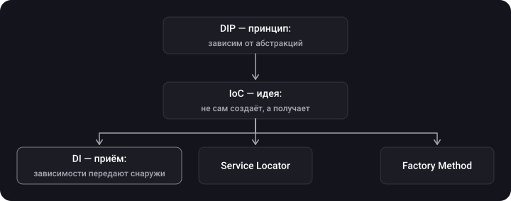
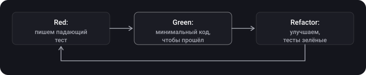

> **Что узнаешь**
>
> - чем различаются DIP, IoC и DI и как они связаны;
> - какие способы внедрения зависимостей бывают и какой выбирать по умолчанию;
> - как внедрять зависимости в SwiftUI: через `init`, `@Environment`, `@EnvironmentObject`, `@Observable`, макрос `@Entry`;
> - почему Service Locator — не способ DI, а альтернатива (и часто антипаттерн);
> - как DI делает код тестируемым и что такое TDD.

> **Нужно знать заранее**
>
> Главы [02](../solid/) (SOLID, особенно DIP) и [04](../creational-patterns/) (Singleton). Основы SwiftUI (`View`, `@State`).

## Аналогия: повар и продукты

Повар, который сам ходит на рынок, выбирает поставщика и выращивает овощи, — жёстко привязан ко всему сразу. Повар, которому продукты **приносят на кухню**, может работать с любым поставщиком, а на экзамене ему можно выдать муляжи. DI — это «продукты приносят».

## Шаг 1. Три похожих термина



| Термин | Что это | Отвечает на вопрос |
| --- | --- | --- |
| **DIP** (Dependency Inversion Principle) | Принцип SOLID: модули верхнего уровня не зависят от нижнего, оба зависят от абстракций | *Какими* должны быть зависимости (закрытыми протоколами) |
| **IoC** (Inversion of Control) | Общая идея: компонент не управляет созданием и связями сам, этим управляет кто-то снаружи (контейнер, фреймворк) | *Кто* управляет |
| **DI** (Dependency Injection) | Паттерн: зависимости объекта задаются извне, а не создаются внутри | *Как* реализовать IoC |

DI — не единственный способ реализовать IoC: есть ещё Service Locator и фабричные методы. Подробнее — в шаге 4.

## Шаг 2. Что такое DI и зачем он

**Dependency Injection** — паттерн настройки объекта, при котором его зависимости передают извне, а не создают внутри.

```swift
// ❌ Зависимость создаётся внутри — подменить нельзя
final class LoginViewModel {
    private let auth = RealAuthService()
}

// ✅ Зависимость приходит снаружи и закрыта протоколом
final class LoginViewModel {
    private let auth: AuthService
    init(auth: AuthService) { self.auth = auth }
}
```

**Зачем:**

- зависимости становятся **явными** — видны в `init`;
- зависимости **внешние** — создание отделено от бизнес-логики (SRP);
- зависимости **гибкие** — реализацию можно заменить (в том числе подделкой в тестах);
- меньше связанность, проще переиспользование.

**Цена:** больше сущностей (протоколы, код сборки) и больше времени на написание.

## Шаг 3. Способы внедрения

| Способ | Как | Плюсы / минусы |
| --- | --- | --- |
| **Constructor injection** | Через `init` | Объект всегда создаётся в готовом состоянии, зависимости `let`. Раздувшийся `init` — сигнал нарушения SRP. |
| **Property injection** | Через публичное `var`-свойство | Объект можно начать использовать до внедрения зависимостей — риск неконсистентного состояния; свойство меняется извне (ломается инкапсуляция). Полезно там, где `init` нельзя изменить (например, `UIViewController` из Storyboard). |
| **Method injection** | Через параметр метода | Хорошо для зависимости, нужной *одному* вызову. |
| **Interface (protocol) injection** | Отдельный протокол «умею принимать X», через который внедряют | Избыточно: на каждую зависимость нужен свой протокол. |
| **Environment injection** | Через окружение (SwiftUI `@Environment`) | Не надо прокидывать через всю иерархию. Скрытая зависимость. |
| **Factory injection** | Объекту дают фабрику, а не готовую зависимость | Когда объекты нужны создавать много раз или отложенно. |

### Constructor injection + тестовая подделка

```swift
protocol AuthService {
    func login(email: String, password: String) async throws -> Bool
}

final class LoginViewModel {
    private let auth: AuthService
    private(set) var errorMessage: String?

    init(auth: AuthService) { self.auth = auth }

    func login(email: String, password: String) async -> Bool {
        do {
            let ok = try await auth.login(email: email, password: password)
            if !ok { errorMessage = "Неверный пароль" }
            return ok
        } catch {
            errorMessage = "Ошибка сети"
            return false
        }
    }
}
```

### Composition root — единое место сборки

Зависимости создают **в одном месте** (обычно точка входа приложения), а остальной код только получает их:

```swift
struct RealAuthService: AuthService {
    func login(email: String, password: String) async throws -> Bool { true }
}

final class AppContainer {
    private let auth: AuthService

    init(auth: AuthService = RealAuthService()) { self.auth = auth }

    func makeLoginViewModel() -> LoginViewModel {
        LoginViewModel(auth: auth)
    }
}
```

В тестах `AppContainer(auth: подделка)`, в приложении — `AppContainer()`.

## Шаг 4. Service Locator: альтернатива, не DI

**Service Locator** — общий реестр, у которого объекты сами *запрашивают* нужные сервисы.

```swift
final class ServiceLocator {
    static let shared = ServiceLocator()
    private var services: [ObjectIdentifier: Any] = [:]
    private init() {}

    func register<T>(_ type: T.Type, _ service: T) {
        services[ObjectIdentifier(type)] = service
    }
    func resolve<T>(_ type: T.Type) -> T {
        guard let service = services[ObjectIdentifier(type)] as? T else {
            fatalError("Не зарегистрирован \(type)")
        }
        return service
    }
}

final class ProfileViewModel {
    private let auth = ServiceLocator.shared.resolve(AuthService.self)   // скрытая зависимость
}
```

|  | DI | Service Locator |
| --- | --- | --- |
| Кто получает зависимость | Объекту передают | Объект сам просит у реестра |
| Зависимости видны в интерфейсе | Да (`init`) | Нет — скрыты внутри |
| Ошибка «забыли зарегистрировать» | Обычно ловится компилятором | Падение в рантайме |
| Тестирование | Передал подделку | Нужно перенастраивать глобальный реестр |
| Связь с Singleton | Не нужна | Сам реестр — глобальный синглтон |

> Многие считают Service Locator **антипаттерном** именно из-за скрытых зависимостей. Допустим на границах приложения (например, в устаревшем коде, где нельзя менять `init`), но не как основной способ связывания.

## Шаг 5. DI в SwiftUI

### 5.1 Через `init` (constructor injection)

Swift сам синтезирует `init` для `struct View`, так что внедрять можно как обычно. Подход одинаково работает для любой зависимости.

```swift
struct LoginView: View {
    let viewModel: LoginViewModel        // передаём снаружи

    var body: some View { Text("Login") }
}
```

Если view вложены глубоко, зависимость придётся «прокидывать» через каждый уровень — для этого есть окружение.

### 5.2 Через окружение: `@Environment` (современный способ)

В **iOS 17+** классы с макросом `@Observable` кладут в окружение по типу:

```swift
import SwiftUI
import Observation

@Observable final class Session {
    var userName: String?
}

@main
struct MyApp: App {
    @State private var session = Session()          // владелец объекта

    var body: some Scene {
        WindowGroup {
            ContentView()
                .environment(session)                // внедряем
        }
    }
}

struct ProfileView: View {
    @Environment(Session.self) private var session   // получаем по типу

    var body: some View { Text(session.userName ?? "Гость") }
}
```

Для зависимостей-протоколов и значений используют ключ окружения. В Xcode 16+ его объявляют макросом `@Entry`, а не тремя блоками кода:

```swift
protocol Analytics { func track(_ event: String) }
struct NoopAnalytics: Analytics { func track(_ event: String) { } }

extension EnvironmentValues {
    @Entry var analytics: any Analytics = NoopAnalytics()   // значение по умолчанию
}

// Внедрение:  ContentView().environment(\.analytics, RealAnalytics())
// Получение:  @Environment(\.analytics) private var analytics
```

> **Обратная совместимость.** Макрос `@Entry` работает и с более старыми версиями iOS (это макрос времени компиляции, требует Xcode 16). Для протоколов в Swift 6-режиме тип-значение может потребоваться пометить `Sendable`.

### 5.3 Старый способ (до iOS 17): `ObservableObject`

| Обёртка | Роль |
| --- | --- |
| `ObservableObject` | Протокол: класс, за которым следит SwiftUI |
| `@Published` | Свойства, изменения которых обновляют view |
| `@StateObject` | **Создаёт и владеет** объектом: инициализируется один раз, переживает пересоздание view. Использовать только там, где объект создаётся. |
| `@ObservedObject` | Хранит ссылку на уже созданный объект, переданный снаружи; не встраивается в иерархию. |
| `@EnvironmentObject` | Получает объект из окружения; внедряется один раз в родительской view через `.environmentObject(_:)`, доступен всем потомкам. |

```swift
final class GameViewModel: ObservableObject {
    @Published var score = 0
}

struct ContentView: View {
    @StateObject private var vm = GameViewModel()      // единственный владелец

    var body: some View {
        MainView()
            .environmentObject(vm)                      // потомки получают ту же ссылку
    }
}

struct MainView: View {
    @EnvironmentObject var vm: GameViewModel            // без создания и без передачи параметром
    var body: some View { Text("\(vm.score)") }
}
```

> **Ловушка из практики.** В дочерней view написать `@ObservedObject var vm = GameViewModel()` (со скобками) вместо `var vm: GameViewModel` — значит **создать второй, независимый объект**. Код скомпилируется и будет «работать», но у view окажутся другие данные, чем у родителя. Такую ошибку долго искать. Правило: `= Type()` только там, где ты владелец (`@StateObject` / `@State`), а потомки объявляют тип без инициализации.

> **Особенности `@EnvironmentObject`.** Если забыть внедрить объект — приложение упадёт в рантайме. В окружении может быть только один объект каждого типа: внедрение ниже по иерархии заменит верхний. Для типов-значений `@EnvironmentObject` не подходит (нужен `ObservableObject`, то есть класс) — берут `@Environment`, у которого всегда есть значение по умолчанию, поэтому он безопаснее.

### 5.4 DI-контейнеры (Swinject, Needle)

Библиотеки-контейнеры регистрируют зависимости и выдают их по типу:

- **Swinject** — контейнер с регистрацией и разрешением зависимостей во время выполнения;
- **Needle** (Uber) — генерирует код и проверяет граф зависимостей **при компиляции**.

Минус подхода с `resolve` — если забыть зарегистрировать зависимость, ошибка возникнет только в рантайме (как и у `@EnvironmentObject`). Поэтому контейнеры хорошо подходят крупным приложениям, а небольшим хватает composition root из шага 3.

### 5.5 Coordinator + DI

Координатор часто сам является местом сборки экранов: он получает контейнер, создаёт `ViewModel` с нужными зависимостями и отдаёт их view. Подробно — в главе [10](../router-coordinator/).

## Шаг 6. Тестируемость и TDD

Для unit-теста нужно подменять всё, что делает тест медленным или недетерминированным: сеть, диск, время, случайные числа. DI как раз даёт точку подмены.

```swift
import XCTest

struct AuthServiceStub: AuthService {
    let result: Result<Bool, Error>
    func login(email: String, password: String) async throws -> Bool {
        try result.get()
    }
}

final class LoginViewModelTests: XCTestCase {
    func test_login_withWrongPassword_setsErrorMessage() async {
        let sut = LoginViewModel(auth: AuthServiceStub(result: .success(false)))

        let ok = await sut.login(email: "a@b.c", password: "x")

        XCTAssertFalse(ok)
        XCTAssertEqual(sut.errorMessage, "Неверный пароль")
    }

    func test_login_onNetworkFailure_setsErrorMessage() async {
        struct Boom: Error {}
        let sut = LoginViewModel(auth: AuthServiceStub(result: .failure(Boom())))

        let ok = await sut.login(email: "a@b.c", password: "x")

        XCTAssertFalse(ok)
        XCTAssertEqual(sut.errorMessage, "Ошибка сети")
    }
}
```

Обрати внимание на именование: `sut` (*system under test*), три части теста — подготовка, действие, проверка (Given–When–Then).

> **Swift Testing.** Начиная с Xcode 16 доступен новый фреймворк `import Testing`: тесты — функции с `@Test`, проверки — `#expect(...)`. Идея подмены зависимостей через DI не меняется.

### TDD — разработка через тестирование

Цикл **Red → Green → Refactor**:



Заявленные плюсы TDD: снимает страх вносить изменения (есть страховка тестов), не оставляет тесты «на потом», заставляет проектировать код так, чтобы он вообще был тестируемым — то есть с явными зависимостями. Слабая сторона — нужна дисциплина и время, особенно для UI-кода; поэтому TDD чаще применяют к бизнес-логике (ViewModel, use case, сервисы).

## Типичные ошибки

- **Создавать зависимости внутри** (`private let api = APIClient()`) — их не подменить.
- **`Singleton.shared` в глубине кода** — та же скрытая зависимость (см. главу [04](../creational-patterns/)).
- **Раздутый `init` из 8 параметров** и попытка «решить» это Service Locator’ом. Разбей тип.
- **`@ObservedObject var vm = VM()`** в дочерней view — второй экземпляр.
- **Забытый `.environmentObject` / `.environment`** — падение в рантайме.
- **Протокол «для галочки»** для типа, который никогда не подменяют.

## Шпаргалка

- DIP — принцип, IoC — идея, DI — приём; Service Locator — альтернатива IoC, не DI.
- По умолчанию — constructor injection, сборка в одном месте (composition root).
- SwiftUI: `init` → `@Environment(Type.self)` (`@Observable`, iOS 17+) → `@Entry` для ключей; до iOS 17 — `@StateObject`/`@EnvironmentObject`.
- Владелец создаёт (`@State`/`@StateObject`), потомки принимают.
- TDD: Red → Green → Refactor.

## Вопросы для самопроверки

<details>
<summary>1. Чем DI отличается от DIP?</summary>

DIP — принцип (зависеть от абстракций), DI — приём, которым мы получаем зависимости снаружи. Их часто используют вместе.

</details>

<details>
<summary>2. Почему constructor injection считается способом по умолчанию?</summary>

Объект сразу создаётся в готовом состоянии, зависимости явные и неизменяемые; слишком длинный `init` подсказывает, что нарушен SRP.

</details>

<details>
<summary>3. Чем Service Locator хуже DI?</summary>

Зависимости скрыты, ошибки регистрации видны только в рантайме, а сам реестр — глобальное состояние, усложняющее тесты.

</details>

<details>
<summary>4. Чем @StateObject отличается от @ObservedObject?</summary>

`@StateObject` создаёт объект и владеет им (создаётся один раз), `@ObservedObject` лишь ссылается на объект, созданный кем-то другим.

</details>

<details>
<summary>5. Как в тесте ViewModel заменить сеть?</summary>

Внедрить через `init` подделку, реализующую тот же протокол, и вернуть заранее заданный результат.

</details>

## Источники

- [Environment — Apple Developer Documentation](https://developer.apple.com/documentation/swiftui/environment)
- [Migrating from the Observable Object protocol to the Observable macro](https://developer.apple.com/documentation/swiftui/migrating-from-the-observable-object-protocol-to-the-observable-macro)
- [Swift Testing — Apple Developer Documentation](https://developer.apple.com/documentation/testing)
- [DI vs. DIP vs. IoC — Сергей Тепляков](https://sergeyteplyakov.blogspot.com/2014/11/di-vs-dip-vs-ioc.html)
