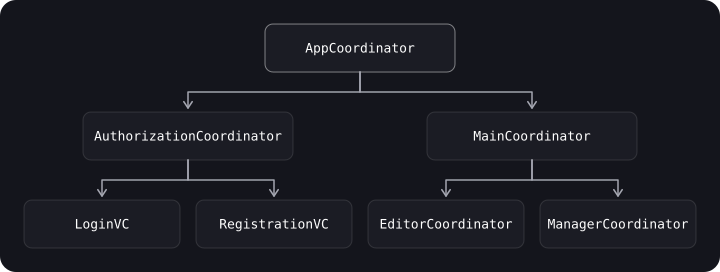

> **Что узнаешь**
>
> - какую проблему решает Coordinator и чем он отличается от Router;
> - как построить дерево координаторов в UIKit и не получить retain cycle;
> - как сделать координатор в SwiftUI на `NavigationStack` и `NavigationPath`;
> - как через координатор реализовать диплинки, «назад через несколько экранов» и возврат результата.

> **Нужно знать заранее**
>
> Главы [06](../behavioral-patterns/) (Delegate), [07](../di-ioc/) (DI), [08](../mvc-mvp-mvvm/)–[09](../viper-clean-mvi/) (MVVM/VIPER). ARC и `weak`.

## Аналогия: экскурсовод

Туристам (экранам) не нужно знать, куда идти дальше: маршрут знает **экскурсовод** (Coordinator). Если экскурсия делится на «музей» и «парк», то у каждой части свой гид, а главный гид просто передаёт группу. **Router** — это дверь между залами: он умеет открыть и закрыть конкретный проход, но не решает, каким будет маршрут.

## Шаг 1. Проблема: экран сам решает, куда идти

В «наивном» UIKit-коде контроллер сам создаёт следующий контроллер и делает `push`:

```swift
final class LoginViewController: UIViewController {
    @objc func didTapRegister() {
        let next = RegistrationViewController()      // экран знает про соседа
        navigationController?.pushViewController(next, animated: true)
    }
}
```

Отсюда проблемы:

- экраны знают друг о друге — их сложно переиспользовать и тестировать;
- диплинк должен построить цепочку из нескольких экранов — а знание о ней размазано по контроллерам;
- кнопка «назад» иногда должна закрыть сразу несколько экранов;
- результат одного экрана влияет на предыдущие и следующие.

## Шаг 2. Coordinator: логика навигации в одном месте

**Суть паттерна** — инкапсулировать навигацию. Контроллер только сообщает «пользователь закончил», а *куда дальше* решает координатор.



Каждый координатор управляет **потоком (flow)** — последовательностью экранов — и может иметь **дочерние** координаторы. Экраны становятся независимыми модулями.

**Применять, когда:**

- нужно лучше контролировать поток из последовательности экранов;
- хочется сделать экраны переиспользуемыми;
- нужен общий результат от цепочки экранов (например, оформление заказа из 4 шагов);
- есть диплинки и глубокие маршруты.

## Шаг 3. Router против Coordinator

Оба отвечают за навигацию, но на разном уровне:

|  | Router | Coordinator |
| --- | --- | --- |
| Уровень | Один экран / модуль | Поток экранов |
| Что знает | Как показать/закрыть конкретный переход | Какой экран следующий и в каком порядке |
| Привязка к модулю | Сильная (часть VIPER-модуля) | Независимая, может жить своей жизнью |
| Дочерние элементы | Нет | Дерево дочерних координаторов |
| Типичный пример | `UserListRouter.openDetails(for:)` | `CheckoutCoordinator` (корзина → адрес → оплата) |

Они хорошо сочетаются: координатор решает *что* показывать, а роутер помогает *технически* показать и скрыть контроллер. Роутер не знает, какой контроллер показывать, — ему об этом говорит координатор.

## Шаг 4. Реализация в UIKit

```swift
import UIKit

enum Flow { case onboarding, authorization, main }

protocol CoordinatorFinishDelegate: AnyObject {        // ⚠️ Исправлено: AnyObject, чтобы можно было weak
    func didFinish(_ coordinator: CoordinatorProtocol)
}

protocol CoordinatorProtocol: AnyObject {
    var finishDelegate: CoordinatorFinishDelegate? { get set }
    var navigationController: UINavigationController { get }
    var childCoordinators: [CoordinatorProtocol] { get set }

    func start(_ flow: Flow?)
    func finish()
}

extension CoordinatorProtocol {
    func finish() {
        childCoordinators.removeAll()
        finishDelegate?.didFinish(self)
    }
}

final class AppCoordinator: CoordinatorProtocol, CoordinatorFinishDelegate {
    weak var finishDelegate: CoordinatorFinishDelegate?  // ⚠️ Исправлено: weak
    let navigationController: UINavigationController
    var childCoordinators: [CoordinatorProtocol] = []

    init(navigationController: UINavigationController) {
        self.navigationController = navigationController
    }

    func start(_ flow: Flow? = nil) {
        switch flow {
        case .onboarding: showOnboardingFlow()
        case .authorization, nil: showAuthorizationFlow()
        case .main: showMainFlow()
        }
    }

    func showAuthorizationFlow() {
        let coordinator = AuthorizationCoordinator(navigationController: navigationController)
        coordinator.finishDelegate = self               // ⚠️ Исправлено: родитель узнаёт о завершении
        childCoordinators.append(coordinator)
        coordinator.start()
    }
    func showOnboardingFlow() { /* … */ }
    func showMainFlow() { /* … */ }

    // Ребёнок закончил — забываем о нём, освобождая память
    func didFinish(_ coordinator: CoordinatorProtocol) {
        childCoordinators.removeAll { $0 === coordinator }
        if coordinator is AuthorizationCoordinator { showMainFlow() }   // переход к следующему потоку
    }
}

final class AuthorizationCoordinator: CoordinatorProtocol {
    weak var finishDelegate: CoordinatorFinishDelegate?
    let navigationController: UINavigationController
    var childCoordinators: [CoordinatorProtocol] = []

    init(navigationController: UINavigationController) {
        self.navigationController = navigationController
    }

    func start(_ flow: Flow? = nil) { showLoginScene() }

    func showLoginScene() {
        let vc = UIViewController()          // в реальности — LoginViewController(viewModel:)
        navigationController.pushViewController(vc, animated: true)
    }
    func showRegistrationScene() { /* … */ }
}

// Точка входа
final class SceneDelegate: UIResponder, UIWindowSceneDelegate {
    var window: UIWindow?
    private var appCoordinator: AppCoordinator?          // ⚠️ Исправлено: координатор нужно хранить

    func scene(_ scene: UIScene, willConnectTo session: UISceneSession,
               options connectionOptions: UIScene.ConnectionOptions) {
        guard let windowScene = scene as? UIWindowScene else { return }
        let window = UIWindow(windowScene: windowScene)
        let navigationController = UINavigationController()

        let coordinator = AppCoordinator(navigationController: navigationController)
        appCoordinator = coordinator
        coordinator.start(.authorization)

        window.rootViewController = navigationController
        window.makeKeyAndVisible()
        self.window = window
    }
}
```

> **Как экран сообщает координатору о событии.** Контроллер/ViewModel не должен знать о координаторе как о типе: передай замыкание (`var onFinish: (() -> Void)?`) или протокол-делегат (см. главу [06](../behavioral-patterns/)). Координатор создаёт экран, назначает обработчик и решает, что делать дальше.

### Координатор и DI

Координатор — удобное место, где экраны собираются с зависимостями (см. главу [07](../di-ioc/)): он получает контейнер, создаёт `ViewModel` и внедряет её:

```swift
final class AuthorizationCoordinator {
    private let container: AppContainer
    // …
    func showLoginScene() {
        let viewModel = container.makeLoginViewModel()
        viewModel.onSuccess = { [weak self] in self?.finish() }   // экран сообщает, координатор решает
        let vc = LoginViewController(viewModel: viewModel)
        navigationController.pushViewController(vc, animated: true)
    }
}
```

Здесь показан фрагмент; полный вариант — по образцу выше.

## Шаг 5. Координатор в SwiftUI

В SwiftUI навигацией управляет **`NavigationStack`**, а «стек экранов» хранится в **`NavigationPath`** (iOS 16+). Значит, координатор — это объект, который владеет `path` и модальными состояниями (`sheet`, `fullScreenCover`).

```swift
import SwiftUI
import Observation

enum Route: Hashable {
    case detail(id: Int)
    case settings
}

enum Sheet: String, Identifiable {
    case profile
    var id: String { rawValue }
}

@MainActor @Observable
final class Coordinator {
    var path = NavigationPath()
    var sheet: Sheet?

    func push(_ route: Route) { path.append(route) }
    func pop() { if !path.isEmpty { path.removeLast() } }
    func popToRoot() { path = NavigationPath() }
    func present(_ sheet: Sheet) { self.sheet = sheet }
    func dismissSheet() { sheet = nil }
}

struct RootView: View {
    @State private var coordinator = Coordinator()

    var body: some View {
        @Bindable var coordinator = coordinator          // нужен для $coordinator.path

        NavigationStack(path: $coordinator.path) {
            HomeView()
                .navigationDestination(for: Route.self) { route in
                    switch route {
                    case .detail(let id): DetailView(id: id)
                    case .settings:       Text("Настройки")
                    }
                }
        }
        .sheet(item: $coordinator.sheet) { sheet in
            switch sheet {
            case .profile: Text("Профиль")
            }
        }
        .environment(coordinator)                          // экраны получают координатор из окружения
    }
}

struct HomeView: View {
    @Environment(Coordinator.self) private var coordinator

    var body: some View {
        VStack(spacing: 12) {
            Button("Детали") { coordinator.push(.detail(id: 42)) }
            Button("Профиль") { coordinator.present(.profile) }
        }
    }
}

struct DetailView: View {
    let id: Int
    @Environment(Coordinator.self) private var coordinator

    var body: some View {
        Button("На главный экран") { coordinator.popToRoot() }
            .navigationTitle("Деталь \(id)")
    }
}
```

**Диплинк:** достаточно построить цепочку маршрутов.

```swift
extension Coordinator {
    func handle(deepLink url: URL) {
        popToRoot()
        if url.host == "detail", let id = Int(url.lastPathComponent) {
            push(.detail(id: id))
        }
    }
}
```

> **Осторожно с типами в `NavigationPath`.** Все значения должны быть `Hashable`, а для каждого типа маршрута — свой `navigationDestination(for:)`. Если хранить в маршруте тяжёлые модели, они попадают в состояние навигации; лучше передавать идентификаторы.

## Шаг 6. Как выбрать

| Ситуация | Решение |
| --- | --- |
| Приложение из 3–4 экранов, переходы простые | Навигация внутри экрана / `NavigationLink` — координатор не нужен (KISS) |
| Есть потоки из нескольких экранов, диплинки, общий результат | Coordinator |
| VIPER-модули | Router на модуль, при необходимости — координатор над ними |
| SwiftUI-приложение с `NavigationStack` | Coordinator/Router с `NavigationPath` |

## Типичные ошибки

- **`finishDelegate` (и вообще ссылки на родителя) без `weak`** — retain cycle.
- **Не убирать дочерний координатор** после завершения — массив растёт, память не освобождается.
- **Не хранить корневой координатор** — он исчезнет после запуска.
- **Экран знает о координаторе как о конкретном типе** — теряется переиспользуемость; передавай замыкание или протокол.
- **Координатор на всё подряд** — для двух экранов это лишний слой.
- **`NavigationPath` с не-`Hashable` или тяжёлыми моделями.**

## Шпаргалка

- Router — навигация одного экрана; Coordinator — поток экранов.
- Координатор владеет детьми (`childCoordinators`), дети сообщают о завершении через `weak` делегат/замыкание.
- UIKit: `AppCoordinator` → дочерние; корневой хранить свойством.
- SwiftUI: `NavigationStack(path:)` + `NavigationPath` + `.environment(coordinator)`.
- Диплинк = цепочка маршрутов.

## Вопросы для самопроверки

<details>
<summary>1. Чем Coordinator отличается от Router?</summary>

Router отвечает за переход из одного экрана, Coordinator управляет потоком экранов и их порядком; роутер лишь технически показывает то, что скажет координатор.

</details>

<details>
<summary>2. Где в примере возникал retain cycle и как его устранить?</summary>

Родитель держит ребёнка в `childCoordinators`, а ребёнок сильно держал родителя как `finishDelegate`. Решение: `AnyObject`-протокол и `weak var finishDelegate`.

</details>

<details>
<summary>3. Зачем нужно didFinish у родительского координатора?</summary>

Чтобы убрать завершённого ребёнка из `childCoordinators` (освободить память) и перейти к следующему потоку.

</details>

<details>
<summary>4. Что хранится в NavigationPath и какое требование к значениям?</summary>

Стек маршрутов, типы значений должны быть `Hashable`; для каждого типа нужен `navigationDestination(for:)`.

</details>

<details>
<summary>5. Как реализовать диплинк через координатор?</summary>

Разобрать URL, сбросить стек и добавить в путь цепочку нужных маршрутов.

</details>

## Источники

- [NavigationStack — Apple Developer Documentation](https://developer.apple.com/documentation/swiftui/navigationstack)
- [NavigationPath — Apple Developer Documentation](https://developer.apple.com/documentation/swiftui/navigationpath)
- [Automatic Reference Counting — The Swift Programming Language](https://docs.swift.org/swift-book/documentation/the-swift-programming-language/automaticreferencecounting/)
- [Управляем навигацией в iOS-приложениях. Паттерн координатор от СберМаркета — Habr](https://habr.com/ru/amp/publications/654339/)
