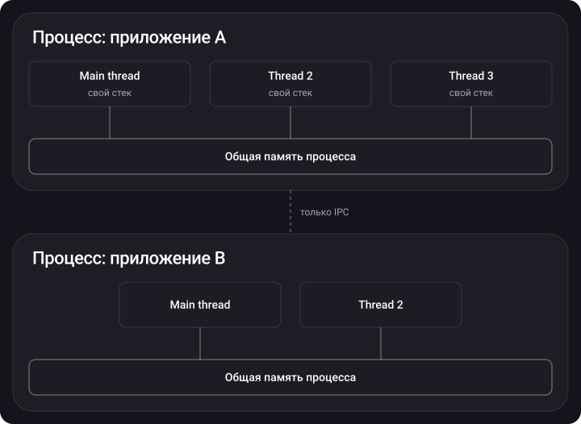
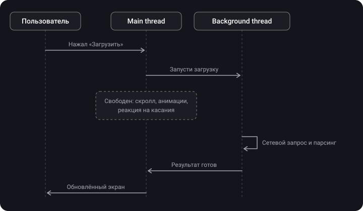

> **Что узнаешь**
>
> - Чем процесс отличается от потока и как они связаны
> - В чём разница между concurrency и параллелизмом
> - Зачем нужен главный поток и почему его нельзя нагружать
> - Жизненный цикл потока и уровни API для работы с потоками
> - Почему вручную управлять потоками — плохая идея

> **Нужно знать заранее:** базовый синтаксис Swift и замыкания (closures). Больше ничего — это стартовая тема.

## Аналогия: телефон — это кухня

Представь телефон как большую кухню, а каждое приложение — как отдельный рецепт.

- **Процесс** — отдельное рабочее место под рецепт: свой стол, свои продукты, свои инструменты (память и ресурсы). Соседний рецепт не может взять твой нож.
- **Поток** — помощник на этом рабочем месте. Один режет овощи, другой следит за кипящей водой. Все помощники пользуются общим столом и продуктами.
- **Concurrency** — одна кухня и один повар, который переключается между блюдами: порезал лук для супа, помешал соус для пасты, вернулся к супу. Прогресс идёт по всем блюдам, хотя в каждый момент он делает что-то одно.
- **Параллелизм** — несколько поваров (ядер), каждый реально готовит своё блюдо в одно и то же мгновение.

## Шаг 1. Процесс

> Процесс — это экземпляр программы во время выполнения, которому система выделила ресурсы: процессорное время и память.

Ключевые свойства процесса:

- Все процессы **независимы** и работают каждый в своём адресном пространстве.
- Один процесс **не может** просто так прочитать переменные другого. Для обмена данными нужно межпроцессное взаимодействие (IPC): каналы, файлы, сокеты, сообщения.
- При запуске приложения iOS создаёт для него **отдельный процесс**.

Что происходит при запуске приложения:

1. Операционная система создаёт новый процесс.
2. Исполняемый файл загружается в память.
3. Загружается динамический linker — он связывает динамические зависимости (фреймворки) с процессом.
4. Процесс готовится к запуску: инициализируются регистры, указатель инструкций ставится на начало программы.
5. ОС передаёт управление процессу — выполняется первая инструкция, и вместе с ней стартует **главный поток**.

## Шаг 2. Поток

> Поток (thread) — последовательность инструкций внутри процесса, которую ядро ОС может независимо назначить на выполнение. Коротко: поток — это путь выполнения нашего кода.

- У каждого процесса есть **минимум один поток** — главный.
- Потоки одного процесса **делят общую память** (кучу, глобальные переменные). Изменение, сделанное одним потоком, сразу видно другим.
- У каждого потока есть **свой стек и свои регистры**.
- Один поток в каждый момент времени выполняет **одну** операцию.



|  | Процесс | Поток |
| --- | --- | --- |
| Что это | Экземпляр запущенного приложения | Путь выполнения кода внутри процесса |
| Память | Своё изолированное адресное пространство | Общая память процесса + свой стек |
| Общение | Через IPC (сообщения, каналы, файлы) | Через общую память — быстро, но опасно |
| Стоимость создания | Дорого | Дешевле, но не бесплатно (стек, планирование) |
| Сбой | Не затрагивает другие процессы | Может уронить весь процесс |

## Шаг 3. Concurrency и параллелизм

**Многопоточность** — способ выполнять программу в нескольких потоках одновременно: работа делится на меньшие задачи, которые могут выполняться независимо.

Процессор в каждый момент времени выполняет на одном ядре одну задачу, для которой выделен поток. Как тогда получается «одновременность»?

- **Одно ядро → concurrency (псевдопараллельность).** Ядро очень быстро переключается между потоками. Такое переключение называется **context switch**: система сохраняет состояние одного потока и загружает состояние другого. Потоки работают не на 100% параллельно, а с прерываниями и ожиданием своей очереди.
- **Несколько ядер → настоящий параллелизм.** Разные потоки физически выполняются на разных ядрах в одно и то же мгновение.

Одно ядро чередует потоки, несколько ядер работают действительно одновременно:


> **Главное:** concurrency позволяет продвигаться в нескольких задачах, даже если они по очереди используют один ресурс (одну кухню). Параллелизм — выполнение действительно в одно мгновение (несколько кухонь). Реальные системы используют и то, и другое.

## Шаг 4. Главный поток (Main / UI thread)

Главный поток запускается вместе с приложением. Он отвечает за:

- отрисовку и обновление интерфейса;
- обработку касаний и других событий пользователя;
- запуск кода, который вы написали для реакции на эти события.

Когда пользователь нажимает кнопку, главный поток выполняет обработчик, затем обновляет экран. Если в обработчике есть тяжёлая работа (сеть, декодирование картинки, парсинг), экран **зависает**: главный поток занят и не может перерисовывать интерфейс.

**Решение** — вынести тяжёлую работу в фоновый поток, а в главный вернуться только для обновления UI:

```swift
// Самый простой способ — создать поток вручную (дальше увидим, почему так лучше не делать)
let thread = Thread {
    // выполняем медленную задачу в фоне
    let data = loadHugeFile()
    DispatchQueue.main.async {
        // обновляем UI только на главном потоке
        label.text = "Готово: \(data.count) байт"
    }
}
thread.start()

// Полезные свойства
let currentThread = Thread.current   // поток, в котором выполняется код
let mainThread = Thread.main         // главный поток
print(Thread.isMainThread)           // true, если мы на главном потоке
```



## Шаг 5. Жизненный цикл потока

- **New** — поток создан, но ещё не запущен.
- **Runnable** — готов к выполнению и ждёт процессорного времени.
- **Running** — выполняется прямо сейчас.
- **Blocked** — ждёт внешнего события (ввод-вывод, освобождение блокировки, sleep).
- **Terminated** — завершил выполнение.


## Шаг 6. Уровни API для работы с потоками

Чем выше уровень, тем меньше ручной работы и тем меньше шансов ошибиться.


**1. Mach (kernel) threads** — самая низкоуровневая реализация, на ней основано всё остальное. Напрямую не используются.

**2. POSIX Threads (pthread)** — стандартный C-интерфейс для работы с потоками в UNIX-системах. Даёт набор функций и типов для создания потоков и управления ими:

```swift
import Foundation

var thread: pthread_t?

func startThread() {
    pthread_create(&thread, nil, threadFunction, nil)
}

func threadFunction(arg: UnsafeMutableRawPointer?) -> UnsafeMutableRawPointer? {
    // Код, выполняемый в новом потоке
    return nil
}

func joinThread() {
    pthread_join(thread!, nil)   // ждём завершения потока
}
```

**3. NSThread / Thread** — класс Foundation, высокоуровневая обёртка над pthread с синтаксисом Objective-C/Swift. Apple добавляет в него оптимизации.

```swift
let thread = Thread {
    print("Hello from \(Thread.current)")
}
thread.name = "com.app.worker"
thread.qualityOfService = .utility
thread.start()
```

> У NSThread **нет API для отслеживания завершения задачи** и нет удобной отмены — всё это придётся писать самому. Поэтому в большинстве случаев потоки таким способом создавать не стоит.

## Шаг 7. Почему не стоит управлять потоками вручную

На первый взгляд это просто, но на практике всплывают проблемы:

1. **Стоимость.** На создание потоков и переключение между ними нужны ресурсы (память под стек, context switch). Много потоков — медленнее, а не быстрее.
2. **Утечки.** Легко забыть остановить поток после работы — лишнее потребление ресурсов.
3. **Синхронизация.** Если потокам нужен доступ к общим данным, придётся вручную расставлять блокировки.
4. **Взаимные блокировки.** Потоки могут бесконечно ждать друг друга (deadlock).

Именно поэтому Apple даёт более высокоуровневые инструменты, где вы описываете **задачи**, а система сама решает, **на каком потоке** и **когда** их выполнить.

| Инструмент | Идея | Когда брать | Тутор |
| --- | --- | --- | --- |
| GCD | Кладём замыкания в очереди, система распределяет их по пулу потоков | Простые фоновые задачи, переход на main, группы задач | [02](../gcd/) |
| Operation / OperationQueue | Задача — объект с состоянием, зависимостями и отменой | Сложные цепочки, отмена, ограничение параллельности | [05](../operation-queue/) |
| Swift Concurrency | async/await, Task, actor, кооперативный пул потоков | Новый код, читаемая асинхронность, безопасность данных | [06](../swift-concurrency/) |
| Lock, семафор, барьер | Защита общих данных от одновременного доступа | Когда несколько потоков трогают одно состояние | [04](../thread-safety-synchronization/) |

> Плата за многопоточность — **потокобезопасность (thread safety)**. Как только задачи работают параллельно, они начинают бороться за одни и те же ресурсы: одну переменную, один файл, одну блокировку. Это может разрушить данные. Подробно — в туторах [03](../concurrency-problems/) и [04](../thread-safety-synchronization/).

## Типичные ошибки

- Тяжёлая работа (сеть, JSON, картинки) прямо в обработчике кнопки на главном потоке → фризы UI.
- Обновление UI из фонового потока → непредсказуемые баги и предупреждения Main Thread Checker.
- «Больше потоков = быстрее». Нет: после числа ядер растут только накладные расходы на переключение.
- Создание Thread на каждую мелкую задачу вместо очередей.

## Шпаргалка

```text
Процесс  = запущенное приложение, своя изолированная память
Поток    = путь выполнения кода внутри процесса, общая память + свой стек
Main     = UI и события; никакой тяжёлой работы
Concurrency  = переключение между задачами (1 ядро тоже умеет)
Parallelism  = одновременное выполнение на разных ядрах
Context switch = сохранить состояние потока A, загрузить состояние B
Состояния потока: New → Runnable ⇄ Running → Blocked → ... → Terminated
Уровни: Mach → pthread → Thread → GCD → Operation / Swift Concurrency
```

## Вопросы для самопроверки

<details>
<summary>1. Чем поток отличается от процесса?</summary>

Процесс — экземпляр запущенного приложения с собственным изолированным адресным пространством. Поток — путь выполнения кода внутри процесса; потоки одного процесса делят общую память, но у каждого свой стек и регистры.

</details>

<details>
<summary>2. Может ли процесс существовать без потоков?</summary>

Нет. Чтобы процесс выполнял хоть что-то, в нём должен быть минимум один поток — главный.

</details>

<details>
<summary>3. Чем concurrency отличается от параллелизма?</summary>

Concurrency — задачи продвигаются «одновременно» за счёт быстрого переключения (возможно даже на одном ядре). Параллелизм — задачи физически выполняются в одно и то же мгновение на разных ядрах.

</details>

<details>
<summary>4. Что такое context switch и почему он не бесплатный?</summary>

Это переключение ядра с одного потока на другой: нужно сохранить регистры и стек текущего потока и восстановить состояние следующего. Это тратит время CPU и кэши, поэтому избыточное число потоков замедляет приложение.

</details>

<details>
<summary>5. Почему UI нельзя обновлять из фонового потока?</summary>

UIKit/SwiftUI не потокобезопасны и рассчитаны на работу в главном потоке, который связан с RunLoop.main и циклом отрисовки. Обновление из другого потока приводит к гонкам и непредсказуемому поведению.

</details>

<details>
<summary>6. Перечисли состояния потока.</summary>

New → Runnable → Running → (Blocked → Runnable) → Terminated.

</details>

<details>
<summary>7. Почему NSThread редко используют напрямую?</summary>

Нужно самому управлять жизнью потока, синхронизацией и числом потоков; нет API для отслеживания завершения. GCD, OperationQueue и Swift Concurrency делают это за нас.

</details>

## Источники

- [Основы многопоточности в iOS — Mad Brains Техно](https://www.youtube.com/watch?v=JgUBBoRydoE&list=PLw6SJ6q6-1YowmlGVks5a088XrSbihJu-&index=39)
