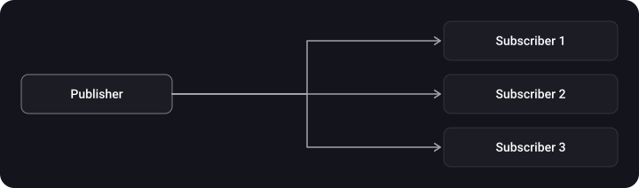
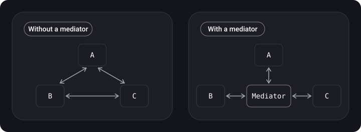

> **What you'll learn**
>
> - how the behavioral patterns work: Delegate, Observer, Chain of Responsibility, Strategy, State, Reactor, Template Method, Mediator;
> - what ways of "observing changes" exist in iOS (`NotificationCenter`, KVO, Combine, `@Observable`) and which to choose when;
> - why a delegate should be `weak` and what the responder chain is;
> - how to replace a "spaghetti of `if`s" with strategies and states.

> **Prerequisites**
>
> Chapters [01](../paradigms/)–[05](../structural-patterns/): protocols, closures, composition. ARC and retain cycles, from the Swift basics.

## Analogy: an office

**Delegate**: a manager hands part of the tasks to an assistant according to a list of duties. **Observer**: a newsletter subscription: the publisher writes, the subscribers read. **Chain of Responsibility**: a request goes along the chain "manager → director → board" until someone decides. **Strategy**: we choose a delivery method: courier, post, pickup. **State**: an employee behaves differently in the statuses "at work" and "on vacation". **Reactor**: a secretary who takes all the calls and transfers them to the right people.

## Step 1. Delegate

> Delegation is a design pattern that enables a class or structure to hand off (or delegate) some of its responsibilities to an instance of another type. (Swift book)

The goal is to let an object tell its owner something **without knowing the owner's concrete type**. The protocol is the list of duties the delegate takes on; until it implements them, the compiler won't let it "start work".

```swift
import Foundation

protocol DownloaderDelegate: AnyObject {          // AnyObject → can be stored weak
    func downloader(_ downloader: Downloader, didFinishWith data: Data)
    func downloader(_ downloader: Downloader, didFailWith error: Error)
}

final class Downloader {
    weak var delegate: DownloaderDelegate?        // weak, otherwise a retain cycle

    func start() {
        // ... downloading ...
        delegate?.downloader(self, didFinishWith: Data())
    }
}

final class ScreenViewModel: DownloaderDelegate {
    let downloader = Downloader()

    init() { downloader.delegate = self }

    func downloader(_ downloader: Downloader, didFinishWith data: Data) {
        print("Downloaded \(data.count) bytes")
    }
    func downloader(_ downloader: Downloader, didFailWith error: Error) {
        print("Error: \(error)")
    }
}
```

> **A delegate is almost always `weak`.** The owner (`ScreenViewModel`) holds `downloader` with a strong reference; if `downloader` holds the delegate strongly, you get a cycle and a leak. For this the delegate protocol is marked `AnyObject` (class-only): `weak` works only with reference types.

> **Optional methods.** A pure Swift protocol has no optional requirements; they are emulated with a default implementation in an `extension`:

```swift
extension DownloaderDelegate {
    func downloader(_ downloader: Downloader, didFailWith error: Error) { }
}
```

**An analogy from the source: a manager and an assistant**. The manager doesn't care what type the assistant is, as long as it performs the list of tasks from the protocol:

```swift
protocol ManagerDelegate: AnyObject {
    func doLaundry(for manager: Manager, laundry: [Clothes]) -> [Clothes]
    func howMuchMoneyDidWeMake() -> Int
}

final class Manager {
    weak var assistant: ManagerDelegate?     // the manager depends on a protocol, not on a class

    func performEndOfDayTasks(today: Weekday, dirtyClothes: [Clothes]) {
        switch today {
        case .monday:
            _ = assistant?.doLaundry(for: self, laundry: dirtyClothes)
        case .friday:
            if let profit = assistant?.howMuchMoneyDidWeMake() {
                print("We made \(profit) dollars this week boss!")
            }
        }
    }
}
```

A helper class that adopts the protocol won't compile until it implements all the requirements. (The `Clothes` and `Weekday` types here are hypothetical; the source also had a joke method `whatBearIsBest`, which I left out.)

**Delegate or closure?** If there are many related events (a set of 3–5 methods, like `UITableViewDelegate`), use a delegate. If there is a single one-off event, a callback closure (`completion`) is simpler.

## Step 2. Observer

A subscription mechanism: one object (the publisher) notifies others (the subscribers) about a state change. The publisher doesn't know the concrete subscribers, and you can subscribe and unsubscribe on the fly. The difference from Delegate: there can be **many** subscribers, while a delegate is one.



A minimal implementation of our own:

```swift
import Foundation

final class Publisher<Value> {
    private var observers: [UUID: (Value) -> Void] = [:]

    func subscribe(_ observer: @escaping (Value) -> Void) -> UUID {
        let id = UUID()
        observers[id] = observer
        return id
    }
    func unsubscribe(_ id: UUID) { observers[id] = nil }
    func send(_ value: Value) { observers.values.forEach { $0(value) } }   // order is not guaranteed
}

let temperature = Publisher<Double>()
let token = temperature.subscribe { print("Temperature: \($0)") }
temperature.send(21.5)
temperature.unsubscribe(token)
```

> In this implementation subscribers are notified in an **arbitrary order** (a dictionary), so you must not write code that depends on the order. This is a known downside of the pattern.

### Observers in iOS: what to choose

| Approach | When | Notes |
| --- | --- | --- |
| `NotificationCenter` | Broadcast events (the app became active, the keyboard) | Publisher and subscriber don't know each other; it is easy to lose control; block-based subscriptions must be removed manually |
| KVO | Watching a property of an `NSObject` subclass (including system classes) | Requires `@objc dynamic`; observation via `observe(_:options:changeHandler:)` |
| Combine (`@Published`, `Subject`) | Streams of values, transformations, merging sources | Keep the `AnyCancellable`, otherwise the subscription dies immediately |
| Observation (`@Observable`, iOS 17+) | State for SwiftUI | Only properties that are actually read are tracked; replaces `ObservableObject` |

```swift
import UIKit
import Combine
import Observation

// NotificationCenter
final class ForegroundWatcher {
    private var token: NSObjectProtocol?

    init() {
        token = NotificationCenter.default.addObserver(
            forName: UIApplication.didBecomeActiveNotification,
            object: nil, queue: .main
        ) { [weak self] _ in self?.refresh() }         // [weak self] so we don't hold the object
    }
    deinit { if let token { NotificationCenter.default.removeObserver(token) } }
    private func refresh() { }
}

// KVO
final class Player: NSObject {
    @objc dynamic var volume: Float = 0.5
}
let player = Player()
let observation = player.observe(\.volume, options: [.new]) { _, change in
    print("Volume:", change.newValue ?? 0)
}
player.volume = 0.8

// Combine
final class Counter { @Published var value = 0 }
let counter = Counter()
var bag = Set<AnyCancellable>()
counter.$value.sink { print("value =", $0) }.store(in: &bag)
counter.value = 1

// Observation (iOS 17+ / Swift 5.9+)
@Observable final class Settings { var isDark = false }
// In a SwiftUI View it is enough to read settings.isDark — the updates hook up on their own.
```

## Step 3. Chain of Responsibility

A request is passed along a chain of handlers; each one decides whether to handle it itself or pass it on. The sender doesn't know who exactly will handle it.

```swift
class Approver {
    var next: Approver?

    func approve(amount: Int) -> String {
        next?.approve(amount: amount) ?? "Rejected"
    }
}

final class Manager: Approver {
    override func approve(amount: Int) -> String {
        amount <= 1_000 ? "Manager approved" : super.approve(amount: amount)
    }
}
final class Director: Approver {
    override func approve(amount: Int) -> String {
        amount <= 10_000 ? "Director approved" : super.approve(amount: amount)
    }
}

let manager = Manager()
manager.next = Director()

print(manager.approve(amount: 500))      // Manager approved
print(manager.approve(amount: 5_000))    // Director approved
print(manager.approve(amount: 50_000))   // Rejected
```

### The main example in iOS: the responder chain

Events (touches, key presses, `UIAction`) travel up the `UIResponder` hierarchy: the view → its parent views → `UIViewController` → `UIWindow` → `UIApplication` → the app delegate. Each link can handle the event or pass it to `next`.

```swift
import UIKit

extension UIView {
    /// Finds the controller that owns the view by walking the responder chain
    var owningViewController: UIViewController? {
        var responder: UIResponder? = self
        while let next = responder?.next {
            if let vc = next as? UIViewController { return vc }
            responder = next
        }
        return nil
    }
}
```

> The same principle is behind middleware in server-side frameworks and chains of error handlers/validators: each one checks its own part and passes the request on.

## Step 4. Strategy

Defines a family of algorithms, encapsulates each one and makes them **interchangeable**; the algorithm can vary independently of the client. It is used when there are forks in behavior (an `if/switch` on the way of calculating, formatting, sorting).

```swift
protocol PriceStrategy {
    func price(for base: Double) -> Double
}

struct RegularPrice: PriceStrategy {
    func price(for base: Double) -> Double { base }
}
struct SalePrice: PriceStrategy {
    let percent: Double
    func price(for base: Double) -> Double { base * (1 - percent / 100) }
}
struct VIPPrice: PriceStrategy {
    func price(for base: Double) -> Double { base * 0.8 - 50 }
}

final class Checkout {
    var strategy: PriceStrategy
    init(strategy: PriceStrategy) { self.strategy = strategy }

    func total(for base: Double) -> Double { strategy.price(for: base) }
}

let checkout = Checkout(strategy: RegularPrice())
print(checkout.total(for: 1000))     // 1000
checkout.strategy = SalePrice(percent: 15)
print(checkout.total(for: 1000))     // 850
```

> In Swift a strategy is often just a **function or closure**: `var pricing: (Double) -> Double`. The `sort(by:)` method takes exactly a comparison strategy. A protocol is needed when the strategy has state or several methods.

**A SwiftUI example.** Phone, email and price input fields differ only in text formatting. The formatting is moved into a strategy, and one template field accepts any of them:

```swift
import SwiftUI

protocol TextFieldFormatStrategy {
    func format(_ value: String) -> String
}

struct PhoneFormatStrategy: TextFieldFormatStrategy {
    func format(_ value: String) -> String {
        // Bring the number to the form +7 (XXX) XXX-XX-XX — implementation omitted
        value
    }
}

struct CustomTextField: View {
    let title: String
    let formatStrategy: TextFieldFormatStrategy
    @State private var text = ""

    var body: some View {
        TextField(title, text: $text)
            .onChange(of: text) { _, newValue in
                text = formatStrategy.format(newValue)
            }
    }
}
```

A new field (email, price) is a new strategy, and `CustomTextField` doesn't change. The source shows the same with formatters (`BoldTextFormatter`, `PhoneTextFormatter`, `MoneyTextFormatter` behind a common protocol): small, atomic strategies are easy to test, store, extend, and hide data and logic behind. (The two-parameter `onChange(of:)` signature is iOS 17+; in older versions the closure takes no arguments.)

| Use when | Don't need when |
| --- | --- |
| There are several variants of an algorithm and you need to switch them on the fly; you need to get rid of `if/switch` branching; you need to hide the details of the algorithm from the client. | There are just two variants and they don't change: an `if` is enough (KISS). |

## Step 5. State

Lets an object change its behavior depending on its internal state; from the outside it seems that the object has changed its class. It is used when methods have many conditions whose branch depends on the state: each branch is moved into a separate type.

An example is a network connection:

```swift
protocol ConnectionState {
    func send(_ request: String, in connection: Connection)
}

final class Connection {
    private(set) var state: ConnectionState = OfflineState()

    func set(state: ConnectionState) { self.state = state }
    func send(_ request: String) { state.send(request, in: self) }
}

struct OfflineState: ConnectionState {
    func send(_ request: String, in connection: Connection) {
        print("No network: \"\(request)\" has been queued")
    }
}
struct OnlineState: ConnectionState {
    func send(_ request: String, in connection: Connection) {
        print("Sent: \(request)")
    }
}

let connection = Connection()
connection.send("GET /profile")          // offline
connection.set(state: OnlineState())
connection.send("GET /profile")          // online
```

> In Swift, states are often expressed with an `enum` with associated values: `enum LoadState { case idle, loading, loaded([Item]), failed(Error) }`. The screen switches the UI with a `switch` on the state, which is State in a light form. Full-blown state classes are needed when each state has complex behavior.

**A second example from the source: authorization.** The `Context` holds the current state and passes questions to it; changing the state is just a new object:

```swift
protocol State {
    func isAuthorized(context: Context) -> Bool
    func userId(context: Context) -> String?
}

final class UnauthorizedState: State {
    func isAuthorized(context: Context) -> Bool { false }
    func userId(context: Context) -> String? { nil }
}

final class AuthorizedState: State {
    let id: String
    init(userId: String) { self.id = userId }
    func isAuthorized(context: Context) -> Bool { true }
    func userId(context: Context) -> String? { id }
}

// The class responsible for managing states
final class Context {
    private var state: State = UnauthorizedState()

    var isAuthorized: Bool { state.isAuthorized(context: self) }
    var userId: String? { state.userId(context: self) }

    func changeStateToAuthorized(userId: String) { state = AuthorizedState(userId: userId) }
    func changeStateToUnauthorized() { state = UnauthorizedState() }
}
```

The client simply asks `context.isAuthorized`, and there are no `if user == nil` branches in the code. (`AuthorizedState` was written by me; only `UnauthorizedState` is visible in the screenshot.)

**Strategy vs State.** The structure is almost identical (an object delegates work to a swappable helper). The difference is in **who changes it** and **why**: the strategy is chosen by the client from outside and usually doesn't change by itself; states switch each other as the work proceeds.

## Step 6. Reactor

A pattern for event-driven systems: a single **synchronous event loop** receives events from many sources and dispatches them to the appropriate handlers. An analogy is a telephone operator who answers calls and transfers them to the right people.

In iOS a similar role is played by the **RunLoop / main loop**: by default it processes events (touches, timers, system signals) synchronously, one after another on the main thread. Hence the rule "don't block the main thread".

The key detail is **synchrony**: if the handling of operation completions is asynchronous (the handler gets a notification that "the operation has already completed"), it is a **Proactor** pattern.

## Step 7. Template Method

Defines the **skeleton of an algorithm** in a base type and leaves the specific steps to subclasses: the order of actions is fixed, the details are overridden. An example from the source is requesting access to a resource (photos, camera, geolocation): the order "checked → requested → reported the result" is the same, while what exactly to check and do is different for each resource.

```swift
class PermissionAccessor {
    // The template method: the order of steps is fixed
    final func requestAccessIfNeeded() {
        guard !hasAccess() else { didReceiveAccess(); return }   // step 1
        requestAccess { [weak self] granted in
            granted ? self?.didReceiveAccess() : self?.didRejectAccess()
        }
    }

    // Steps that subclasses override
    func hasAccess() -> Bool { fatalError("Override in a subclass") }
    func requestAccess(_ completion: @escaping (Bool) -> Void) { fatalError("Override in a subclass") }
    func didReceiveAccess() { }   // an optional step, a "hook"
    func didRejectAccess() { }
}

final class PhotoPermissionAccessor: PermissionAccessor {
    override func hasAccess() -> Bool { /* check the PHPhotoLibrary status */ false }
    override func requestAccess(_ completion: @escaping (Bool) -> Void) { completion(true) }
    override func didReceiveAccess() { print("Opening the gallery") }
    override func didRejectAccess() { print("Showing a hint about settings") }
}
```

> **Swift has no abstract classes**, so mandatory steps are replaced with `fatalError` (the mistake will only be discovered at runtime) or you use a protocol with a default implementation in an `extension`: then the "not implemented" error is caught at compile time, and the skeleton of the algorithm lives in the `extension`. `final` on the template method forbids subclasses from changing the order of steps. Template Method is a variant of inheritance; if you need more flexibility, people often choose composition and Strategy (see chapter [03](../kiss-dry-yagni/)).

## Step 8. Mediator

Reduces the coupling of many objects: instead of talking to each other directly (everyone with everyone), they talk **only through a mediator**. The classes know nothing about each other, and all the interaction logic is gathered in one place.



```swift
protocol FormMediator: AnyObject {
    func fieldDidChange(_ field: FormField)
}

final class FormField {
    let name: String
    var text = "" { didSet { mediator?.fieldDidChange(self) } }
    weak var mediator: FormMediator?     // weak: the mediator owns the fields, not the other way round
    init(name: String) { self.name = name }
}

final class SignUpFormMediator: FormMediator {
    let email = FormField(name: "email")
    let password = FormField(name: "password")
    private(set) var isSubmitEnabled = false

    init() {
        email.mediator = self
        password.mediator = self
    }

    func fieldDidChange(_ field: FormField) {
        // All the logic of relations between fields is here, not in the fields themselves
        isSubmitEnabled = email.text.contains("@") && password.text.count >= 8
    }
}
```

> **The risk is a "god object".** All the logic gathers in the mediator and it easily grows. In iOS the role of the mediator is often played by a `UIViewController` or a ViewModel (Mediator ≈ Controller in MVC), which is why they are called "massive"; make sure business logic moves out into separate objects (see chapters [08](../mvc-mvp-mvvm/)–[09](../viper-clean-mvi/)). The difference from Observer: Mediator is a two-way "many ↔ many" coordination through one center, while Observer is a one-way "one → many" broadcast.

## Step 9. How to choose

| Situation | Pattern |
| --- | --- |
| An object hands part of its duties to a single "owner" (table → controller) | Delegate |
| One source, many subscribers | Observer (Combine, `@Observable`, NotificationCenter) |
| A request must go through a chain of checks/handlers | Chain of Responsibility |
| Several interchangeable algorithms | Strategy |
| Behavior depends on state and changes as the work proceeds | State |
| Unified handling of events from many sources | Reactor (event loop) |
| A fixed order of steps, different details | Template Method |
| Many objects that talk "everyone to everyone" | Mediator |

> **Case tasks**
>
> In the designers' UIKit there are phone, email and price input fields: they look the same, while the formatting and validation differ → one template field (`CustomTextField`) receives a `TextFieldFormatStrategy` through `let formatStrategy`, and `onChange` runs the text through `format(_:)`; this is Strategy (in the source, `applyPhoneMask` brings the number to the form +7 (XXX) XXX-XX-XX).
>
> A form with fields, checkboxes and toggles that affect each other (a checkbox opens some fields and blocks others; entering a phone or email changes the set of fields and the button title) → the form's state is moved into State: each state knows which fields to show and how to name the button. Template Method (`PermissionAccessor` with the steps `hasAccess`, `didReceiveAccess`, `didRejectAccess`, which `PhotoPermissionAccessor` overrides) is covered above.

## Common mistakes

- **`var delegate: SomeDelegate?` without `weak`**: a retain cycle.
- **A block-based `NotificationCenter` subscription without `[weak self]` and without `removeObserver`**: a leak and calls on "dead" objects.
- **Losing the `AnyCancellable`**: the Combine subscription ends instantly.
- **Using Observer as a "global event bus" for everything**: it becomes impossible to understand who reacts to what.
- **A strategy made of two `if` branches**: over-complication.
- **Confusing Strategy and State**: a strategy is set from outside, states switch by themselves.

## Cheat sheet

- Delegate: an `AnyObject` protocol + `weak var delegate`.
- Observer: `NotificationCenter` — broadcast, KVO — `NSObject` properties, Combine — streams, `@Observable` — SwiftUI.
- Chain: each one handles or passes `next`; in UIKit this is the responder chain.
- Strategy — a swappable algorithm; State — swappable behavior by state.
- Reactor — a synchronous event loop; the asynchronous variant is Proactor.
- Template Method — the base type fixes the order of steps (`final`), subclasses override the steps.
- Mediator — objects talk only through a mediator; make sure it doesn't become a "god object".

## Self-check questions

<details>
<summary>1. Why is a delegate declared weak?</summary>

To avoid a retain cycle: the owner already holds the object with a strong reference, and the object holds the delegate (usually the same owner).

</details>

<details>
<summary>2. How does Observer differ from Delegate?</summary>

Observer has many subscribers and the publisher doesn't know their types; Delegate has one recipient with a known protocol.

</details>

<details>
<summary>3. How does an event travel along the responder chain?</summary>

From the view through the parent views to the controller, then `UIWindow`, `UIApplication`, the app delegate; each can handle it or pass it to `next`.

</details>

<details>
<summary>4. How does Strategy differ from State?</summary>

The strategy is chosen by the client, while states switch by themselves during the object's work.

</details>

<details>
<summary>5. What makes a Reactor a Reactor and not a Proactor?</summary>

Synchronous event handling in a loop; with asynchronous handling of completions it is a Proactor.

</details>

## Sources

- [Protocols — Delegation (Swift book)](https://docs.swift.org/swift-book/documentation/the-swift-programming-language/protocols/#Delegation)
- [UIResponder — Apple Developer Documentation](https://developer.apple.com/documentation/uikit/uiresponder)
- [Using responders and the responder chain to handle events](https://developer.apple.com/documentation/uikit/touches_presses_and_gestures/using_responders_and_the_responder_chain_to_handle_events)
- [Observation — Apple Developer Documentation](https://developer.apple.com/documentation/observation)
- [Combine — Apple Developer Documentation](https://developer.apple.com/documentation/combine)
