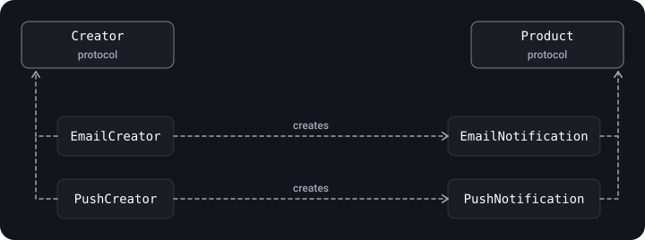
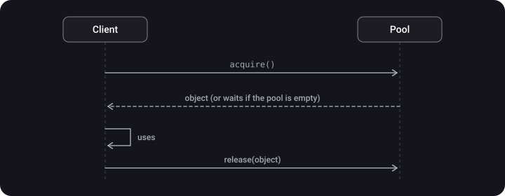

> **What you'll learn**
>
> - what design patterns are and which three groups they fall into;
> - how the six creational patterns work: Factory Method, Abstract Factory, Singleton, Builder, Prototype, Object Pool;
> - when each one is needed and when it is overkill;
> - how to make a Singleton and an object pool safe in a multithreaded environment.

> **Prerequisites**
>
> Chapters [01](../paradigms/)–[03](../kiss-dry-yagni/): protocols, SOLID (especially OCP and DIP). For Object Pool, the basics of GCD (see the "Concurrency" topic).

## Analogy: how to get a pizza

You can knead the dough yourself (create an object with `new`). You can order the "pizza of the day" and let the kitchen decide which one to make (**Factory Method**). You can order a "party set" with pizza, a drink and a dessert from one kitchen (**Abstract Factory**). You can assemble a pizza step by step: dough, sauce, toppings (**Builder**). You can ask for "the same as the neighbor's" (**Prototype**). One kitchen for the whole block is a **Singleton**. And dishes that are washed and used again are an **Object Pool**.

## Step 1. What patterns are and how they are divided

A **design pattern** is a description of the interaction of objects and classes, adapted to solve a typical design problem in a particular context. It is not ready-made code but a "recipe" that you adapt to your task.

| Group | What it is responsible for | Patterns |
| --- | --- | --- |
| **Creational** | Creating objects, hiding *how* and *which* object is created | Factory Method, Abstract Factory, Singleton, Builder, Prototype, Object Pool |
| **Structural** | Composing objects and classes into larger structures | Adapter, Facade, Decorator, Flyweight, Proxy (chapter [05](../structural-patterns/)) |
| **Behavioral** | Interaction of objects and distribution of responsibilities | Delegate, Observer, Chain of Responsibility, Strategy, State, Reactor (chapter [06](../behavioral-patterns/)) |

> **The full GoF classification**. The "Gang of Four" book has 23 patterns. *Creational:* Singleton, Factory Method, Abstract Factory, Builder, Prototype. *Structural:* Adapter, Bridge, Composite, Decorator, Facade, Flyweight, Proxy. *Behavioral:* Visitor, Chain of Responsibility, Template Method, Command, Strategy, Iterator, State, Mediator, Observer, Memento. This tutorial covers in detail the ones most often met in iOS; Object Pool and Reactor are not in the GoF list, they are later additions.

> **Why patterns are useful**. *Speed:* you take a ready solution instead of reinventing the wheel. *Proven:* the code is built from standard blocks whose problems have long been known. *A shared vocabulary:* it is enough to name the pattern instead of explaining the structure for an hour. A typical example from the source ("Case #1"): in different places of the app you need access to device resources (camera, gallery, geolocation); the request algorithm is similar but the code differs, and such a task is solved through a common interface with different implementations (for example, Strategy or a factory).

> A pattern is not a goal. Apply it when the *problem it solves* has arisen; otherwise you get over-complication (see KISS in chapter [03](../kiss-dry-yagni/)).

## Step 2. Factory Method

**Idea.** A common interface for creating an object is declared in a base type, and *which exact* object to create is decided by its descendants. The client works with the abstraction and doesn't know the concrete classes.



```swift
protocol Notification {
    func send(_ text: String)
}

struct EmailNotification: Notification {
    func send(_ text: String) { print("Email: \(text)") }
}
struct PushNotification: Notification {
    func send(_ text: String) { print("Push: \(text)") }
}

protocol NotificationCreator {
    func makeNotification() -> Notification        // the factory method
}

extension NotificationCreator {
    func notify(_ text: String) {                  // common logic uses the product
        makeNotification().send(text)
    }
}

struct EmailCreator: NotificationCreator {
    func makeNotification() -> Notification { EmailNotification() }
}
struct PushCreator: NotificationCreator {
    func makeNotification() -> Notification { PushNotification() }
}

func alert(using creator: NotificationCreator) {
    creator.notify("Hello!")
}

alert(using: EmailCreator())
alert(using: PushCreator())
```

> Foundation already has a `Notification` (the `NotificationCenter` notification). In your own project don't name a type the same way: in the example it is a teaching name; rename it to `UserNotification` or `Message`.

**Alerts in UIKit: Factory and Builder side by side.** The factory hands out the right alert by type, and the builder assembles a specific alert from parameters:

```swift
protocol DefaultsAlertsFactory: AnyObject {
    func getAlert(by type: DefaultsAlerts) -> UIViewController
}

protocol DefaultsAlertsBuilder: AnyObject {
    func buildOkAlert(with title: String, message: String) -> UIViewController
    func buildCancelAlert(with message: String, handler: (() -> Void)?) -> UIViewController
}
```

The difference in approach: with a factory the client asks "give me an alert of such and such type" (choosing a variant), with a builder "assemble an alert with this data" (assembling one object). Protocols with `AnyObject` are convenient if they are later stored weakly (`weak`).

| Pros | Cons |
| --- | --- |
| The client is not tied to concrete products. The creation code is in one place. New products are added without editing the client (OCP). | The number of types grows: each product needs its own creator. |

> In Swift people often get by with something simpler: a static function, or an `enum` with a `make()` method, or a closure `() -> Product`. A full hierarchy of creators is needed when the creation logic must be *overridden* in subtypes.

**A variant with a type parameter.** A car factory: a common protocol, and each concrete factory builds only some of the models (for example, for a particular country):

```swift
protocol Car { }
struct Tesla: Car { }
struct Mazda: Car { }

enum CarType { case tesla, ferrari, mazda }

protocol CarFactory {
    func makeCar(type: CarType) -> Car?
}

final class RegionalFactory: CarFactory {
    func makeCar(type: CarType) -> Car? {
        switch type {
        case .tesla: return Tesla()
        case .mazda: return Mazda()
        case .ferrari: return nil        // there won't be such cars in this country
        }
    }
}

let car = RegionalFactory().makeCar(type: .tesla)
```

In the source, an unsupported brand ends in `fatalError(...)`, which will crash the app at runtime. It is safer to return `nil` or throw an error (`throws`), as above.

## Step 3. Abstract Factory

**Idea.** Creates a **family** of related objects without being tied to concrete classes. The difference from Factory Method is exactly the family: one factory hands out a consistent set of products.

An example is interface styling: the light and dark themes have their own buttons and toggles, and they can't be mixed.

```swift
protocol Button { func render() -> String }
protocol Toggle { func render() -> String }

protocol ThemeFactory {
    func makeButton() -> Button
    func makeToggle() -> Toggle
}

struct LightButton: Button { func render() -> String { "Light button" } }
struct LightToggle: Toggle { func render() -> String { "Light toggle" } }
struct DarkButton: Button { func render() -> String { "Dark button" } }
struct DarkToggle: Toggle { func render() -> String { "Dark toggle" } }

struct LightThemeFactory: ThemeFactory {
    func makeButton() -> Button { LightButton() }
    func makeToggle() -> Toggle { LightToggle() }
}
struct DarkThemeFactory: ThemeFactory {
    func makeButton() -> Button { DarkButton() }
    func makeToggle() -> Toggle { DarkToggle() }
}

func buildScreen(with factory: ThemeFactory) {
    print(factory.makeButton().render())
    print(factory.makeToggle().render())
}

buildScreen(with: DarkThemeFactory())
```

> The original note shows the same idea with the example of a "set of devices from one manufacturer" (phone + laptop + tablet). The principle is the same: factory = manufacturer, products = its lineup.

## Step 4. Singleton

**Idea.** Guarantees a single instance of a class for the whole app and provides a global access point to it. It is everywhere in iOS: `URLSession.shared`, `UserDefaults.standard`, `FileManager.default`, `NotificationCenter.default`.

```swift
final class NetworkManager {
    static let shared = NetworkManager(baseURL: URL(string: "https://example.com")!)

    let baseURL: URL
    private init(baseURL: URL) { self.baseURL = baseURL }   // can't be created from outside
}

print(NetworkManager.shared.baseURL)
```

If setup is needed at creation, it is done in an initializer closure (as shown in the source): `static let shared: Singleton = { let instance = Singleton(); /* setup */ return instance }()`. The closure is also executed lazily and exactly once.

### Thread safety

In Swift, a `static let` is initialized **lazily and exactly once, even when accessed from several threads at the same time**. This is a language guarantee (the Swift book, the Type Properties section). That is why `static let shared` is a safe way to create a singleton.

> The guarantee covers **only the creation** of the instance. Mutable state inside the singleton still has to be protected (a queue, `NSLock`, `actor`). And in Swift 6 with strict concurrency checking, a `static let` of a non-concurrent mutable type causes an error: make the type `Sendable`, an `actor` or `@MainActor`.

### Why the singleton is called an anti-pattern

| Problem | What happens |
| --- | --- |
| Hidden dependencies | A class reaches for `NetworkManager.shared` from inside, and its `init` doesn't show this |
| Testing | You can't replace `shared` with a fake, and state "leaks" between tests |
| SRP | The type is responsible both for its work and for being the only one |
| Global mutable state | Any code can change it, and the order of changes is unpredictable |

### How to use it more safely

- Use a `private init` so a second instance can't be created by accident.
- **Don't keep mutable state in a singleton**, or protect it.
- **Inject it as a dependency** through a protocol, and then tests can substitute a fake:

```swift
protocol Networking { func load(_ url: URL) async throws -> Data }

final class NetworkService: Networking {
    static let shared = NetworkService()
    private init() {}
    func load(_ url: URL) async throws -> Data {
        try await URLSession.shared.data(from: url).0
    }
}

final class ProfileViewModel {
    private let network: Networking
    init(network: Networking = NetworkService.shared) { self.network = network }  // in tests we pass a Mock
}
```

## Step 5. Builder

**Idea.** Assembles a complex object **step by step**; the same assembly process can produce different representations. Classically two participants take part: the *Builder* (assembles) and the *Director* (knows the order of steps).

An example is a house with walls and a roof.

```swift
struct Walls { var width: Float; var height: Float }
struct Roof  { var width: Float; var height: Float }

struct House {
    var walls: Walls?
    var roof: Roof?
}

final class HouseBuilder {
    private var house = House()

    @discardableResult
    func setWalls(_ walls: Walls) -> Self { house.walls = walls; return self }

    @discardableResult
    func setRoof(_ roof: Roof) -> Self { house.roof = roof; return self }

    func build() -> House { house }
}

let house = HouseBuilder()
    .setWalls(Walls(width: 1.5, height: 2.3))
    .setRoof(Roof(width: 2.5, height: 3.3))
    .build()
```

> **In Swift, Builder is needed less often than in Java.** Default parameter values and argument labels solve most tasks: `House(walls: w, roof: r)`. A builder is justified when assembly is *multi-step*, depends on conditions or must be validated before `build()`. In iOS you constantly see it as chains: `URLComponents`, `NSAttributedString` builders, `UIAlertController` with actions being added.

**An example with validation: `URLBuilder`.** Here a builder is justified: the steps are optional, and the consistency of fields (a login without a password) is checked in `build()`:

```swift
import Foundation

final class URLBuilder {
    enum URLBuilderError: Error { case emptyHost, inconsistentCredentials, systemError }

    private var scheme = "https"
    private var user: String?
    private var password: String?
    private var host: String?
    private var port: Int?
    private var path = ""
    private var queryItems: [String: String]?

    func with(scheme: String) -> URLBuilder { self.scheme = scheme; return self }
    func with(user: String) -> URLBuilder { self.user = user; return self }
    func with(password: String) -> URLBuilder { self.password = password; return self }
    func with(host: String) -> URLBuilder { self.host = host; return self }
    func with(port: Int) -> URLBuilder { self.port = port; return self }
    func with(path: String) -> URLBuilder { self.path = path; return self }
    func with(queryItems: [String: String]) -> URLBuilder { self.queryItems = queryItems; return self }

    func build() throws -> URL {
        guard let host else { throw URLBuilderError.emptyHost }
        guard (user == nil) == (password == nil) else { throw URLBuilderError.inconsistentCredentials }

        var components = URLComponents()
        components.scheme = scheme
        components.user = user
        components.password = password
        components.host = host
        components.port = port
        components.path = path
        components.queryItems = queryItems?.map { URLQueryItem(name: $0.key, value: $0.value) }
        guard let url = components.url else { throw URLBuilderError.systemError }
        return url
    }
}

let url = try URLBuilder()
    .with(host: "example.com")
    .with(path: "/some/path")
    .with(queryItems: ["page": "0"])
    .build()
```

In the source, the login/password pair check is written as two mirror-image `if`s; I merged them into one condition with the same behavior. The `systemError` error is marked in the original with the comment "Impossible?"; in practice `components.url` returns `nil` only for invalid characters in the components.

| Pros | Cons |
| --- | --- |
| Step-by-step assembly, one process gives different products, the complex assembly code is separated from business logic. | Extra types; the client is tied to the builder if the Director has no method for getting the result. |

## Step 6. Prototype

**Idea.** A new object is created by **cloning** an existing one. This is handy when creating from scratch is expensive or when you need a "template" with settings.

In the Objective-C/Foundation world this is handled by the `NSCopying` protocol:

```swift
final class Contact: NSObject, NSCopying {
    var firstName: String
    var lastName: String

    init(firstName: String, lastName: String) {
        self.firstName = firstName
        self.lastName = lastName
    }

    func copy(with zone: NSZone? = nil) -> Any {
        Contact(firstName: firstName, lastName: lastName)
    }
}

let first = Contact(firstName: "Tom", lastName: "Leader")
let second = first.copy() as! Contact
second.lastName = "Paul"

print(first.lastName, second.lastName)   // Leader Paul
```

> **Value types are a built-in Prototype.** In Swift, structs and enums are *copied on assignment*, so `var b = a` already creates an independent clone. You need to implement `NSCopying` only if the type is a class (especially an `NSObject` subclass that Cocoa APIs expect).

## Step 7. Object Pool

**Idea.** Instead of constantly creating and destroying "expensive" objects, you create a set in advance and **take / return** them. It is used for database connections, threads, buffers; in UIKit `UITableView`/`UICollectionView` follow the same principle: cells are reused through `dequeueReusableCell`.



A thread-safe pool based on a semaphore:

```swift
import Foundation

final class Pool<T> {
    private let lock = NSLock()
    private let semaphore: DispatchSemaphore
    private var items: [T]

    init(_ items: [T]) {
        self.items = items
        self.semaphore = DispatchSemaphore(value: items.count)   // as many "tickets" as there are objects
    }

    /// Blocks the thread until the pool has a free object.
    func acquire() -> T {
        semaphore.wait()
        lock.lock(); defer { lock.unlock() }
        return items.removeFirst()          // after wait() an object is guaranteed to exist
    }

    func release(_ item: T) {
        lock.lock()
        items.append(item)
        lock.unlock()
        semaphore.signal()                   // signal that an object has come back
    }
}
```

> `acquire()` blocks the calling thread. **Don't call it on the main thread**: the interface will freeze. In modern code, to limit the number of concurrent tasks people more often use a `TaskGroup` with a limit or an `actor` rather than semaphores.

## Step 8. How to choose

| Task | Pattern |
| --- | --- |
| The client doesn't need to know which exact object is created | Factory Method |
| You need to create a consistent *set* of objects (themes, platforms) | Abstract Factory |
| You need exactly one instance (and it is justified) | Singleton (better together with DI) |
| A complex object is assembled in steps | Builder |
| It is easier to clone a ready object than to create a new one | Prototype |
| Creation is expensive, objects can be reused | Object Pool |

## Common mistakes

- **A Singleton for everything**: "global variables in a suit".
- **Keeping mutable state in a singleton without synchronization.**
- **A Builder without need** where an `init` with default parameters would be enough.
- **A Factory for a single product**: an extra layer.
- **Blocking the main thread in `acquire()`.**
- **Copying a class "as a value"**: references inside are copied shallowly.

## Cheat sheet

- Creational patterns hide *how and which* object is created.
- Factory Method — one product; Abstract Factory — a family.
- `static let shared` is created lazily and thread-safely, but doesn't make the state thread-safe.
- Builder = step by step; Prototype = cloning; Pool = reuse.

## Self-check questions

<details>
<summary>1. How does Abstract Factory differ from Factory Method?</summary>

Factory Method creates one product, the choice of which is left to subtypes. Abstract Factory hands out a family of consistent products.

</details>

<details>
<summary>2. Does static let shared guarantee the singleton's thread safety?</summary>

Only its creation: the instance is initialized once even under simultaneous access. Mutable state inside must be protected separately.

</details>

<details>
<summary>3. Why does Singleton get in the way of testing?</summary>

The dependency is hidden inside the code, it can't be replaced, and state lives on between tests. The solution is to inject it through a protocol.

</details>

<details>
<summary>4. What is wrong with HouseBuilder from the original note?</summary>

`house` is `nil`, so all the `house?.…` assignments were never executed and the result is always `nil`.

</details>

<details>
<summary>5. Where does UIKit have an Object Pool?</summary>

In the reuse of table and collection cells (`dequeueReusableCell`).

</details>

## Sources

- [Properties — The Swift Programming Language (Type Properties)](https://docs.swift.org/swift-book/documentation/the-swift-programming-language/properties/)
- [NSCopying — Apple Developer Documentation](https://developer.apple.com/documentation/foundation/nscopying)
- [DispatchSemaphore — Apple Developer Documentation](https://developer.apple.com/documentation/dispatch/dispatchsemaphore)
- [Design Patterns — Refactoring.Guru](https://refactoring.guru/design-patterns)
