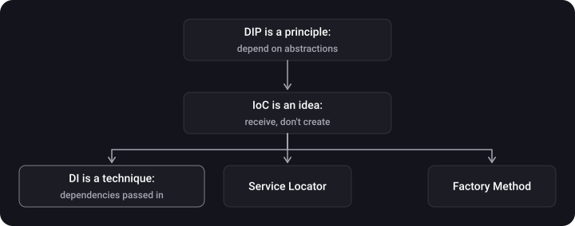
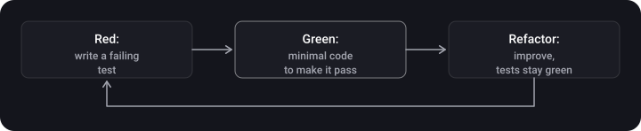

> **What you'll learn**
>
> - how DIP, IoC and DI differ and how they are related;
> - what ways of injecting dependencies exist and which to choose by default;
> - how to inject dependencies in SwiftUI: through `init`, `@Environment`, `@EnvironmentObject`, `@Observable`, the `@Entry` macro;
> - why Service Locator is not a way of doing DI but an alternative (and often an anti-pattern);
> - how DI makes code testable and what TDD is.

> **Prerequisites**
>
> Chapters [02](../solid/) (SOLID, especially DIP) and [04](../creational-patterns/) (Singleton). SwiftUI basics (`View`, `@State`).

## Analogy: a cook and groceries

A cook who goes to the market himself, picks a supplier and grows the vegetables is tightly tied to everything at once. A cook to whom groceries are **brought to the kitchen** can work with any supplier, and at an exam he can be given dummies. DI is "the groceries are brought to you".

## Step 1. Three similar terms



| Term | What it is | The question it answers |
| --- | --- | --- |
| **DIP** (Dependency Inversion Principle) | A SOLID principle: high-level modules don't depend on low-level ones, both depend on abstractions | *What* the dependencies should be like (hidden behind protocols) |
| **IoC** (Inversion of Control) | A general idea: a component doesn't manage creation and wiring itself, someone from outside (a container, a framework) does | *Who* is in charge |
| **DI** (Dependency Injection) | A pattern: an object's dependencies are provided from outside rather than created inside | *How* to implement IoC |

DI is not the only way to implement IoC: there are also Service Locator and factory methods. More in step 4.

## Step 2. What DI is and why it is needed

**Dependency Injection** is a pattern of configuring an object in which its dependencies are passed in from outside rather than created inside.

```swift
// ❌ The dependency is created inside — it can't be replaced
final class LoginViewModel {
    private let auth = RealAuthService()
}

// ✅ The dependency comes from outside and is hidden behind a protocol
final class LoginViewModel {
    private let auth: AuthService
    init(auth: AuthService) { self.auth = auth }
}
```

**Why:**

- dependencies become **explicit**, visible in the `init`;
- dependencies are **external**: creation is separated from business logic (SRP);
- dependencies are **flexible**: the implementation can be replaced (including with a fake in tests);
- less coupling, easier reuse.

**The price:** more entities (protocols, assembly code) and more time to write.

## Step 3. Ways of injection

| Way | How | Pros / cons |
| --- | --- | --- |
| **Constructor injection** | Through `init` | The object is always created in a ready state, dependencies are `let`. A bloated `init` is a sign of an SRP violation. |
| **Property injection** | Through a public `var` property | The object can be used before the dependencies are injected, which risks an inconsistent state; the property can be changed from outside (encapsulation breaks). Useful where the `init` can't be changed (for example, a `UIViewController` from a Storyboard). |
| **Method injection** | Through a method parameter | Good for a dependency needed by *one* call. |
| **Interface (protocol) injection** | A separate "I can accept X" protocol through which the injection is done | Excessive: each dependency needs its own protocol. |
| **Environment injection** | Through the environment (SwiftUI `@Environment`) | No need to pass it down the whole hierarchy. A hidden dependency. |
| **Factory injection** | The object is given a factory rather than a ready dependency | When objects need to be created many times or lazily. |

### Constructor injection + a test fake

```swift
protocol AuthService {
    func login(email: String, password: String) async throws -> Bool
}

final class LoginViewModel {
    private let auth: AuthService
    private(set) var errorMessage: String?

    init(auth: AuthService) { self.auth = auth }

    func login(email: String, password: String) async -> Bool {
        do {
            let ok = try await auth.login(email: email, password: password)
            if !ok { errorMessage = "Wrong password" }
            return ok
        } catch {
            errorMessage = "Network error"
            return false
        }
    }
}
```

### Composition root: a single place of assembly

Dependencies are created **in one place** (usually the app's entry point), and the rest of the code only receives them:

```swift
struct RealAuthService: AuthService {
    func login(email: String, password: String) async throws -> Bool { true }
}

final class AppContainer {
    private let auth: AuthService

    init(auth: AuthService = RealAuthService()) { self.auth = auth }

    func makeLoginViewModel() -> LoginViewModel {
        LoginViewModel(auth: auth)
    }
}
```

In tests it is `AppContainer(auth: fake)`, in the app `AppContainer()`.

## Step 4. Service Locator: an alternative, not DI

A **Service Locator** is a shared registry from which objects *request* the services they need themselves.

```swift
final class ServiceLocator {
    static let shared = ServiceLocator()
    private var services: [ObjectIdentifier: Any] = [:]
    private init() {}

    func register<T>(_ type: T.Type, _ service: T) {
        services[ObjectIdentifier(type)] = service
    }
    func resolve<T>(_ type: T.Type) -> T {
        guard let service = services[ObjectIdentifier(type)] as? T else {
            fatalError("Not registered: \(type)")
        }
        return service
    }
}

final class ProfileViewModel {
    private let auth = ServiceLocator.shared.resolve(AuthService.self)   // a hidden dependency
}
```

|  | DI | Service Locator |
| --- | --- | --- |
| Who gets the dependency | It is passed to the object | The object asks the registry itself |
| Dependencies are visible in the interface | Yes (`init`) | No, they are hidden inside |
| The "forgot to register" error | Usually caught by the compiler | A runtime crash |
| Testing | Pass a fake | The global registry has to be reconfigured |
| Relation to Singleton | Not needed | The registry itself is a global singleton |

> Many consider Service Locator an **anti-pattern** precisely because of the hidden dependencies. It is acceptable at the boundaries of an app (for example, in legacy code where the `init` can't be changed), but not as the main way of wiring.

## Step 5. DI in SwiftUI

### 5.1 Through `init` (constructor injection)

Swift synthesizes the `init` for a `struct View` itself, so you can inject as usual. The approach works the same for any dependency.

```swift
struct LoginView: View {
    let viewModel: LoginViewModel        // passed in from outside

    var body: some View { Text("Login") }
}
```

If views are nested deeply, the dependency will have to be "passed down" through every level, and that is what the environment is for.

### 5.2 Through the environment: `@Environment` (the modern way)

In **iOS 17+**, classes with the `@Observable` macro are put into the environment by type:

```swift
import SwiftUI
import Observation

@Observable final class Session {
    var userName: String?
}

@main
struct MyApp: App {
    @State private var session = Session()          // the owner of the object

    var body: some Scene {
        WindowGroup {
            ContentView()
                .environment(session)                // inject
        }
    }
}

struct ProfileView: View {
    @Environment(Session.self) private var session   // get by type

    var body: some View { Text(session.userName ?? "Guest") }
}
```

For protocol dependencies and values an environment key is used. In Xcode 16+ it is declared with the `@Entry` macro rather than three blocks of code:

```swift
protocol Analytics { func track(_ event: String) }
struct NoopAnalytics: Analytics { func track(_ event: String) { } }

extension EnvironmentValues {
    @Entry var analytics: any Analytics = NoopAnalytics()   // the default value
}

// Injecting:  ContentView().environment(\.analytics, RealAnalytics())
// Receiving:  @Environment(\.analytics) private var analytics
```

> **Backward compatibility.** The `@Entry` macro also works with older iOS versions (it is a compile-time macro and requires Xcode 16). For protocols in Swift 6 mode, the value type may need to be marked `Sendable`.

### 5.3 The old way (before iOS 17): `ObservableObject`

| Wrapper | Role |
| --- | --- |
| `ObservableObject` | A protocol: a class that SwiftUI observes |
| `@Published` | Properties whose changes update the view |
| `@StateObject` | **Creates and owns** the object: initialized once, survives view re-creation. Use only where the object is created. |
| `@ObservedObject` | Holds a reference to an already created object passed in from outside; it is not built into the hierarchy. |
| `@EnvironmentObject` | Gets an object from the environment; injected once in a parent view through `.environmentObject(_:)`, available to all descendants. |

```swift
final class GameViewModel: ObservableObject {
    @Published var score = 0
}

struct ContentView: View {
    @StateObject private var vm = GameViewModel()      // the only owner

    var body: some View {
        MainView()
            .environmentObject(vm)                      // descendants get the same reference
    }
}

struct MainView: View {
    @EnvironmentObject var vm: GameViewModel            // no creation and no passing as a parameter
    var body: some View { Text("\(vm.score)") }
}
```

> **A trap from practice.** Writing `@ObservedObject var vm = GameViewModel()` (with parentheses) in a child view instead of `var vm: GameViewModel` means **creating a second, independent object**. The code compiles and "works", but the view ends up with different data than its parent. Such a bug takes a long time to find. The rule: `= Type()` only where you are the owner (`@StateObject` / `@State`), while descendants declare the type without initialization.

> **Peculiarities of `@EnvironmentObject`.** If you forget to inject the object, the app crashes at runtime. The environment can hold only one object of each type: injecting lower in the hierarchy replaces the upper one. `@EnvironmentObject` doesn't suit value types (it needs an `ObservableObject`, that is, a class); people use `@Environment` instead, which always has a default value and is therefore safer.

### 5.4 DI containers (Swinject, Needle)

Container libraries register dependencies and hand them out by type:

- **Swinject** is a container with registration and resolution of dependencies at runtime;
- **Needle** (Uber) generates code and checks the dependency graph **at compile time**.

The downside of the `resolve` approach: if you forget to register a dependency, the error appears only at runtime (as with `@EnvironmentObject`). So containers suit large apps well, while for small ones the composition root from step 3 is enough.

### 5.5 Coordinator + DI

A coordinator is often itself the place where screens are assembled: it receives a container, creates a `ViewModel` with the necessary dependencies and hands them to the view. More in chapter [10](../router-coordinator/).

## Step 6. Testability and TDD

A unit test needs to replace everything that makes a test slow or nondeterministic: network, disk, time, random numbers. DI provides exactly that substitution point.

```swift
import XCTest

struct AuthServiceStub: AuthService {
    let result: Result<Bool, Error>
    func login(email: String, password: String) async throws -> Bool {
        try result.get()
    }
}

final class LoginViewModelTests: XCTestCase {
    func test_login_withWrongPassword_setsErrorMessage() async {
        let sut = LoginViewModel(auth: AuthServiceStub(result: .success(false)))

        let ok = await sut.login(email: "a@b.c", password: "x")

        XCTAssertFalse(ok)
        XCTAssertEqual(sut.errorMessage, "Wrong password")
    }

    func test_login_onNetworkFailure_setsErrorMessage() async {
        struct Boom: Error {}
        let sut = LoginViewModel(auth: AuthServiceStub(result: .failure(Boom())))

        let ok = await sut.login(email: "a@b.c", password: "x")

        XCTAssertFalse(ok)
        XCTAssertEqual(sut.errorMessage, "Network error")
    }
}
```

Note the naming: `sut` (*system under test*), and the three parts of a test are arrange, act, assert (Given–When–Then).

> **Swift Testing.** Starting with Xcode 16 a new framework is available, `import Testing`: tests are functions with `@Test`, checks are `#expect(...)`. The idea of substituting dependencies through DI doesn't change.

### TDD: test-driven development

The **Red → Green → Refactor** cycle:



The claimed benefits of TDD: it removes the fear of making changes (the tests are a safety net), doesn't leave tests "for later", and forces you to design code so that it is testable at all, that is, with explicit dependencies. The weak side is that it takes discipline and time, especially for UI code; so TDD is more often applied to business logic (ViewModel, use cases, services).

## Common mistakes

- **Creating dependencies inside** (`private let api = APIClient()`): they can't be replaced.
- **`Singleton.shared` deep in the code**: the same hidden dependency (see chapter [04](../creational-patterns/)).
- **A bloated `init` of 8 parameters** and an attempt to "solve" it with a Service Locator. Split the type.
- **`@ObservedObject var vm = VM()`** in a child view: a second instance.
- **A forgotten `.environmentObject` / `.environment`**: a runtime crash.
- **A protocol "for show"** for a type that is never replaced.

## Cheat sheet

- DIP is a principle, IoC is an idea, DI is a technique; Service Locator is an alternative to DI for implementing IoC, not DI itself.
- By default: constructor injection, assembled in one place (the composition root).
- SwiftUI: `init` → `@Environment(Type.self)` (`@Observable`, iOS 17+) → `@Entry` for keys; before iOS 17, `@StateObject`/`@EnvironmentObject`.
- The owner creates (`@State`/`@StateObject`), descendants accept.
- TDD: Red → Green → Refactor.

## Self-check questions

<details>
<summary>1. How does DI differ from DIP?</summary>

DIP is a principle (depend on abstractions), DI is the technique by which we receive dependencies from outside. They are often used together.

</details>

<details>
<summary>2. Why is constructor injection considered the default way?</summary>

The object is created in a ready state right away, the dependencies are explicit and immutable; an overly long `init` hints that SRP is violated.

</details>

<details>
<summary>3. Why is Service Locator worse than DI?</summary>

The dependencies are hidden, registration errors are visible only at runtime, and the registry itself is global state that complicates tests.

</details>

<details>
<summary>4. How does @StateObject differ from @ObservedObject?</summary>

`@StateObject` creates the object and owns it (it is created once), whereas `@ObservedObject` only refers to an object created by someone else.

</details>

<details>
<summary>5. How do you replace the network in a ViewModel test?</summary>

Inject through `init` a fake that implements the same protocol and returns a predefined result.

</details>

## Sources

- [Environment — Apple Developer Documentation](https://developer.apple.com/documentation/swiftui/environment)
- [Migrating from the Observable Object protocol to the Observable macro](https://developer.apple.com/documentation/swiftui/migrating-from-the-observable-object-protocol-to-the-observable-macro)
- [Swift Testing — Apple Developer Documentation](https://developer.apple.com/documentation/testing)
- [DI vs. DIP vs. IoC — Sergey Teplyakov (in Russian)](https://sergeyteplyakov.blogspot.com/2014/11/di-vs-dip-vs-ioc.html)
