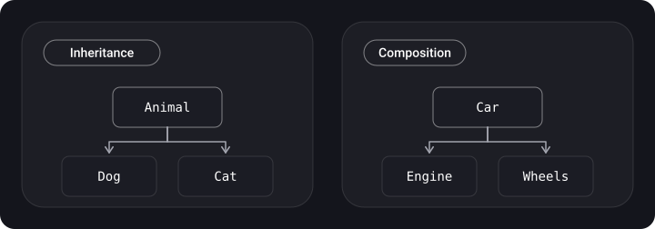

> **What you'll learn**
>
> - what KISS, DRY and YAGNI mean and how they help (and hinder) each other;
> - how composition differs from inheritance and why "favor composition" is not a dogma but a working rule;
> - how to replace a class hierarchy with a set of protocols and components in Swift.

> **Prerequisites**
>
> Chapters [01](../paradigms/) and [02](../solid/): OOP, protocols, SOLID.

## Analogy: a ready-made dish vs a set of ingredients

**Inheritance** is buying a semi-prepared "borscht" and trying to turn it into "solyanka": you get all the extras that are already in it. **Composition** is taking separate ingredients and assembling a dish from the ones you need. The first is faster at the start, the second is more flexible later.

## Step 1. KISS: "keep it simple"

**KISS** (*keep it simple, stupid* or, more gently, *keep it short and simple*) treats simplicity as the main value. Simple code is understandable code; complex code is hard to change and bugs hide in it more often.

| How it shows up | iOS example |
| --- | --- |
| Don't pile up abstractions without need | Three layers of protocols for an "About" screen |
| Don't pull in a huge library for a couple of functions | Adding a whole framework just to format a date when `Date.FormatStyle` exists |
| Break the complex into simple parts | Extract a complex screen into several small `View`s |
| Use a pattern only when its problem exists | Don't make a Factory if one type is created in one way |

> **Patterns and KISS.** A design pattern is a simple solution to a *specific problem*. Applying it where there is no problem is over-complication (a KISS violation). Not applying it where there is a problem is also over-complication, because the code ends up more tangled than it could be.

```swift
// ❌ Over-engineered: a factory, a protocol and a strategy just to add two numbers
protocol OperationStrategy { func run(_ a: Int, _ b: Int) -> Int }
struct AddStrategy: OperationStrategy { func run(_ a: Int, _ b: Int) -> Int { a + b } }
final class OperationFactory { func make() -> OperationStrategy { AddStrategy() } }

// ✅ Enough
func add(_ a: Int, _ b: Int) -> Int { a + b }
```

## Step 2. DRY: "don't repeat yourself"

> Every piece of knowledge must have a single, unambiguous, authoritative representation within a system.

DRY (*don't repeat yourself*) is about repeating **knowledge**, not repeating lines. If the rule "the maximum name length is 30 characters" is written in three places, changing it means fixing it everywhere, and one place will certainly be forgotten.

```swift
// ❌ The knowledge about "30" is smeared around
func validateProfile(name: String) -> Bool { name.count <= 30 }
func validateCompany(name: String) -> Bool { name.count <= 30 }

// ✅ A single source of truth
enum Limits { static let nameLength = 30 }
func validate(name: String) -> Bool { name.count <= Limits.nameLength }
```

## Step 3. YAGNI: "you aren't gonna need it"

**YAGNI** (*you aren't gonna need it*): don't implement what isn't in the requirements. The customer shouldn't pay for extra features, and you shouldn't spend time on code "just in case".

- Don't add parameters, protocols and "extensibility" that nobody asked for.
- When refactoring, delete what is unused. If you need it again, git remembers everything.

```swift
// ❌ "What if it comes in handy"
struct User {
    let id: Int
    let name: String
    var legacyToken: String? = nil     // nobody uses it
    var extraFlags: [String: Any] = [:] // "for the future"
}

// ✅
struct User {
    let id: Int
    let name: String
}
```

### How these three principles argue with each other

| Situation | What the principle says |
| --- | --- |
| You want to build a universal abstraction right away | YAGNI and KISS: too early, wait for the second or third case |
| The same code on five screens | DRY: extract it |
| You extracted it but had to add 4 flags | KISS: maybe it was false duplication, put it back |

## Step 4. Composition and inheritance

One of the main design rules: **favor composition over inheritance**. Both are ways to reuse functionality.

- **Inheritance** is "is-a": a `Dog` is an `Animal`. A subclass gets everything from its parent.
- **Composition** is "has-a": a `Car` has an `Engine`. A new type is assembled from existing parts.



### Why a deep hierarchy is bad

Let's model game heroes. At first everything is simple:

```swift
class Hero {
    func walk() { print("Walking") }
}
class Wizard: Hero {
    func castSpell() { print("Spell") }
}
class Archer: Hero {
    func shoot() { print("Shot") }
}
```

Then a "battle mage" and a "flying mage" appear. Swift doesn't allow inheriting from two classes; moving `shoot` into `Hero` means letting even a pacifist peasant shoot; copying the method violates DRY. That is the problem: **a subclass is tightly bound to its parent and gets everything the parent can do** (including the extras).

### The same with composition and protocols

```swift
protocol Walking   { func walk() }
protocol Shooting  { func shoot() }
protocol Casting   { func castSpell() }

struct Legs: Walking { func walk() { print("Walking") } }
struct Bow: Shooting { func shoot() { print("Shot") } }
struct Spellbook: Casting { func castSpell() { print("Spell") } }

struct Hero {
    let legs = Legs()
    var bow: (any Shooting)?           // can shoot, if there is a weapon
    var spellbook: (any Casting)?
}

var battleMage = Hero(bow: Bow(), spellbook: Spellbook())
battleMage.legs.walk()
battleMage.bow?.shoot()
battleMage.spellbook?.castSpell()
```

Each ability lives separately, combinations are assembled without a new class, and any ability can be swapped out in tests.

> Components can be substituted: `Hero` depends on the `Shooting` protocol, not on `Bow`. Then in a test you pass a `MockShooter`, and in the game a `Bow` or a `Crossbow`. This is already the DIP principle from the previous chapter.

### The same on UIKit screens

A classic case: there is a `BaseViewController` with a set of methods `functionality1/2/3`, and screens inherit from it and override whatever they need:

```swift
class BaseViewController: UIViewController {
    func functionality1() { print("Base functionality 1") }
    func functionality2() { print("Base functionality 2"); functionality3() }
    func functionality3() { print("Base functionality 3") }
}

class ViewControllerB: BaseViewController {
    override func functionality3() { print("ViewControllerB functionality 3") }
    @IBAction func buttonTapped(_ sender: Any) { functionality2() }
}
```

The problems listed in the source: an SRP violation; the base class has many methods, most of which the screen doesn't need, and everything is tightly coupled; they can't be reused in classes that don't inherit from the `UIViewController` base; it is hard to test. The solution is composition: each capability is extracted into a protocol and a component, and the screen receives only the ones it needs through `init`:

```swift
protocol Functionality1Protocol { func doSomething() }
struct Functionality1Component: Functionality1Protocol {
    func doSomething() { print("Something 1") }
}

protocol Functionality2Protocol { func doSomething() }
struct Functionality2Component: Functionality2Protocol {
    func doSomething() { print("Something 2") }
}

final class ViewControllerA: UIViewController {
    private let functionality1: Functionality1Protocol

    init(functionality1: Functionality1Protocol) {
        self.functionality1 = functionality1
        super.init(nibName: nil, bundle: nil)
    }
    required init?(coder: NSCoder) { fatalError("init(coder:) has not been implemented") }

    @IBAction func buttonTapped(_ sender: Any) { functionality1.doSomething() }
}

final class ViewControllerB: UIViewController {
    private let functionality1: Functionality1Protocol
    private let functionality2: Functionality2Protocol

    init(functionality1: Functionality1Protocol, functionality2: Functionality2Protocol) {
        self.functionality1 = functionality1
        self.functionality2 = functionality2
        super.init(nibName: nil, bundle: nil)
    }
    required init?(coder: NSCoder) { fatalError("init(coder:) has not been implemented") }

    @IBAction func buttonTapped(_ sender: Any) {
        functionality1.doSomething()
        functionality2.doSomething()
    }
}
```

Each screen takes only what it needs, and the components can be swapped in tests. The code in the screenshots was shown small, so I reconstructed it by meaning; the exact names may differ.

### When inheritance is still appropriate

| Inheritance | Composition |
| --- | --- |
| An "is-a" relationship | A "has / uses" relationship |
| Classes only, one parent | Any types, any number of parts |
| A rigid link, fixed at declaration time | Flexible, a component can be swapped |
| A subclass sees the parent's internals (tight coupling) | Parts communicate through a public interface |
| Mandatory when a framework requires a base class (`UIViewController`, `UIView`) | The usual choice for your own logic |

In practice both approaches are combined: `final class ProfileViewController: UIViewController` inherits from UIKit (it has to), while all of its logic is assembled from injected services.

## Common mistakes

- **A "universal" base class** `BaseViewController` with logic that half of the screens need. Screens get behavior that isn't theirs, and a change to the base class breaks everyone.
- **Merging code just because it looks similar** (false DRY).
- **Writing "extensibility" in advance** (a YAGNI violation): a protocol for a single implementation, parameters "for the future".
- **Treating KISS as an excuse for spaghetti.** Simplicity is not "all in one 300-line method" but a clear structure.
- **Fearing inheritance like fire.** If a type really is a subtype and you control both sides, inheritance is a perfectly good tool.

## Cheat sheet

- KISS — the simplest working solution.
- DRY — one piece of knowledge, one place.
- YAGNI — don't write "just in case".
- Composition = "has-a", inheritance = "is-a"; by default assemble from parts.
- Protocol + component is a way to get the combination of behaviors you need without a hierarchy.

## Self-check questions

<details>
<summary>1. How does DRY differ from a plain "don't copy code"?</summary>

DRY is about duplicating *knowledge* (rules, constants, logic). Code that looks the same but changes for different reasons should not be merged.

</details>

<details>
<summary>2. How does YAGNI help when refactoring?</summary>

It lets you calmly delete unused methods and fields: if needed, they can be restored from git.

</details>

<details>
<summary>3. Why does a "battle mage" fit inheritance badly?</summary>

A class has only one parent, and moving abilities into a common base class hands them to those who don't need them.

</details>

<details>
<summary>4. When is inheritance justified?</summary>

When it is a genuine "is-a" relationship and when a framework requires it (for example, `UIViewController`).

</details>

<details>
<summary>5. How is composition related to DIP?</summary>

Components are connected through protocols and passed in from outside, so they are easy to substitute. That is exactly depending on abstractions.

</details>

## Sources

- [Choosing Between Structures and Classes — Apple Developer Documentation](https://developer.apple.com/documentation/swift/choosing-between-structures-and-classes)
- [Inheritance — The Swift Programming Language](https://docs.swift.org/swift-book/documentation/the-swift-programming-language/inheritance/)
