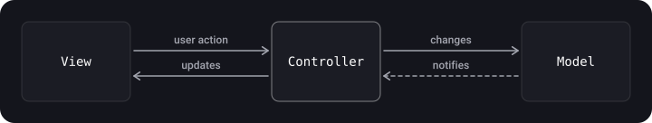
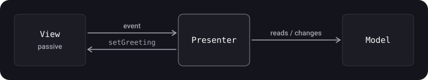
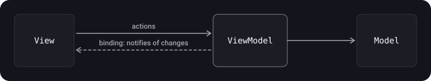

> **What you'll learn**
>
> - why architectural patterns are needed and how to recognize a good architecture;
> - how MVC, MVP and MVVM work, who knows whom and who is responsible for what;
> - why "Apple's MVC" turns into Massive View Controller;
> - how the same screen looks in all three variants, and which to choose.

> **Prerequisites**
>
> Chapters [02](../solid/) (SOLID), [06](../behavioral-patterns/) (Delegate, Observer) and [07](../di-ioc/) (DI). UIKit at a basic level.

## Analogy: a restaurant

There is a **dining room** (View), which is what the guest sees, a **kitchen and storeroom** (Model), the ingredients and recipes, and someone has to connect them. In **MVC** that is a universal manager (Controller) who takes the order, runs to the kitchen and sets the table. In **MVP** it is a waiter (Presenter): he doesn't know how the dining room is built, talks to it over a loudspeaker (a protocol) and can easily practice on a dummy. In **MVVM** it is an order board (ViewModel) to which the dining room subscribes by itself: there is no waiter, the room simply mirrors the board.

## Step 1. Why architecture is needed

An architectural pattern splits code into roles so that each part solves its own task and can be understood, reused and tested separately.

**Signs of a good architecture:**

- **Distribution of responsibilities** between entities (SRP from chapter [02](../solid/));
- **Strict roles:** it is clear what goes where;
- **Testability:** the logic can be checked without launching the interface;
- **Simplicity, scalability and low cost**: the architecture shouldn't cost more than it saves.
- **Ease of change:** a good architecture responds readily to new requirements, helps to estimate any changes to the system more accurately and supports a fast, steady pace of development.
- **Independence** from frameworks, the database, the UI, hardware and the outside world: this is the ideal from chapter [09](../viper-clean-mvi/) (Clean).

Designing an architecture is more an art than a craft: compromises are inevitable.

### Three roles in MV(X)

| Role | What it is responsible for | Examples |
| --- | --- | --- |
| **Model** | Domain data and the layer for accessing it (network, database); *knows nothing* about the interface | `Person`, `PersonDataProvider` |
| **View** | Display. In iOS this is everything that starts with `UI`, and in SwiftUI it is `View` | `UILabel`, `UIButton`, a SwiftUI screen |
| **Controller / Presenter / ViewModel** | The mediator: reacts to user actions, changes the Model and updates the View | `GreetingViewController`, `GreetingPresenter`, `GreetingViewModel` |

The practical benefit of the separation: entities are easier to understand, View and Model can be reused, and each part can be tested separately.

All the examples below use the same model:

```swift
struct Person {
    let name: String
    let surname: String
}
```

And the same screen: a "Show greeting" button and a text label in which "Hello Tom Leader" appears.

## Step 2. MVC

MVC (Model–View–Controller) splits data, interface and control logic into three components so that each can be changed independently.

### The classic scheme

- The **Model** provides data and reacts to commands from the controller.
- The **View** displays the model's data.
- The **Controller** interprets user actions and tells the model what to change.

The model can be **passive** (it can't notify; the controller is responsible for redrawing) or **active** (it notifies subscribed views of changes).

### Apple's MVC: as intended



The Controller is the mediator: the View and the Model don't talk to each other.

### What it looks like in UIKit in practice

```swift
import UIKit

final class GreetingViewController: UIViewController {
    var person: Person!                    // Model

    private let showGreetingButton = UIButton(type: .system)   // View
    private let greetingLabel = UILabel()                       // View

    override func viewDidLoad() {
        super.viewDidLoad()
        showGreetingButton.setTitle("Show greeting", for: .normal)
        showGreetingButton.addAction(UIAction { [weak self] _ in
            self?.didTapButton()
        }, for: .touchUpInside)
        // ... adding subviews and constraints
    }

    private func didTapButton() {
        greetingLabel.text = "Hello \(person.name) \(person.surname)"   // display logic is right here
    }
}
```

### Why it is called "Massive View Controller"

In iOS a `UIViewController` is **already** tied to the `View` (`view`, `viewDidLoad`, the lifecycle, layout). So in real MVC the View and the Controller have effectively stuck together, and everything gets dumped into the controller: data formatting, networking, navigation, validation. The result is controllers of thousands of lines.

| Drawback of MVC in iOS | Consequence |
| --- | --- |
| View and Controller are tightly coupled through `UIViewController` | Display logic is inseparable from UIKit |
| Everything goes into the controller | Huge, hard-to-read classes |
| The logic can't be checked without creating the UI | Low testability (usually only the Model is tested) |

**Plus:** it is the fastest to write, familiar to everyone, and suits small screens and prototypes.

## Step 3. The Humble Object idea

To make logic testable, you have to move it out of what is hard to test (UI classes). The **Humble Object** pattern splits behavior into two parts:

- the **humble** part contains almost no logic and is hard to test (`View`, `UIViewController`);
- the **testable** part holds all the logic and is easy to check (`Presenter`, `ViewModel`).

In MVP and MVVM the View is the humble object, and the Presenter or ViewModel is the testable logic. ViewModel and Presenter work with simple basic types (`String`, `Int`, `Bool`), not with `UILabel`.

## Step 4. MVP

MVP (Model–View–Presenter) is a pattern derived from MVC, invented to simplify unit testing and to separate logic from display better.



- The **View** is passive: it shows what the Presenter tells it to and passes user events to it. It implements a **protocol**.
- The **Presenter** knows nothing about UIKit: it works with the View through a protocol, formats the Model's data and commands the View.
- The **Presenter is not tied to the lifecycle** of `UIViewController`.
- The View ↔ Presenter link has to be **made manually** (usually when the screen is assembled).

```swift
import UIKit

protocol GreetingView: AnyObject {
    func setGreeting(_ greeting: String)
}

protocol GreetingViewPresenter {
    func showGreeting()
}

final class GreetingPresenter: GreetingViewPresenter {
    private weak var view: GreetingView?
    private let person: Person

    init(view: GreetingView, person: Person) {
        self.view = view
        self.person = person
    }

    func showGreeting() {
        view?.setGreeting("Hello \(person.name) \(person.surname)")
    }
}

final class GreetingViewController: UIViewController, GreetingView {
    var presenter: GreetingViewPresenter!
    private let greetingLabel = UILabel()
    private let showGreetingButton = UIButton(type: .system)

    override func viewDidLoad() {
        super.viewDidLoad()
        showGreetingButton.addAction(UIAction { [weak self] _ in
            self?.presenter.showGreeting()
        }, for: .touchUpInside)
    }

    func setGreeting(_ greeting: String) {
        greetingLabel.text = greeting
    }
}

// Assembly: we make the link manually
let viewController = GreetingViewController()
viewController.presenter = GreetingPresenter(view: viewController,
                                              person: Person(name: "Tom", surname: "Leader"))
```

> **`weak` for the view in the Presenter.** The controller owns the presenter (`var presenter`), and the presenter refers to the controller: without `weak` you get a retain cycle. The source materials use `unowned let view`; `weak` is safer: `unowned` crashes if the view is suddenly released before the presenter.

Testing the Presenter doesn't require UIKit:

```swift
import XCTest

final class GreetingViewSpy: GreetingView {
    private(set) var greeting: String?
    func setGreeting(_ greeting: String) { self.greeting = greeting }
}

final class GreetingPresenterTests: XCTestCase {
    func test_showGreeting_sendsFormattedGreetingToView() {
        let view = GreetingViewSpy()
        let sut = GreetingPresenter(view: view, person: Person(name: "Tom", surname: "Leader"))

        sut.showGreeting()

        XCTAssertEqual(view.greeting, "Hello Tom Leader")
    }
}
```

**Pros:** excellent testability, clear separation. **Cons:** considerably more code (roughly double compared to MVC), protocols and manual assembly are needed.

## Step 5. MVVM

MVVM (Model–View–ViewModel) is convenient where the platform supports **data binding**. In MVC/MVP any change to the interface goes through the controller or presenter; in MVVM the View simply **subscribes** to the ViewModel and updates itself.



Differences from MVP:

- the **ViewModel doesn't know about the View at all**: it has no reference to the View, not even through a protocol;
- the View is updated through **bindings**, not by the presenter calling methods;
- the ViewModel stores the screen's state as simple values.

### An implementation with a closure binding (UIKit)

```swift
import UIKit

protocol GreetingViewModelProtocol: AnyObject {
    var greeting: String? { get }
    var greetingDidChange: ((GreetingViewModelProtocol) -> Void)? { get set }
    func showGreeting()
}

final class GreetingViewModel: GreetingViewModelProtocol {
    private let person: Person

    private(set) var greeting: String? {
        didSet { greetingDidChange?(self) }          // notify the subscriber
    }
    var greetingDidChange: ((GreetingViewModelProtocol) -> Void)?

    init(person: Person) { self.person = person }

    func showGreeting() {
        greeting = "Hello \(person.name) \(person.surname)"
    }
}

final class GreetingViewController: UIViewController {
    var viewModel: GreetingViewModelProtocol! {
        didSet {
            viewModel.greetingDidChange = { [weak self] viewModel in
                self?.greetingLabel.text = viewModel.greeting   // the View updates itself
            }
        }
    }
    private let greetingLabel = UILabel()
    private let showGreetingButton = UIButton(type: .system)

    override func viewDidLoad() {
        super.viewDidLoad()
        showGreetingButton.addAction(UIAction { [weak self] _ in
            self?.viewModel.showGreeting()
        }, for: .touchUpInside)
    }
}

// Assembly
let viewController = GreetingViewController()
viewController.viewModel = GreetingViewModel(person: Person(name: "Tom", surname: "Leader"))
```

Instead of a home-made closure, in practice people use Combine (`@Published`), and in SwiftUI the binding is built into the platform:

```swift
import SwiftUI
import Observation

@Observable final class GreetingViewModel {
    private let person: Person
    var greeting = ""

    init(person: Person) { self.person = person }
    func showGreeting() { greeting = "Hello \(person.name) \(person.surname)" }
}

struct GreetingView: View {
    @State private var viewModel = GreetingViewModel(person: Person(name: "Tom", surname: "Leader"))

    var body: some View {
        VStack {
            Button("Show greeting") { viewModel.showGreeting() }
            Text(viewModel.greeting)          // updates automatically
        }
    }
}
```

> The general layer scheme of an iOS app in MVVM: **Views** (UIKit/SwiftUI) → **View Controller** (binding only) → **View Models** → **Business / Network / Persistence** (Foundation). The ViewModel is the boundary between the interface and the rest of the logic.

**Pros:** it combines the strengths of the approaches: good testability and less code than MVP; bindings remove manual View updates; the logic is moved out of the controller, and the ViewModel can be reused. **Cons:** you need a binding mechanism (Combine, Observation, your own closures, formerly RxSwift) and reactive thinking; in large apps the ViewModel itself can bloat; bindings are harder to debug; navigation remains unsolved (see chapter [10](../router-coordinator/)).

## Step 6. Comparison

|  | MVC | MVP | MVVM |
| --- | --- | --- | --- |
| Mediator | Controller | Presenter | ViewModel |
| Does the mediator know about the View | Yes, directly (`UIViewController` = View + Controller) | Yes, through a protocol | No |
| How the View is updated | The controller changes the fields itself | The Presenter calls View methods | Binding/subscription |
| Testability of the logic | Low | High | High |
| Amount of code | Minimal | The largest (protocols, assembly) | Medium |
| Manual wiring of the View and the mediator | Not needed | Needed | Needed (plus the binding) |
| When to choose | Simple screens, a prototype | UIKit, maximum verifiability needed | SwiftUI and reactive UIKit: the default choice |

## Common mistakes

- **Putting everything into `UIViewController`** "while the screen is small" and ending up with a Massive View Controller.
- **Importing `UIKit` in a Presenter/ViewModel**: then the logic stops being "humble" and testable. Work with `String`, `Bool`, `Int`.
- **A strong reference to the View in the Presenter**: a retain cycle.
- **Forgetting `[weak self]` in the ViewModel → ViewController binding.**
- **A ViewModel "junk drawer"**: MVVM doesn't cancel SRP; move networking, formatting and navigation out separately.
- **Thinking MVVM is a "silver bullet"**: the choice of pattern depends on the size of the screen and the team.

## Cheat sheet

- MVC — quick to write, poorly testable; in iOS prone to Massive View Controller.
- MVP — a passive View + a Presenter via a protocol; the best testability, a lot of code.
- MVVM — the ViewModel doesn't know about the View, updates via binding; a balance of code and testability.
- View / Model are common to all, only the mediator changes.
- Humble Object: all the logic lives in a type that is easy to test.

## Self-check questions

<details>
<summary>1. Why does MVC in iOS turn into "Massive View Controller"?</summary>

`UIViewController` already contains the View and the lifecycle, so display, networking, navigation and formatting logic piles up in the controller.

</details>

<details>
<summary>2. How does ViewModel differ from Presenter?</summary>

The Presenter holds a reference to the View (through a protocol) and calls its methods itself, while the ViewModel doesn't know about the View at all: the View subscribes to its changes.

</details>

<details>
<summary>3. What is a "humble object"?</summary>

A pattern of splitting into a hard-to-test "humble" part (View) and an easy-to-test part with logic (Presenter/ViewModel).

</details>

<details>
<summary>4. Why is the reference to the View in MVP made weak?</summary>

The controller owns the Presenter, so a strong back reference creates a cycle.

</details>

<details>
<summary>5. When is MVC still enough?</summary>

When the screen is simple and short-lived (a prototype, a small module) and the cost of the extra code is higher than the benefit.

</details>

## Sources

- [Model-View-Controller — Apple Developer Documentation (Archive)](https://developer.apple.com/library/archive/documentation/General/Conceptual/DevPedia-CocoaCore/MVC.html)
- [Managing the View Controller Lifecycle](https://developer.apple.com/documentation/uikit/uiviewcontroller)
- [Managing model data in your app — SwiftUI](https://developer.apple.com/documentation/swiftui/managing-model-data-in-your-app)
- [Architectural patterns in iOS — Badoo, Habr (in Russian)](https://habr.com/ru/companies/badoo/articles/281162/)
