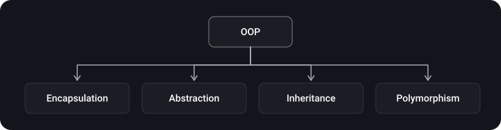

> **What you'll learn**
>
> - how OOP, protocol-oriented programming and functional programming differ and how they coexist in a single Swift project;
> - how the four pillars of OOP work and what they look like in Swift;
> - when a protocol is a "type" and when it is a "constraint on a type" (`any` vs `some`/generic);
> - what higher-order functions are: `map`, `flatMap`, `compactMap`, `filter`, `reduce`.

> **Prerequisites**
>
> Basic Swift syntax: `class`, `struct`, `enum`, `protocol`, closures. Nothing more.

## Analogy: three ways to run a kitchen

Picture a restaurant. **OOP** is the staff: every cook has a position and duties, and can pass skills on to apprentices (inheritance). **POP** is a set of "roles" like "can fry" and "can chop": anyone, a cook or a waiter, can be given such a role, and no hierarchy of positions is needed. **FP** is recipes: groceries go in, a dish comes out, and the recipe never touches anything on the next table.

## Step 1. OOP: thinking in objects

**The main goal of OOP** is to make complex code simpler: the program is split into independent blocks, objects, each with its own data and behavior. Changes inside one object should not break the others.



| Principle | Essence | What it looks like in Swift |
| --- | --- | --- |
| Encapsulation | Data and logic are gathered in one type, the unnecessary is hidden | `private`, `fileprivate`, `internal`, `public`, `private(set)` |
| Abstraction | Only a "remote control" is visible from outside: a set of methods and properties, not the internals | Protocols, the public API of a type |
| Inheritance | A class takes the properties and methods of its parent and adds its own | `class Dog: Animal`, `override`, `super`; only one parent |
| Polymorphism | One interface, many implementations; code works with different types in the same way | `override` in subclasses, protocols, generics |

```swift
class Animal {
    private(set) var name: String          // encapsulation: the name can't be changed from outside
    init(name: String) { self.name = name }
    func makeSound() -> String { "..." }   // common interface
}

class Dog: Animal {                        // inheritance
    override func makeSound() -> String { "Woof" }   // polymorphism
}

class Cat: Animal {
    override func makeSound() -> String { "Meow" }
}

let zoo: [Animal] = [Dog(name: "Rex"), Cat(name: "Kitty")]
zoo.forEach { print($0.name, $0.makeSound()) }   // the code doesn't know exactly who is in front of it
```

> **Abstraction and encapsulation are not the same thing.** Encapsulation is about *hiding data* ("how it is stored"), abstraction is about *hiding complexity* ("how it is done"). The button on a blender is abstraction, the housing that covers the motor is encapsulation. Different authors define these slightly differently, so in an interview give your own version and back it with an example.

**Pros of OOP:** code can be shared between developers (one writes the order, another the delivery, and the second only needs to know that `order.cancel()` exists), there is less duplication, and complex programs are easier to write.

**Con of OOP:** with inheritance you take *everything*, including what the subclass doesn't need, and you are tightly bound to the hierarchy. We look at this problem in more detail in the chapter on composition and inheritance.

> In Swift **structs and enums can't be inherited**, and class inheritance is single. That is why in Swift "OOP" often means "protocols + classes" rather than deep inheritance trees.

## Step 2. POP: protocols instead of hierarchies

In **protocol-oriented programming** you describe a type's capabilities with protocols instead of building a rigid class hierarchy. A protocol can be adopted by a class, a struct and an enum, and a protocol `extension` provides a default implementation to all types at once.

```swift
protocol Flyable {
    var maxAltitude: Double { get }
    func fly()
}

extension Flyable {
    func fly() { print("Flying, ceiling \(maxAltitude) m") }   // default implementation
}

struct Bird: Flyable { let maxAltitude = 500.0 }
struct Drone: Flyable { let maxAltitude = 120.0 }
enum Balloon: Flyable {
    case small
    var maxAltitude: Double { 3000 }
}

Bird().fly()
Drone().fly()
```

Note that `Bird`, `Drone` and `Balloon` have no common ancestor. That is the gain: modularity instead of a hierarchy, and a single type can adopt several protocols at once.

### A protocol as a type and a protocol as a constraint

This is the main thing to understand in POP. There are two scenarios:

|  | Protocol as a **type** (existential) | Protocol as a **constraint on a type** (generic / opaque) |
| --- | --- | --- |
| Syntax | `let x: any Flyable` | `func f<T: Flyable>(_ x: T)` or `func f(_ x: some Flyable)` |
| The concrete type is known to the compiler | No: the value is "packed" into a box | Yes, the same one on every call |
| Different types in one array | Yes: `[any Flyable]` | No: `[T]` holds only one type |
| Dispatch | Dynamic | Often static, the compiler can specialize |
| When to use | Services, repositories and other dependencies that you pass around and register in a container | Math and comparisons, `Self` requirements, generic algorithms |

```swift
let mixed: [any Flyable] = [Bird(), Drone()]      // different types in one collection

func describe(_ x: some Flyable) { x.fly() }      // one concrete type per call
func describe2<T: Flyable>(_ x: T) { x.fly() }    // the same thing, long form
```

### Protocols with associated types

```swift
protocol Repository<Item> {                // primary associated type in angle brackets
    associatedtype Item
    func all() -> [Item]
}

struct UsersRepo: Repository {
    func all() -> [String] { ["Anna", "Boris"] }
}

let repo: any Repository<String> = UsersRepo()   // Swift 5.7+
print(repo.all())
```

> **Rule of thumb.** A dependency that is passed through `init` and replaced in tests is `any Protocol`. An algorithm that needs the same type on input and output is `some`/generic. If in doubt, start with `any` and optimize based on the profiler.

<details>
<summary>What is type erasure and is it still needed today?</summary>

Type erasure is a technique where you wrap a concrete type in a universal "wrapper" (`AnyPublisher`, `AnyView`, `AnySequence`), hiding the details. Before Swift 5.7 it was the main way to store values of protocols with associated types. Today `any Protocol<…>` is usually enough, but the wrappers from the standard library and SwiftUI/Combine are still in use.

</details>

## Step 3. FP: functions as values

**Functional programming** is not a language but a way of solving problems: break a complex process into small steps and assemble them by composition. The unit of composition is a *function*, and its main goal is **not to change state outside its own scope** (a pure function: the same input gives the same output, with no side effects).

**Higher-order functions** take a function as a parameter or return a function. In the Swift standard library they live in the `Sequence` and `Collection` protocols.

| Function | What it does | Example |
| --- | --- | --- |
| `map` | Applies a closure to each element, returns a new collection of the same length | `[1,2,3].map { $0 * 2 }` → `[2,4,6]` |
| `filter` | Keeps the elements for which the closure returned `true` | `[1,2,3,4].filter { $0.isMultiple(of: 2) }` → `[2,4]` |
| `reduce` | Folds a collection into a single value | `[1,2,3].reduce(0, +)` → `6` |
| `flatMap` | For a sequence of sequences: applies a closure and "flattens" the result by one level | `[[1,2],[3]].flatMap { $0 }` → `[1,2,3]` |
| `compactMap` | Applies a closure and drops `nil` | `["1","a","3"].compactMap { Int($0) }` → `[1,3]` |

```swift
let raw = ["10", "x", "25", "7"]

let total = raw
    .compactMap { Int($0) }         // [10, 25, 7] — dropped the non-numeric
    .filter { $0 > 8 }              // [10, 25]
    .map { $0 * 2 }                 // [20, 50]
    .reduce(0, +)                   // 70

print(total)
```

Functions can be passed and returned, so they can be *combined*:

```swift
func adder(_ n: Int) -> (Int) -> Int { { $0 + n } }   // a function that returns a function

let plusTen = adder(10)
print([1, 2, 3].map(plusTen))   // [11, 12, 13]
```

> **Value type + immutability = everyday FP.** In Swift, structs are copied when passed, so a function that receives a `struct` can't silently change your copy. That is the practical embodiment of "no side effects". Classes (reference types) give no such guarantee: two variables refer to the same object.

## Step 4. How they coexist

In a real iOS project the paradigms don't fight:

| Layer | What is used most often |
| --- | --- |
| UIKit: `UIViewController`, `UIView` | OOP: inheriting from framework classes |
| Services and dependencies | POP: protocol + implementation, swapped out in tests |
| Data models | `struct`, `enum` (value types) |
| Collection processing, Combine, async chains | FP: `map`/`filter`/`reduce`, pure functions |

## Common mistakes

- **Building deep inheritance trees** where a protocol and a `struct` would be enough.
- **`class` by default.** Start with `struct` and switch to `class` only when you need reference semantics or inheritance from a framework.
- **Keeping `any Protocol` in a hot loop** and being surprised by the load: dynamic dispatch and boxing are not free.
- **Confusing `flatMap` and `compactMap`** when working with optionals.
- **Functions with side effects inside `map`.** `map` is for transformation; use `forEach` for actions.

## Cheat sheet

- OOP: encapsulation, abstraction, inheritance, polymorphism.
- POP: a protocol = a capability; `extension` gives a default implementation; works for `struct`/`enum`/`class`.
- `any P` means "something that can do P"; `some P` / `<T: P>` means "one concrete type that can do P".
- Protocols with associated types can be used as `any P` since Swift 5.7.
- FP: pure functions, `map`/`filter`/`reduce`/`flatMap`/`compactMap`.

## Self-check questions

<details>
<summary>1. How does encapsulation differ from abstraction?</summary>

Encapsulation hides *data and internal state* (access modifiers), abstraction hides the *complexity of the implementation* behind a simple interface.

</details>

<details>
<summary>2. Why is POP in Swift often more convenient than inheritance?</summary>

A protocol can be adopted by structs, enums and classes; a type can adopt several protocols; inheritance, on the other hand, is single and only for classes.

</details>

<details>
<summary>3. What does any Repository&lt;String&gt; mean?</summary>

"Any type conforming to `Repository` whose `Item == String`". It is an existential type with a primary associated type, available since Swift 5.7.

</details>

<details>
<summary>4. What will [[1,2],[3]].flatMap { $0 } return, and what about ["1","a"].compactMap { Int($0) }?</summary>

`[1, 2, 3]` and `[1]`.

</details>

<details>
<summary>5. Why is a pure function with a struct safer than a method of a class object?</summary>

A copy of a value can't be changed "from outside", whereas with a class several references can modify the same object.

</details>

## Sources

- [The Swift Programming Language: Opaque and Boxed Protocol Types](https://docs.swift.org/swift-book/documentation/the-swift-programming-language/opaquetypes/)
- [SE-0309: Unlock existential types for protocols with associated types](https://github.com/swiftlang/swift-evolution/blob/main/proposals/0309-unlock-existential-types-for-protocols-with-self-or-associated-type-requirements.md)
- [SE-0358: Primary associated types in the standard library](https://github.com/swiftlang/swift-evolution/blob/main/proposals/0358-primary-associated-types-in-stdlib.md)
