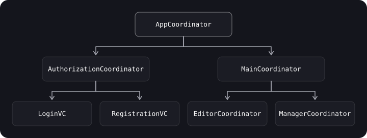

> **What you'll learn**
>
> - what problem the Coordinator solves and how it differs from a Router;
> - how to build a tree of coordinators in UIKit without getting a retain cycle;
> - how to build a coordinator in SwiftUI on `NavigationStack` and `NavigationPath`;
> - how to implement deep links, "back across several screens" and returning a result through a coordinator.

> **Prerequisites**
>
> Chapters [06](../behavioral-patterns/) (Delegate), [07](../di-ioc/) (DI), [08](../mvc-mvp-mvvm/)–[09](../viper-clean-mvi/) (MVVM/VIPER). ARC and `weak`.

## Analogy: a tour guide

The tourists (screens) don't need to know where to go next: the route is known by the **tour guide** (Coordinator). If the tour is split into "museum" and "park", each part has its own guide, and the main guide simply hands the group over. A **Router** is the door between halls: it can open and close a specific passage, but doesn't decide what the route will be.

## Step 1. The problem: a screen decides where to go itself

In "naive" UIKit code a controller creates the next controller itself and does a `push`:

```swift
final class LoginViewController: UIViewController {
    @objc func didTapRegister() {
        let next = RegistrationViewController()      // the screen knows about its neighbor
        navigationController?.pushViewController(next, animated: true)
    }
}
```

This leads to problems:

- screens know about each other, so they are hard to reuse and test;
- a deep link has to build a chain of several screens, and the knowledge of that chain is smeared across controllers;
- the "back" button sometimes has to close several screens at once;
- the result of one screen affects the previous and the next ones.

## Step 2. Coordinator: navigation logic in one place

**The essence of the pattern** is to encapsulate navigation. A controller only reports "the user is done", and *where to go next* is decided by the coordinator.



Each coordinator manages a **flow**, a sequence of screens, and can have **child** coordinators. The screens become independent modules.

**Use it when:**

- you need better control over a flow made of a sequence of screens;
- you want to make screens reusable;
- you need a common result from a chain of screens (for example, a 4-step checkout);
- there are deep links and deep routes.

## Step 3. Router vs Coordinator

Both are responsible for navigation, but at different levels:

|  | Router | Coordinator |
| --- | --- | --- |
| Level | One screen / module | A flow of screens |
| What it knows | How to show/close a specific transition | Which screen is next and in what order |
| Tie to a module | Strong (part of a VIPER module) | Independent, can live its own life |
| Children | None | A tree of child coordinators |
| A typical example | `UserListRouter.openDetails(for:)` | `CheckoutCoordinator` (cart → address → payment) |

They combine well: the coordinator decides *what* to show, and the router helps to *technically* show and hide the controller. The router doesn't know which controller to show; the coordinator tells it.

## Step 4. Implementation in UIKit

```swift
import UIKit

enum Flow { case onboarding, authorization, main }

protocol CoordinatorFinishDelegate: AnyObject {
    func didFinish(_ coordinator: CoordinatorProtocol)
}

protocol CoordinatorProtocol: AnyObject {
    var finishDelegate: CoordinatorFinishDelegate? { get set }
    var navigationController: UINavigationController { get }
    var childCoordinators: [CoordinatorProtocol] { get set }

    func start(_ flow: Flow?)
    func finish()
}

extension CoordinatorProtocol {
    func finish() {
        childCoordinators.removeAll()
        finishDelegate?.didFinish(self)
    }
}

final class AppCoordinator: CoordinatorProtocol, CoordinatorFinishDelegate {
    weak var finishDelegate: CoordinatorFinishDelegate?
    let navigationController: UINavigationController
    var childCoordinators: [CoordinatorProtocol] = []

    init(navigationController: UINavigationController) {
        self.navigationController = navigationController
    }

    func start(_ flow: Flow? = nil) {
        switch flow {
        case .onboarding: showOnboardingFlow()
        case .authorization, nil: showAuthorizationFlow()
        case .main: showMainFlow()
        }
    }

    func showAuthorizationFlow() {
        let coordinator = AuthorizationCoordinator(navigationController: navigationController)
        coordinator.finishDelegate = self
        childCoordinators.append(coordinator)
        coordinator.start()
    }
    func showOnboardingFlow() { /* … */ }
    func showMainFlow() { /* … */ }

    // The child is done: we forget about it, freeing memory
    func didFinish(_ coordinator: CoordinatorProtocol) {
        childCoordinators.removeAll { $0 === coordinator }
        if coordinator is AuthorizationCoordinator { showMainFlow() }   // move on to the next flow
    }
}

final class AuthorizationCoordinator: CoordinatorProtocol {
    weak var finishDelegate: CoordinatorFinishDelegate?
    let navigationController: UINavigationController
    var childCoordinators: [CoordinatorProtocol] = []

    init(navigationController: UINavigationController) {
        self.navigationController = navigationController
    }

    func start(_ flow: Flow? = nil) { showLoginScene() }

    func showLoginScene() {
        let vc = UIViewController()          // in reality, LoginViewController(viewModel:)
        navigationController.pushViewController(vc, animated: true)
    }
    func showRegistrationScene() { /* … */ }
}

// The entry point
final class SceneDelegate: UIResponder, UIWindowSceneDelegate {
    var window: UIWindow?
    private var appCoordinator: AppCoordinator?

    func scene(_ scene: UIScene, willConnectTo session: UISceneSession,
               options connectionOptions: UIScene.ConnectionOptions) {
        guard let windowScene = scene as? UIWindowScene else { return }
        let window = UIWindow(windowScene: windowScene)
        let navigationController = UINavigationController()

        let coordinator = AppCoordinator(navigationController: navigationController)
        appCoordinator = coordinator
        coordinator.start(.authorization)

        window.rootViewController = navigationController
        window.makeKeyAndVisible()
        self.window = window
    }
}
```

> **How a screen reports an event to the coordinator.** A controller/ViewModel shouldn't know about the coordinator as a type: pass a closure (`var onFinish: (() -> Void)?`) or a delegate protocol (see chapter [06](../behavioral-patterns/)). The coordinator creates the screen, assigns the handler and decides what to do next.

### Coordinator and DI

The coordinator is a convenient place where screens are assembled with their dependencies (see chapter [07](../di-ioc/)): it receives a container, creates a `ViewModel` and injects it:

```swift
final class AuthorizationCoordinator {
    private let container: AppContainer
    // …
    func showLoginScene() {
        let viewModel = container.makeLoginViewModel()
        viewModel.onSuccess = { [weak self] in self?.finish() }   // the screen reports, the coordinator decides
        let vc = LoginViewController(viewModel: viewModel)
        navigationController.pushViewController(vc, animated: true)
    }
}
```

This is a fragment; for the full version follow the pattern above.

## Step 5. Coordinator in SwiftUI

In SwiftUI navigation is driven by **`NavigationStack`**, and the "stack of screens" is stored in a **`NavigationPath`** (iOS 16+). So a coordinator is an object that owns the `path` and the modal states (`sheet`, `fullScreenCover`).

```swift
import SwiftUI
import Observation

enum Route: Hashable {
    case detail(id: Int)
    case settings
}

enum Sheet: String, Identifiable {
    case profile
    var id: String { rawValue }
}

@MainActor @Observable
final class Coordinator {
    var path = NavigationPath()
    var sheet: Sheet?

    func push(_ route: Route) { path.append(route) }
    func pop() { if !path.isEmpty { path.removeLast() } }
    func popToRoot() { path = NavigationPath() }
    func present(_ sheet: Sheet) { self.sheet = sheet }
    func dismissSheet() { sheet = nil }
}

struct RootView: View {
    @State private var coordinator = Coordinator()

    var body: some View {
        @Bindable var coordinator = coordinator          // needed for $coordinator.path

        NavigationStack(path: $coordinator.path) {
            HomeView()
                .navigationDestination(for: Route.self) { route in
                    switch route {
                    case .detail(let id): DetailView(id: id)
                    case .settings:       Text("Settings")
                    }
                }
        }
        .sheet(item: $coordinator.sheet) { sheet in
            switch sheet {
            case .profile: Text("Profile")
            }
        }
        .environment(coordinator)                          // screens get the coordinator from the environment
    }
}

struct HomeView: View {
    @Environment(Coordinator.self) private var coordinator

    var body: some View {
        VStack(spacing: 12) {
            Button("Details") { coordinator.push(.detail(id: 42)) }
            Button("Profile") { coordinator.present(.profile) }
        }
    }
}

struct DetailView: View {
    let id: Int
    @Environment(Coordinator.self) private var coordinator

    var body: some View {
        Button("To the home screen") { coordinator.popToRoot() }
            .navigationTitle("Detail \(id)")
    }
}
```

**A deep link:** it is enough to build a chain of routes.

```swift
extension Coordinator {
    func handle(deepLink url: URL) {
        popToRoot()
        if url.host == "detail", let id = Int(url.lastPathComponent) {
            push(.detail(id: id))
        }
    }
}
```

> **Be careful with types in `NavigationPath`.** All values must be `Hashable`, and each route type needs its own `navigationDestination(for:)`. If you store heavy models in a route, they end up in the navigation state; it is better to pass identifiers.

## Step 6. How to choose

| Situation | Solution |
| --- | --- |
| An app of 3–4 screens, simple transitions | Navigation inside the screen / `NavigationLink`: no coordinator needed (KISS) |
| There are flows of several screens, deep links, a common result | Coordinator |
| VIPER modules | A Router per module, and a coordinator above them if needed |
| A SwiftUI app with `NavigationStack` | Coordinator/Router with `NavigationPath` |

## Common mistakes

- **`finishDelegate` (and generally references to the parent) without `weak`**: a retain cycle.
- **Not removing the child coordinator** after it finishes: the array grows and memory isn't released.
- **Not storing the root coordinator**: it disappears after launch.
- **A screen knows about the coordinator as a concrete type**: reusability is lost; pass a closure or a protocol.
- **A coordinator for everything**: for two screens it is an extra layer.
- **A `NavigationPath` with non-`Hashable` or heavy models.**

## Cheat sheet

- Router — navigation of one screen; Coordinator — a flow of screens.
- The coordinator owns its children (`childCoordinators`), and the children report completion through a `weak` delegate/closure.
- UIKit: `AppCoordinator` → children; store the root one in a property.
- SwiftUI: `NavigationStack(path:)` + `NavigationPath` + `.environment(coordinator)`.
- A deep link = a chain of routes.

## Self-check questions

<details>
<summary>1. How does Coordinator differ from Router?</summary>

A Router is responsible for the transition out of one screen, while a Coordinator manages a flow of screens and their order; the router only technically shows what the coordinator tells it to.

</details>

<details>
<summary>2. Where did a retain cycle arise in the example and how can it be eliminated?</summary>

The parent holds the child in `childCoordinators`, and the child strongly held the parent as `finishDelegate`. The solution: an `AnyObject` protocol and `weak var finishDelegate`.

</details>

<details>
<summary>3. Why does the parent coordinator need didFinish?</summary>

To remove the finished child from `childCoordinators` (free memory) and move on to the next flow.

</details>

<details>
<summary>4. What is stored in NavigationPath and what is required of the values?</summary>

A stack of routes; the value types must be `Hashable`; each type needs a `navigationDestination(for:)`.

</details>

<details>
<summary>5. How do you implement a deep link through a coordinator?</summary>

Parse the URL, reset the stack and add the chain of needed routes to the path.

</details>

## Sources

- [NavigationStack — Apple Developer Documentation](https://developer.apple.com/documentation/swiftui/navigationstack)
- [NavigationPath — Apple Developer Documentation](https://developer.apple.com/documentation/swiftui/navigationpath)
- [Automatic Reference Counting — The Swift Programming Language](https://docs.swift.org/swift-book/documentation/the-swift-programming-language/automaticreferencecounting/)
- [Managing navigation in iOS apps. The coordinator pattern from SberMarket — Habr (in Russian)](https://habr.com/ru/amp/publications/654339/)
