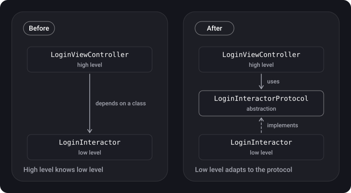

> **What you'll learn**
>
> - what each letter of SOLID stands for and how to spot a violation of the principle in code;
> - how to fix violations in Swift, with "bad" and "good" examples for each principle;
> - why DIP is not the same as DI and IoC, and what "high-level/low-level module" means;
> - how LSP relates to OCP and where it is really violated in iOS.

> **Prerequisites**
>
> Chapter [01](../paradigms/): classes, protocols, polymorphism.

## Analogy: a LEGO set

Good code is like a construction set: the parts are standard (protocols), each does one job (S), a new part can be added without sawing the old ones apart (O), any suitable part can be put in the same place (L), a part has no extra studs you don't need (I), and the parts are joined through a standard connector rather than "glued together for good" (D).

## Step 0. The big picture

SOLID is five design principles whose goal is to make code understandable, flexible and easy to maintain.

| Letter | Principle | In one line |
| --- | --- | --- |
| **S** | Single Responsibility | A type has one reason to change |
| **O** | Open/Closed | Extend without rewriting what exists |
| **L** | Liskov Substitution | A subtype can be substituted for its base type and the program keeps working correctly |
| **I** | Interface Segregation | Many narrow protocols are better than one wide one |
| **D** | Dependency Inversion | Depend on abstractions, not on concrete types |

## Step 1. S — Single Responsibility

A type should have **one reason to change**: it solves one task. Several methods are fine if they all serve one purpose.

**Violation:** one class goes to the network, parses the response and writes to the database.

```swift
class NetworkManager {
    static let shared = NetworkManager()
    private init() {}

    func handleAllActions() {
        let data = getUsers()
        let users = parse(data)
        save(users)
    }
    func getUsers() -> Data { Data() }            // network
    func parse(_ data: Data) -> [String] { [] }   // parsing
    func save(_ users: [String]) { }              // storage
}
```

If the response format, the database schema or the way of making requests changes, you have to edit the same class.

**Fix:** split the roles and assemble them together.

```swift
protocol UsersFetching { func fetchUsers() -> Data }
protocol UsersParsing  { func parse(_ data: Data) -> [String] }
protocol UsersStoring  { func save(_ users: [String]) }

struct UsersAPI: UsersFetching { func fetchUsers() -> Data { Data() } }
struct UsersParser: UsersParsing { func parse(_ data: Data) -> [String] { [] } }
struct UsersDatabase: UsersStoring { func save(_ users: [String]) { } }

final class SyncUsersUseCase {
    private let api: UsersFetching
    private let parser: UsersParsing
    private let storage: UsersStoring

    init(api: UsersFetching, parser: UsersParsing, storage: UsersStoring) {
        self.api = api; self.parser = parser; self.storage = storage
    }

    func run() {
        storage.save(parser.parse(api.fetchUsers()))
    }
}
```

> **How to check SRP.** Try to describe the type in one sentence without the words "and" / "also". If you can't, it probably has several responsibilities. Another sign: the type is hard to test because checking one part means setting up all the others.

> **Don't overdo it.** SRP doesn't mean "one method per class". If you create five types for the sake of one line, you have just smeared the logic around. Split by *reasons to change*, not by the number of methods.

## Step 2. O — Open/Closed

A type is **open for extension** (new behavior can be added) and **closed for modification** (there is no need to edit tested code). In Swift this is done with protocols and `extension`.

**Violation:** to add an animal you have to change `makeSound`.

```swift
class Animal {
    let name: String
    init(name: String) { self.name = name }

    func makeSound() {
        if name == "Dog" { print("Woof") }
        else if name == "Cat" { print("Meow") }
        // added a Cow — we dig in here again
    }
}
```

**Fix:** move the behavior into a protocol.

```swift
protocol Animal { func makeSound() }

struct Dog: Animal { func makeSound() { print("Woof") } }
struct Cat: Animal { func makeSound() { print("Meow") } }
struct Cow: Animal { func makeSound() { print("Moo") } }   // a new type, old code untouched

func chorus(_ animals: [any Animal]) { animals.forEach { $0.makeSound() } }
```

The data source example works the same way: the consumer depends on a protocol, not on a concrete class.

```swift
protocol DataProtocol { func getData() -> Data? }

final class NetworkData: DataProtocol {
    func getData() -> Data? { nil }   // URLSession
}

final class SQLData: DataProtocol {
    func getData() -> Data? { nil }   // database
}
```

> **What about `extension`?** `extension` lets you add methods to a type without touching its source (for example, extend `String` or `UIColor`), which is extension in the spirit of OCP. But an extension can't add stored properties and doesn't replace the behavior of existing methods, so it is a supplement to polymorphism, not a full replacement.

## Step 3. L — Liskov Substitution

> Objects of a base type must be replaceable with objects of a subtype without breaking the correctness of the program.

A subtype must honor the **contract** of the base type: not demand more from the caller, not promise less, and not break what is expected of the base type.

**Violation:** a penguin inherits from a bird that "can fly".

```swift
class Bird { func fly() { print("Flying") } }

class Penguin: Bird {
    override func fly() { fatalError("Penguins can't fly!") }   // a crash where a bird was expected
}

let bird: Bird = Penguin()
bird.fly()   // crash
```

**Fix 1 (simple):** extract the behavior that really is common to all.

```swift
class Bird { func move() { print("The bird moves") } }
class Penguin: Bird { override func move() { print("The penguin slides") } }
```

**Fix 2 (better):** make "can fly" a separate capability.

```swift
protocol Bird { func eat() }
protocol Flying { func fly() }

struct Sparrow: Bird, Flying { func eat() {}; func fly() { print("Flying") } }
struct Penguin: Bird { func eat() {} }

func launch(_ f: some Flying) { f.fly() }   // a penguin simply can't be passed here
```

Another classic sign of a violation is a subclass that **changes the meaning** of a method:

```swift
class Operators {
    func add(_ a: Int, _ b: Int) -> Int { a + b }
}
class Calculator: Operators {
    override func add(_ a: Int, _ b: Int) -> Int { a * b }   // addition does multiplication
}

print(Calculator().add(5, 5))   // 25, while the caller expected 10
```

And a sign of a violation that is common in practice: **type casting in the consumer**.

```swift
func draw(shape: Shape) {
    if let s = shape as? Square { s.drawSquare() }
    else if let c = shape as? Circle { c.drawCircle() }   // and for a plain Shape, nothing
}
```

Here the function behaves differently for `Shape` and its subclasses, and when a `Triangle` appears you will have to edit it again, so OCP is violated too. The cure is a common `draw()` method in a protocol.

<details>
<summary>What about the "LSP violation in UIKit": UIViewController methods without super?</summary>

Interviewers love this question, and the answer is subtler than "no super = LSP violation". Different methods have different contracts: for `viewDidLoad()` and `viewWillAppear(_:)` the documentation requires calling `super` (otherwise the internal logic of the base class breaks, so the subclass stops honoring the contract), while for `loadView()` it is the opposite: it says *not* to call `super` if you build the view hierarchy yourself. So it is more accurate to put it this way: UIKit often relies on inheritance with "template methods", where the base class counts on the subclass calling `super`. This is a fragile contract, close to an LSP violation, and one of the reasons modern code prefers composition.

</details>

## Step 4. I — Interface Segregation

A client should not depend on methods it doesn't use. **Many narrow protocols are better than one "universal" one.**

**Violation:** a robot has to "implement" eating.

```swift
protocol Worker { func work(); func eat() }

class Robot: Worker {
    func work() { /* works */ }
    func eat() { fatalError("Robots can't eat") }   // a forced stub
}
```

**Fix:**

```swift
protocol Workable { func work() }
protocol Feedable { func eat() }

struct Robot: Workable { func work() { } }
struct Human: Workable, Feedable { func work() { }; func eat() { } }

typealias Employee = Workable & Feedable   // protocol composition when needed
```

> In iOS, ISP is easy to see in delegates: several small protocols (`UITableViewDataSource`, `UITableViewDelegate`) with optional methods are better than one "mega-specification" of 30 requirements. A `fatalError` stub in a method you are "forced" to implement is almost always a sign of an ISP violation (and often of an LSP one).

## Step 5. D — Dependency Inversion

The formulation has two parts:

1. **High-level modules should not depend on low-level modules. Both should depend on abstractions.**
2. **Abstractions should not depend on details. Details should depend on abstractions.**

In iOS a **module** can be a class, a framework or a library. The **low level** is the concrete performers (network, database, `LoginInteractor`), the **high level** is those who use their results (`LoginViewController`).



In the "after" picture the arrow from `LoginInteractor` has **turned around**: now it is not the high-level module that knows about the low-level one, but the low-level one adapts to the protocol the high-level one needs. Hence the word "inversion".

**Violation (part 1):**

```swift
class LoginInteractor {
    func login(userID: Int) { /* … */ }
}

final class LoginViewController: UIViewController {
    private let interactor: LoginInteractor   // a concrete class

    init(interactor: LoginInteractor) {
        self.interactor = interactor
        super.init(nibName: nil, bundle: nil)
    }
    required init?(coder: NSCoder) { fatalError("init(coder:) has not been implemented") }

    override func viewDidLoad() {
        super.viewDidLoad()
        interactor.login(userID: 123)
    }
}
```

**Fix:**

```swift
protocol LoginInteractorProtocol {
    func login(userID: Int)
}

final class LoginInteractor: LoginInteractorProtocol {
    func login(userID: Int) { /* the real login */ }
}

final class LoginViewController: UIViewController {
    private let interactor: LoginInteractorProtocol   // an abstraction

    init(interactor: LoginInteractorProtocol) {
        self.interactor = interactor
        super.init(nibName: nil, bundle: nil)
    }
    required init?(coder: NSCoder) { fatalError("init(coder:) has not been implemented") }

    override func viewDidLoad() {
        super.viewDidLoad()
        interactor.login(userID: 123)
    }
}
```

Now tests can substitute a fake:

```swift
final class LoginInteractorMock: LoginInteractorProtocol {
    private(set) var loggedInUserID: Int?
    func login(userID: Int) { loggedInUserID = userID }
}
```

### Part 2: "details" and abstractions

A "detail" is what leaks from a concrete implementation into the interface, for example the parameters `userID` and `phone`. If you have two interactors with different methods (`login(userID:)` and `login(phone:)`), each controller knows about its own, and when a signature changes you have to fix all the consumers. It is better to first design an *abstraction for the needs of the high level* ("log in") and only then fit the details to it.

```swift
protocol AuthService {
    func login(with credentials: Credentials) async throws
}

enum Credentials {
    case userID(Int)
    case phone(String)     // ⚠️ a phone is a string, not an Int: leading zeros, plus sign, length
}
```

> **DIP ≠ DI ≠ IoC.** DIP is a *principle*: "depend on abstractions". DI (dependency injection) is the *technique* we use to implement this principle: an object receives its dependencies from outside. IoC (inversion of control) is a more general idea: it is not the object that creates what it needs, but someone from outside (a container, a framework). More in the chapter on DI.

## Common mistakes

- **A protocol "for show"** on every class, even when there is always one implementation and no substitution is needed.
- **`fatalError` in a method that is "not supported"**: almost always an ISP/LSP violation.
- **`as?` inside the consumer** to choose behavior: a sign of an LSP and OCP violation.
- **Understanding DIP only as "hide it behind a protocol".** What matters more is *whose* protocol it is: it should reflect the needs of the high level.
- **`static let shared` inside a class that does something with the interface**: a concrete dependency hidden from view (more in the chapter on Singleton).

## Cheat sheet

- **S** — one reason to change.
- **O** — new behavior = a new type, not an `if` in the old one.
- **L** — a subtype doesn't break the expectations of the base type; you may extend the interface but must not break the contract.
- **I** — narrow protocols, no "stubs" for other people's methods.
- **D** — the high level depends on a protocol; the low level implements the protocol.

## Self-check questions

<details>
<summary>1. Which principle does a class that goes to the network and updates the UI violate?</summary>

SRP: the class has two reasons to change, a change of the network layer and a change of the interface.

</details>

<details>
<summary>2. Why does an if name == "Dog" … else if … chain violate OCP?</summary>

Every new variant requires editing an existing method. Instead, the behavior is moved into a protocol, and a new type is added without changing the old code.

</details>

<details>
<summary>3. Does a subclass that adds a new method violate LSP?</summary>

No. LSP is violated when a subclass changes or breaks behavior that the base class promises.

</details>

<details>
<summary>4. How can you tell that ISP is violated?</summary>

A class is forced to implement methods it doesn't need (`fatalError`, empty stubs), or a client depends on a protocol of which it uses only a small part.

</details>

<details>
<summary>5. What is "inverted" in DIP?</summary>

The direction of the dependency in the source code: instead of "high level → low level" you get "high level → protocol ← low level".

</details>

## Sources

- [UIViewController — Apple Developer Documentation](https://developer.apple.com/documentation/uikit/uiviewcontroller)
- [loadView() — Apple Developer Documentation](https://developer.apple.com/documentation/uikit/uiviewcontroller/1621454-loadview)
- [DI vs. DIP vs. IoC — Sergey Teplyakov (in Russian)](https://sergeyteplyakov.blogspot.com/2014/11/di-vs-dip-vs-ioc.html)
- [SOLID in Swift. A simple explanation with examples (in Russian)](https://habr.com/ru/articles/746410/)
