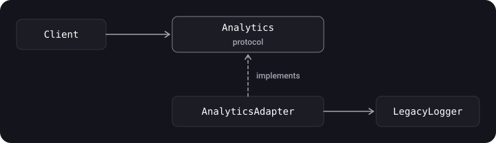

> **What you'll learn**
>
> - how the five structural patterns work: Adapter, Facade, Decorator, Flyweight, Proxy;
> - how Decorator differs from Proxy (and from `extension`);
> - how to wrap third-party code, hide a complex subsystem, and add logging, caching and memory savings without rewriting existing types.

> **Prerequisites**
>
> Chapters [01](../paradigms/)–[04](../creational-patterns/): protocols, OCP/DIP, composition, creational patterns. Basic `async/await`.

## Analogy: sockets and adapters

On a trip you have a European plug and the socket is American, so you take an **adapter** (Adapter). At the reception desk you don't need to know how housekeeping, the kitchen and the storeroom work: you talk to the receptionist (**Facade**). You add milk to your coffee, then syrup, and each addition "wraps" the drink (**Decorator**). A bank card is a representative of your account (**Proxy**). And a thousand identical icons in a game are stored in memory only once (**Flyweight**).

All these patterns are about *composition*: how to assemble objects into a structure without changing their code.

## Step 1. Adapter

**Idea.** Lets objects with incompatible interfaces work together. The adapter wraps an object and "translates" the calls.



An example: the app works with the `Analytics` protocol, while an old library offers its own interface.

```swift
// What our app needs
protocol Analytics {
    func track(event: String, parameters: [String: String])
}

// Someone else's code that we can't change
final class LegacyLogger {
    func write(line: String) { print(line) }
}

// The adapter
final class LegacyLoggerAdapter: Analytics {
    private let logger: LegacyLogger
    init(logger: LegacyLogger) { self.logger = logger }

    func track(event: String, parameters: [String: String]) {
        let params = parameters.map { "\($0.key)=\($0.value)" }.sorted().joined(separator: ",")
        logger.write(line: "[\(event)] \(params)")
    }
}

let analytics: Analytics = LegacyLoggerAdapter(logger: LegacyLogger())
analytics.track(event: "open_screen", parameters: ["name": "Home"])
```

| Pros | Cons |
| --- | --- |
| Hides the details of interface conversion from the client; the third-party library is plugged in at one place (easy to swap). | Extra types appear. |

> The adapter is the main way to apply DIP to third-party libraries: the app depends on *your* protocol, and the library hides behind the adapter.

> **An adapter via `extension`**. If the type already exists and you only need to make it conform to the right protocol, the extension itself can serve as the adapter: `extension ViewController: GreetingProtocol { func sayHello() { /* … */ } }`. The plus is that no separate wrapper class is needed; the minus is that the type itself still knows about the protocol directly, and this doesn't suit someone else's code with different method names, where you need a full translator like `LegacyLoggerAdapter` above.

## Step 2. Facade

**Idea.** A single simple interface to a complex subsystem. The client doesn't know about the internal components or the order of calling them.

```swift
struct Inventory { func reserve(_ item: String) -> Bool { true } }
struct Payment   { func charge(_ amount: Double) -> Bool { true } }
struct Shipping  { func schedule(_ item: String) { print("Shipping: \(item)") } }

final class OrderFacade {
    private let inventory = Inventory()
    private let payment = Payment()
    private let shipping = Shipping()

    func placeOrder(item: String, price: Double) -> Bool {
        guard inventory.reserve(item) else { return false }
        guard payment.charge(price) else { return false }
        shipping.schedule(item)
        return true
    }
}

let ok = OrderFacade().placeOrder(item: "Book", price: 500)
```

The client needs only `placeOrder`, while the three subsystems and the order of calling them are hidden. A facade doesn't forbid accessing the subsystems directly; it just simplifies the typical scenario.

> **Don't confuse Adapter and Facade.** An adapter *converts one interface to another* so that code can work with someone else's type. A facade *simplifies* the interface to a whole set of types and usually introduces a new one.

> In iOS, `URLSession` (behind it are sockets, TLS, the cache), the `Core Data` stack `NSPersistentContainer` and `AVPlayer` are essentially facades. Your service layers (`UserRepository`, `OrderService`) are facades too.

> **A facade for configuring services**. A typical example is a single point where the client gets ready-made services without knowing how they are assembled: `protocol ServicesFacade { func configureAuthService() -> AuthService; func configureUserInfoService() -> UserInfoService }`. The client calls one method, while the chain of dependencies (network, tokens, storage) is hidden inside the facade. DI containers have something similar (chapter [07](../di-ioc/)).

## Step 3. Decorator

**Idea.** Dynamically adds new responsibilities to an object. A flexible alternative to inheritance for extending functionality.

**Problems of inheritance that the decorator solves:**

- it is **static**: you can't change the behavior of an existing object, you have to create an object of a different subclass;
- you can't inherit the behavior of several classes, so you end up breeding combination subclasses (`LoggingRetryingCachingClient`…).

A decorator is based on composition: an object holds a reference to another object **of the same protocol**, delegates the work to it and adds its own behavior before or after.


```swift
import Foundation

protocol Networking {
    func load(_ url: URL) async throws -> Data
}

struct URLSessionNetworking: Networking {
    func load(_ url: URL) async throws -> Data {
        try await URLSession.shared.data(from: url).0
    }
}

struct LoggingNetworking: Networking {
    let base: any Networking

    func load(_ url: URL) async throws -> Data {
        print("→ \(url)")
        let data = try await base.load(url)
        print("← \(data.count) bytes")
        return data
    }
}

struct RetryingNetworking: Networking {
    let base: any Networking
    let attempts: Int

    func load(_ url: URL) async throws -> Data {
        var lastError: Error = URLError(.unknown)
        for _ in 0..<max(attempts, 1) {
            do { return try await base.load(url) }
            catch { lastError = error }
        }
        throw lastError
    }
}

// Assemble the combination we need without creating new subclasses
let network: any Networking = LoggingNetworking(
    base: RetryingNetworking(base: URLSessionNetworking(), attempts: 3)
)
```

Each decorator can be switched on and off independently, and the order of wrapping defines the behavior (logging outside the retries will show one entry, inside it one entry per attempt).

> **Two cases**.
>
> *Interface:* the UI kit has a primary button, but on some screens it needs a red indicator, on others an error text, and on a third kind both. Instead of four button subclasses you make two independent decorators ("indicator", "error") and combine the ones you need (in SwiftUI this is a chain of modifiers).
>
> *Network layer:* first request logging is needed, then logging to Firebase, then timing statistics; every new requirement is a new wrapper around `Networking`, without editing the network class itself (this is the example above).

> **A caching case**.
>
> A team was building an online app, and the customer asked to cache the data: if there is a cache, return it, otherwise request from the server and write to the cache. In the source this is solved exactly with a **decorator**, not inheritance: `CachedRepository` wraps `Repository`, and then one more layer is added on top of it, a cache reset after 30 seconds. Below is a corrected version. The same idea can also be called a caching Proxy (see Step 5): the structure is the same, the difference is in the intent. Here we *add a responsibility* rather than control access.

```swift
import Foundation

protocol Repository {
    func fetchData(completion: @escaping ([String]) -> Void)
}

// Layer 1: the cache
final class CachedRepository: Repository {
    private let repository: Repository
    private let cache = NSCache<NSString, NSArray>()
    private let key: NSString = "repository_data"

    init(repository: Repository) { self.repository = repository }

    func fetchData(completion: @escaping ([String]) -> Void) {
        if let cached = cache.object(forKey: key) as? [String] {
            completion(cached)
            return
        }
        repository.fetchData { [weak self] data in
            self?.cache.setObject(data as NSArray, forKey: self?.key ?? "repository_data")
            completion(data)
        }
    }
}

// Layer 2: cache expiration (TTL), also a decorator over Repository
final class ExpiringRepository: Repository {
    private let repository: Repository
    private let ttl: TimeInterval
    private var lastFetch: Date?
    private var cached: [String]?

    init(repository: Repository, ttl: TimeInterval = 30) {
        self.repository = repository
        self.ttl = ttl
    }

    func fetchData(completion: @escaping ([String]) -> Void) {
        if let cached, let lastFetch, Date().timeIntervalSince(lastFetch) < ttl {
            completion(cached)
            return
        }
        repository.fetchData { [weak self] data in
            self?.cached = data
            self?.lastFetch = Date()
            completion(data)
        }
    }
}
```

> In Foundation/SwiftUI the word "decorator" often refers to `View` modifiers (`.padding()`, `.background()`): each one wraps the view and returns a new one, which is the same principle of a chain of wrappers. Don't confuse it with *property wrappers* or *Python decorators*; those are different things.

## Step 4. Flyweight

**Idea.** Saves memory by sharing **common immutable state** among many objects. Instead of a thousand copies of identical data there is one shared object, and the individual (mutable) state is passed in from outside.

You can recognize a flyweight by a creating method that **returns cached objects** instead of creating new ones. If there is no memory problem, you probably don't need a flyweight either.

An example: in a text of 10,000 characters, most have the same font, size and color.

```swift
// Immutable shared (intrinsic) state
struct TextStyle: Hashable {
    let font: String
    let size: Int
    let color: String
}

final class TextAttributes {
    let style: TextStyle
    init(style: TextStyle) { self.style = style }

    // The extrinsic state (the text itself) comes as a parameter
    func display(_ text: String) {
        print("'\(text)' — \(style.font), \(style.size), \(style.color)")
    }
}

final class TextAttributesFactory {
    private var cache: [TextStyle: TextAttributes] = [:]

    func attributes(font: String, size: Int, color: String) -> TextAttributes {
        let style = TextStyle(font: font, size: size, color: color)
        if let cached = cache[style] { return cached }   // reuse
        let created = TextAttributes(style: style)
        cache[style] = created
        return created
    }
}

let factory = TextAttributesFactory()
let a = factory.attributes(font: "Arial", size: 12, color: "Black")
let b = factory.attributes(font: "Arial", size: 12, color: "Black")
print(a === b)   // true — the same object
a.display("Hello")
b.display("Flyweight")
```

> In iOS you see this principle in the `UIImage(named:)` cache, in `NSCache`, in font reuse (`UIFont`) and in string *interning*. In Swift, immutable value types are copied lazily anyway (copy-on-write), so Flyweight is needed more often for *classes and heavy resources*.

## Step 5. Proxy

**Idea.** An intermediary object between the client and the real object. It implements **the same interface**, so the client doesn't notice the substitution; it receives a call, does its own thing (access control, cache, log, lazy initialization) and passes the call on.


**Example 1. Measuring execution time.**

```swift
import Foundation

protocol ExampleProtocol {
    func performAction()
}

struct ExampleService: ExampleProtocol {
    func performAction() { /* heavy work */ }
}

struct ProfilingExampleService: ExampleProtocol {
    private let service: ExampleProtocol

    init(service: ExampleProtocol) { self.service = service }

    func performAction() {
        let start = Date()
        service.performAction()
        print("Time elapsed: \(Date().timeIntervalSince(start))")
    }
}

let service: ExampleProtocol = ExampleService()
let profiled: ExampleProtocol = ProfilingExampleService(service: service)
profiled.performAction()
```

**Example 2. A caching proxy.** Instead of the cache of "download tasks" from the original note, we show a cache of results, so the point of the pattern is visible:

```swift
import Foundation

protocol ImageLoading {
    func data(for url: URL) async throws -> Data
}

struct RemoteImageLoader: ImageLoading {
    func data(for url: URL) async throws -> Data {
        try await URLSession.shared.data(from: url).0
    }
}

actor CachingImageLoader: ImageLoading {
    private let real: any ImageLoading
    private var cache: [URL: Data] = [:]

    init(real: any ImageLoading) { self.real = real }

    func data(for url: URL) async throws -> Data {
        if let cached = cache[url] { return cached }   // don't go to the network again
        let loaded = try await real.data(for: url)
        cache[url] = loaded
        return loaded
    }
}

let loader: any ImageLoading = CachingImageLoader(real: RemoteImageLoader())
```

The `actor` protects the dictionary from races; at `await` *reentrancy* is possible: two simultaneous requests for the same URL will both go to the network. To avoid this, the cache stores a `Task` rather than the finished data.

### Kinds of proxies

| Kind | What it does | Example |
| --- | --- | --- |
| Virtual | Defers the creation of a heavy object until the first access | Lazy image loading, `lazy var` |
| Protection | Checks access rights | A wrapper over a service that requires authorization |
| Caching | Remembers results | The example above |
| Remote | Represents an object from another process or from a server | An XPC/API client as a local object |

### Decorator vs Proxy

Their structure is almost the same: a wrapper with the same protocol. They differ in **intent**:

|  | Decorator | Proxy |
| --- | --- | --- |
| Goal | Add responsibilities | Control access to an object |
| Who creates the wrapped object | The client passes it in from outside | Often the proxy itself (it manages the lifecycle) |
| Combined | As a chain of many | Usually just one |

> **Case tasks**.
>
> There is a primary button in UIKit, and on some screens a red indicator is added to it, on others an error text, and somewhere both; instead of four subclasses the button is wrapped in the "indicator" and "error" decorators, which are combined.
>
> There is an unchangeable network layer to which people ask in turn to "bolt on" logging, then logging to Firebase, then sending request timing statistics. Each wish becomes a separate decorator over the same protocol, and the network layer itself isn't touched (a spoiler from the source: both cases are solved by one pattern, Decorator).
>
> The scheme "is there a cache and is it fresh? yes → return the cache, no → request from the server and write to the cache" is a proxy with the same interface as the repository (Proxy/Decorator); see the analysis above.

## Common mistakes

- **An adapter that drags the third-party library's types** into the signatures of your protocol: then the library leaks into your code anyway.
- **A "god" Facade** into which the whole app's logic has been dumped.
- **A decorator that changes the contract** of the base protocol: it violates LSP.
- **Mutable state in a Flyweight**: the shared object changes for everyone.
- **A proxy that changes semantics** (for example, a cache returns stale data without the client's knowledge).
- **A `static` cache without synchronization**: thread races.

## Cheat sheet

- **Adapter** — an adapter between incompatible interfaces.
- **Facade** — one simple entry point into a complex subsystem.
- **Decorator** — add behavior with a wrapper, combining chains.
- **Flyweight** — shared immutable state in a single instance.
- **Proxy** — a stand-in that controls access to the real object.

## Self-check questions

<details>
<summary>1. How does Adapter differ from Facade?</summary>

Adapter converts one interface to another, Facade simplifies access to a set of classes by introducing a new interface.

</details>

<details>
<summary>2. Why is Decorator better than inheritance for combining behaviors?</summary>

A combination can be assembled at runtime from wrappers without creating a subclass for every combination.

</details>

<details>
<summary>3. How does extension differ from Decorator?</summary>

`extension` statically adds methods to a type (without stored properties or replacing behavior), whereas Decorator wraps a specific object and changes behavior at runtime.

</details>

<details>
<summary>4. Why must a shared Flyweight object be immutable?</summary>

It is used by many clients; a change through one reference would affect all of them.

</details>

<details>
<summary>5. How does Proxy differ from Decorator?</summary>

In its goal: Proxy controls access (laziness, rights, cache), Decorator adds responsibilities.

</details>

## Sources

- [Extensions — The Swift Programming Language](https://docs.swift.org/swift-book/documentation/the-swift-programming-language/extensions/)
- [Concurrency (actors) — The Swift Programming Language](https://docs.swift.org/swift-book/documentation/the-swift-programming-language/concurrency/)
- [Design Patterns — Refactoring.Guru](https://refactoring.guru/design-patterns)
