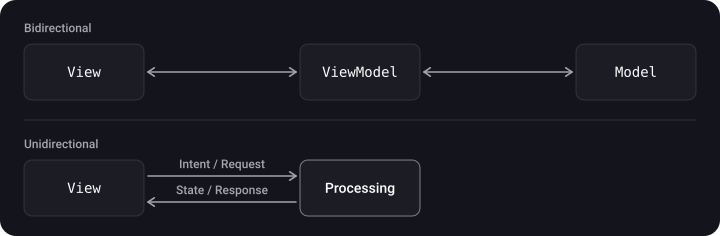
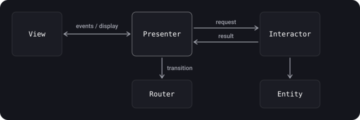
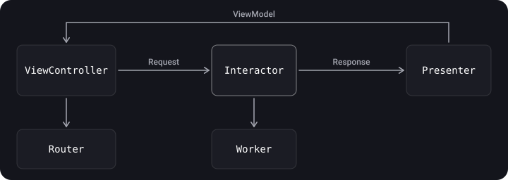
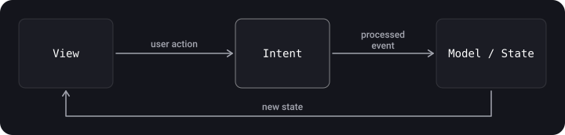

> **What you'll learn**
>
> - how VIPER, Clean Swift (VIP) and MVI work and how unidirectional architectures differ from bidirectional ones;
> - what roles Interactor, Presenter, Router, Entity and Worker play;
> - how to build an MVI module in SwiftUI on the modern stack;
> - which architecture to choose when: a summary table.

> **Prerequisites**
>
> Chapter [08](../mvc-mvp-mvvm/) (MVC/MVP/MVVM), chapter [07](../di-ioc/) (DI), protocols and `weak`.

## Analogy: an assembly line vs "everyone with everyone"

In MVC/MVVM the participants talk in both directions, like colleagues in an open-plan office: anyone can walk up to anyone. In **VIPER/Clean Swift** and **MVI** it is an assembly line: the order goes along the chain in one direction, and at each station it is clear what the worker is responsible for. The line is longer, but it is easier to find where a part got "stuck".

## Step 1. Bidirectional and unidirectional architectures

- **Bidirectional** (MVC, MVP, MVVM, MVVM+Coordinator): layers exchange data both up and down.
- **Unidirectional** (VIP from Clean Swift, MVI, Redux/TCA): data moves in a circle in one direction: event → processing → state → display.



A caveat: even VIP and VIPER are not purely unidirectional, since the Router and the worker modules connect to the cycle in both directions.

## Step 2. VIPER

VIPER stands for **V**iew, **I**nteractor, **P**resenter, **E**ntity, **R**outing (sometimes *Router*). It is an attempt to apply SRP "to the maximum": each role has one responsibility, so there are many components.

| Component | Responsibility |
| --- | --- |
| **View** | Shows what the Presenter tells it to; passes user input to it |
| **Interactor** | A use case (business logic): gets data, applies rules |
| **Presenter** | Display logic: prepares data for the View, reacts to input |
| **Entity** | Simple domain models |
| **Router** | Navigation between screens and module assembly |



**How VIPER differs from MV(X)**: the logic from the Model (working with data) moves to the **Interactor**, while the Entities themselves become "dumb" data structures; the duties of presenting the UI move from the Controller/Presenter/ViewModel to the **Presenter**, but without the ability to change data; navigation is moved out into the **Router**.

A module using a user list as an example:

```swift
import UIKit

// Entity
struct User { let id: Int; let name: String }

// Contracts
protocol UserListViewProtocol: AnyObject {
    func show(users: [String])
    func showError(_ message: String)
}
protocol UserListPresenterProtocol: AnyObject {
    func viewDidLoad()
    func didSelectUser(at index: Int)
}
protocol UserListInteractorInput: AnyObject { func loadUsers() }
protocol UserListInteractorOutput: AnyObject {
    func didLoad(_ users: [User])
    func didFail(_ error: Error)
}
protocol UserListRouterProtocol: AnyObject { func openDetails(for user: User) }

// Interactor: business logic
final class UserListInteractor: UserListInteractorInput {
    weak var output: UserListInteractorOutput?

    func loadUsers() {
        output?.didLoad([User(id: 1, name: "Anna"), User(id: 2, name: "Boris")])
    }
}

// Presenter: display logic
final class UserListPresenter: UserListPresenterProtocol, UserListInteractorOutput {
    private weak var view: UserListViewProtocol?
    private let interactor: UserListInteractorInput
    private let router: UserListRouterProtocol
    private var users: [User] = []

    init(view: UserListViewProtocol,
         interactor: UserListInteractorInput,
         router: UserListRouterProtocol) {
        self.view = view
        self.interactor = interactor
        self.router = router
    }

    func viewDidLoad() { interactor.loadUsers() }
    func didSelectUser(at index: Int) { router.openDetails(for: users[index]) }

    func didLoad(_ users: [User]) {
        self.users = users
        view?.show(users: users.map(\.name))
    }
    func didFail(_ error: Error) { view?.showError("Failed to load") }
}

// Router: navigation
final class UserListRouter: UserListRouterProtocol {
    weak var viewController: UIViewController?
    func openDetails(for user: User) { /* push the details screen */ }
}

// View
final class UserListViewController: UIViewController, UserListViewProtocol {
    var presenter: UserListPresenterProtocol!

    override func viewDidLoad() {
        super.viewDidLoad()
        presenter.viewDidLoad()
    }
    func show(users: [String]) { /* update the table */ }
    func showError(_ message: String) { /* show an alert */ }
}

// Module assembly
enum UserListBuilder {
    static func build() -> UIViewController {
        let view = UserListViewController()
        let interactor = UserListInteractor()
        let router = UserListRouter()
        let presenter = UserListPresenter(view: view, interactor: interactor, router: router)

        view.presenter = presenter
        interactor.output = presenter
        router.viewController = view
        return view
    }
}
```

> Look at the references: View → Presenter is strong, Presenter → View is `weak`; Interactor → Presenter (`output`) is `weak`; Router → ViewController is `weak`. Otherwise you get a cycle.

**Pros:** extremely clear separation, each part can be tested separately, convenient for large teams. **Cons:** a lot of boilerplate (5+ files per screen), a high entry cost; overkill for small apps (KISS).

## Step 3. Clean Swift (VIP)

An alternative to VIPER, also a transfer of Clean Architecture ideas to iOS. The main difference: **`UIViewController` stays at the center** (the UIKit paradigm isn't broken), and the module is a triple **View–Interactor–Presenter** connected by a **unidirectional cycle** and exchanging special data structures: `Request → Response → ViewModel`.



| Component | Task |
| --- | --- |
| ViewController | UI only; sends a Request, displays a ViewModel |
| Interactor | Application logic |
| Presenter | Adapts data for output (Response → ViewModel) |
| Worker | Working with data stores and the network |
| Router | Navigation and passing data between modules |

```swift
import UIKit

enum Greeting {
    enum Show {
        struct Request {}
        struct Response { let name: String }
        struct ViewModel { let text: String }
    }
}

protocol GreetingBusinessLogic { func showGreeting(request: Greeting.Show.Request) }
protocol GreetingPresentationLogic { func presentGreeting(response: Greeting.Show.Response) }
protocol GreetingDisplayLogic: AnyObject { func displayGreeting(viewModel: Greeting.Show.ViewModel) }

final class GreetingInteractor: GreetingBusinessLogic {
    var presenter: GreetingPresentationLogic?          // strong: the Interactor owns the Presenter

    func showGreeting(request: Greeting.Show.Request) {
        presenter?.presentGreeting(response: .init(name: "Tom"))
    }
}

final class GreetingPresenter: GreetingPresentationLogic {
    weak var viewController: GreetingDisplayLogic?     // weak: closing the cycle

    func presentGreeting(response: Greeting.Show.Response) {
        viewController?.displayGreeting(viewModel: .init(text: "Hello \(response.name)"))
    }
}

final class GreetingViewController: UIViewController, GreetingDisplayLogic {
    var interactor: GreetingBusinessLogic?             // strong: the VC owns the Interactor
    private let label = UILabel()

    override func viewDidLoad() {
        super.viewDidLoad()
        interactor?.showGreeting(request: .init())
    }
    func displayGreeting(viewModel: Greeting.Show.ViewModel) {
        label.text = viewModel.text
    }
}
```

**The ownership chain:** ViewController → Interactor → Presenter ⇢ (weak) ViewController, so there is no cycle.

**Difference from VIPER:** in VIPER the Presenter is the center through which all links pass; in Clean Swift the flow is closed in a ring, and the data between layers are typed structures.

**Pros and cons of Clean Swift**: pros are a unidirectional flow, easy testability (good separation of concerns and protocol-based exchange), modularity, easier debugging of features; cons are boilerplate, many files and protocols per scene, and slow code review.

**With a Coordinator**: the Router is often replaced with a Coordinator, and then it is not the ViewController but the Interactor that reports the transition (the decision "where to go" is made in the logic, navigation belongs to the coordinator); for more on Coordinator see chapter [10](../router-coordinator/).

## Step 4. MVI (Model–View–Intent)

The pattern was first described by the JavaScript developer André Staltz. The idea is a strictly **unidirectional flow**:

- **Intent** waits for user events and processes them;
- **Model** accepts the processed events and forms a new **state**;
- **View** waits for state changes and simply displays them.



**The key idea:** a screen has **one state**, and the View is a function of it: `View = f(State)`. The state can be changed only through an Intent.

### A modern example: a counter

```swift
import SwiftUI
import Observation

// The screen's state is the single source of truth
struct CounterState: Equatable {
    var count = 0
}

// All possible events
enum CounterIntent {
    case increment
    case decrement
    case reset
}

// A pure function: (state, event) -> new state. Easy to test without UI.
func reduce(_ state: CounterState, _ intent: CounterIntent) -> CounterState {
    var new = state
    switch intent {
    case .increment: new.count += 1
    case .decrement: new.count -= 1
    case .reset:     new.count = 0
    }
    return new
}

@MainActor @Observable
final class CounterStore {
    private(set) var state = CounterState()

    func send(_ intent: CounterIntent) {
        state = reduce(state, intent)
    }
}

struct CounterView: View {
    @State private var store = CounterStore()

    var body: some View {
        VStack(spacing: 16) {
            Text("\(store.state.count)").font(.largeTitle)
            HStack {
                Button("−") { store.send(.decrement) }
                Button("+") { store.send(.increment) }
                Button("Reset") { store.send(.reset) }
            }
        }
    }
}
```

The test is an ordinary check of a pure function:

```swift
import XCTest

final class CounterReducerTests: XCTestCase {
    func test_increment_addsOne() {
        XCTAssertEqual(reduce(CounterState(count: 1), .increment).count, 2)
    }
}
```

### Two screen states and side effects

Usually the state also stores "loading in progress" and the error:

```swift
enum LoadState<Value> {
    case idle
    case loading
    case loaded(Value)
    case failed(String)
}
```

The network and other side effects are launched in the Intent handler (`Task { … }`), and the result is returned to the store as **a new Intent** (`.loaded(items)`), so the flow stays unidirectional.

**Pros of MVI:** predictability (the state changes in one place), easy debugging (you can log the stream of Intents), excellent testability. **Cons:** a lot of boilerplate for simple screens, complex state requires discipline, and the state can "bloat".

## Step 5. TCA: a brief overview

**The Composable Architecture (TCA)** from Point-Free is a library that develops the same principle in an industrial form (close to Redux): **State**, **Action** (the analog of Intent), **Reducer** (a function that changes the state), **Store** and **Effect** (side effects described declaratively), plus a built-in dependency injection mechanism and convenient testing tools. It suits SwiftUI and large teams well, but adds an external dependency and a noticeable learning curve. For the description and the current API, see the project's documentation: it has changed between versions.

## Step 6. How to choose

| Architecture | When it fits | The price |
| --- | --- | --- |
| MVC | Prototypes, simple screens | Massive View Controller |
| MVP | UIKit, high testability needed | A lot of code and manual wiring |
| MVVM | SwiftUI, reactive UIKit; the default choice | A binding is needed; the ViewModel can bloat |
| VIPER | Large teams, long projects, strict roles | 5+ files per screen, a lot of boilerplate |
| Clean Swift (VIP) | UIKit projects with a clean architecture without breaking the familiar `UIViewController` | Many Request/Response/ViewModel structures |
| MVI / TCA | SwiftUI with complex state, predictability and traceability needed | Discipline, boilerplate; for TCA, an external library |

> Start with the simplest thing that gives the testability you need. Make the architecture more complex when real pain appears (a bloated controller, tangled state, a large team), not "for the future" (YAGNI).

## Common mistakes

- **VIPER for an "About" screen**: 5 files for one piece of text.
- **Strong back references** (Presenter → View, Interactor → Presenter): a retain cycle.
- **Business logic in the Presenter** (VIPER/VIP): its place is in the Interactor.
- **`ForEach(0..<count)` for mutable data.**
- **Side effects right in the View** instead of the Intent handler: the flow stops being unidirectional.
- **Mixing several sources of state** on one screen in MVI.

## Cheat sheet

- VIPER: View–Interactor–Presenter–Entity–Router; the maximum of SRP and the maximum of files.
- Clean Swift: a ring VC → Interactor → Presenter → VC with Request/Response/ViewModel; UIViewController stays at the center.
- MVI: Intent → State → View; `View = f(State)`; changes only through a pure function.
- TCA is an industrial implementation of the same idea.
- Choice: the minimally sufficient architecture.

## Self-check questions

<details>
<summary>1. How does a unidirectional architecture differ from a bidirectional one?</summary>

In a unidirectional one the data goes in a circle in one direction (event → state → View), and the layers don't "poke" each other in both directions.

</details>

<details>
<summary>2. In VIPER, who is responsible for navigation and who for business logic?</summary>

Navigation is the Router; business logic is the Interactor. The Presenter is responsible for preparing data for display.

</details>

<details>
<summary>3. How does Clean Swift differ from VIPER?</summary>

In Clean Swift `UIViewController` stays at the center, and the data flow is closed in a ring with typed Request/Response/ViewModel.

</details>

<details>
<summary>4. What does "View = f(State)" mean in MVI?</summary>

The display is fully determined by the current state; the state can be changed only through an Intent.

</details>

<details>
<summary>5. Why shouldn't you write ForEach(0..&lt;items.count) for a changing list?</summary>

SwiftUI allows `Range<Int>` only for a constant range; for dynamic data you need `Identifiable` elements.

</details>

## Sources

- [ForEach — Apple Developer Documentation](https://developer.apple.com/documentation/swiftui/foreach)
- [Observation — Apple Developer Documentation](https://developer.apple.com/documentation/observation)
- [The Composable Architecture — Point-Free (GitHub)](https://github.com/pointfreeco/swift-composable-architecture)
- [Clean Swift](https://clean-swift.com)
- [Architectural patterns in iOS — Badoo, Habr (in Russian)](https://habr.com/ru/companies/badoo/articles/281162/)
