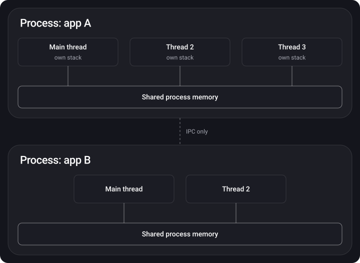

> **What you'll learn**
>
> - How a process differs from a thread and how they are related
> - What the difference is between concurrency and parallelism
> - Why the main thread exists and why you must not overload it
> - The life cycle of a thread and the API levels for working with threads
> - Why managing threads by hand is a bad idea

> **Prerequisites:** basic Swift syntax and closures. Nothing else: this is the starting topic.

## Analogy: a phone is a kitchen

Picture a phone as a big kitchen and each app as a separate recipe.

- **Process** — a separate workstation for one recipe: its own table, its own ingredients, its own tools (memory and resources). The neighboring recipe can't take your knife.
- **Thread** — a helper at that workstation. One chops vegetables, another watches the boiling water. All helpers share the same table and ingredients.
- **Concurrency** — one kitchen and one cook who switches between dishes: chopped the onion for the soup, stirred the pasta sauce, went back to the soup. Every dish moves forward, even though at any given moment the cook is doing just one thing.
- **Parallelism** — several cooks (cores), each really cooking their own dish at the very same instant.

## Step 1. Process

> A process is an instance of a program at run time, to which the system has allocated resources: processor time and memory.

Key properties of a process:

- All processes are **independent** and each works in its own address space.
- One process **cannot** simply read another one's variables. Exchanging data requires inter-process communication (IPC): pipes, files, sockets, messages.
- When an app launches, iOS creates a **separate process** for it.

What happens when an app launches:

1. The operating system creates a new process.
2. The executable file is loaded into memory.
3. The dynamic linker is loaded — it binds the dynamic dependencies (frameworks) to the process.
4. The process is prepared to run: registers are initialized and the instruction pointer is set to the start of the program.
5. The OS hands control to the process — the first instruction executes, and the **main thread** starts along with it.

## Step 2. Thread

> A thread is a sequence of instructions inside a process that the OS kernel can independently schedule for execution. In short: a thread is a path of execution of our code.

- Every process has **at least one thread** — the main one.
- Threads of one process **share the same memory** (the heap, global variables). A change made by one thread is immediately visible to the others.
- Every thread has **its own stack and its own registers**.
- A thread performs **one** operation at a time.



|  | Process | Thread |
| --- | --- | --- |
| What it is | An instance of a running app | A path of code execution inside a process |
| Memory | Its own isolated address space | The process's shared memory + its own stack |
| Communication | Via IPC (messages, pipes, files) | Via shared memory — fast, but dangerous |
| Cost of creation | Expensive | Cheaper, but not free (stack, scheduling) |
| Failure | Doesn't affect other processes | Can bring down the whole process |

## Step 3. Concurrency and parallelism

**Multithreading** is a way to run a program in several threads at once: the work is split into smaller tasks that can run independently.

At any moment a processor core executes one task, the one a thread was given for. So how do we get "simultaneity"?

- **One core → concurrency (pseudo-parallelism).** The core switches between threads very quickly. This switch is called a **context switch**: the system saves the state of one thread and loads the state of another. Threads don't run 100% in parallel; they run with interruptions and waiting for their turn.
- **Several cores → true parallelism.** Different threads physically execute on different cores at the very same instant.

One core interleaves threads, several cores really work at the same time:


> **Key idea:** concurrency lets you make progress on several tasks even if they take turns using one resource (one kitchen). Parallelism is execution that really happens at the same instant (several kitchens). Real systems use both.

## Step 4. The main thread (Main / UI thread)

The main thread starts together with the app. It is responsible for:

- drawing and updating the interface;
- handling touches and other user events;
- running the code you wrote to react to those events.

When the user taps a button, the main thread runs the handler and then updates the screen. If the handler does heavy work (networking, image decoding, parsing), the screen **freezes**: the main thread is busy and can't redraw the interface.

**The solution** is to move the heavy work to a background thread and return to the main one only to update the UI:

```swift
// The simplest way is to create a thread by hand (we'll see below why it's better not to)
let thread = Thread {
    // run the slow task in the background
    let data = loadHugeFile()
    DispatchQueue.main.async {
        // update the UI only on the main thread
        label.text = "Done: \(data.count) bytes"
    }
}
thread.start()

// Useful properties
let currentThread = Thread.current   // the thread the code is running on
let mainThread = Thread.main         // the main thread
print(Thread.isMainThread)           // true if we are on the main thread
```


## Step 5. Thread life cycle

- **New** — the thread is created but not started yet.
- **Runnable** — ready to run and waiting for processor time.
- **Running** — executing right now.
- **Blocked** — waiting for an external event (I/O, a lock being released, sleep).
- **Terminated** — finished executing.


## Step 6. API levels for working with threads

The higher the level, the less manual work and the fewer chances to make a mistake.


**1. Mach (kernel) threads** — the lowest-level implementation; everything else is built on it. Not used directly.

**2. POSIX Threads (pthread)** — the standard C interface for working with threads on UNIX systems. It provides a set of functions and types for creating and managing threads:

```swift
import Foundation

var thread: pthread_t?

func startThread() {
    pthread_create(&thread, nil, threadFunction, nil)
}

func threadFunction(arg: UnsafeMutableRawPointer?) -> UnsafeMutableRawPointer? {
    // Code that runs in the new thread
    return nil
}

func joinThread() {
    pthread_join(thread!, nil)   // wait for the thread to finish
}
```

**3. NSThread / Thread** — a Foundation class, a high-level wrapper over pthread with Objective-C/Swift syntax. Apple adds optimizations to it.

```swift
let thread = Thread {
    print("Hello from \(Thread.current)")
}
thread.name = "com.app.worker"
thread.qualityOfService = .utility
thread.start()
```

> NSThread has **no API for tracking when a task finishes** and no convenient cancellation — you would have to write all of that yourself. That is why in most cases you shouldn't create threads this way.

## Step 7. Why you shouldn't manage threads by hand

At first glance it looks simple, but in practice problems show up:

1. **Cost.** Creating threads and switching between them takes resources (stack memory, context switches). Many threads make things slower, not faster.
2. **Leaks.** It is easy to forget to stop a thread after the work is done — extra resource consumption.
3. **Synchronization.** If threads need access to shared data, you have to place locks by hand.
4. **Mutual blocking.** Threads can wait for each other forever (deadlock).

That is exactly why Apple provides higher-level tools where you describe **tasks**, and the system decides **on which thread** and **when** to run them.

| Tool | Idea | When to use | Tutorial |
| --- | --- | --- | --- |
| GCD | Put closures into queues, the system distributes them over a thread pool | Simple background tasks, hopping to main, task groups | [02](../gcd/) |
| Operation / OperationQueue | A task is an object with state, dependencies and cancellation | Complex chains, cancellation, limiting concurrency | [05](../operation-queue/) |
| Swift Concurrency | async/await, Task, actor, the cooperative thread pool | New code, readable asynchrony, data safety | [06](../swift-concurrency/) |
| Lock, semaphore, barrier | Protecting shared data from simultaneous access | When several threads touch the same state | [04](../thread-safety-synchronization/) |

> The price of multithreading is **thread safety**. As soon as tasks run in parallel, they start fighting over the same resources: one variable, one file, one lock. This can corrupt data. In detail — in tutorials [03](../concurrency-problems/) and [04](../thread-safety-synchronization/).

## Common mistakes

- Heavy work (networking, JSON, images) right in a button handler on the main thread → UI freezes.
- Updating the UI from a background thread → unpredictable bugs and Main Thread Checker warnings.
- "More threads = faster." No: beyond the number of cores, only the switching overhead grows.
- Creating a Thread for every small task instead of using queues.

## Cheat sheet

```text
Process  = a running app, its own isolated memory
Thread   = a path of code execution inside a process, shared memory + its own stack
Main     = UI and events; no heavy work
Concurrency  = switching between tasks (even 1 core can do it)
Parallelism  = simultaneous execution on different cores
Context switch = save the state of thread A, load the state of B
Thread states: New → Runnable ⇄ Running → Blocked → ... → Terminated
Levels: Mach → pthread → Thread → GCD → Operation / Swift Concurrency
```

## Self-check questions

<details>
<summary>1. How does a thread differ from a process?</summary>

A process is an instance of a running app with its own isolated address space. A thread is a path of code execution inside a process; threads of one process share memory, but each has its own stack and registers.

</details>

<details>
<summary>2. Can a process exist without threads?</summary>

No. For a process to do anything at all, it must have at least one thread — the main one.

</details>

<details>
<summary>3. How does concurrency differ from parallelism?</summary>

Concurrency — tasks make progress "at the same time" thanks to fast switching (even on a single core). Parallelism — tasks physically execute at the very same instant on different cores.

</details>

<details>
<summary>4. What is a context switch and why isn't it free?</summary>

It is switching a core from one thread to another: the registers and stack of the current thread must be saved and the state of the next one restored. This costs CPU time and cache efficiency, so an excessive number of threads slows the app down.

</details>

<details>
<summary>5. Why can't the UI be updated from a background thread?</summary>

UIKit/SwiftUI are not thread-safe and are designed to work on the main thread, which is tied to RunLoop.main and the rendering cycle. Updating from another thread leads to races and unpredictable behavior.

</details>

<details>
<summary>6. List the thread states.</summary>

New → Runnable → Running → (Blocked → Runnable) → Terminated.

</details>

<details>
<summary>7. Why is NSThread rarely used directly?</summary>

You have to manage the thread's lifetime, synchronization and the number of threads yourself; there is no API for tracking completion. GCD, OperationQueue and Swift Concurrency do this for us.

</details>

## Sources

- [Multithreading basics in iOS — Mad Brains Techno](https://www.youtube.com/watch?v=JgUBBoRydoE&list=PLw6SJ6q6-1YowmlGVks5a088XrSbihJu-&index=39) (video, in Russian)
