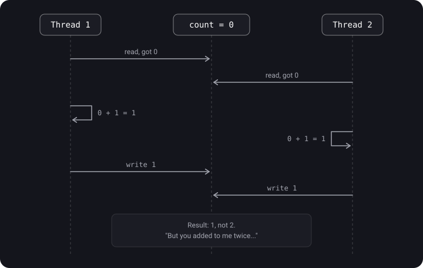
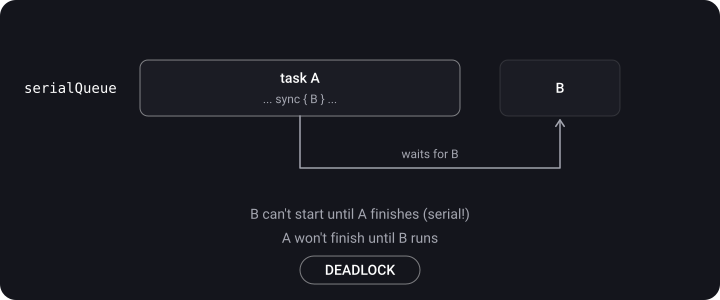

> **What you'll learn**
>
> - Data race and race condition — what the difference is and why `+=` is not safe
> - Deadlock and livelock — how they arise and how to avoid them
> - Priority inversion and starvation — thread management mistakes
> - Thread explosion and actor reentrancy
> - How to find such bugs with Thread Sanitizer

> **Prerequisites:** tutorials [01](../concurrency-basics/)–[02](../gcd/): threads, queues, sync/async, QoS. NSLock and a semaphore appear in the examples — it is enough to understand them as a "lock"; they are covered in detail in [tutorial 04](../thread-safety-synchronization/).

## Analogy: chaos in the kitchen

- **Data race** — two cooks salt the same pot at the same time without looking at each other. The result is unpredictable.
- **Race condition** — a cook puts a plate on the pass, and the waiter has already carried off the empty one: everything depends on who got there first.
- **Deadlock** — one cook holds the knife and waits for the board, another holds the board and waits for the knife. Both stand there forever.
- **Livelock** — two polite cooks in a narrow passage keep yielding to each other: "no, you go" — "no, you." Both are moving, but nobody gets through.
- **Priority inversion** — the chef (high priority) waits for the intern (low) to return the only frying pan.
- **Starvation** — a cook stands in line for the stove all day because others keep cutting ahead.
- **Thread explosion** — 100 cooks were hired for the kitchen, and now they only bump into each other.

## A map of the problems


> The logic of the map: a **race condition** forces us to turn to synchronization mechanisms → along with synchronization come **deadlock, livelock and a drop in performance** → and unskilled thread management adds **priority inversion and starvation**.

## Step 1. Data race

> **Data race** — different threads access the same memory location **without synchronization**, and at least one of them **writes**. It is a consequence of a critical section being left unprotected; it can lead to data corruption and a crash.

**Example 1.** A counter:

```swift
var result = 0
for _ in 0..<1000 {
    DispatchQueue.global().async {
        result += 1          // read and write from different threads
    }
}
print(result)   // anything, but not necessarily 1000
```

**Why is `+=` dangerous?** It isn't one operation but three: read → add → write (read-modify-write). If two threads read the same value, one of the increments is lost:



**Example 2.** A write in the background + a read on the main thread:

```swift
private var name = ""

func updateName() {
    DispatchQueue.global().async {
        self.name.append("test")   // a write on a background thread
    }
    print(self.name)               // a read on the main thread — at the same time
}
```

**Example 3.** Two fields that must change together:

```swift
final class Name {
    private(set) var firstName: String = ""
    private(set) var lastName: String  = ""

    func setFullName(firstName: String, lastName: String) {
        self.firstName = firstName
        self.lastName = lastName
    }
}
```

What happens if two threads call `setFullName` at the same time?

```text
Thread 1: setFullName("Bruno", "Rocha")
Thread 2: setFullName("Onurb", "Ahcor")
Thread 1: firstName = "Bruno"
Thread 2: firstName = "Onurb"
Thread 2: lastName  = "Ahcor"
Thread 1: lastName  = "Rocha"

Result: "Onurb Rocha" — nobody ever set that name
```

**How to fix a data race:**

- a serial queue;
- DispatchBarrier with a concurrent queue;
- NSLock and other locks;
- atomic operations (they execute either entirely or not at all);
- an `actor` in Swift Concurrency.

```swift
let serialQueue = DispatchQueue(label: "counter")
var result = 0
for _ in 0..<1000 {
    serialQueue.async { result += 1 }   // all writes go one at a time
}
serialQueue.sync { print(result) }       // 1000
```

## Step 2. Race condition

> **Race condition** — a design error where the result depends on the **order or timing** of execution of parts of the code. The expected order of operations becomes unpredictable, and the intended logic suffers.

Such bugs are very hard to debug: the problem appears at random, and finding steps to reproduce it is almost impossible.

**Example 1.** A bank account ("check, then act", check-then-act):

```swift
var balance = 100

func withdraw(amount: Int) {
    if balance >= amount {                    // check
        Thread.sleep(forTimeInterval: 0.1)    // simulate work
        balance -= amount                     // act
    }
}

concurrentQueue.async { withdraw(amount: 80) }
concurrentQueue.async { withdraw(amount: 90) }
// Both passed the check (100 >= 80 and 100 >= 90) → balance = -70
```

**Example 2.** An auth token:

```swift
func retrieveToken(completion: @escaping (Result<AccessToken, Error>) -> Void) {
    if let token = token, token.isValid {
        completion(.success(token))
        return
    }
    loader.load { [weak self] result in
        if case let .success(token) = result {
            self?.token = token
        }
        completion(result)
    }
}
// Two parallel calls will both see "no token" and make TWO requests.
// The fix is to keep a queue of waiting completions and make a single request.
```

**Example 3** (from notes): two accounts with 100 dollars each; 50 and 70 are transferred from account A to B. With a race condition it is unknown which transaction goes through first, and the second fails for lack of funds.

> **A race condition is NOT solved by protecting the critical section alone.** It is a logic error. You can protect every read and every write of the balance with a lock — and still go negative if "check" and "withdraw" are not combined into one atomic operation. Another example from notes: if correctness doesn't depend on order, you can use a `Set` instead of an array; if you need an ordered array, the order has to be spelled out explicitly in the logic.

**How to fix a race condition:** atomic operations (check + action in one critical section), serial queues, NSLock, an actor, and above all — **fix the order of calls** in the logic.

```swift
let lock = NSLock()
func withdraw(amount: Int) -> Bool {
    lock.lock(); defer { lock.unlock() }
    guard balance >= amount else { return false }   // the check and the action —
    balance -= amount                               // in one critical section
    return true
}
```

|  | Data race | Race condition |
| --- | --- | --- |
| Essence | Simultaneous unsynchronized memory access, at least one write | The result depends on the order of events |
| Level | Memory, low level | Application logic |
| Consequences | Corrupted data, a crash | A wrong result with "correct" data |
| Fixed by a lock? | Yes | Not always — the logic must be rethought |
| Caught by Thread Sanitizer? | Yes | Usually not |

## Step 3. Deadlock

> **Deadlock** — two or more threads wait forever for resources held by each other. The first action can't finish because it waits for the second, and the second because it waits for the first.

A deadlock is possible only with **nested (dependent) access** to resources. The app hangs, and the system may kill it (watchdog).

**A scenario from notes:** tasks A (low priority) and B (high), resources X and Y.


**Example 1.** Two locks in opposite order:

```swift
let lock1 = NSLock()
let lock2 = NSLock()

let thread1 = Thread {
    lock1.lock()
    lock2.lock()                       // waits for lock2, which thread2 holds
    print("This won't run")
    lock2.unlock(); lock1.unlock()
}
let thread2 = Thread {
    lock2.lock()
    lock1.lock()                       // waits for lock1, which thread1 holds
    print("This won't run")
    lock1.unlock(); lock2.unlock()
}
thread1.start()
thread2.start()
// The fix: both threads acquire the locks in the SAME order: lock1 → lock2
```

**Example 2.** `sync` onto the same serial queue:

```swift
let serialQueue = DispatchQueue(label: "queue")
serialQueue.async {
    serialQueue.sync {                 // waiting for a task that stands BEHIND us in the same queue
        print("This won't run")
    }
    print("This won't run")
}
// The fix: make the inner call async — both prints will run
```



**Example 3.** The main queue is the same case:

```swift
override func viewDidLoad() {        // we are already on main
    super.viewDidLoad()
    DispatchQueue.main.sync {        // DEADLOCK
        // ...
    }
}

DispatchQueue.main.async {
    DispatchQueue.main.sync { }      // also a deadlock
}
```

**Example 4.** Calling `lock()` twice on the same thread with a plain `NSLock` is also a deadlock. Recursive acquisition needs `NSRecursiveLock` ([tutorial 04](../thread-safety-synchronization/)).

**Example 5.** A cycle in operation dependencies: Op2 waits for Op5, Op5 waits for Op3, Op3 waits for Op2 ([tutorial 05](../operation-queue/)).

**The four deadlock conditions (Coffman conditions).** A deadlock is possible only if all four hold; to rule it out it is enough to break any one:

1. Mutual exclusion — a resource can be owned by only one party.
2. Hold and wait — I hold one resource and wait for another.
3. No preemption — a resource can't be taken away.
4. Circular wait — A waits for B, B waits for A.

**How to avoid deadlock:**

- don't use `sync` in GCD without need, and never `main.sync` from the main thread;
- keep `lock` / `unlock` paired (convenient with `defer`);
- acquire resources in all branches in a **strictly identical order**;
- avoid nested locks; don't design in a complicated way where a simple way will do;
- timeouts: `lock(before:)`, `wait(timeout:)`.

## Step 4. Livelock

> **Livelock** — two or more threads can't do useful work because of a struggle over a shared resource. It differs from deadlock in that the threads don't just wait but **actively and unsuccessfully try** to get out of the stupor (hence live, not dead). Often these are processes that keep giving way to each other.

An example: two "polite" threads that, on conflict, release their lock and try again — in sync, again and again:

```swift
func politeWorker(first: NSLock, second: NSLock) {
    while true {
        first.lock()
        if second.try() {              // tried to take the second lock
            doWork()
            second.unlock(); first.unlock()
            return
        }
        first.unlock()                 // "no, you work" — gave way and immediately retried
    }
}
// thread A: politeWorker(first: lockX, second: lockY)
// thread B: politeWorker(first: lockY, second: lockX)
// The fix: a single acquisition order or a random delay before retrying
```

## Step 5. Priority inversion

> **Priority inversion** — a low-priority thread holds a resource that a high-priority thread needs. As a result the high-priority task waits for the low-priority one, and its speed becomes equal to (or lower than) the speed of the low-priority one.


Step by step (a diagram from notes): **T1** — Low locks the resource; **T2** — High preempts Low; **T3** — High tries to take the resource, it is busy → High waits, Low continues; **T4** — Low releases the resource, High runs right away. The gap T3–T4 is the inversion. Worst of all is when a **medium**-priority task arrives at that moment and preempts Low: then High waits for Medium as well.

```swift
let highPriority = DispatchQueue.global(qos: .userInitiated)
let lowPriority = DispatchQueue.global(qos: .utility)
let lock = NSLock()

lowPriority.async {
    lock.lock()
    Thread.sleep(forTimeInterval: 2)       // we hold the lock for a long time
    print("Low-priority task")
    lock.unlock()
}
highPriority.async {
    lock.lock()                            // has to wait for low
    print("High-priority task")
    lock.unlock()
}
```

**How to reduce the risk:**

- minimize how long resources are held (put into the critical section only what is really needed);
- don't share one resource between tasks with very different QoS;
- use primitives with **priority donation to the owner**: serial queues with `sync`, `os_unfair_lock`, `pthread_mutex` with the `PTHREAD_PRIO_INHERIT` attribute (the default is `PTHREAD_PRIO_NONE`), actor. `DispatchSemaphore` has no owner, so the system can't raise the priority of whoever is "holding" it — a classic source of inversions.

## Step 6. Starvation, resource contention and fairness

> **Starvation** — a thread can't get a resource and unsuccessfully tries again and again, because the resource keeps going to others. "How much longer?! I'm starving for work, give me the lock!" — "Running task 100 of 500…"

Typical causes:

- **Priorities.** A constant stream of high-priority tasks doesn't let `.background` tasks run.
- **Unfair locks.** `os_unfair_lock` by definition doesn't guarantee ordering: a thread that has just released the lock may immediately take it again.
- **Readers and writers.** If reads come continuously, a write may never get its "window" (which is why a GCD barrier is used for writes: tasks submitted after it will not start until it completes, so new readers cannot overtake the writer).
- **Long holding.** One thread holds the lock while it processes 500 elements in a row.

How to fight it: split long work and release the lock between chunks; a barrier for writes; fair (FIFO) mechanisms — a serial queue, `NSCondition` with a queue of waiters; adequate QoS.

**Resource contention** — several threads try to get one resource, the time to acquire it grows, and performance drops (the price of synchronization).

**Non-deterministic and fairness** — you can't assume when and in what order a thread will get a resource. Some synchronization primitives provide fairness — they guarantee access to all waiters in order.

## Step 7. Thread explosion

> **Thread explosion** — a very large number of threads gets created. The app slows down (a context switch is an expensive operation), memory grows, and you can hit GCD's thread limit and get a deadlock or a crash.

**How it happens.** If you put many **thread-blocking** tasks on queues (`sleep`, locks, `sync`, synchronous I/O), GCD sees that the pool's threads are blocked while there are tasks in the queue — and creates new threads.

```swift
func gcdThreadPoolTest() {
    for i in 1...100 {
        DispatchQueue.global(qos: .default).async {
            for n in 1...10000 { _ = i * n }
            sleep(2)                          // block the thread → GCD creates a new one
            for n in 1...10000 { _ = i * n }
        }
    }
}
```

```swift
// An example: 50,000 tasks, each waits for a serial queue
func calculateValues() {
    let group = DispatchGroup()
    for _ in 0..<50000 {
        group.enter()
        concurrentQueue.async { [weak self] in
            guard let self else { return }
            let value = self.calculateValue()
            self.saveValue(value) { group.leave() }
        }
    }
    group.notify(queue: .main) { print("Completed") }
}

func saveValue(_ value: Int, completion: @escaping () -> Void) {
    serialQueue.async { [weak self] in
        self?.store.saveValue(value)
        completion()
    }
}
```

**How to avoid it:**

- `maxConcurrentOperationCount` in OperationQueue;
- limiting with a semaphore (`DispatchSemaphore(value: N)`);
- Swift Concurrency: the cooperative pool doesn't create more threads than there are cores ([tutorial 06](../swift-concurrency/));
- don't block threads inside tasks; make fewer large tasks instead of a million small ones; use `concurrentPerform` for loops.

## Step 8. Actor reentrancy (in brief)

An actor protects against data races, but **not** against race conditions. At every `await` an actor's method may suspend, and another call can "enter" the actor in the meantime:

```swift
actor Account {
    var balance = 0

    func withdraw(amount: Int) async throws {
        guard balance >= amount else { throw AccountError.noMoney }
        try await logWithdrawing(amount)   // ← a suspension point: another withdraw can get past the guard
        balance -= amount                  // ← the balance may have already changed
    }
}
// The fix: change state BEFORE the await or re-check the conditions AFTER it
```

In detail — in [tutorial 06](../swift-concurrency/).

## Step 9. Tools: Thread Sanitizer

**Thread Sanitizer (TSan)** finds data races at run time and shows which threads conflict and on which lines.

1. Product → Scheme → **Edit Scheme…**
2. Run → the **Diagnostics** tab.
3. Check **Thread Sanitizer**. Next to it are **Main Thread Checker** (catches UI work off the main thread) and **Thread Performance Checker** (which catches, among other things, priority inversions).
4. Run and go through the suspicious scenario.

> General advice: turn Thread Sanitizer on and **don't overcomplicate multithreaded code**. Keep an eye on Energy Impact in Xcode — "Very High" often means a livelock or thread explosion. Concurrency problems are possible with **any** tool: GCD, Operation, async/await.

## Summary table

| Problem | Symptom | Cause | Solution |
| --- | --- | --- | --- |
| Data race | Random wrong values, EXC_BAD_ACCESS crashes | Unsynchronized writes from different threads | Serial queue, lock, barrier, actor |
| Race condition | Logic breaks "sometimes" | Dependence on the order of events, check-then-act | Atomic operations, rethinking the logic and order |
| Deadlock | The app hangs, CPU ≈ 0 | Circular wait, sync onto the current serial queue | No sync, a single lock order, timeouts |
| Livelock | No progress, high CPU | Threads give way to each other in sync | A single order, a random delay (backoff) |
| Priority inversion | An important task lags | Low holds a resource High needs | Short critical sections, primitives with an owner |
| Starvation | One task never runs | Unfair distribution of a resource | Fair queues, splitting work, barrier |
| Thread explosion | Hundreds of threads, lag, memory | Blocking tasks on concurrent queues | A concurrency limit, Swift Concurrency |
| Actor reentrancy | An actor invariant is broken after an await | Re-entry during suspension | Change state before await, re-check after |

## Common mistakes

- Thinking that if a bug doesn't reproduce, it doesn't exist. Races show up rarely and at random.
- Protecting the getter and the setter separately and assuming `+=` is now safe ([tutorial 04](../thread-safety-synchronization/)).
- Acquiring locks in different orders in different places in the code.
- Making network requests or `sleep` inside a critical section.
- Assuming an actor solves all problems — it removes data races, but not race conditions.

## Cheat sheet

```text
Data race        = the same memory, different threads, no synchronization, at least 1 write
Race condition   = the result depends on order (logic)
Deadlock         = A waits for B, B waits for A (asleep)
Livelock         = A and B give way to each other (spinning idle)
Priority inv.    = High waits for Low, which holds a resource
Starvation       = a thread never gets a resource
Thread explosion = blocking tasks → GCD spawns threads

NEVER:  DispatchQueue.main.sync { } from the main thread
ALWAYS: the same lock acquisition order, defer { unlock() }
DIAGNOSTICS: Edit Scheme → Run → Diagnostics → Thread Sanitizer
```

## Self-check questions

<details>
<summary>1. Name the main concurrency problems.</summary>

Data race, race condition, deadlock, livelock, priority inversion, starvation, thread explosion. The classic trio in an interview is race condition, priority inversion, deadlock.

</details>

<details>
<summary>2. What is the difference between a data race and a race condition?</summary>

A data race is a low-level simultaneous memory access without synchronization (at least one write); it is cured with a lock/queue/actor. A race condition is a logic error: the result depends on the order of events; it can occur even without a data race.

</details>

<details>
<summary>3. Why does count += 1 from different threads lose increments?</summary>

It is three operations (read, add, write). Two threads can read the same old value and both write "old + 1".

</details>

<details>
<summary>4. Why is serialQueue.sync from inside a task of the same queue a deadlock?</summary>

A serial queue won't start a new task until the current one finishes. And the current one synchronously waits for the new one. Each waits for the other.

</details>

<details>
<summary>5. How does livelock differ from deadlock?</summary>

In a deadlock the threads sleep waiting for each other and don't use CPU. In a livelock the threads are active, change state and use CPU, but do no useful work.

</details>

<details>
<summary>6. What is priority inversion and how can it be mitigated?</summary>

A high-priority task waits for a resource held by a low-priority one. To mitigate: short critical sections, don't share resources between different QoS levels, use primitives with an owner (the system will raise its priority) rather than a semaphore.

</details>

<details>
<summary>7. What causes thread explosion?</summary>

When a concurrent queue has many tasks that block their thread (sleep, lock, sync, semaphore.wait): GCD creates new threads to keep going.

</details>

<details>
<summary>8. Does an actor protect against a race condition?</summary>

No. An actor rules out data races, but because of reentrancy, at every `await` the state can be changed by another call.

</details>

## Sources

- [iOS Interview — concurrency problems](https://ios-interview.ru/multithreading-problems/) (in Russian)
- [What is a race condition](https://apptractor.ru/info/articles/chto-takoe-sostoyanie-gonki-race-condition.html) (in Russian)
- [Hard iOS questions and simple answers to them — Mad Brains Techno](https://youtu.be/pWXgH-GbRSU?t=1715) (video, in Russian)
- [Multithreading basics in iOS — Mad Brains Techno](https://youtu.be/JgUBBoRydoE?list=PLw6SJ6q6-1YowmlGVks5a088XrSbihJu-&t=1896) (video, in Russian)
