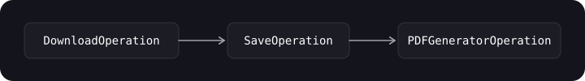
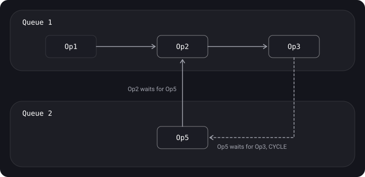

> **What you'll learn**
>
> - What an Operation is and why it beats a plain closure in GCD
> - BlockOperation and OperationQueue: adding, limiting concurrency, suspending
> - The states and life cycle of an operation
> - Dependencies and how not to run into a deadlock
> - Cancelling operations
> - Your own synchronous and asynchronous operations (KVO)

> **Prerequisites:** [tutorial 02](../gcd/) (GCD, queues, QoS), [tutorial 03](../concurrency-problems/) (deadlock), [tutorial 04](../thread-safety-synchronization/) (synchronization — it will come in handy for your own operations).

## Analogy: a restaurant's recipe cards

In GCD you put slips of paper with a short order on the rail. In OperationQueue every order is a **recipe card** with a status ("waiting", "cooking", "done", "cancelled"), a mark "start only after the sauce" (a dependency) and a "cancel" button. The shift manager (OperationQueue) makes sure no more than N cooks work at once, and can cancel all of a table's orders in one go if the guests have left.

## Step 1. What an Operation is

> **Operation (NSOperation)** — a task object that is executed in an OperationQueue. It is an abstraction over GCD, a higher-level and more object-oriented way to manage task execution.

- `Operation` is an **abstract class**, not used directly. It performs one task.
- Ready-made subclasses from the system: `BlockOperation` and `NSInvocationOperation` (the latter is available only in Objective-C).
- You can write your own subclass — a Custom Operation with full control.
- An operation can be started **manually** or added to an **OperationQueue**.

**What Operation gives you on top of GCD:**

- **Dependencies** — an operation won't start until the ones it depends on have finished.
- **Simple cancellation** — of one operation or of all at once. Example: the user opened a screen, we started a download, the user left — we cancel.
- **States** and KVO — it is easy to track what is happening with each task.
- **A concurrency limit** (like a semaphore), pausing and resuming the queue.
- **Priorities** within the queue (`queuePriority`) and QoS.

> Concurrency problems (deadlock, livelock, priority inversion, race condition) are possible with operations too — Operation doesn't protect against them automatically.

## Step 2. The first operation: BlockOperation

`BlockOperation` is for when there is no point in writing your own subclass and a closure is enough.

```swift
let blockOperation = BlockOperation {
    print("Executing!")
}

let queue = OperationQueue()
queue.addOperation(blockOperation)

// You can add code to the queue directly — it will create a BlockOperation itself
queue.addOperation {
    print("Executing!")
}
```

**How exactly an operation is started:**

- `operation.start()` — runs the operation **on the current thread** and synchronously (if that is main, then on main).
- `queue.addOperation(op)` — the operation runs on a separate thread as soon as possible.
- OperationQueue is similar to DispatchQueue, but can work with threads directly as well as through GCD. Operations are started through Dispatch on separate threads; if `underlyingQueue` is set, they go to that queue, otherwise the system decides.

**Several blocks in one operation.** The blocks inside a BlockOperation run **in parallel**, and the operation itself is considered finished when all of them are done. Additional closures are added via `addExecutionBlock`:

```swift
let operation = BlockOperation {
    checker.check { _ in }
}

let checkerOperation = BlockOperation()
for checker in checkers {
    checkerOperation.addExecutionBlock {
        checker.check { _ in }       // all blocks — in parallel
    }
}
checkerOperation.completionBlock = {
    print("All checks are finished")
}
```

To make the blocks run sequentially — use either separate operations with dependencies, or a serial queue (`maxConcurrentOperationCount = 1`).

## Step 3. OperationQueue

> **OperationQueue** — the same kind of queue, only high-level and OOP-style. It can cancel, account for dependencies and limit the number of simultaneous operations. After being added, an operation runs until it finishes or is cancelled and is removed from the queue automatically.

**Three ways to add work:** a single Operation, a closure, an array of Operations.

```swift
let firstOperation = BlockOperation { print("First operation") }
let secondOperation = BlockOperation { print("Second operation") }
secondOperation.addDependency(firstOperation)          // second — only after first

let queue = OperationQueue()
queue.addOperations([firstOperation, secondOperation], waitUntilFinished: false)

let thirdOperation = BlockOperation { print("Third operation") }
thirdOperation.cancel()                                  // cancellation

// Limiting the maximum number of operations running at the same time
queue.maxConcurrentOperationCount = 2
```

**The OperationQueue API (from a slide):**

```swift
class OperationQueue: NSObject, ProgressReporting {
    unowned(unsafe) var underlyingQueue: DispatchQueue?
    var progress: Progress { get }
    var maxConcurrentOperationCount: Int
    var isSuspended: Bool
    var name: String?
    var qualityOfService: QualityOfService

    func addOperation(_ op: Operation)
    func addOperations(_ ops: [Operation], waitUntilFinished wait: Bool)
    func addOperation(_ block: @escaping @Sendable () -> Void)
    func addBarrierBlock(_ barrier: @escaping @Sendable () -> Void)
    func cancelAllOperations()
    func waitUntilAllOperationsAreFinished()
}
```

| Property / method | What it does |
| --- | --- |
| `maxConcurrentOperationCount` | The maximum of simultaneous operations. `1` → the queue becomes serial |
| `isSuspended` | Suspension: new operations don't start (those already running finish up) |
| `qualityOfService` | The default QoS for the queue's operations |
| `underlyingQueue` | The DispatchQueue on which operations actually run. **Don't set the main queue** (for main there is `OperationQueue.main`) |
| `waitUntilAllOperationsAreFinished()` | Blocks the current thread until all are finished. Don't call it on main! |
| `cancelAllOperations()` | Cancel everything in the queue |
| `addBarrierBlock` | A barrier: runs after all previous operations, and subsequent ones wait for it |

## Step 4. States and life cycle

**Operation states:**

- **pending** — added, waiting (for dependencies, for example);
- **ready** — ready to start;
- **executing** — running;
- **finished** — completed;
- **cancelled** — cancelled.


In terms of properties: `isReady → isExecuting → isFinished` or `isExecuting → isCancelled → isFinished`.

| Property | Meaning | When to override |
| --- | --- | --- |
| `isReady` | `true` when all dependent operations are done | Rarely: if readiness depends on more than the dependencies |
| `isExecuting` | The operation is running right now | If you override `start()` — required, with KVO |
| `isFinished` | Completed successfully or cancelled. While `false`, the operation hangs in the queue | If you override `start()` — required, with KVO |
| `isCancelled` | A cancellation request has been sent | Not overridden — but you implement the reaction to cancellation |

> **An operation is single-use.** If it is in the finished or cancelled state, it can't be started again — create a new one. OperationQueue automatically removes an operation when it becomes finished (both after execution and after cancellation).

**The Operation API (from a slide):**

```swift
open class Operation: NSObject {
    open var name: String?
    open var isCancelled: Bool { get }
    open var isExecuting: Bool { get }
    open var isFinished: Bool { get }
    open var isConcurrent: Bool { get }      // deprecated, see isAsynchronous
    open var isAsynchronous: Bool { get }
    open var isReady: Bool { get }
    open var queuePriority: Operation.QueuePriority
    open var dependencies: [Operation] { get }
    open var qualityOfService: QualityOfService
    open var completionBlock: (() -> Void)?

    open func start()
    open func main()
    open func cancel()
    open func addDependency(_ op: Operation)
    open func removeDependency(_ op: Operation)
    open func waitUntilFinished()
}
```

## Step 5. Dependencies

A dependency guarantees that the dependent operation **won't start** until the required one has finished. Dependencies work even between operations in **different** queues.

An example: first the data import, then the upload.

```swift
let fileURL = URL(fileURLWithPath: "..")
let contentImportOperation = ContentImportOperation(itemProvider: NSItemProvider(contentsOf: fileURL)!)
contentImportOperation.completionBlock = {
    print("Importing completed!")
}

let contentUploadOperation = UploadContentOperation()
contentUploadOperation.addDependency(contentImportOperation)
contentUploadOperation.completionBlock = {
    print("Uploading completed!")
}

queue.addOperations([contentImportOperation, contentUploadOperation], waitUntilFinished: true)

// Prints:
// Importing content..
// Importing completed!
// Uploading content..
// Uploading completed!
```

The chain "download → save → generate a PDF": with operations the code is flat, with GCD it's a "pyramid of doom":

```swift
// Operations
let downloadOp = DownloadOperation(url: url)
let saverOp = SaveOperation()
let pdfGeneratorOp = PDFGeneratorOperation()
saverOp.addDependency(downloadOp)
pdfGeneratorOp.addDependency(saverOp)
queue.addOperations([downloadOp, saverOp, pdfGeneratorOp], waitUntilFinished: false)

// Remove a dependency
pdfGeneratorOp.removeDependency(saverOp)

// GCD — the same thing via nested callbacks
network.onDownloaded { data in
    saver.onSave(data) { file in
        pdfGenerator.onGenerate(file) { pdf in
            // ...
        }
    }
}
```



One way to pass data is to read the result from the dependency at the start of your own work:

```swift
final class DownloadOperation: Operation {
    private(set) var data: Data?
    override func main() {
        guard !isCancelled else { return }
        data = try? Data(contentsOf: url)
    }
}

final class SaveOperation: Operation {
    override func main() {
        guard !isCancelled else { return }
        let input = dependencies
            .compactMap { $0 as? DownloadOperation }
            .first?.data                        // we pick up the result ourselves
        save(input)
    }
}
```

### How to check the dependency graph for deadlock

Dependencies form a graph. As long as it has no cycles, everything is fine. **A cycle in the dependency graph = deadlock**: no operation in the cycle will ever become ready.



- Queue1: Op1 → Op2 → Op3 — no deadlock.
- Added Op5 (Queue2) → Op2 — no deadlock.
- Added Op3 → Op5: now Op2 waits for Op5, Op5 waits for Op3, Op3 waits for Op2 — **a cycle, deadlock**.

## Step 6. Cancellation

`cancel()` doesn't "kill" an operation — it only sets `isCancelled = true`. If the operation hasn't started yet, the queue won't start it. If it is already running, it has to check the flag itself and exit.

| Property | Before cancel() | After cancel() and exit |
| --- | --- | --- |
| `isCancelled` | false | true |
| `isExecuting` | true | false |
| `isFinished` | false | true |

```swift
queue.cancelAllOperations()      // cancel everything, for example in the screen's deinit
```

## Step 7. Your own synchronous operation

A subclass is needed for complex or reusable work. Steps (cookbook):

1. Subclass `Operation`.
2. Pass the needed data in `init()`.
3. Override `main()` — all the code goes there.
4. In `main()` check for cancellation: `guard !isCancelled else { return }` — at the start and before every long step.
5. Don't forget to synchronize access to the operation's data.

```swift
final class ImageFilterOperation: Operation {
    private let input: UIImage
    private(set) var output: UIImage?

    init(image: UIImage) {
        self.input = image
        super.init()
    }

    override func main() {
        guard !isCancelled else { return }
        let blurred = applyBlur(to: input)
        guard !isCancelled else { return }       // check again after a long step
        output = applyVignette(to: blurred)
    }
}
```

When `main()` returns, the operation automatically becomes finished. That is why you **must not** start asynchronous work with a callback in `main()` — the operation will finish before the response arrives.

## Step 8. Your own asynchronous operation

For networking and other callback-based work, the operation has to report on its own when it has finished. The cookbook:

- override `start()` at the very least;
- override `isAsynchronous`, `isExecuting`, `isFinished` (and account for `isCancelled`);
- send **KVO notifications** when the state changes — this is how OperationQueue learns that the operation has finished.


A base class you can reuse:

```swift
class AsyncOperation: Operation {
    private enum State: String {
        case ready, executing, finished
        var keyPath: String { "is" + rawValue.capitalized }   // isReady, isExecuting, isFinished
    }

    private let lock = NSLock()
    private var _state = State.ready
    private var state: State {
        get { lock.withLock { _state } }
        set {
            let old = state
            willChangeValue(forKey: old.keyPath)
            willChangeValue(forKey: newValue.keyPath)
            lock.withLock { _state = newValue }
            didChangeValue(forKey: newValue.keyPath)
            didChangeValue(forKey: old.keyPath)
        }
    }

    override var isAsynchronous: Bool { true }
    override var isReady: Bool { super.isReady && state == .ready }
    override var isExecuting: Bool { state == .executing }
    override var isFinished: Bool { state == .finished }

    override func start() {
        guard !isCancelled else { state = .finished; return }
        state = .executing
        main()                       // the subclass starts the asynchronous work
    }

    func finish() { state = .finished }   // call it from the callback
}

final class LoadUserOperation: AsyncOperation {
    private(set) var user: User?
    override func main() {
        api.loadUser { [weak self] result in
            self?.user = try? result.get()
            self?.finish()           // without this the operation hangs in the queue forever
        }
    }
}
```

**The sync vs async life cycle** (from a slide):


> Working with operations is more convenient than working with threads, **but**: implementing an asynchronous operation correctly is not easy — you have to manage state, support cancellation and synchronize access. And besides, there is GCD (and today also Swift Concurrency).

## Step 9. What to choose when

| Task | GCD | OperationQueue |
| --- | --- | --- |
| One background task + return to main | yes, simpler | Possible, but overkill |
| A chain of dependent steps | Nested callbacks | yes — `addDependency` |
| Cancel everything when leaving the screen | One WorkItem at a time | yes — `cancelAllOperations()` |
| No more than N downloads at once | A semaphore | yes — `maxConcurrentOperationCount` |
| Pausing the queue | `suspend()` / `resume()` on DispatchQueue | yes — `isSuspended` |
| Observing state | No | yes — KVO, `progress` |

## Common mistakes

- Starting asynchronous work in the `main()` of a regular (synchronous) operation — the operation becomes finished before the response, and dependents start too early.
- In an asynchronous operation, forgetting KVO or the `finish()` call → the operation hangs forever.
- Not checking `isCancelled` — `cancel()` won't stop anything.
- Circular dependencies → deadlock.
- Trying to restart an operation that has already run.
- `waitUntilFinished` / `waitUntilAllOperationsAreFinished` / `addOperations(…, waitUntilFinished: true)` on the main thread.
- `underlyingQueue = .main` on your own queue.
- Updating the UI in `completionBlock` — it is called on a background thread; you need `OperationQueue.main.addOperation { }` or `DispatchQueue.main.async`.

## Cheat sheet

```swift
let queue = OperationQueue()
queue.maxConcurrentOperationCount = 3        // 1 = serial
queue.qualityOfService = .userInitiated

let a = BlockOperation { }                   // blocks inside — in parallel
a.addExecutionBlock { }
a.completionBlock = { }                      // on a background thread!

let b = MyOperation()
b.addDependency(a)                           // b after a (ordering, NOT data passing)
queue.addOperations([a, b], waitUntilFinished: false)
queue.addOperation { }                       // a closure
queue.addBarrierBlock { }

b.cancel(); queue.cancelAllOperations()
queue.isSuspended = true

// Sync subclass: override main() + guard !isCancelled
// Async subclass: override start, isAsynchronous, isExecuting, isFinished + KVO
// A cycle in dependencies = deadlock
```

## Self-check questions

<details>
<summary>1. How does an Operation differ from a closure in DispatchQueue?</summary>

An Operation is an object with state (ready/executing/finished/cancelled), KVO support, dependencies, cancellation and priority. A closure in GCD is just code with no state (DispatchWorkItem partly makes up for this).

</details>

<details>
<summary>2. What happens when you call operation.start() manually?</summary>

The operation runs synchronously on the current thread. If it isn't ready yet (the dependencies haven't finished), an exception is thrown.

</details>

<details>
<summary>3. What does cancel() do?</summary>

It sets `isCancelled = true`. If the operation hasn't started yet, it won't do its work and becomes finished. If it is already running, it must check the flag itself and finish.

</details>

<details>
<summary>4. What needs to be overridden for a synchronous and for an asynchronous operation?</summary>

A synchronous one — only `main()`. An asynchronous one — `start()`, `isAsynchronous`, `isExecuting`, `isFinished`, and it must send KVO notifications when the state changes.

</details>

<details>
<summary>5. Does a dependency pass data between operations?</summary>

No, it only guarantees order. Data is passed by hand: through properties of the dependencies (`dependencies`), a shared container object or an adapter operation.

</details>

<details>
<summary>6. How do you make an OperationQueue serial?</summary>

`maxConcurrentOperationCount = 1`.

</details>

<details>
<summary>7. How can you tell that dependencies will lead to a deadlock?</summary>

Draw the dependency graph: if it has a cycle (A waits for B, B waits for … A), the operations in the cycle will never become ready.

</details>

## Sources

- [Concurrency in Swift 3 and 4. Operation and OperationQueue](https://habr.com/ru/articles/335756/) (in Russian)
- [About multithreading 3. Operation](https://habr.com/ru/articles/755762/) (in Russian)
- [Hard iOS questions and simple answers to them — Mad Brains Techno](https://youtu.be/pWXgH-GbRSU?t=3520) (video, in Russian)
