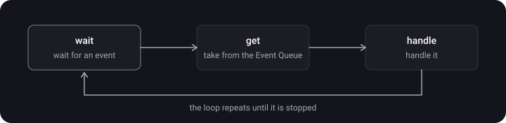
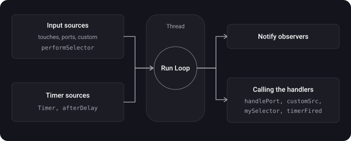
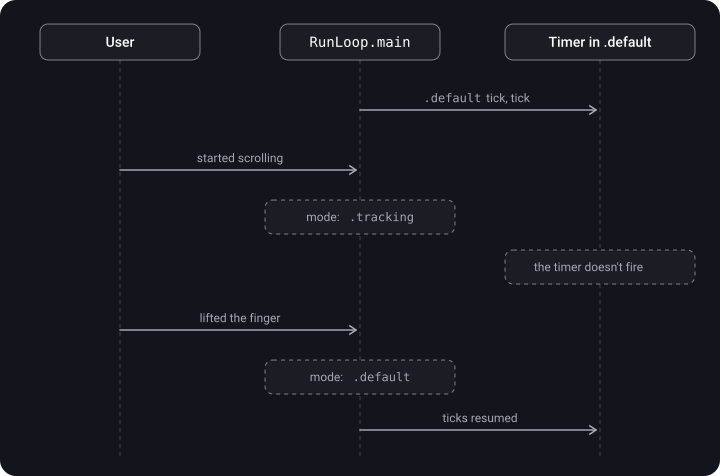

> **What you'll learn**
>
> - What an Event Loop is and how RunLoop is "smarter" than one
> - Event sources: input sources and timer sources
> - Modes: default, tracking, common — and why a timer freezes during scrolling
> - RunLoop and threads: a timer on your own thread
> - The RunLoop life cycle and observers

> **Prerequisites:** [tutorial 01](../concurrency-basics/) (threads, the main thread, Thread), [tutorial 02](../gcd/) (DispatchQueue.main).

## Analogy: the waiter on duty

A waiter (a thread) doesn't run around the dining room endlessly — he **sits and dozes** while nothing is happening. A guest's bell rings (an input source) or the alarm "bring the check in 10 minutes" goes off (a timer source) — he wakes up, serves, and sits down again. This cycle "wait → wake up → serve → fall asleep" is the RunLoop.

**Modes** are like a sign on the door: in "banquet" mode (tracking — the user is scrolling) the waiter reacts only to the banquet's guests and ignores ordinary alarms — unless an alarm is marked "for all modes" (common).

## Step 1. The Event Loop pattern

RunLoop is based on the **Event Loop** pattern:

1. **wait** — wait for an event;
2. **get** — take it from the event queue (Event Queue);
3. **handle** — handle it.

The loop keeps spinning until it is explicitly stopped (by us or by iOS). In simplified form:

```swift
while running {
    let event = waitForNextEvent()   // the thread sleeps while there are no events
    handle(event)
}
```



## Step 2. RunLoop — a "smart" Event Loop

> **Run Loop** — a loop that receives and handles events on a specific thread; an infinite loop for processing and coordinating all incoming events. It is an object that manages events and messages, handles them, and provides an entry-point function for running the event's logic.

**RunLoop's job** is to keep the thread busy when there is work and put it to sleep the rest of the time so as not to waste resources. In essence it does two things: waits for something to happen, and sends a message to the recipient.

RunLoop lets you:

- accept input without interrupting the program;
- decide when to handle events;
- separate calls into categories and modes;
- save CPU time (and battery).

**How RunLoop is smarter than a plain Event Loop:** it splits events into **categories** (sources) and **modes**, knows how to sleep and wake up properly, and notifies observers about its stages.

## Step 3. Event sources

Two types of sources (run loop sources):

- **Input Sources** — external events: touches, swipes, the keyboard, the mouse, ports (Mach ports), custom sources for passing data. Calls to `perform(_:on:with:waitUntilDone:)` / `performSelector` also work through the RunLoop.
- **Timer Sources** — delayed actions: `Timer` (NSTimer), `perform(_:with:afterDelay:)`. Timers work on top of the RunLoop.

Plus **observers** — subscribers to the loop's stages (step 8).



`DispatchQueue.main.async` tasks also run within `RunLoop.main`: the GCD main queue is attached to the main RunLoop as a source and is served on every iteration. That is exactly why asynchronous code on the main thread doesn't block the interface.

## Step 4. One iteration of the loop

After entering the RunLoop, the thread stays in a cycle of **receiving a message → waiting → handling → sleeping until the next message → receiving a message**, until the loop ends (for example, a stop message arrives or a timeout expires).

In more detail, with observer notifications:


## Step 5. Modes (RunLoop Modes)

A mode is a "filter setting": which sources and timers the RunLoop serves in the current iteration. A source added to one mode simply can't be heard in another mode.

| Mode | When it is active | What it handles |
| --- | --- | --- |
| `.default` | The main one, automatic at launch when the user isn't touching anything | Timers, performSelector, afterDelay and most input sources |
| `.tracking` | The user is interacting with the screen: scrolling a UIScrollView / UICollectionView, tracking a gesture | UI events. Timers from `.default` **don't fire** |
| `.common` | Not a mode of its own but a **group**: `.default` • `.tracking` (and others marked as common) | A source added to `.common` works both at rest and during scrolling |

**The classic problem:** a countdown timer in a cell freezes while the user scrolls the list. When the interaction begins, the RunLoop switches from `.default` to `.tracking`, and `Timer.scheduledTimer` adds the timer only to `.default`.



**The solution** is to add the timer to `.common`:

```swift
// On the main thread: scheduledTimer + add to .common
let timer = Timer.scheduledTimer(withTimeInterval: 3.0, repeats: true) { timer in
    print("Timer fired")
}
RunLoop.main.add(timer, forMode: .common)

// Or create it without auto-adding and add it straight to .common
let timer2 = Timer(timeInterval: 3.0, repeats: true) { _ in print("tick") }
RunLoop.main.add(timer2, forMode: .common)
```

## Step 6. RunLoop and threads

- Every thread **may have** its own associated RunLoop, but **by default it isn't running** (it is created lazily on the first access to `RunLoop.current`).
- For the **main thread**, the RunLoop is created and started by `UIApplication` automatically — this is `RunLoop.main`.
- For threads you create, you have to **start and configure the RunLoop yourself**.
- Without a RunLoop, a thread just runs its block, finishes, and is reclaimed by the system.

**A timer on your own thread** — you have to start `RunLoop.current.run()` manually:

```swift
let thread = Thread {
    let runLoop = RunLoop.current
    let timer = Timer(timeInterval: 3.0, repeats: true) { timer in
        print("Timer fired")
    }
    runLoop.add(timer, forMode: .common)
    runLoop.run()              // without this the thread ends and the timer won't fire
}
thread.start()
```

**Why not `scheduledTimer` on custom threads:** `scheduledTimer` is automatically added to the `.default` mode of the current RunLoop but **doesn't start** it. On a custom thread such a timer may not fire at all. It is better to create a `Timer(timeInterval:repeats:)` and explicitly add it to the mode you need.


## Step 7. The RunLoop life cycle

- `RunLoop.main` **is not destroyed** until the app closes.
- If there are no tasks, the RunLoop puts the thread to **sleep** (reducing CPU load) and **wakes up** on a new event.
- Custom threads and their RunLoops are freed when all the tasks in the Thread block have finished. Meanwhile `run()` with no sources returns immediately, and with sources it keeps spinning until they are removed (or `run(until:)` expires).


## Step 8. Observers

With `CFRunLoopObserver` you can subscribe to the loop's stages:

| Activity | When |
| --- | --- |
| `entry` | Entering the RunLoop |
| `beforeTimers` | Before processing timers |
| `beforeSources` | Before processing Input Sources |
| `beforeWaiting` | Before sleeping |
| `afterWaiting` | After waking up |
| `exit` (supplemented) | Exiting the RunLoop |

Useful for performance tracking and logging. For example, if more than 16 ms passed between `afterWaiting` and the next `beforeWaiting`, the main thread did too much work — and a frame was dropped (many freeze detectors work this way).

```swift
let observer = CFRunLoopObserverCreateWithHandler(
    nil,
    CFRunLoopActivity.beforeWaiting.rawValue,   // which stage we subscribe to
    true,                                        // repeats
    0                                            // order
) { _, activity in
    print("RunLoop is about to fall asleep...")
}
CFRunLoopAddObserver(CFRunLoopGetMain(), observer, .commonModes)
```

## Step 9. Timers are not precise

A timer fires not at the exact time but when the RunLoop gets around to processing timers. The notes mention the problem of timers "firing at the wrong time": if a timer is added while the current iteration is already running, it will be processed only on the next one. In addition: if the main thread is busy with a long task, all timers wait; missed firings of a repeating timer don't accumulate; the system may shift a firing within `tolerance` to save energy. For animations use `CADisplayLink`, for background timers — `DispatchSourceTimer`.

## Summary

- All `DispatchQueue.main.async` tasks run within `RunLoop.main`.
- Thanks to the RunLoop, asynchronous code on the main thread doesn't block the interface.
- Use `.common` so the timer doesn't stop during UI interaction.
- On your own threads, the RunLoop has to be started manually.

## Common mistakes

- `Timer.scheduledTimer` on main without `.common` → the timer freezes while scrolling.
- `Timer.scheduledTimer` inside `DispatchQueue.global().async` or a custom `Thread` without `run()` → the timer never fires (GCD threads have no running RunLoop).
- `RunLoop.current.run()` with no exit condition on a GCD pool thread → the pool thread is busy forever.
- Forgetting `invalidate()` — `Timer` strongly holds the target/closure, the RunLoop holds the timer → a leak and an "eternal" timer.
- Long work on main → the RunLoop doesn't get to timers and rendering → freezes.

## Cheat sheet

```swift
// The loop: wait → get → handle → sleep → …
// Sources: Input (touches, ports, performSelector) + Timer (Timer, afterDelay)
// Modes: .default | .tracking (scrolling) | .common = default + tracking

RunLoop.main            // main's is started automatically
RunLoop.current         // on your own thread — created lazily, NOT started

// A timer that doesn't freeze while scrolling
let t = Timer(timeInterval: 1, repeats: true) { _ in }
RunLoop.main.add(t, forMode: .common)

// A timer on your own thread
Thread { RunLoop.current.add(t, forMode: .common); RunLoop.current.run() }.start()

// Observer
CFRunLoopAddObserver(CFRunLoopGetMain(), observer, .commonModes)
// stages: entry, beforeTimers, beforeSources, beforeWaiting, afterWaiting, exit
```

## Self-check questions

<details>
<summary>1. What is a RunLoop and what is it for?</summary>

A loop that receives and handles events on a specific thread. It listens to input and timer sources, puts the thread to sleep when there is no work, and wakes it when work appears. Without it, a thread would run its code and finish.

</details>

<details>
<summary>2. How does a RunLoop differ from a plain Event Loop?</summary>

It splits events into categories (input sources, timer sources) and modes, serves only the sources of the current mode, knows how to sleep and wake up, and notifies observers about its stages.

</details>

<details>
<summary>3. Why does a timer stop while scrolling and how do you fix it?</summary>

`scheduledTimer` is added to the `.default` mode. During scrolling the RunLoop switches to `.tracking`, where this timer isn't served. The fix: `RunLoop.main.add(timer, forMode: .common)`.

</details>

<details>
<summary>4. Does every thread have a RunLoop?</summary>

Every thread may have its own RunLoop, but it is created lazily and isn't running. Only the main thread's RunLoop is started automatically (UIApplication starts it).

</details>

<details>
<summary>5. How do you make a timer on your own thread?</summary>

Create a `Timer(timeInterval:repeats:)`, add it to `RunLoop.current` in the needed mode (usually `.common`) and call `RunLoop.current.run()`. Or use a `DispatchSourceTimer`, which doesn't need a RunLoop.

</details>

<details>
<summary>6. What is the .common mode?</summary>

Not a mode of its own but a group of "common" modes (by default `.default` and `.tracking`). A source added to `.common` is served in all the modes of the group.

</details>

<details>
<summary>7. How are DispatchQueue.main and RunLoop.main related?</summary>

`DispatchQueue.main.async` tasks run within `RunLoop.main` iterations: the main queue wakes the main RunLoop and is served by it. So asynchronous code on main doesn't block the UI, but a long task in it will delay everything else.

</details>

<details>
<summary>8. What are RunLoop observers for?</summary>

To subscribe to the loop's stages (entry, beforeTimers, beforeSources, beforeWaiting, afterWaiting, exit) — for logging, measuring performance, detecting freezes, doing work "before sleep".

</details>

## Sources

- [iOS Run Loop: What? When? Why?](https://habr.com/ru/companies/otus/articles/590319/) (in Russian)
- [RunLoop on the main thread — Anton Sergeev](https://www.youtube.com/watch?v=wA_392H7JeU) (video, in Russian)
- [Ruslan Prokofiev on NSRunLoop, CocoaHeads Moscow](https://www.youtube.com/watch?v=GfpZ1fBHvxg) (video, in Russian)
- [Hard iOS questions and simple answers to them — Mad Brains Techno](https://youtu.be/pWXgH-GbRSU?t=555) (video, in Russian)
- [Spinning the Runloop. How the VKontakte feed is built — Alexander Terentyev](https://www.youtube.com/watch?v=fXCfvYZIrrE) (video, in Russian)
