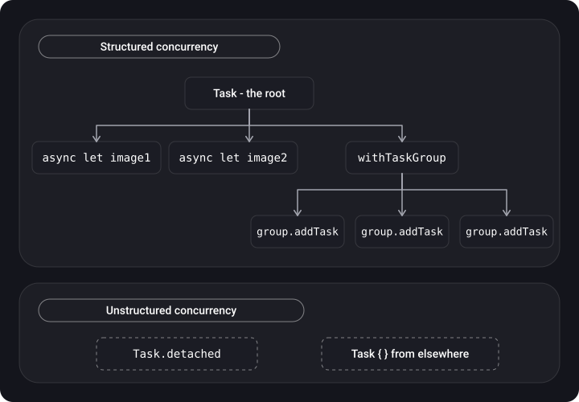
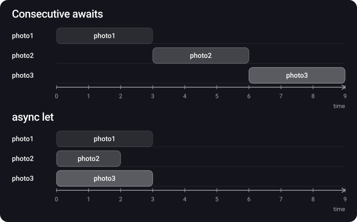
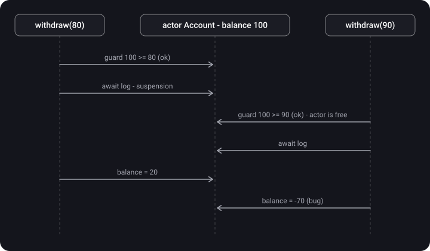

> **What you'll learn**
>
> - Why Swift Concurrency appeared and which GCD problems it solves
> - async/await, suspension points, continuations and the cooperative thread pool
> - Task, priorities, Task.detached, structured and unstructured concurrency
> - Parallelism: async let and TaskGroup
> - Cancellation, asynchronous properties, continuations for old code
> - Actors, @MainActor and actor reentrancy

> **Prerequisites:** tutorials [01](../concurrency-basics/)–[04](../thread-safety-synchronization/). Especially important: the main thread, callbacks in GCD, thread explosion, deadlock, data race.

## Analogy: the cook doesn't stand over the pot

In GCD with `sync`/locks, the cook puts water on the fire and **stands next to it** until it boils — and the kitchen has to hire more cooks (thread explosion). In Swift Concurrency the cook says "**await** boiling", sticks a note on the pot with where he stopped (a **continuation**), and goes to make another dish. When the water boils, **any free cook** finishes the recipe after reading the note. There are exactly as many cooks as burners (cores), and nobody sits idle.

**Actor** — a separate workshop with its own fridge: orders are passed in through a window, and inside only one person works at a time.

## Step 1. Why Swift Concurrency

**Swift Concurrency** is an Apple technology introduced in Swift 5.5. It lets you write multithreaded code with better performance and fewer bugs:

- **async/await syntax** — asynchronous code looks and reads like synchronous code while staying non-blocking.
- **Error handling** — ordinary `throws` / `try` / `do-catch` instead of a `Result` in every callback.
- **A new model** abstracts away threads and queues: instead of DispatchQueue there are the **Task** and **Actor** primitives, and threads are managed by the **Cooperative Thread Pool**.

**The GCD problems that SC solves** fall into two groups.

**1) Readability.** The pyramid of doom — deeply nested callbacks:

```swift
func fetchUserData(for id: String, completion: @escaping ((User) -> Void)) {
    loadUserDataFromNetwork(for: id) { user in
        saveToCoreData(user: user) { savedUser in
            completion(savedUser)
        }
    }
}
```

With error handling it gets even worse — and it is easy to forget to call `completion` in one of the branches:

```swift
func fetchUserDataWithError(for id: String, completion: @escaping ((Result<User, Error>) -> Void)) {
    loadUserFromNetworkWithError(for: id) { result in
        do {
            saveUserToCoreDataWithError(data: try result.get()) { savedResult in
                guard let savedUser = try? savedResult.get() else { return }   // ← completion isn't called!
                completion(.success(savedUser))
            }
        } catch {
            // completion(.failure(error))  ← easy to forget
        }
    }
}
```

**2) Technical problems:** thread explosion, deadlock (`DispatchQueue.main.sync` in `viewDidLoad`), race condition (two `async` calls on a concurrent queue doing `array.append`). They are all covered in detail in [tutorial 03](../concurrency-problems/). In SC you can create them too, but the tool makes it much harder to let them in.

**How async/await is better than GCD (in brief):** no callback hell, no thread explosion, better structure, compiler checks.

## Step 2. async and await

- **async** — a function attribute: "I do asynchronous work and may suspend".
- **await** — a keyword when calling an async function: "here we may suspend and wait for the result or an error". They always come as a pair: "Await waits for a callback from its buddy async".

**Before (a callback):**

```swift
enum DownloadError: Error {
    case badImage
    case unknown
}

typealias Completion = (Result<Response, DownloadError>) -> Void

func saveChanges(completion: Completion) {
    Thread.sleep(forTimeInterval: 2)                 // simulate a complex task
    let randomNumber = Int.random(in: 0..<2)
    if randomNumber == 0 {
        completion(.failure(.unknown))
        return
    }
    completion(.success(Response(id: 100)))
}

saveChanges { result in
    switch result {
    case .success(let response): print(response)
    case .failure(let error):    print(error)
    }
}
```

**After (async/await):**

1. Mark the function `async` (after the parameter list).
2. If the function throws an error, put `throws` right after `async`.
3. Call it from synchronous code via `Task`.

```swift
func saveChanges() async throws -> Response {
    try await Task.sleep(for: .seconds(2))           // doesn't block the thread (see the note)
    if Int.random(in: 0..<2) == 0 {
        throw DownloadError.unknown
    }
    return Response(id: 100)
}

func someSyncFunction() {
    Task(priority: .medium) {
        do {
            let result = try await saveChanges()
            print(result.id)
        } catch let error as DownloadError {
            // Handle Download Error
        } catch {
            // Handle some other type of error
        }
    }
}
```

**A comparison from a slide — loading photos:**

**Swift Concurrency**

```swift
func loadPhotos() async throws -> [Photo] {
    let (data, _) = try await URLSession.shared.data(from: url)
    return try JSONDecoder().decode([Photo].self, from: data)
}

// the call
let photos = try await loadPhotos()
show(photos)
```

**GCD**

```swift
func loadPhotos(completion: @escaping (Result<[Photo], Error>) -> Void) {
    URLSession.shared.dataTask(with: url) { data, response, error in
        guard let data = data,
              let photos = try? JSONDecoder().decode([Photo].self, from: data) else {
            completion(.failure(ServiceError.loadingError))
            return
        }
        completion(.success(photos))
    }.resume()
}

// the call
loadPhotos { [weak self] result in
    if case let .success(photos) = result {
        DispatchQueue.main.async { self?.show(photos) }
    }
}
```

## Step 3. What happens at an await: suspension and the continuation

Every `await` is a **suspension point**. At that moment the function may give up the thread, and the thread is **not blocked** but keeps doing other work.

- A **continuation** is a lightweight object that stores the state of the suspended function ("where we stopped and what was in the local variables"). It is created for every running task.
- Switching between continuations is a function call, not a thread context switch; that is why it is cheap.
- After an `await`, execution **may continue on a different thread** (if the code isn't bound to an actor, for example `@MainActor`).


## Step 4. Cooperative thread pool

> **Cooperative thread pool** — the Swift Concurrency thread pool. A fixed number of threads (proportional to the number of cores) is created in the system right away, and tasks are distributed across them.

- For tasks of the same priority the number of threads **can't exceed the number of cores** → thread explosion is impossible.
- The **main thread is not part of the pool.**
- In the **simulator** the pool is artificially limited — to study its behavior you need a real device.
- The pool is "cooperative": it counts on tasks **not blocking** threads but voluntarily yielding them at an `await`.


> Inside async code you **must not** use blocking primitives: `semaphore.wait()`, `group.wait()`, `Thread.sleep`, long locks, `DispatchQueue.sync` for long work. There are few threads in the pool, and one blocked thread is a noticeable share of the total performance; in the worst case — a deadlock.

## Step 5. Task

> **Task** — an asynchronous task, a new asynchronous context for running code. It is through Task that we get from synchronous code (a button handler, `viewDidLoad`) into asynchronous code.

```swift
// Create a task and wait for its result
let task = Task(priority: .background) {
    await store.save(value)
}
await task.value

// A detached task and its cancellation
let detachedTask = Task.detached(priority: .background) {
    await self.store.save(value)
}
detachedTask.cancel()
```

**Parallel independent tasks** — just several Tasks:

```swift
Task(priority: .medium) { let result1 = await asyncFunction1() }
Task(priority: .medium) { let result2 = await asyncFunction2() }
Task(priority: .medium) { let result3 = await asyncFunction3() }
```

**Priorities (`TaskPriority`):** `high`, `medium`, `low`, `userInitiated`, `utility`, `background`.

How they map to QoS: `high` = `userInitiated`, `medium` ≈ `default`, `low` = `utility`, `background` = `background`. A Task created without a priority inherits the priority (and the actor) of the current context.

### Structured and unstructured concurrency

- **Structured Concurrency** — there is a **hierarchy** of tasks: child tasks (`async let`, `TaskGroup`) live no longer than the parent and inherit its priority and cancellation. The parent won't finish until its children finish.
- **Unstructured** — tasks are separate, not tied to a parent: `Task { }` (inherits the context but lives on its own) and `Task.detached { }` (inherits nothing).



**Detached Tasks** are an example of unstructured tasks with maximum flexibility. Their lifetime isn't tied to the original scope, and the priority is set explicitly. An example: we downloaded an image and returned it to the caller, while saving it to the cache continues in the background in a completely different context:

```swift
Task(priority: .userInitiated) {
    let networkOperation = NetworkOperation()
    print("About to download image")
    let image = try await networkOperation.downloadImage(with: 1)
    print("Image downloaded")

    print("Starting detached task in the background")
    Task.detached(priority: .background) {
        // Locally store the downloaded image in the cache
    }

    print("Image size is")
    print(image.size)
}
```

## Step 6. async let — in parallel and with a result

`await` waits for the work to finish so we can read the result, while `async let` **doesn't wait**: it starts the work and moves on. You can wait later via `await`, when the value is really needed.

**Sequentially** (3 s + 3 s + 3 s)

```swift
let firstPhoto = await downloadPhoto(named: "photo1")
let secondPhoto = await downloadPhoto(named: "photo2")
let thirdPhoto = await downloadPhoto(named: "photo3")
let photos = [firstPhoto, secondPhoto, thirdPhoto]
show(photos)
```

**In parallel** (the max of the three)

```swift
async let firstPhoto = downloadPhoto(named: "photo1")
async let secondPhoto = downloadPhoto(named: "photo2")
async let thirdPhoto = downloadPhoto(named: "photo3")
let photos = await [firstPhoto, secondPhoto, thirdPhoto]
show(photos)
```



The time of the parallel version equals the time of the **longest** task. An example from notes — loading 3 images by id:

```swift
func downloadImageWithImageId(imageId: Int) async throws -> UIImage {
    let imageUrl = URL(string: "https://imageserver.com/\(imageId)")!
    let imageRequest = URLRequest(url: imageUrl)
    let (data, response) = try await URLSession.shared.data(for: imageRequest)

    if let httpResponse = response as? HTTPURLResponse, httpResponse.statusCode != 200 {
        throw DownloadError.invalidStatusCode
    }
    guard let image = UIImage(data: data) else {
        throw DownloadError.badImage
    }
    return image
}

Task(priority: .medium) {
    do {
        async let image_1 = try downloadImageWithImageId(imageId: 1)   // started and moved on
        async let image_2 = try downloadImageWithImageId(imageId: 2)
        async let image_3 = try downloadImageWithImageId(imageId: 3)

        let images = try await [image_1, image_2, image_3]            // waited for all at once
        // Display images
    } catch {
        // Handle Error
    }
}
```

## Step 7. TaskGroup — a dynamic number of parallel tasks

`async let` is convenient when the number of tasks is known when you write the code. If there are N tasks and N is known only at run time — use a **Task Group** (a group of tasks running in parallel):

```swift
let calculatedValues = await withTaskGroup(of: Int.self) { group in
    for _ in 0..<numberOfValues {
        group.addTask {
            return await self.calculator.calculateValue()
        }
    }

    var result = [Int]()
    for await value in group {        // results arrive in order of COMPLETION
        result.append(value)
    }
    return result
}
```

|  | async let | TaskGroup |
| --- | --- | --- |
| Number of tasks | Fixed in the code | Dynamic (a loop) |
| Result types | Can differ | A single type, `of:` |
| Result order | As declared | As they complete |
| Cancelling the rest | On an error / leaving the scope | `group.cancelAll()`, or automatically on a throw in a throwing group |
| GCD analog | — | DispatchGroup, but with results and cancellation |

## Step 8. Cancellation

When there is no longer any point in continuing a task, it can be cancelled — and **all its child tasks will be cancelled too**. Cancellation is cooperative: it only sets a flag, and the code has to check it itself (system APIs like `URLSession` and `Task.sleep` do this on their own).

```swift
final class ImageViewModel {
    private var task: Task<Void, Never>?

    func load() {
        task = Task(priority: .background) {
            let networkService = NetworkOperation()
            let image = try? await networkService.downloadImage(with: 1)
            // ...
        }
    }

    deinit {
        task?.cancel()          // cancel when the object is destroyed
    }
}

// Checking for cancellation inside long work
func processAll(_ items: [Item]) async throws {
    for item in items {
        try Task.checkCancellation()          // throws CancellationError
        // or: if Task.isCancelled { return }
        await process(item)
    }
}
```

## Step 9. Asynchronous properties

Not only methods but also **read-only properties** (computed, `get` only) can be asynchronous. If the property can throw an error, add `throws` after `async` and call it with `try await`.

```swift
extension UIImage {
    var processedImage: UIImage {
        get async throws {
            let processId = 100
            return try await self.getProcessedImage(id: processId)
        }
    }

    func getProcessedImage(id: Int) async throws -> UIImage {
        // Heavy Operation; throw an error if operation encounters exception
        return self
    }
}

let originalImage = UIImage(named: "Flower")
let processedImage = try await originalImage?.processedImage
```

## Step 10. Continuations — a bridge between callbacks and async

To convert old callback-based code to async, use:

- `withCheckedContinuation` / `withCheckedThrowingContinuation` — with run-time checks;
- `withUnsafeContinuation` / `withUnsafeThrowingContinuation` — without checks, slightly faster.

**The main rule: `resume` must be called exactly once.** Never — and the task hangs forever (the checked version prints a warning to the console). Twice — a crash (checked) or undefined behavior (unsafe).

```swift
func getMessages() async -> [Message] {
    await withCheckedContinuation { continuation in
        service.fetchMessages { messages in
            continuation.resume(returning: messages)
        }
    }
}

// With errors
func loadUser(id: String) async throws -> User {
    try await withCheckedThrowingContinuation { continuation in
        api.loadUser(id: id) { result in
            continuation.resume(with: result)      // Result<User, Error> → returns the value or throws
        }
    }
}
```

## Step 11. Actors

> **Actor** — a reference type that protects its state: only one task works with it at any moment (actor isolation). The compiler forbids accessing its properties and methods from outside without `await`, and thus **rules out data races at compile time**.

```swift
actor ImageCache {
    private var storage: [URL: UIImage] = [:]

    func image(for url: URL) -> UIImage? {        // inside — ordinary synchronous code
        storage[url]
    }

    func insert(_ image: UIImage, for url: URL) {
        storage[url] = image
    }

    nonisolated let name = "cache"                  // immutable — can be read without await
}

let cache = ImageCache()
await cache.insert(image, for: url)                 // from outside — only via await
let cached = await cache.image(for: url)
```

**@MainActor** is the global actor of the main thread. Code marked with it always runs on main — a replacement for `DispatchQueue.main.async`:

```swift
@MainActor
final class PhotosViewModel: ObservableObject {
    @Published var photos: [Photo] = []

    func load() async {
        do {
            photos = try await service.loadPhotos()   // networking — in the background, the assignment — on main
        } catch { }
    }
}

// Selectively:
await MainActor.run { label.text = "Done" }
```

**Actor reentrancy.** At every `await` inside an actor, its method suspends, and another call can "enter" the actor. This prevents deadlocks but can produce a **race condition**:

```swift
actor Account {
    var balance = 0

    func withdraw(amount: Int) async throws {
        guard balance >= amount else { throw AccountError.noMoney }
        try await logWithdrawing(amount)    // ← here another withdraw can pass the same guard
        balance -= amount                   // ← and the balance goes negative
    }
}

// The fix: change the state first, then await
func withdrawFixed(amount: Int) async throws {
    guard balance >= amount else { throw AccountError.noMoney }
    balance -= amount                       // synchronous, no suspension points
    try await logWithdrawing(amount)
}
```



**Sendable** is a marker protocol for types that are safe to pass between tasks and actors (value structs, immutable classes, actors). In Swift 6 with strict concurrency checking, the compiler won't let you pass non-Sendable state between threads.

## GCD vs Swift Concurrency

| Aspect | GCD | Swift Concurrency |
| --- | --- | --- |
| Unit of work | A closure / DispatchWorkItem on a queue | Task, an async function |
| Threads | The pool can grow (thread explosion) | A cooperative pool ≈ the number of cores |
| Waiting | Blocks the thread (sync, wait) | Suspends the task, the thread is free |
| Errors | `Result` in a callback | `throws` / `try` / `catch` |
| Cancellation | Manual, one WorkItem at a time | Hierarchical: cancelling the parent cancels the children |
| Data protection | Queues, locks — up to the developer | Actor + Sendable, compiler checks |
| Returning to the UI | `DispatchQueue.main.async` | `@MainActor`, `MainActor.run` |
| A group of tasks | DispatchGroup | async let, TaskGroup |

> Concurrency problems (deadlock, livelock, priority inversion, race condition) are possible with async/await too. The tool lowers their likelihood but doesn't remove the need to think about order and state.

## Common mistakes

- `Thread.sleep`, `semaphore.wait()`, `group.wait()` inside async code — blocking the cooperative pool.
- Thinking that after an `await` we stayed on the same thread (without `@MainActor` this isn't guaranteed).
- Updating the UI from `Task.detached` or from code without `@MainActor`.
- Using `Task.detached` "just in case" — the priority, the actor and automatic cancellation are lost.
- Forgetting to call `resume` in one of the continuation's branches, or calling it twice.
- Not keeping a reference to a Task and not cancelling it when leaving the screen (in SwiftUI `.task { }` is handy — it is cancelled by itself).
- Checking a condition in an actor before an `await` and relying on it after (reentrancy).
- Writing sequential `await`s where the tasks are independent and could go through `async let`.

## Cheat sheet

```swift
func load() async throws -> Data                  // declaration
let data = try await load()                       // the call (a suspension point)

Task { await work() }                             // from sync code, inherits the context
Task.detached(priority: .background) { }          // no inheritance
let t = Task { try await load() }; t.cancel(); let v = try await t.value

async let a = f(); async let b = g()              // in parallel, N is known
let (x, y) = try await (a, b)

await withTaskGroup(of: T.self) { group in        // in parallel, N is dynamic
    group.addTask { }; for await v in group { }
}

try Task.checkCancellation(); if Task.isCancelled { }

var value: T { get async throws { } }             // an asynchronous property

await withCheckedContinuation { c in api { c.resume(returning: $0) } }   // resume EXACTLY once

actor Store { }                 @MainActor class VM { }      await MainActor.run { }
```

## Self-check questions

<details>
<summary>1. What is Swift Concurrency for?</summary>

Structured concurrency makes asynchronous code easier to read, trace and understand (since Swift 5.5). Plus technical gains: a cooperative pool without thread explosion, hierarchical cancellation, actors and compiler checks against data races.

</details>

<details>
<summary>2. What is async/await?</summary>

`async` marks a function that can suspend. `await` lets you wait for the result (or error) of an asynchronous function and pass it on without blocking the thread. This way the code better reflects the intent and the order of execution.

</details>

<details>
<summary>3. What problems does async/await solve and how is it better than GCD?</summary>

It makes asynchronous code readable — it looks synchronous while staying non-blocking. Compared to GCD: no callback hell, no thread explosion, better structure and error handling.

</details>

<details>
<summary>4. What is a Task?</summary>

A new asynchronous context for running code. You wrap asynchronous work in a Task to start it from synchronous code or to run several tasks at once. A task has a priority, a result (`value`) and cancellation.

</details>

<details>
<summary>5. What is async let and how does it differ from await?</summary>

`await` waits for the work to finish right now. `async let` starts a child task and lets you move on; the result is picked up later via `await`. Use `await` when the value is needed immediately, and `async let` for independent tasks that can run in parallel.

</details>

<details>
<summary>6. What priorities does a Task have?</summary>

`high`, `medium`, `low`, `userInitiated`, `utility`, `background`. `high` matches `userInitiated`, `low` matches `utility`.

</details>

<details>
<summary>7. How does Task differ from Task.detached?</summary>

`Task { }` inherits the context: the actor (for example @MainActor), the priority, task-local values. `Task.detached` is completely independent and inherits nothing. Both are unstructured (they aren't cancelled automatically with the parent).

</details>

<details>
<summary>8. What is the cooperative thread pool and why can't you block threads in it?</summary>

The Swift Concurrency thread pool with no more threads than cores (main is not part of it). Tasks must yield the thread at an `await`. If you block a thread (sleep, semaphore), no new one will be created — performance drops, and a deadlock is possible.

</details>

<details>
<summary>9. How do you turn a function with a callback into an async one, and what is the main rule?</summary>

Via `withCheckedContinuation` / `withCheckedThrowingContinuation` (or the unsafe variants). `resume` must be called exactly once in every branch.

</details>

<details>
<summary>10. How do you cancel asynchronous operations?</summary>

Keep a reference to the Task and call `cancel()` (for example, in `deinit`) — all child tasks are cancelled too. Inside long work, check `Task.isCancelled` or call `try Task.checkCancellation()`.

</details>

<details>
<summary>11. Does an actor protect against all state problems?</summary>

Against data races — yes. Against race conditions — no: because of reentrancy, at every `await` another call can change the actor's state. Change state before `await` and re-check conditions after it.

</details>

## Sources

- [Fucking Approachable Swift Concurrency](https://fuckingapproachableswiftconcurrency.com/ru/) (in Russian)
- [async/await in Swift with examples](https://sparrowcode.io/ru/tutorials/async-await) (in Russian)
- [What is Structured Concurrency?](https://www.avanderlee.com/swift/what-is-structured-concurrency/)
- [Structured Concurrency (VK)](https://vk.com/@studyswift-async-await-ili-structured-concurrency) (in Russian)
- [Introduction — Structured Concurrency is not magic](https://proekt-swiftui.github.io/sc-book/) (in Russian)
- [Swift async/await. How is it better than GCD?](https://habr.com/ru/articles/727788/) (in Russian)
- [Swift async/await by example](https://habr.com/ru/articles/728732/) (in Russian)
- [Task and structured concurrency in Swift](https://habr.com/ru/articles/762148/) (in Russian)
- [Swift TaskGroup by example](https://habr.com/ru/articles/792444/) (in Russian)
- [Swift concurrency. Executors, Actors and their relation to threads](https://habr.com/ru/articles/887240/) (in Russian)
- [Async / Await in Swift](https://habr.com/ru/articles/746892/) (in Russian)
- [Swift Concurrency Instrument: how it helps an iOS developer](https://habr.com/ru/companies/surfstudio/articles/737578/) (in Russian)
- [async let vs Task group](https://habr.com/ru/companies/otus/articles/928172/) (in Russian)
- [Taming asynchronous code with async/await](https://habr.com/ru/companies/hh/articles/904506/) (in Russian)
- [Behind the scenes of async functions](https://vbat.dev/behind-the-scenes-of-async-functions)
- [Task.sleep() vs. Task.yield(): The differences explained](https://www.avanderlee.com/concurrency/task-sleep-vs-yield-differences/)
- Videos (in Russian): [Inside Swift Concurrency — Alexander Andryukhin](https://www.youtube.com/watch?v=RlBkXywtGww&ab_channel=Podlodka%D0%A1rew), [From GCD to Modern Swift Concurrency — Anna Zharkova](https://www.youtube.com/watch?v=7xACoHojvXA&list=PLNSmyatBJig4EAjHqJ7TvqEngaGJ3Lflk&index=2&pp=iAQB), [Ilya Chikmarev — async/await in Swift](https://www.youtube.com/watch?v=F02-k1X_Rok), [Kirill Volodin — Oh brave new world with Swift Concurrency](https://www.youtube.com/watch?v=A-GQB8wVK78), [Structured Concurrency. Best Practice](https://www.youtube.com/watch?v=WyVK0DFgZDw), [Vasily Usov — Do we even need Swift Modern Concurrency?](https://www.youtube.com/watch?v=DIDoHx6KP50&pp=2AYP), [Grand Central Dispatch and Structured Concurrency](https://www.youtube.com/watch?v=5AKHv9QZnp8), [Andrey Antropov — What's new in asynchrony in Swift 5.5](https://www.youtube.com/watch?v=8Z93U97gsvA&list=PLw6SJ6q6-1YowmlGVks5a088XrSbihJu-&index=6)
