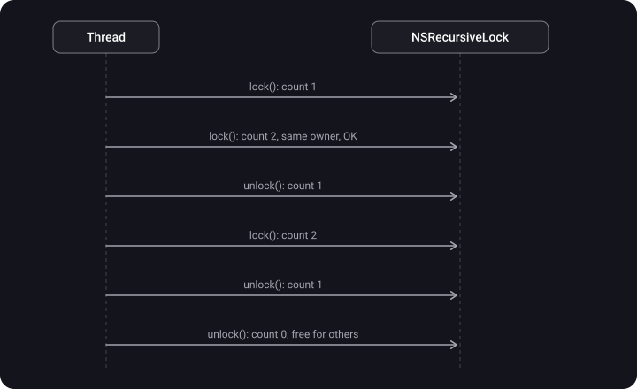
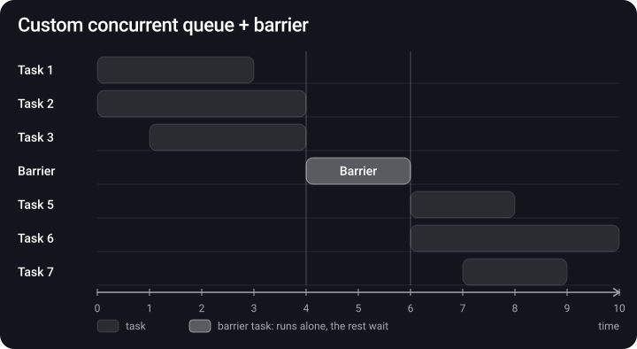
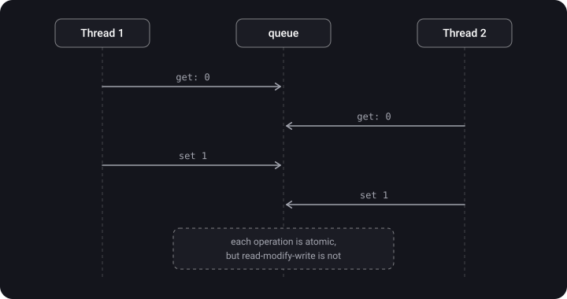

> **What you'll learn**
>
> - What thread safety and a critical section are
> - The tools: serial queue, mutex (pthread, os_unfair_lock, NSLock, NSRecursiveLock), DispatchSemaphore, barrier, actor
> - How a semaphore differs from a mutex
> - What atomicity is and how to write your own atomic wrapper correctly
> - Which tool to choose in a given situation

> **Prerequisites:** tutorials [02](../gcd/) (queues, sync/async) and [03](../concurrency-problems/) (data race, race condition, deadlock).

## Analogy: one cutting board

- **Mutex / Lock** — an "occupied" sign is hung on the board. Only the one who hung it can take it down.
- **Recursive lock** — the same cook can hang the sign again without waiting for himself, but must take it down the same number of times.
- **Semaphore** — N tokens lie at the entrance. Took a token — you go in; no tokens — you wait. Anyone can return a token.
- **Serial queue** — one cook is assigned to the board, and everyone else hands him their chopping orders.
- **Barrier** — many people can **look** at the board at once, but when someone is about to **cut** on it, everyone is asked to step back.
- **Actor** — the board stands in a separate room with its own cook, orders are passed through a window, and the compiler watches over it.

## Step 1. What thread safety is

> **Thread safety** — the ability of a system to work correctly when several threads try to use it at the same time.

A **critical section** is a piece of code that works with shared state and must be executed by no more than one thread at a time. All the tools below are different ways to protect a critical section.

The original problem (from [tutorial 03](../concurrency-problems/)): `setFullName("Bruno", "Rocha")` and `setFullName("Onurb", "Ahcor")` from two threads give `"Onurb Rocha"`. Below we'll fix it in different ways.


## Step 2. Serial DispatchQueue — the simplest way

A serial queue guarantees that only one task runs at a time. So if every access to the state goes through it, there is no race.

```swift
final class Name {
    private let queue = DispatchQueue(label: "com.example.name")
    private var _firstName = ""
    private var _lastName = ""

    var fullName: String {
        queue.sync { "\(_firstName) \(_lastName)" }      // a read — sync, we need the result
    }

    func setFullName(firstName: String, lastName: String) {
        queue.async {                                   // a write — can be async
            self._firstName = firstName
            self._lastName = lastName                   // both fields — in one task
        }
    }
}
```

Pros: simple and reliable, no risk of forgetting `unlock`. Cons: slower than locks; `sync` from inside the same queue → deadlock.

## Step 3. Mutex — mutual exclusion

> **Mutex (mutual exclusion)** — a synchronization primitive that rules out simultaneous access to one resource from different threads: **only one** thread is let into the critical section. A mutex has an **owner**: only the thread that locked it can unlock it.


iOS has several implementations — from the lowest-level to the convenient one.

### 3.1. POSIX mutex (pthread_mutex_t)

The lowest-level mutex; it fits when the code must run on different OSes. The notes give an example in C:

```c
pthread_mutex_t mutex = PTHREAD_MUTEX_INITIALIZER;
pthread_mutex_lock(&mutex);
// Do Stuff
pthread_mutex_unlock(&mutex);
```

In Swift and with the recursive type (one thread can acquire it several times):

```swift
var mutex = pthread_mutex_t()
var mutexAttributes = pthread_mutexattr_t()          // the mutex attributes
pthread_mutexattr_init(&mutexAttributes)
pthread_mutexattr_settype(&mutexAttributes, PTHREAD_MUTEX_RECURSIVE)   // the recursive type
pthread_mutex_init(&mutex, &mutexAttributes)

func doSomething1() {
    pthread_mutex_lock(&mutex)
    doSomething2()                  // the same thread takes the mutex again — OK for RECURSIVE
    pthread_mutex_unlock(&mutex)
}

func doSomething2() {
    pthread_mutex_lock(&mutex)
    print("Hello World!")
    pthread_mutex_unlock(&mutex)
}
```

### 3.2. os_unfair_lock — the fastest

`os_unfair_lock` is the fastest lock on iOS. If you just need to protect a short critical section, it does so with maximum performance. "Unfair" because it doesn't guarantee the order of waiters (see starvation in [tutorial 03](../concurrency-problems/)). Important: in Swift you can't store it as a plain property — it needs a stable address in memory, so we wrap it in a class with a pointer:

```swift
final class UnfairLock {
    private var _lock: UnsafeMutablePointer<os_unfair_lock>

    init() {
        _lock = UnsafeMutablePointer<os_unfair_lock>.allocate(capacity: 1)
        _lock.initialize(to: os_unfair_lock())
    }

    deinit {
        _lock.deallocate()
    }

    func locked<ReturnValue>(_ f: () throws -> ReturnValue) rethrows -> ReturnValue {
        os_unfair_lock_lock(_lock)
        defer { os_unfair_lock_unlock(_lock) }
        return try f()
    }
}

let lock = UnfairLock()
lock.locked {
    // Critical region
}
```

Since iOS 16 there is a ready-made safe wrapper `OSAllocatedUnfairLock` (the `os` module), and since iOS 18 — `Mutex` from the `Synchronization` module:

```swift
import os
let counter = OSAllocatedUnfairLock(initialState: 0)
counter.withLock { $0 += 1 }
```

### 3.3. NSLock

`NSLock` is Foundation's implementation of a basic mutex, an object abstraction over `pthread_mutex`. Why people choose it over `os_unfair_lock`:

1. It can be used directly, without a hand-written wrapper.
2. It has extra features — for example, a **timeout** `lock(before:)`.

```swift
let lock = NSLock()

// Option 1: by hand
lock.lock()
doSomething()
lock.unlock()

// Option 2: withLock — unlock is called by itself
lock.withLock {
    doSomething()
}
```

An example:

```swift
let lock = NSLock()
private var logs: [String] = []

func lockExample() {
    lock.lock()
    logs.append("new event")     // protected access to the shared array
    lock.unlock()
}
```

A timeout is insurance against deadlock:

```swift
let nslock = NSLock()

func synchronize(action: () -> Void) {
    if nslock.lock(before: Date().addingTimeInterval(5)) {
        action()
        nslock.unlock()
    } else {
        print("Took too long to lock, did we deadlock?")
        reportPotentialDeadlock()   // non-fatal to the crash reporter
        action()                    // carry on and hope the session doesn't break
    }
}
```

> **NSLock rules:**
>
> - `unlock()` must be called **from the same thread** on which `lock()` was called. In practice this isn't always easy, especially with dependent resources and nested accesses.
> - A second `lock()` on the same thread → **deadlock**.
> - Use `defer { lock.unlock() }` or `withLock` so you don't forget to release the lock on `return` or `throw`.

Example:

```swift
var result = 0
let lock = NSLock()
let group = DispatchGroup()

for _ in 0..<1000 {
    DispatchQueue.global().async(group: group) {
        lock.lock()
        result += 1
        lock.unlock()
    }
}
group.wait()                            // wait for all the tasks
print(result)                           // 1000
```

### 3.4. NSRecursiveLock

`NSRecursiveLock` is an `NSLock` that allows **the same thread** to acquire the lock several times. It counts how many times it was acquired, and it must be released the same number of times before another thread can get it.

```swift
let recursiveLock = NSRecursiveLock()

func synchronize(action: () -> Void) {
    recursiveLock.lock()
    action()
    recursiveLock.unlock()
}

func logEntered() { synchronize { print("Entered!") } }
func logExited()  { synchronize { print("Exited!") } }

func logLifecycle() {
    synchronize {
        logEntered()          // a second lock() on the same thread
        print("Running!")
        logExited()           // and one more
    }
}

logLifecycle()   // No crash! With a plain NSLock this would be a deadlock
```



There are other Foundation locks too: `NSCondition` (a lock + waiting for a condition, `wait()` / `signal()`), `NSConditionLock`.

## Step 4. DispatchSemaphore

> **Semaphore** — lets you set the **maximum number of threads** that can access a resource at the same time. If the limit is reached, it blocks the thread until a slot frees up.

- The initializer takes an integer — how many threads can work in parallel.
- `wait()` **decrements** the counter; if it drops below zero, the thread goes to sleep.
- `signal()` **increments** the counter and wakes one of the waiting threads.
- Unlike NSLock, a semaphore **can be unlocked from any thread**.
- A semaphore with the value 1 works as a mutex (a binary semaphore).

```swift
import Dispatch

let semaphore = DispatchSemaphore(value: 1)    // one slot → works as a mutex
var resourceCounter = 0                        // the shared resource

func taskOne() {
    semaphore.wait()                           // take the slot
    for _ in 1...5 {
        resourceCounter += 1
        print("Task One: \(resourceCounter)")
    }
    semaphore.signal()                         // free the slot
}

func taskTwo() {
    semaphore.wait()
    for _ in 1...5 {
        resourceCounter -= 1
        print("Task Two: \(resourceCounter)")
    }
    semaphore.signal()
}

let concurrentQueue = DispatchQueue(label: "com.exp.conQueue", attributes: .concurrent)
concurrentQueue.async { taskOne() }
concurrentQueue.async { taskTwo() }
// First all 5 lines of one task, then all 5 of the other — no interleaving
```

An interview example, "What is a semaphore/mutex?" — tasks of different lengths on a concurrent queue run one at a time:

```swift
var sleepTaskArray = [UInt32]()
sleepTaskArray.append(3)
sleepTaskArray.append(7)
sleepTaskArray.append(15)

let semaphore = DispatchSemaphore(value: 1)
let queue = DispatchQueue(label: "queue", attributes: .concurrent)

for taskItem in sleepTaskArray {
    queue.async {
        semaphore.wait()
        for i in 1...taskItem {
            sleep(1)
            print("TaskItem: \(taskItem), i: \(i)")
        }
        semaphore.signal()
    }
}
// With value: 1 — the tasks go strictly one at a time. With value: 2 — two at a time.
```

A typical practical use — no more than 3 downloads at once:

```swift
let limiter = DispatchSemaphore(value: 3)
let downloadQueue = DispatchQueue(label: "downloads", attributes: .concurrent)

for url in urls {
    downloadQueue.async {
        limiter.wait()                      // the 4th task waits until a slot frees up
        defer { limiter.signal() }
        download(url)
    }
}
```

### Semaphore vs mutex

| Parameter | Semaphore | Mutex |
| --- | --- | --- |
| Mechanism | Signaling | Locking (blocking) |
| What it is | An integer counter | A lock object |
| Operations | `wait()` / `signal()` | `lock()` / `unlock()` |
| How many threads inside | Up to N at a time | Exactly one; many threads can pass through, but not at the same time |
| Owner | No: any thread can change the value | Yes: only the one who locked it unlocks it |
| When the resource is busy | The thread waits until the counter is greater than 0 | The thread is queued and waits for the unlock |
| Kinds | Counting and binary | No subtypes (there is a recursive variation) |
| Priority donation | No — risk of priority inversion | Yes (os_unfair_lock, pthread_mutex) |

## Step 5. Dispatch Barrier — many readers, one writer

> **Dispatch Barrier** — a task synchronization mechanism in a concurrent queue. While a barrier task runs (usually a write), no other tasks in that queue run: the concurrent queue temporarily becomes serial.

How it works:

1. The queue holds back the barrier task (and everything that came after it) until all previously submitted tasks finish.
2. Then it runs the barrier task **alone**.
3. After it finishes, the queue returns to the normal concurrent mode.



**The reader-writer pattern** — reads in parallel, writes exclusively:

```swift
private let concurrentQueue = DispatchQueue(label: "com.app.name", attributes: .concurrent)
private var _name: String = ""

var name: String {
    get {
        concurrentQueue.sync { _name }                     // many reads at once
    }
    set {
        concurrentQueue.async(flags: .barrier) {           // a write — alone
            self._name = newValue
        }
    }
}
```

An example with output:

```swift
private let concurrentQueue = DispatchQueue(label: "com.gcd.dispatchBarrier", attributes: .concurrent)

for value in 1...5 {
    concurrentQueue.async { print("async \(value)") }
}
for value in 6...10 {
    concurrentQueue.async(flags: .barrier) { print("barrier \(value)") }
}
for value in 11...15 {
    concurrentQueue.async { print("sync \(value)") }
}
// async 1…5   — among themselves in any order
// barrier 6, 7, 8, 9, 10 — strictly one at a time and in order
// sync 11…15  — only after all the barriers, among themselves in any order
```

## Step 6. Actor

Swift Concurrency introduces the concept of an actor, which encapsulates data and behavior. Only one task at a time gets access to its properties and methods — and this is checked by the **compiler**.

```swift
actor Counter {
    private var value = 0

    func increment() {
        value += 1               // inside the actor — safe
    }
}

let counter = Counter()
await counter.increment()        // from outside — only via await
```

In detail (reentrancy, `@MainActor`, Sendable) — in [tutorial 06](../swift-concurrency/).

## Step 7. Atomicity

> **An atomic operation** — an operation that either executes entirely or doesn't execute at all; an operation that can't be partially executed. An operation on shared memory is atomic if, for other threads, it completes in one step: no thread can see it "half done".

**A frequent interview question:** what is wrong with this atomic wrapper?

```swift
final class Atomic<Value> {
    private let queue = DispatchQueue(label: "com.test.atomic")
    private var value: Value

    init(_ value: Value) { self.value = value }

    var wrappedValue: Value {
        get { queue.sync { value } }
        set { queue.sync { value = newValue } }
    }
}
```

Separately, the getter and the setter are safe. But `atomic.wrappedValue += 1` is **two** separate trips into the queue: first `get`, then `set`. In between, another thread can do its own `get` — and the race is back.



**The solution** is a separate mutation method that does the read and the write inside **one** closure:

```swift
final class Atomic<A> {
    private let queue = DispatchQueue(label: "Atomic serial queue")
    private var _value: A

    init(_ value: A) {
        self._value = value
    }

    var value: A {
        get { return queue.sync { self._value } }
    }

    func mutate(_ transform: (inout A) -> ()) {
        queue.sync {
            transform(&self._value)          // read + modify + write — one step
        }
    }
}

let counter = Atomic(0)
counter.mutate { $0 += 1 }                   // safe
```

An example — a common protocol for any lock, with an `around` method:

```swift
private protocol Lock {
    func lock()
    func unlock()
}

extension Lock {
    /// Executes a closure returning a value while acquiring the lock.
    func around<T>(_ closure: () -> T) -> T {
        lock(); defer { unlock() }
        return closure()
    }

    /// Execute a closure while acquiring the lock.
    func around(_ closure: () -> Void) {
        lock(); defer { unlock() }
        closure()
    }
}
```

A property wrapper over NSLock:

```swift
@propertyWrapper
public struct SynchronizedLock<Value> {
    private var value: Value
    private var lock = NSLock()

    public var wrappedValue: Value {
        get { lock.synchronized { value } }
        set { lock.synchronized { value = newValue } }
    }

    public init(wrappedValue value: Value) {
        self.value = value
    }
}

private extension NSLock {
    @discardableResult
    func synchronized<T>(_ block: () -> T) -> T {
        lock()
        defer { unlock() }
        return block()
    }
}
```

> `SynchronizedLock` has **the same trap** as the first version of `Atomic`: `@SynchronizedLock var count = 0; count += 1` is get + set, and the race remains. Compound operations need a method like `mutate` / `withLock`.

## Comparing the tools

| Tool | Speed | Recursion | Owner / unlock from another thread | Notes |
| --- | --- | --- | --- | --- |
| serial DispatchQueue | Medium | No (sync inside = deadlock) | — | Simple, writes can be async |
| os_unfair_lock | Highest | No | Has an owner, only the same thread | Needs a wrapper with a pointer; unfair |
| pthread_mutex | High | Optional (RECURSIVE) | Has an owner | C API, cross-platform |
| NSLock | High | No | Has an owner | Timeout `lock(before:)`, `withLock` |
| NSRecursiveLock | A bit lower than NSLock | Yes | Has an owner | unlock as many times as lock |
| DispatchSemaphore | High | No | No owner, signal from any thread | A limit of N; risk of priority inversion |
| Barrier | High for reads | — | — | Only on a custom concurrent queue |
| actor | High | Calls inside the actor — without await | — | Checked by the compiler; reentrancy |

## Common mistakes

- Forgetting `unlock()` on one of the branches (`return`, `throw`) → a permanent block. Cured by `defer`.
- `unlock()` on a different thread than `lock()`.
- A second `lock()` of a plain NSLock on the same thread → deadlock.
- Storing `os_unfair_lock` as a plain `var` property and passing `&lock` — the address isn't guaranteed to be stable.
- `.barrier` on `DispatchQueue.global()` — there is no barrier.
- `semaphore.wait()` on the main thread or inside Swift Concurrency (it blocks a thread of the cooperative pool).
- Protecting get/set separately and assuming `+=` is atomic.
- Long work (network, disk) inside a critical section.

## Cheat sheet

```swift
// Serial queue
queue.sync { read }            queue.async { write }

// NSLock
lock.lock(); defer { lock.unlock() }
lock.withLock { ... }
lock.lock(before: Date() + 5)  // timeout

// Recursion → NSRecursiveLock / PTHREAD_MUTEX_RECURSIVE

// Semaphore: wait = -1 (take), signal = +1 (free)
let s = DispatchSemaphore(value: 3); s.wait(); defer { s.signal() }

// Barrier (only on a custom concurrent queue!)
q.sync { read }                q.async(flags: .barrier) { write }

// Actor
actor Store { var items: [Item] = [] }     await store.add(item)

// Atomic mutation
atomic.mutate { $0 += 1 }       // NOT atomic.value += 1
```

## Self-check questions

<details>
<summary>1. How does a semaphore differ from a mutex?</summary>

A semaphore is a signaling mechanism based on a counter: it lets up to N threads in, has no owner, and `signal()` can be called from any thread; it comes in counting and binary kinds. A mutex is a locking mechanism: exactly one thread in the critical section, it has an owner, and only the one who locked it unlocks it.

</details>

<details>
<summary>2. What is atomicity?</summary>

An operation on shared memory is atomic if it completes in one step relative to other threads: nobody can see it half done. An atomic load guarantees that the variable is read whole at one moment; non-atomic operations give no such guarantee.

</details>

<details>
<summary>3. What is NSRecursiveLock for?</summary>

It is used when the same thread has to acquire the lock several times (recursion, nested method calls with one lock). It counts acquisitions, and another thread can take it only after as many `unlock()` calls. A plain NSLock would deadlock in such a situation.

</details>

<details>
<summary>4. What is wrong with an Atomic whose get and set are wrapped in queue.sync?</summary>

The `+=` operation runs as two independent trips (get, then set), and another thread can wedge in between. You need a `mutate { $0 += 1 }` method that does the read-modify-write inside one `sync`.

</details>

<details>
<summary>5. Why doesn't a barrier work on DispatchQueue.global()?</summary>

Global queues are shared by the whole app and the system; if a barrier worked on them, one task could halt other people's work. So the flag is ignored there — you need your own concurrent queue.

</details>

<details>
<summary>6. How does wait() differ from signal() on a semaphore?</summary>

`wait()` decrements the counter and, if there are no slots, puts the thread to sleep. `signal()` increments the counter and wakes one of the waiters.

</details>

<details>
<summary>7. Which tool to choose for a cache that is read often and written rarely?</summary>

A concurrent queue + barrier (reader-writer): reads go in parallel via `sync`, writes go exclusively via `async(flags: .barrier)`. In new code on Swift Concurrency — an actor.

</details>

## Sources

- [Mutexes and closure capture in Swift](https://habr.com/ru/companies/nix/articles/336260/) (in Russian)
- [Live coding: Semaphores, mutexes, locks — Alexey Shchukin](https://www.youtube.com/watch?v=Jk7srtw8iIE&list=PLNSmyatBJig7GmFpPEr9oBiFSBai7V3dC&index=2&pp=iAQB) (video, in Russian)
- [Hard iOS questions and simple answers to them — Mad Brains Techno](https://youtu.be/pWXgH-GbRSU?t=2225) (video, in Russian)
- [Multithreading basics in iOS — Mad Brains Techno](https://www.youtube.com/watch?v=JgUBBoRydoE&list=PLw6SJ6q6-1YowmlGVks5a088XrSbihJu-&index=39) (video, in Russian)
- [Swift. Ways to implement thread-safe operations](https://www.youtube.com/watch?v=GDQjylf5Uho) (video, in Russian)
