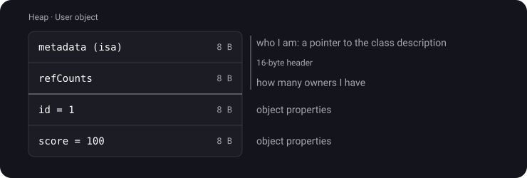
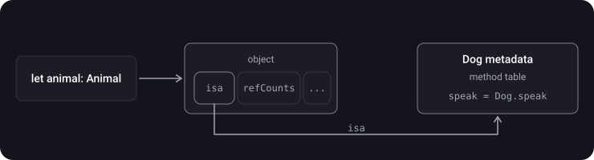
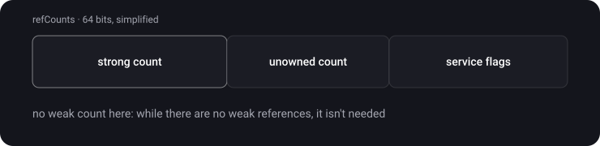
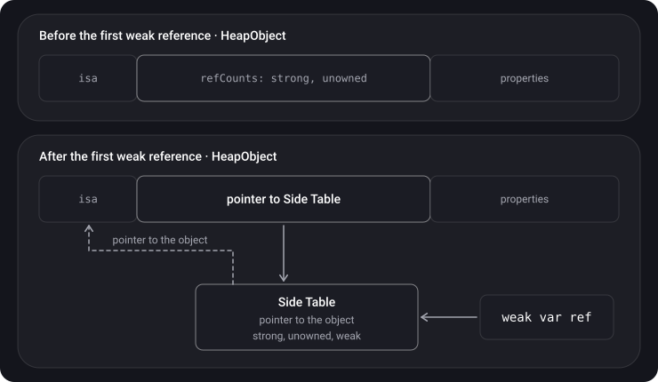
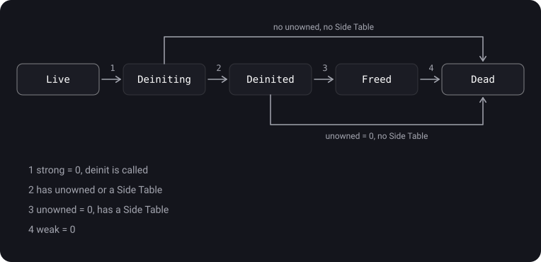

> **What you'll learn**
>
> - What a class instance looks like in memory from the inside (HeapObject)
> - What the isa pointer is and why it is needed
> - Where the strong, unowned and weak counts live
> - What a side table is and why weak references cost more
> - Which states an object goes through from creation to complete deallocation

> **Prerequisites:** [topic 05](../mrc-to-arc/) — the reference count and ARC; [topic 06](../reference-types-retain-cycle/) — strong, weak, unowned.

> **Level: advanced.** For an interview, steps 1–4 and the lifecycle in broad strokes are usually enough. The runtime implementation details are tucked into the collapsible "For the advanced" blocks.

## Analogy: a passport and moving out

**An object is a resident with a passport.** The first line of the passport is "who I am" (the object's type). The second is "how many owners I have" (the reference count). Then comes personal data (the properties).

**A side table is a card in the concierge's card index.** As long as nobody writes to the resident "poste restante" (there are no weak references), no card is needed. As soon as the first such correspondent appears, the concierge starts a card, and in the passport, instead of the count, writes the card number.

**The lifecycle is moving out:**

- **Live** — you live in the apartment.
- **Deiniting** — you pack your things (`deinit` runs).
- **Deinited** — the things are gone, but someone still has keys (unowned references). The apartment can't be rented to new tenants until the keys are returned.
- **Freed** — the apartment has been rented out. But the concierge still keeps a note, "doesn't live here any more", for those who come to the old address (weak references will get `nil`).
- **Dead** — the note is thrown away. Nothing is left of the resident.

## Step 1. HeapObject — what an object looks like in memory

> **HeapObject** — the internal representation of any class instance in the Swift runtime. You don't see it in code: the compiler hides it behind `class`.

```swift
final class User {
    var id: Int = 1
    var score: Int = 100
}
```



The first 16 bytes are the **header**, the same for all objects. Then come the properties.

<details>
<summary>How much memory will an empty class final class Empty {} take?</summary>

At least 16 bytes — just the header: the pointer to the metadata and the counts. There are no properties, but every object has a header. That is why many small objects on the heap cost more than they seem to.

</details>

## Step 2. The isa pointer

> **isa pointer** ("is a") — the first field of an object, a pointer to the metadata of its class. The name comes from Objective-C.

Why it is needed:

- **To learn the type at run time.** `animal is Dog` and `type(of: animal)` work through it.
- **Polymorphism.** A variable of type `Animal` holds a `Dog`. The call `animal.speak()` goes through isa to `Dog`'s metadata and finds the overridden version of the method.



## Step 3. Where the counts live: the ordinary case

An object actually has **three** counts: strong, unowned and weak. As long as there are no weak references, strong and unowned fit into a single 64-bit `refCounts` field right in the header. There is no room for a weak count at all — it isn't needed.



## Step 4. Side table — when a weak reference appears

> **Side table** — a separate structure on the heap to which **all** of an object's counts move as soon as the first weak reference to it appears.

Why so complicated? Most objects never have weak references. Reserving room for a weak count in every object is wasteful. So the space is allocated separately and only when needed.



An important detail: **a weak reference points to the side table, not to the object itself.** Thanks to this, the object can be fully deallocated even while weak references still exist: the side table remains and answers them "the object is gone" → `nil`.

> **Key point:** this is why `weak` is more expensive than `unowned`. The first weak reference creates a side table — a separate heap allocation, and all operations on the counts start going through an extra pointer hop.

<details>
<summary>For the advanced: HeapObjectSideTableEntry, WeakReference and swift_weakLoadStrong</summary>

The side table in the runtime sources (C++):

```cpp
class HeapObjectSideTableEntry {
  std::atomic<HeapObject*> object;   // pointer to the original object
  SideTableRefCounts refCounts;      // strong, unowned, weak + flags
};
```

Once the side table is created, a pointer to it (shifted by 3 bits) is written into the object's `refCounts` field, and the `UseSlowRC` flag tells the runtime: "go to the side table for the counts".

Every weak variable is a `WeakReference` structure that stores a pointer to the side table. Reading a weak variable calls `swift_weakLoadStrong`: the function checks whether the object is alive; if so, it makes a temporary `retain` and returns the object, otherwise it returns `nil`.

</details>

## Step 5. The object lifecycle

An object doesn't vanish in one go. It goes through up to five states:



| State | What happens | Object memory | Side table |
| --- | --- | --- | --- |
| Live | The object is working | occupied | exists, if there were weak references |
| Deiniting | `deinit` is running; weak references already return `nil` | occupied | as before |
| Deinited | `deinit` has finished, but unowned references remain | **still occupied** | as before |
| Freed | The object's memory is freed, weak references remain | free | **still alive** |
| Dead | Nothing is left | free | free |

> Look at the **Deinited** state: unowned references prevent freeing the **object's memory**, even though the object itself is already "dead". That is exactly why `unowned` can reliably crash the app on access: the memory hasn't been handed over to something else yet, and the runtime sees the mark "the object is deinitialized". Weak references, on the other hand, hold only the small side table.

<details>
<summary>One unowned and one weak reference to an object remain. There are no strong references left. Which path will the object take?</summary>

Live → Deiniting (`deinit`) → Deinited (unowned keeps the object's memory) → when the unowned reference goes away: Freed (the object's memory is freed, the side table lives on for the weak reference) → when the weak reference goes away: Dead.

</details>

## Step 6. Historical note

Before Swift 4, a weak reference pointed straight at the object. Because of this, after `deinit` the object's memory could not be freed while weak references existed: the object turned into a "zombie" occupying memory. There were also thread-safety problems with weak references. The side table solved both problems: weak references hold only it, and the object is freed right away.

## Common mistakes

- "The count always lives in the header". Only while there are no weak references; after that — in the side table.
- "A weak reference points to the object". A weak reference points to the side table.
- Confusing Deinited and Dead: after `deinit` the object's memory may still be alive because of unowned references.
- "isa is an entity separate from HeapObject". It is the first field of the object's header.

## Cheat sheet

```text
HeapObject = [ isa (8) | refCounts (8) | properties... ]  — a 16-byte header
isa        = a pointer to the class metadata → type, polymorphism
refCounts  = strong + unowned in one 64-bit field (while there is no weak)

The first weak reference → a side table is created
  the header holds a pointer to the side table instead of the counts
  the side table holds strong, unowned, weak
  weak variables point to the side table, not to the object

Lifecycle:
  Live → Deiniting (strong = 0, deinit)
       → Dead      (no unowned, no side table)
       → Deinited  (unowned keeps the object's memory)
           → Freed (the object's memory is free, the side table lives on for weak)
               → Dead (weak = 0)
```

## Self-check questions

<details>
<summary>1. What is in the header of any class instance?</summary>

A pointer to the type metadata (isa) and the reference-count field — 8 bytes each on a 64-bit platform.

</details>

<details>
<summary>2. What is the isa pointer for?</summary>

To know the object's real type at run time: for type checks and for calling the correct overridden implementation of a method.

</details>

<details>
<summary>3. When is a side table created and what does it store?</summary>

On the first weak reference to the object. It holds a pointer to the object and all the counts: strong, unowned and weak.

</details>

<details>
<summary>4. What does a weak reference point to and why does it matter?</summary>

To the side table. Thanks to this, the object's memory can be freed even while weak references exist: the side table remains and returns `nil` to them.

</details>

<details>
<summary>5. Why is weak more expensive than unowned?</summary>

The first weak reference requires allocating a side table on the heap, and all operations on the counts go through an additional pointer.

</details>

<details>
<summary>6. Why does accessing an unowned reference after the object is deallocated give a predictable crash instead of garbage?</summary>

While unowned references exist, the object's memory is not freed (the Deinited state). The runtime sees that the object is already deinitialized and stops the program with a controlled error.

</details>

## Sources

- [HeapObject](https://github.com/apple/swift/blob/main/stdlib/public/runtime/HeapObject.cpp)
- [RefCount.h — description of object states](https://github.com/apple/swift/blob/main/stdlib/public/SwiftShims/swift/shims/RefCount.h)
- [WeakReference](https://github.com/apple/swift/blob/9a5bb49067e21d33c73b32843dcc95f8a88d7a9d/stdlib/public/runtime/WeakReference.h#L156)
- [swift_weakLoadStrong](https://github.com/apple/swift/blob/c39901d7fb34debbaf51d225b01f2869cd0b101f/stdlib/public/runtime/HeapObject.cpp#L909)
- [swift_deallocObject](https://github.com/apple/swift/blob/c39901d7fb34debbaf51d225b01f2869cd0b101f/stdlib/public/runtime/HeapObject.cpp#L888)
