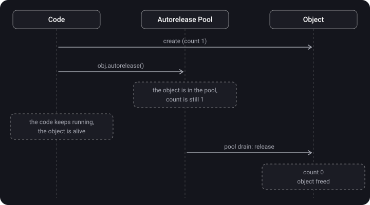

> **What you'll learn**
>
> - What `autorelease` is and why it appeared
> - How an autorelease pool works and when it is drained
> - When Swift code needs an explicit `autoreleasepool { }`
> - How it changes the memory usage graph

> **Prerequisites:** [topic 05](../mrc-to-arc/) — MRC, `retain` / `release`, ARC.

## Analogy: an office wastebasket

You don't run to the street container with every crumpled sheet of paper. You throw it into the basket under your desk, and the cleaner takes everything out in the evening at once.

- **`release`** — you took the sheet to the street right away.
- **`autorelease`** — you tossed it into the basket: it will be thrown away, but later.
- **Autorelease pool** — the basket itself.
- **The end of an event loop cycle (run loop)** — the evening cleanup.
- **`autoreleasepool { }` inside a loop** — you print 1000 drafts in one evening. The basket will overflow long before the cleanup, so you empty it after every batch.

## Step 1. The problem autorelease solves

In MRC every object must have an owner who will call `release`. But what if a function creates an object and **returns** it?

```objective-c
- (NSString *)makeGreeting {
    NSString *s = [[NSString alloc] initWithFormat:@"Hello"]; // count 1, the owner is us
    return s;   // ??? who will call release?
}
```

- Calling `release` before `return` — the object is deleted before the caller receives it.
- Not calling it — a leak if the caller forgets about `release`.

The solution is a **deferred release**:

```objective-c
- (NSString *)makeGreeting {
    NSString *s = [[NSString alloc] initWithFormat:@"Hello"];
    return [s autorelease];   // "release later": the object survives until it reaches the caller
}
```

> **`autorelease`** — mark an object for a deferred `release`. The count is decreased not now but when the autorelease pool is drained.

This gives the classic Objective-C rule: methods whose names begin with `alloc`, `new`, `copy`, `mutableCopy` return an object that you **own** (a `release` is needed). All the others — for example `[NSString stringWithFormat:]` — return the object via `autorelease`: you don't need to own it, and it goes away by itself when the pool is drained.

## Step 2. The autorelease pool

> **Autorelease pool** — a container for objects that have been sent `autorelease`. When drained, the pool sends `release` to each of them.



**When the pool is drained:**

- on the main thread — at the end of every run loop iteration (UIKit wraps each iteration in its own pool);
- at the end of an `autoreleasepool { }` block;
- in Objective-C manually — by calling `drain` on an `NSAutoreleasePool` (the old style) or at the closing brace of `@autoreleasepool { }`.

GCD queues have an `autoreleaseFrequency` parameter. With the value `.workItem` the queue wraps each task in its own pool:

```swift
let queue = DispatchQueue(label: "com.app.images", autoreleaseFrequency: .workItem)
```

## Step 3. Is it needed in Swift?

Pure Swift objects don't go through the autorelease pool — ARC releases them immediately when they leave scope. The pool matters when the code **calls Objective-C APIs**: UIKit, Foundation, Core Graphics and so on. They may return autoreleased objects, and those accumulate in the pool until it is drained.

> **Key point:** in ordinary code you don't need to write `autoreleasepool`. It is needed in one typical scenario — **a loop that creates many heavy temporary objects through Objective-C APIs**.

## Step 4. The main scenario: a heavy loop

```swift
func processImages(paths: [String]) {
    for path in paths {                                   // 1000 files
        autoreleasepool {
            guard let image = UIImage(contentsOfFile: path) else { return }
            let thumbnail = makeThumbnail(from: image)
            save(thumbnail)
        }   // ← the pool is drained here, on every iteration
    }
}
```

<details>
<summary>What happens without autoreleasepool inside the loop?</summary>

The temporary objects of all 1000 iterations pile up in the pool of the current run loop iteration. The whole `for` loop runs within one run loop iteration, so the pool is drained only after it ends. The memory peak = the sum of the temporary objects of all iterations.

</details>

**What this looks like on a memory graph:**


## Step 5. The cost

Creating and draining a pool are not free operations. There is no need to wrap every iteration of every loop "just in case": the gain is noticeable only where heavy temporary objects are created on each iteration.

If there are many iterations and the objects are light, you can drain the pool once every N iterations — for example, process files in batches of 50 and wrap each batch in `autoreleasepool`.

## Common mistakes

- `autoreleasepool` in every loop in a row → overhead for no benefit.
- Confusing `autorelease` and `release`: `autorelease` does **not** decrease the count immediately, the object lives until the pool is drained.
- Expecting memory savings from `autoreleasepool` with `UIImage(named:)` — the images stay in the system cache.
- Adding `autoreleasepool` in pure Swift code with no Objective-C APIs — the objects are freed immediately anyway.

## Cheat sheet

```text
release        = −1 now
autorelease    = −1 later, when the pool is drained
Pool is drained = end of a run loop iteration (main) / end of autoreleasepool { } / drain
Objective-C    = alloc/new/copy/mutableCopy → you own it; everything else → autorelease

Swift: needed only in loops with heavy temporary objects from Objective-C APIs
       for x in items { autoreleasepool { ...heavy work... } }
       GCD: DispatchQueue(label:, autoreleaseFrequency: .workItem)
Don't overuse: the pool has a cost
```

## Self-check questions

<details>
<summary>1. How does autorelease differ from release?</summary>

`release` decreases the count immediately. `autorelease` defers that until the autorelease pool is drained — until then the object is alive.

</details>

<details>
<summary>2. Why did autorelease appear in the first place?</summary>

So that a method can return an object it created: you can't release it right away (it would be deleted before it is received), and not releasing it is a leak. A deferred `release` solves both problems.

</details>

<details>
<summary>3. When is the autorelease pool drained on the main thread?</summary>

At the end of every run loop iteration.

</details>

<details>
<summary>4. When does Swift code need an explicit autoreleasepool?</summary>

In loops where heavy temporary objects are created on each iteration through Objective-C APIs (images, `Data`, Foundation objects), so they don't pile up until the end of the whole loop.

</details>

<details>
<summary>5. Why won't autoreleasepool help with UIImage(named:)?</summary>

`UIImage(named:)` puts images into the system cache. They are held by the cache, not by the pool, so draining the pool won't free them.

</details>

## Sources

- [Memory management in Swift](https://swiftme.ru/upravlenie-pamyatyu-v-swift-8281/#autoreleasepool) (in Russian)
- [Tough iOS questions and simple answers — Mad Brains Techno](https://youtu.be/pWXgH-GbRSU?t=1258) (video, in Russian)
- [Memory management in Swift — Mad Brains Techno 1.08.19](https://youtu.be/NF19v4Ef6KA?list=PLw6SJ6q6-1YowmlGVks5a088XrSbihJu-&t=1751) (video, in Russian)
- [Swift: ARC and memory management](https://habr.com/ru/articles/451130/) (in Russian)
