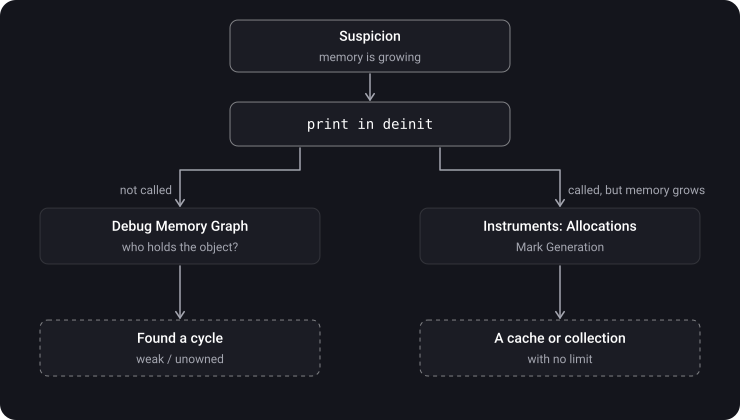

> **What you'll learn**
>
> - What a memory leak is and where it comes from in real apps
> - How to find a leak: `deinit`, Memory Graph, Instruments
> - What memory safety is and which errors Swift protects you from by itself
> - What the exclusive access rule is
> - Why a leak and a memory safety violation are different things

> **Prerequisites:** topics [05](../mrc-to-arc/)–[06](../reference-types-retain-cycle/) — ARC, strong/weak/unowned, retain cycles.

## Analogy: a dripping tap and a stair railing

- **A memory leak** — a dripping tap. Nothing breaks right away, but the water bill keeps growing. A month later — a flood (the system kills the app for using too much memory).
- **Memory safety** — the railings and guards on a staircase. They don't save water, they keep you from falling: from touching non-existent memory, going past the end of an array, reading an uninitialized variable.

These are two different problems: you can have perfect railings and a dripping tap at the same time.

## Step 1. What a leak is

> **Memory leak** — an object is no longer needed by the app, but a strong reference to it remains, so ARC doesn't free it.

A leak by itself doesn't crash the app or corrupt data — it just eats memory. The classic sign: you open and close the same screen, and memory usage grows in steps.

## Step 2. Where leaks come from

| Source | Who holds whom | How to fix |
| --- | --- | --- |
| A stored closure | object → closure → `self` | `[weak self]` |
| A strong delegate | controller → view → delegate (the controller) | `weak var delegate` |
| A repeating `Timer` | run loop → timer → closure / target → `self` | `[weak self]` • `invalidate()` when leaving the screen |
| `NotificationCenter` with a block | notification center → closure → `self` | `[weak self]` • `removeObserver(token)` |
| A singleton or an unbounded cache | singleton → array → objects | delete what is no longer needed, limit the size (`NSCache`) |

<details>
<summary>Find the leak</summary>

```swift
final class ClockViewController: UIViewController {
    private var timer: Timer?

    override func viewDidLoad() {
        super.viewDidLoad()
        timer = Timer.scheduledTimer(withTimeInterval: 1, repeats: true) { _ in
            self.updateTime()
        }
    }
}
```

The run loop holds the repeating timer, the timer holds the closure, the closure holds `self`. The screen is closed — the controller stays in memory, and the timer ticks forever. The fix: `{ [weak self] _ in self?.updateTime() }` and `timer?.invalidate()`, for example in `viewDidDisappear`.

</details>

## Step 3. How to find a leak

**Method 1 — `deinit`.** The fastest.

```swift
deinit { print("\(Self.self) is deallocated") }
```

You closed the screen and there is no message — someone is holding the object.

**Method 2 — Debug Memory Graph**

1. Run the app from Xcode and go through the suspicious scenario (open and close a screen several times).
2. Click the Debug Memory Graph button (three connected circles) in the debug bar.
3. On the left is the list of live objects. If there are three instances of a closed controller, that is a leak. Genuine cycles are marked with a purple `!`.
4. Select an object — in the middle is the graph of who references it. Look for the arrow that closes the circle.

**Method 3 — Instruments**

1. `Product → Profile` (`⌘I`) → the **Leaks** template.
2. Go through the scenario. The red marks on the timeline are the leaks found.
3. Select a leak → the inspector shows the **call stack** where the object was created → from it you can tell what the object is and where it came from.
4. The **Allocations** instrument shows all memory allocations. The **Mark Generation** button: make a mark, open and close the screen, make another one. Everything that grew between the marks and didn't go away is a leak candidate.



> Leaks finds only memory that **cannot** be reached (classic cycles). If an object is reachable — for example, it sits in a singleton's array — Leaks won't show it. Such "abandoned memory" is hunted with Allocations and Mark Generation.

## Step 4. Memory safety

> **Memory safety** — a guarantee that the program doesn't access memory in an invalid way: doesn't read uninitialized memory, doesn't go out of bounds, doesn't touch freed memory, doesn't write to one variable from two places at once.

What Swift does by default:

1. **Initialization before use.** The compiler won't let you read a variable that hasn't been assigned anything.
2. **Bounds checking.** `array[10]` with 5 elements is a controlled crash, not a read of someone else's memory.
3. **ARC.** It doesn't let an object be freed while a strong reference to it exists — no accesses to a deleted object.
4. **Optionals.** "No value" has to be handled explicitly, instead of getting a random `nil` in an unexpected place.
5. **Strong typing.** You can't read memory of one type as another without an explicit `unsafe` API.
6. **Exclusive access.** A write to a variable can't overlap with another access to it (step 5).

> All of this is turned off wherever an API name contains `Unsafe`: `UnsafePointer`, `unowned(unsafe)`, `unsafeBitCast`. There the responsibility is yours.

## Step 5. Exclusive access

> **The exclusivity rule** (SE-0176): while a variable is being written to, no other access to it may overlap with that write.

An example from the Swift documentation:

```swift
var stepSize = 1

func increment(_ number: inout Int) {
    number += stepSize      // we read stepSize…
}

increment(&stepSize)        // …while it is being written through inout
```

<details>
<summary>What will happen?</summary>

A crash at run time: "Simultaneous accesses to stepSize". `inout` opens a long write to `stepSize` for the whole duration of the call, and inside the function the same variable is read. The accesses overlapped.

The fix is to make an explicit copy: `var copy = stepSize; increment(&copy); stepSize = copy`.

</details>

Sometimes the compiler sees the conflict itself:

```swift
var balance = 100
swap(&balance, &balance)    // ❌ compile-time error: overlapping accesses
```

## Step 6. A leak ≠ a memory safety violation

|  | A memory leak | A memory safety violation |
| --- | --- | --- |
| The essence | An object lives longer than needed | An invalid memory access |
| The danger | Memory usage grows | Data corruption, a crash, security holes |
| Does Swift protect you | No — the developer breaks the cycles | Yes, by default (except `Unsafe` APIs) |
| How to look for it | `deinit`, Memory Graph, Leaks, Allocations | The compiler, crashes with a clear message, Address/Thread Sanitizer |

> A retain cycle is a problem of **efficiency**, not safety. Accessing a "leaked" object is perfectly safe — it is alive and intact. It's just that nobody uses it, yet it occupies memory.

## Common mistakes

- "No crashes — so no leaks". A leak doesn't crash right away; the system will kill the app later, at a random place.
- Searching only with Leaks. It won't show reachable but unneeded memory — you need Allocations and Mark Generation.
- Forgetting `invalidate()` on a repeating `Timer`.
- Confusing a leak with a memory safety violation.
- Assuming that exclusivity checks replace synchronization between threads.

## Cheat sheet

```text
Leak = an unneeded object is held by a strong reference → memory is not returned
Sources: a closure with self, a strong delegate, Timer, a NotificationCenter block, a singleton/cache

Finding it:
  print in deinit                         → is someone holding the object
  Debug Memory Graph                      → exactly who holds it (a graph)
  Instruments → Leaks                     → unreachable cycles
  Instruments → Allocations + Mark Gen.   → growth of reachable memory

Memory safety (Swift by default):
  initialization before use, bounds checking, ARC, optionals, types,
  exclusive access (SE-0176): a write doesn't overlap with another access
  turned off in Unsafe APIs
Between threads → Thread Sanitizer, not exclusivity checks
```

## Self-check questions

<details>
<summary>1. What is a memory leak?</summary>

An object is no longer needed, but a strong reference to it remains, and ARC doesn't free it. The most common cause is a retain cycle.

</details>

<details>
<summary>2. Name three sources of leaks other than a cycle of two classes.</summary>

A stored closure that captured `self`; a repeating `Timer` without `invalidate`; a `NotificationCenter` observer block; a singleton or a cache that accumulates objects.

</details>

<details>
<summary>3. Why might Leaks fail to show a problem even though memory is growing?</summary>

Leaks looks only for unreachable memory. If the objects are reachable (they sit in a cache or in a singleton's array), that is "abandoned memory" — it shows up through Allocations and Mark Generation.

</details>

<details>
<summary>4. What does the exclusive access rule require?</summary>

A write to a variable must not overlap in time with any other access to the same variable.

</details>

<details>
<summary>5. Do exclusivity checks catch races between threads?</summary>

Not reliably. They work dependably within a single thread. For races between threads you need Thread Sanitizer.

</details>

<details>
<summary>6. Is it dangerous to access an object that has "leaked"?</summary>

No. It is alive and valid — it just occupies memory to no purpose. A leak is a problem of efficiency, not safety.

</details>

## Sources

- [Artem Kolosov — Fighting memory leaks: from the task to victory](https://www.youtube.com/watch?v=4yn19H07NSE&list=WL&index=15&pp=gAQBiAQB) (video, in Russian)
- [Memory leaks. Xcode instruments](https://www.youtube.com/watch?v=OSd8ilmCTGs) (video, in Russian)
- [Tracking memory leaks at runtime in an iOS app with SwiftUI](https://habr.com/ru/companies/banki/articles/836924/) (in Russian)
- [How not to lose your head (and memory) when hunting leaks in iOS](https://habr.com/ru/companies/simbirsoft/articles/723954/) (in Russian)
- [Finding strong reference cycles in an iOS project with Xcode](https://tproger.ru/articles/poisk-retain-cycle-s-pomoshhju-instrumentov-xcode) (in Russian)
- [A simple way to detect a retain cycle in a UIViewController](https://habr.com/ru/articles/662708/) (in Russian)
- [Memory management in Swift — Mad Brains Techno 1.08.19](https://youtu.be/NF19v4Ef6KA?list=PLw6SJ6q6-1YowmlGVks5a088XrSbihJu-&t=1926) (video, in Russian)
- [The Swift Programming Language — Memory Safety](https://docs.swift.org/swift-book/documentation/the-swift-programming-language/memorysafety/)
- [SE-0176: Enforce Exclusive Access to Memory](https://github.com/apple/swift-evolution/blob/main/proposals/0176-enforce-exclusive-access-to-memory.md)
