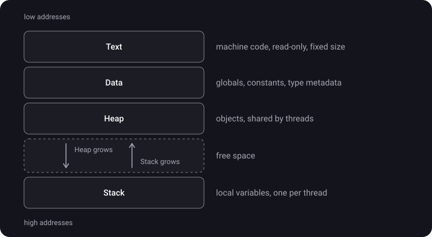
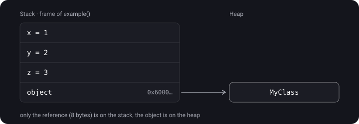
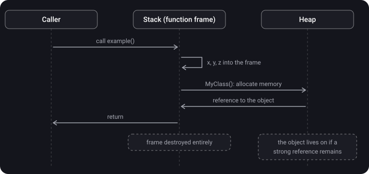
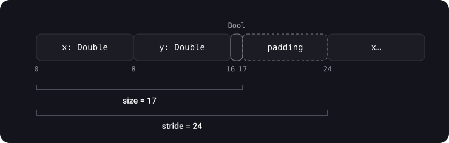

> **What you'll learn**
>
> - What four regions the memory of a running app consists of
> - Where a variable, a class instance, a constant and the code itself end up
> - What happens to memory when a function is called and when it returns
> - What `size`, `stride` and `alignment` are and how to compute them by hand

> **Prerequisites:** basic Swift syntax and the difference between `struct` and `class` at the "what is it" level. This is the opening topic of the block.

## Analogy: an office building

Picture a running app as an office building.

- **Text (code)** — the walls and the floor plan. They were built in advance (by the compiler) and are not rebuilt while the app runs — they are only read.
- **Data (global data)** — the notice board in the lobby. It hangs all working day and every employee can see it.
- **Heap** — a warehouse. You can take a shelf of any size for any length of time, but someone has to keep track of when the shelf should be freed (that is ARC).
- **Stack** — a pile of papers on an employee's desk. You put on top, you take from the top. When the task is done, you throw away its whole pile at once. Every employee (thread) has their own desk.

## Step 1. Four memory regions

> **Process address space** — all the memory the system has allocated to the app. It is divided into regions with different rules.

1. **Text** — the app's machine code. Read-only, fixed size.
2. **Data** — global and static variables, constants, type metadata (the description of a `class` / `struct` / `protocol`, not their instances).
3. **Heap** — objects with their own lifetime: class instances and sometimes value types ([topic 04](../value-types-on-heap-existential/)).
4. **Stack** — local variables and function parameters. It works on the LIFO principle, and every thread has its own.



> **Key point:** Text and Data are formed in advance and do not change size. Heap and Stack are dynamic: they grow and shrink as the program runs.

## Step 2. What goes where — an example

```swift
// Data: a global constant and the type declarations themselves
let greeting = "Hello, world"
class MyClass { }
struct MyStruct { }

func example() {
    // Stack: the function's local variables
    var x = 1
    var y = 2
    let z = x + y

    // Stack: the reference variable (an 8-byte pointer)
    // Heap:  the MyClass object itself
    let object = MyClass()
}
```

> `let object = MyClass()` is **two** things in two different places. The variable `object` (essentially a pointer) lives on the stack. The object it points to lives on the heap. Mixing them up is the most common mistake in this topic.



## Step 3. What happens when a function is called

1. A function is called → the system creates a **stack frame** for it.
2. Parameters and local variables are placed in this frame.
3. A class instance is created → memory is allocated on the heap, and only the reference goes into the frame.
4. The function returns → the stack frame disappears **entirely and instantly**.
5. The heap object **does not disappear** with the frame. It lives as long as there is a strong reference to it (topics [05](../mrc-to-arc/)–[06](../reference-types-retain-cycle/)).



<details>
<summary>A function created an object and returned it via return. What happens to the object when the function's stack frame is destroyed?</summary>

Nothing bad: the object lives on the heap, not in the frame. The caller received a reference to it, so a strong reference remains and the object stays alive. Only the local variable inside the function is gone.

</details>

## Step 4. MemoryLayout: how much space a type takes

Swift lets you find out how a type is laid out in memory:

- **`size`** — how many bytes the data actually occupies;
- **`alignment`** — the number that the address where the value starts must be a multiple of;
- **`stride`** — the distance between neighbouring elements in an array: `size` rounded up to a multiple of `alignment`.

```swift
struct Point {
    let x: Double     // 8 bytes
    let y: Double     // 8 bytes
    let isFilled: Bool // 1 byte
}

MemoryLayout<Point>.size       // ?
MemoryLayout<Point>.alignment  // ?
MemoryLayout<Point>.stride     // ?
```

<details>
<summary>Work it out yourself, then open the answer</summary>

- `size` = 8 + 8 + 1 = **17**
- `alignment` = the maximum of the fields' alignments = **8** (that of `Double`)
- `stride` = 17 rounded up to a multiple of 8 = **24**

</details>

Why is `stride` larger than `size`? Imagine an array `[Point]`. If the elements went back to back at 17-byte intervals, the second `Point` would start at address 17 — not a multiple of 8 — and its `Double`s would be misaligned. So 7 bytes of "padding" are added after each element:



Field order affects `size`. If you put `Bool` first, the Swift compiler still lays the fields out in declaration order: `Bool` (1) + 7 bytes of padding + `Double` + `Double` → `size` = 24. That is why it pays to declare small fields last.

> In practice `MemoryLayout` is needed when you work with raw memory: `UnsafeRawPointer`, `UnsafeMutableRawBufferPointer`, binary formats. To allocate space for N elements, always use `stride * N`, not `size * N`.

## Step 5. Nuances

- **The stack is per thread, the heap is shared.** Every thread has its own stack; there is one heap for the whole app, available to all threads.
- **Four regions is a simplification.** The real memory map is more detailed: there are CPU registers, separate sections for string literals, loaded system libraries. For iOS development the four-region model is enough.
- "Data segment" and "Global Data" are the same thing; both names are in use.

## Common mistakes

- "The variable is on the stack → so the object is on the stack too". No: only the reference is on the stack, the object is on the heap.
- "All structs are always on the stack". Usually yes, but there are exceptions ([topic 04](../value-types-on-heap-existential/)).
- Using `size` instead of `stride` when working with arrays and raw memory → overwriting neighbouring data.
- "The stack is shared by the whole app". No: every thread has its own stack.

## Cheat sheet

```text
Text   = code, read-only, fixed size
Data   = global/static variables, constants, type metadata
Heap   = class instances (+ value types in special cases), shared by threads
Stack  = local variables and parameters, LIFO, one per thread

let obj = MyClass()   → obj (the reference) on the stack, the object on the heap
Leaving a function    → the stack frame disappears, heap objects do not

size      = how many bytes the data occupies
alignment = the maximum of the fields' alignments
stride    = size rounded up to a multiple of alignment (the step in an array)
```

## Self-check questions

<details>
<summary>1. What four regions does an app's address space consist of?</summary>

Text (code), Data (global data), Heap, Stack.

</details>

<details>
<summary>2. Where does the variable let obj = MyClass() live, and where does the object itself live?</summary>

The variable (the pointer) is on the stack of the current function. The `MyClass` object is on the heap.

</details>

<details>
<summary>3. Why is MemoryLayout&lt;Point&gt;.stride (24) larger than size (17)?</summary>

`stride` is `size` rounded up to a multiple of `alignment` (8). Otherwise the next array element would start at a misaligned address.

</details>

<details>
<summary>4. Which region is read-only?</summary>

Text — the app's machine code.

</details>

<details>
<summary>5. Is the stack shared by all threads?</summary>

No. Every thread has its own stack. The region shared by all threads is the heap.

</details>

## Sources

- [Types of memory in Swift (Swift 5)](https://www.youtube.com/watch?v=7oiVJMsLJAE) (video, in Russian)
- [Memory in iOS. ARC. Part II — iOS interview questions explained](https://www.youtube.com/watch?v=hzdYoipYBfQ&t=550s) (video, in Russian)
