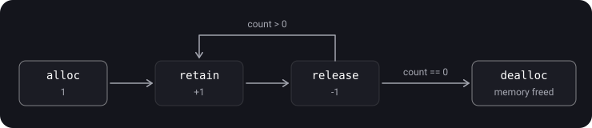
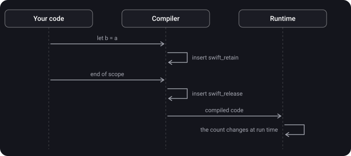
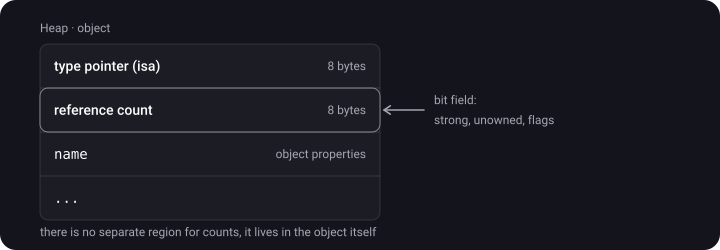

> **What you'll learn**
>
> - Why a heap object needs a reference count
> - How memory was managed by hand (MRC) and what mistakes that caused
> - What exactly ARC does for you and at which stage
> - Where the reference count is physically stored
> - How ARC differs from a garbage collector

> **Prerequisites:** topics [01](../memory-segments-memorylayout/)–[03](../value-reference-copying/) — class instances live on the heap, and a variable holds only a reference.

## Analogy: the light in a meeting room

An object is a meeting room. The light is on as long as there is at least one person inside. The last person to leave turns the light off — the object is freed.

- **Reference count** — the display above the door: how many people are inside.
- **MRC** — everyone signs in and out on a sheet at the entrance by hand. Forget to sign out when leaving, and the display never shows 0, so the light burns forever (a leak). Sign out twice, and the display shows 0 while people are still inside, and the light goes out on them (a crash).
- **ARC** — a turnstile on the door. It counts entries and exits by itself; people do nothing.

## Step 1. Why count references at all

A class instance lives on the heap and does not disappear when a function returns ([topic 01](../memory-segments-memorylayout/)). So someone has to decide **when** to delete it:

- delete too early → someone touches freed memory → a crash;
- never delete → the memory never comes back → a leak.

Apple's solution: every object has a **reference count** — how many strong references to it exist right now. When it reaches 0, nobody needs the object any more and it can be deleted.

## Step 2. MRC — manual counting

> **MRC (Manual Reference Counting)** — the Objective-C approach until 2011: the developer increased and decreased the count by calling methods.

- **`alloc`** — creates an object, count = 1.
- **`retain`** — +1: "I need this object too".
- **`release`** — −1: "I don't need it any more".
- **`dealloc`** — called automatically when the count reaches 0: the memory is freed.

```objective-c
MyObject *obj = [[MyObject alloc] init]; // 1
[obj retain];                             // 2
[obj release];                            // 1
[obj release];                            // 0 → dealloc
```



**The main rule of MRC:** for every `alloc` / `retain` there must be exactly one `release`.

<details>
<summary>Find the bug</summary>

```objective-c
- (void)showName {
    NSString *name = [[NSString alloc] initWithFormat:@"User %d", 42]; // 1
    self.label.text = name;   // the label did a retain itself → 2, and will release it on its own later
}
```

There is no `[name release]` at the end of the method. `alloc` gave +1, and there is no matching `release` — after the label lets go of the string, the count stays at 1 forever. A leak.

</details>

MRC mistakes:

- forgot `release` → a **leak**;
- an extra `release` → the object is deleted while still in use → a **crash**;
- two objects `retain` each other → a **retain cycle** ([topic 06](../reference-types-retain-cycle/)).

## Step 3. ARC — automatic counting

> **ARC (Automatic Reference Counting)** — the compiler itself inserts `retain` and `release` into the code. The rules are the same as in MRC, but they are applied by the compiler, not by a human.

You write:

```swift
func example() {
    let a = Person(name: "Anna")
    let b = a
    print(b.name)
}
```

The compiler turns this into roughly:

```swift
func example() {
    let a = Person(name: "Anna")   // allocation, count 1
    let b = a
    swift_retain(b)                // 2
    print(b.name)
    swift_release(b)               // 1
    swift_release(a)               // 0 → deinit, memory freed
}
```

(The optimizer often removes redundant `retain`/`release` pairs when it sees they change nothing.)



> The **decision** about where `retain` and `release` go is made **at compile time**. The **counting** itself — the actual change of the number — happens **while the app is running**. Interviewers like to ask about this.

## Step 4. What ARC works with

ARC counts references to **class instances**, as well as closures and actors — all of these are reference types.

Structs and enums are value types: they have no "owners", every variable stores its own copy, and there is nothing to count.

## Step 5. Where the count is stored

There is no separate memory region for counts. The count lives **in the header of the object itself**, next to the pointer to its type:



Since the object is on the heap, the count is on the heap too. How this bit field is laid out and what happens when weak references appear is covered in [topic 07](../arc-internals/).

## Step 6. ARC vs a garbage collector

|  | ARC (Swift, Objective-C) | Garbage Collector (Java, C#, Go) |
| --- | --- | --- |
| When the object is freed | Immediately, as soon as the count reaches 0 | At some point, during garbage collection |
| Pauses in the app | No | Possible |
| Reference cycles | Doesn't find them — a leak, the developer deals with it | Finds and collects them itself |
| Cost | retain/release on every operation with a reference | Periodic memory scanning |

> **Key point:** ARC is deterministic — you know exactly that `deinit` is called at the moment the last strong reference goes away. The price is that you have to break reference cycles yourself ([topic 06](../reference-types-retain-cycle/)).

## Step 7. How to peek at the count (for debugging only)

```swift
let user = User()
print(CFGetRetainCount(user))   // the number may turn out larger than expected
```

The value is often larger than the "intuitive" one: temporary references are added by the function call itself and by compiler optimizations. Don't rely on this number in app logic.

## Step 8. Nuances

- In multithreaded code an object is deleted on the thread where the last `release` happened. So `deinit` may run off the main thread.
- Operations on the count are atomic: `retain`/`release` from different threads don't corrupt the count. But that doesn't make the object's **properties** thread-safe.

## Common mistakes

- "ARC is a garbage collector". No: ARC doesn't scan memory, it inserts `retain`/`release` at compile time.
- "ARC works with structs". No: only with reference types.
- "ARC will break the cycle itself". It won't — you need `weak` / `unowned`.
- Relying on the count's value in code.

## Cheat sheet

```text
Reference count = how many strong references point to the object. 0 → deinit + free

MRC: alloc (=1), retain (+1), release (−1), dealloc (at 0)
     forgot release → a leak;  an extra release → a crash

ARC: the compiler inserts swift_retain / swift_release itself
     the decision is at compile time, the counting is at run time
     only for reference types (class, closure, actor)

The count is stored in the object's header (on the heap), a bit field
ARC ≠ GC: frees immediately, no pauses, but doesn't find cycles
Debugging: CFGetRetainCount(obj) — not for logic
```

## Self-check questions

<details>
<summary>1. Name the four MRC operations.</summary>

`alloc` — create an object, count 1; `retain` — +1; `release` — −1; `dealloc` — free the memory when the count reaches 0.

</details>

<details>
<summary>2. When does ARC insert retain/release and when do they run?</summary>

The compiler inserts them at build time. They run while the app is running.

</details>

<details>
<summary>3. Does ARC work with structs?</summary>

No. Value types have no shared owners — there is nothing to count. If a value ended up on the heap, it is the service box that has a count, not the struct itself.

</details>

<details>
<summary>4. Where is the reference count stored?</summary>

In the header of the object itself, next to the pointer to its type. It is a bit field.

</details>

<details>
<summary>5. How does ARC differ from a garbage collector?</summary>

ARC frees an object immediately, as soon as the count reaches 0, with no pauses; but it can't find cycles. A GC frees objects periodically and finds cycles itself.

</details>

<details>
<summary>6. On which thread will deinit be called?</summary>

On the one where the last strong reference was released. It is not necessarily the main thread.

</details>

## Sources

- [Memory management in Swift](https://swiftme.ru/upravlenie-pamyatyu-v-swift-8281/#refcounting) (in Russian)
- [How it all began (MRC)](https://iosdeeptech.github.io/ios_deep_tech/Swift/ARC/Junior/1.%20%D0%A1%20%D1%87%D0%B5%D0%B3%D0%BE%20%D0%B2%D1%81%D0%B5%20%D0%BD%D0%B0%D1%87%D0%B0%D0%BB%D0%BE%D1%81%D1%8C%3F%20%28MRC%29/) (in Russian)
- [How the reference count works in Swift](https://habr.com/ru/companies/vivid_money/articles/592599/) (in Russian)
- [Swift: ARC and memory management](https://habr.com/ru/articles/451130/) (in Russian)
- [What you need to know about ARC](https://habr.com/ru/articles/209288/) (in Russian)
- [Automatic Reference Counting: part 1](https://habr.com/ru/articles/129874/) (in Russian)
- [Memory in Swift from 0 to 1](https://habr.com/ru/companies/hh/articles/546856/) (in Russian)
- [Memory management in Swift](https://habr.com/ru/articles/592385/) (in Russian)
- [Memory in Swift (heap, stack, ARC)](https://habr.com/ru/companies/otus/articles/649329/) (in Russian)
- [Interview questions: What is ARC (Automatic Reference Counting)](https://apptractor.ru/info/techhype/arc.html) (in Russian)
- [Swift programming basics: 14.1. ARC basics](https://www.youtube.com/watch?v=fYjpXUGND9w) (video, in Russian)
- [№5635 - Everything you need to know about ARC in Swift](https://www.youtube.com/watch?v=x0KWpxRrk8c) (video, in Russian)
