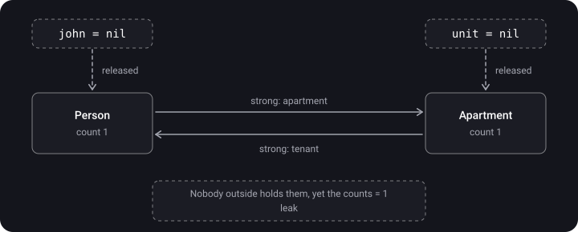
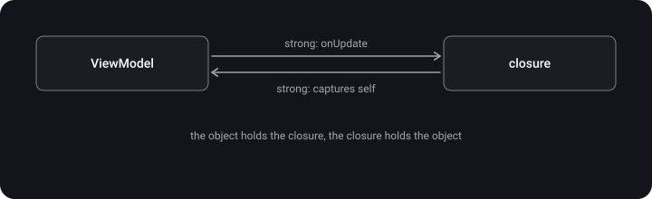

> **What you'll learn**
>
> - How strong, weak and unowned references differ from one another
> - How two objects "lock" each other in memory (a retain cycle)
> - How a closure can hold its own object, and how to fix it with `[weak self]`
> - When to use `weak` and when `unowned`
> - How to find a leak in Xcode

> **Prerequisites:** [topic 05](../mrc-to-arc/) — ARC counts the strong references to an object and frees it when the count reaches 0.

## Analogy: a dog on a leash

An object is a dog in a park. As long as someone holds it by a leash, it stays in the park. When all the leashes are let go, the dog goes home: the object is freed.

- **Strong** — you hold the leash. As long as you hold it, the dog won't go anywhere.
- **Weak** — you just watch the dog. You don't stop it from leaving, and when it is gone you see an empty spot (`nil`).
- **Unowned** — you are so sure the dog is nearby that you don't even look. Call it when it has already gone and you'll trip over thin air (a crash).
- **Retain cycle** — two dogs hold each other's leashes in their teeth. The owners left long ago, and the dogs keep wandering around the park forever.

## Step 1. Strong — holding the leash

> **Strong reference** — the default reference. It increases the object's reference count and doesn't let ARC free it.

Any `let` / `var` without modifiers is strong. Let's see how the count changes:

```swift
class Person {
    let name: String
    init(name: String) { self.name = name }
    deinit { print("\(name) is deallocated") }
}

var a: Person? = Person(name: "Anna")   // count: 1
var b = a                                // count: 2
a = nil                                  // count: 1 — the object is alive
b = nil                                  // count: 0 → "Anna is deallocated"
```

> **Key point:** an object lives as long as there is **at least one** strong reference to it. It doesn't matter where it comes from — a variable, another object's property or a closure.

## Step 2. Retain cycle — two dogs with leashes in their teeth

> **Retain cycle** — two or more objects hold each other with strong references. Their counts never reach 0, and no `deinit` is called.

A person rents an apartment, and the apartment knows its tenant:

```swift
class Person {
    let name: String
    var apartment: Apartment?          // strong
    init(name: String) { self.name = name }
    deinit { print("\(name) is deallocated") }
}

class Apartment {
    let number: Int
    var tenant: Person?                // also strong — here is the problem
    init(number: Int) { self.number = number }
    deinit { print("Apartment \(number) is deallocated") }
}

var john: Person? = Person(name: "John")
var unit: Apartment? = Apartment(number: 73)
john?.apartment = unit
unit?.tenant = john
john = nil
unit = nil
```

<details>
<summary>What will be printed?</summary>

**Nothing.** No `deinit` is called. See the table below.

</details>

Let's follow the counts line by line:

| Line | Person count | Apartment count | Who holds it |
| --- | --- | --- | --- |
| `john = Person(...)` | 1 | — | Person ← john |
| `unit = Apartment(...)` | 1 | 1 | Apartment ← unit |
| `john?.apartment = unit` | 1 | 2 | Apartment ← unit, Person |
| `unit?.tenant = john` | 2 | 2 | Person ← john, Apartment |
| `john = nil` | 1 | 2 | Person is held only by Apartment |
| `unit = nil` | **1** | **1** | They hold only each other — a leak |



> ARC is **not** a garbage collector. It doesn't look for "islands" of objects unreachable from code. It only counts references. So cycles are entirely the developer's responsibility.

## Step 3. Weak — just watching the dog

> A **weak reference** does not increase the count. When the object is deallocated, ARC itself writes `nil` into it.

Two rules follow. A weak reference is always:

- **optional** (`Person?`) — it needs a state for "the object is gone";
- **`var`**, not `let` — ARC must be able to write `nil` into it.

Let's fix the apartment — by changing one word:

```swift
class Apartment {
    let number: Int
    weak var tenant: Person?           // ← now it doesn't hold the tenant
    init(number: Int) { self.number = number }
    deinit { print("Apartment \(number) is deallocated") }
}
```

We run the same code as in step 2:

| Line | Person count | Apartment count | What happens |
| --- | --- | --- | --- |
| `john?.apartment = unit` | 1 | 2 | as before |
| `unit?.tenant = john` | **1** | 2 | weak isn't counted |
| `john = nil` | 0 | 1 | "John is deallocated", Person releases the apartment, `tenant` became `nil` |
| `unit = nil` | — | 0 | "Apartment 73 is deallocated" |

<details>
<summary>What will be printed now, and in what order?</summary>

```text
John is deallocated
Apartment 73 is deallocated
```

Person is deallocated first, because after `john = nil` it has no strong references left. On the way out it releases its strong reference to the apartment, and the apartment's count drops to 1. The last reference is removed by `unit = nil`.

</details>

## Step 4. Unowned — sure the dog is nearby

> An **unowned reference** also doesn't increase the count, but it is **non-optional**. ARC doesn't set it to nil. If the object has already been deallocated, accessing it is a crash.

It fits when one object **cannot exist** without the other. A card doesn't exist without a customer:

```swift
class Customer {
    let name: String
    var card: CreditCard?
    init(name: String) { self.name = name }
}

class CreditCard {
    let number: Int
    unowned let customer: Customer     // doesn't hold, but is never nil
    init(number: Int, customer: Customer) {
        self.number = number
        self.customer = customer
    }
}

// card.customer.name — no unwrapping needed, unlike weak
```

And here is what happens if the "certainty" lets you down:

```swift
var anna: Customer? = Customer(name: "Anna")
let card = CreditCard(number: 1234, customer: anna!)
anna = nil                            // Customer is deallocated, card is alive
print(card.customer.name)             // 💥 crash: access to a deallocated object
```

> With `weak` you would simply get `nil` in this situation. With `unowned` — a crash. Use `unowned` only if you **know for sure** the object will outlive the reference.

**Rule of choice:**

```text
Can the other object die EARLIER?      → weak
Does the other object live AT LEAST as long?  → unowned
Not sure?                              → weak
```

<details>
<summary>For the advanced: unowned(safe), unowned(unsafe) and optional unowned</summary>

- `unowned` = `unowned(safe)`: accessing a deallocated object is a controlled crash.
- `unowned(unsafe)` — no check, like `__unsafe_unretained` in Objective-C: you can read garbage from memory instead of crashing. Only for integration with legacy code.
- `unowned var x: T?` — an optional unowned. ARC does **not** write `nil` into it automatically; you do that yourself.

</details>

## Step 5. A retain cycle in a closure

A cycle also appears with a single class, if the object **stores** a closure and the closure **captures** `self`:

```swift
final class ProfileViewModel {
    var name = "Anna"
    var onUpdate: (() -> Void)?        // the object holds the closure

    func bind() {
        onUpdate = {
            print(self.name)           // the closure holds self
        }
    }
    deinit { print("ViewModel is deallocated") }
}

var vm: ProfileViewModel? = ProfileViewModel()
vm?.bind()
vm = nil                               // deinit won't be called
```



**The fix — a capture list:**

```swift
func bind() {
    onUpdate = { [weak self] in
        guard let self else { return }  // the object is gone — just exit
        print(self.name)
    }
}
```

> A cycle needs **both directions**: object → closure and closure → object. If the closure isn't stored (it ran and was forgotten), there is no cycle. That is why `[weak self]` isn't required in `map`, `forEach`, `DispatchQueue.main.async` — more in the tutorial «Concurrency → 02 · GCD».

## Step 6. How to find a leak

1. **The simplest way** — a `print` in `deinit`. Closed the screen, and the console is silent? Most likely a leak.
2. **Debug Memory Graph** — the button with three circles in Xcode's debug bar. It shows all live objects and the reference arrows between them; leaks are marked with a purple `!`.
3. **Instruments → Leaks** — looks for leaks while the app is running.

## Summary table

|  | strong | weak | unowned |
| --- | --- | --- | --- |
| Increases the count | yes | no | no |
| Type | any | optional only | usually non-optional |
| `let` or `var` | both | `var` only | both |
| The object is deallocated | impossible while we hold it | the reference becomes `nil` | access → crash |
| Cost | — | creates a Side Table ([topic 07](../arc-internals/)) | no Side Table needed |
| When to use | by default, ownership | the object may die earlier | the object certainly lives at least as long |

## Common mistakes

- `unowned` "just in case" → a crash when the deallocation order turns out to be different.
- A stored closure (`var onTap: () -> Void`) without `[weak self]` → a leaked screen or ViewModel.
- "ARC is automatic, so there are no leaks" → ARC honestly counts the cycle too.
- `[weak self]` everywhere, even where a cycle can't occur → needless noise in the code.
- A delegate declared as `var delegate: MyDelegate?` without `weak` → the classic controller ↔ view cycle.

## Cheat sheet

```text
strong   = holds the leash, count +1, the default
weak     = watches, doesn't touch the count, becomes nil by itself (always var + Optional)
unowned  = doesn't hold and doesn't check, deallocated → crash

Retain cycle = A holds B, B holds A → both live forever
Fix          = make one of the sides weak / unowned
Closures     = the object stores a closure + the closure captured self → [weak self]

Can it die earlier? → weak.  Lives at least as long? → unowned.  Not sure? → weak.
FIND: print in deinit, Debug Memory Graph, Instruments → Leaks
```

## Self-check questions

<details>
<summary>1. How does weak differ from unowned?</summary>

Neither increases the count. `weak` is always optional and becomes `nil` by itself when the object is deallocated. `unowned` is non-optional, ARC doesn't set it to nil, and accessing a deallocated object crashes the app.

</details>

<details>
<summary>2. Why can't a weak reference be declared with let?</summary>

ARC must write `nil` into it when the object is deallocated, and a `let` can't be changed.

</details>

<details>
<summary>3. What is a retain cycle and why doesn't ARC break it by itself?</summary>

Two or more objects hold each other with strong references, and their counts never drop to 0. ARC only counts references and doesn't analyze whether the objects are reachable from code — unlike a garbage collector.

</details>

<details>
<summary>4. How can you get a retain cycle if there is only one class in the code?</summary>

The object stores a closure in a property, and the closure captures `self` with a strong reference. The object holds the closure, the closure holds the object.

</details>

<details>
<summary>5. Is [weak self] needed in DispatchQueue.main.async?</summary>

To avoid a leak — no: the queue holds the closure only until it runs, and the object doesn't store this closure. But `[weak self]` is useful if you don't want to extend the object's life until the task runs.

</details>

<details>
<summary>6. Why is a delegate usually declared weak?</summary>

The delegate (for example, a controller) usually owns the object it is a delegate of. If the reference to the delegate is strong too, you get a cycle: controller ↔ view.

</details>

## Sources

- [Swift 4 — weak references](https://habr.com/ru/articles/341014/) (in Russian)
- [Finding strong reference cycles in an iOS project with Xcode](https://tproger.ru/articles/poisk-retain-cycle-s-pomoshhju-instrumentov-xcode) (in Russian)
- [A guide to using unsafe in Swift](https://habr.com/ru/articles/887914/) (in Russian)
- [Swift: ARC and memory management](https://habr.com/ru/articles/451130/) (in Russian)
