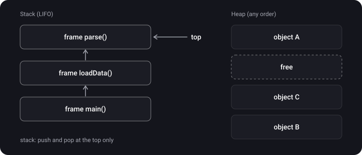
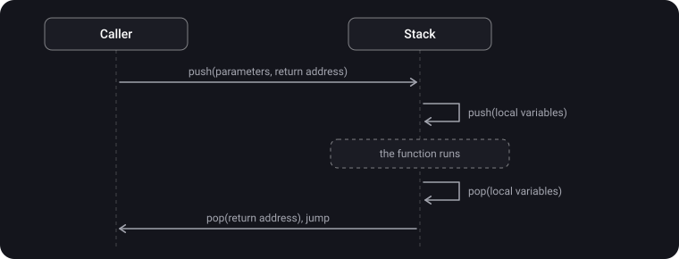
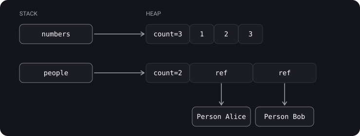

> **What you'll learn**
>
> - How the stack works and why it is so fast
> - How the heap works and why it is slower
> - Who frees memory on the stack and on the heap, and when
> - Why an array's "header" can live on the stack while its elements live on the heap
> - Where a stack overflow comes from

> **Prerequisites:** [topic 01](../memory-segments-memorylayout/) — the four memory regions, the stack frame, "the reference is on the stack, the object is on the heap".

## Analogy: a stack of plates and a warehouse

- **Stack** — a stack of plates. You put a new one on top and take one only from the top. There is nothing to search for: there is always exactly one top. You can't pull a plate out of the middle.
- **Heap** — a big warehouse with a storekeeper. You come in: "I need a 3-metre shelf". The storekeeper looks for a free spot of the right size and writes in a ledger that the shelf is taken. When the item is no longer needed, the shelf is released and crossed out of the ledger. Over time the free space becomes "holey" — many small gaps between occupied shelves (fragmentation).

## Step 1. The stack is LIFO

> **Stack** — a thread's memory region where data is pushed and popped strictly at one end: **last in, first out** (LIFO).



## Step 2. How the stack works during a function call

1. **Call** — the parameters and the return address (where to go back after the function) are pushed onto the stack.
2. **Work** — the function pushes its local variables onto the stack.
3. **Completion** — the local variables are popped, the result is saved.
4. **Return** — the return address is taken from the stack, and execution jumps there.
5. The parameters are popped from the stack too.



**Why is the stack so fast?** All the processor needs is one register, `sp` (stack pointer), pointing at the top. Allocating 16 bytes just means moving it:

```text
; ARM64 (iPhone)
sub sp, sp, #16   ; reserved 16 bytes for local variables
...
add sp, sp, #16   ; freed them — moved the pointer back
```

No search, no ledger. Allocation and deallocation are a single arithmetic operation.

## Step 3. How the heap works

> **Heap** — a region shared by all threads, from which you can request a block of any size at any moment and free it in any order.

Here is what happens when you write `let user = User()`:

1. The allocator (`malloc`) looks for a free block of a suitable size.
2. It marks the block as occupied in its bookkeeping structures (the "storekeeper's ledger").
3. It returns the block's address — and that address goes into the `user` variable on the stack.
4. When no strong references to the object remain, ARC triggers deallocation and the block goes back to the allocator.

This is where the heap's cost comes from: finding space, tracking occupied blocks, allocator thread safety (the heap is shared by all threads) and fragmentation.

## Step 4. Stack vs Heap

| Criterion | Stack | Heap |
| --- | --- | --- |
| How many per app | One per thread | One for the whole app |
| What it stores | Local value types of known size, references | Class instances; value types in special cases ([topic 04](../value-types-on-heap-existential/)) |
| Order of freeing | Strictly LIFO | Any |
| Who frees it | Automatically when the function returns | ARC, when the reference count reaches 0 |
| Speed | Very fast: a pointer shift | Slower: finding space, tracking blocks, synchronization |
| Size | Small and fixed | Grows as needed |
| Thread safety | Each thread has its own — no races | Shared — access from different threads must be synchronized |

## Step 5. Array: the header on the stack, the elements on the heap

`Array` is a value type, but the number of elements is not known in advance. So an array consists of two parts:

```swift
class Person {
    let name: String
    init(name: String) { self.name = name }
}

let numbers = [1, 2, 3]
let people = [Person(name: "Alice"), Person(name: "Bob")]
```



- The array variable is a small "header" (essentially a pointer to the buffer). It can live on the stack.
- The elements themselves live on the heap, in one contiguous buffer.
- If the elements are value types (`Int`), they sit right in the buffer.
- If the elements are classes, the buffer holds **references**, while the objects themselves are separately on the heap.

> **Key point:** "value → stack, reference → heap" is a useful rule to start with, but not a law. Array, string and dictionary are value types whose data lives on the heap.

## Step 6. Stack overflow

The stack is small and does not grow indefinitely. If a function calls itself with no exit condition, frames pile up until the space runs out:

```swift
func countDown(_ n: Int) {
    countDown(n - 1)   // no stopping condition
}
countDown(10)          // 💥 EXC_BAD_ACCESS — stack overflow
```

The stack size is set when the thread is created. On iOS the main thread has 1 MB and secondary threads have 512 KB by default (for a `Thread` you can change it with the `stackSize` property before starting it).

## Step 7. Nuances

- An `indirect enum` (a recursive enum) stores its cases on the heap: the compiler cannot know its size in advance.
- The classic "heap and stack grow toward each other" diagram is a convenient model. In a real system every thread has its own separate stack, so a "one heap and one stack" diagram shows a single thread.

## Common mistakes

- "The heap is slower because it's the heap". No — it is slower because it must look for space, keep records and synchronize access between threads.
- "A value type is always on the stack". The elements of an array, string or dictionary are on the heap.
- "There is one stack per app". The stack is per thread.
- Deep recursion with no exit condition → stack overflow.

## Cheat sheet

```text
Stack  = LIFO, one per thread, allocation = shifting sp
         freed automatically when the function returns
         small: main 1 MB, other threads 512 KB (iOS)
Heap   = shared, blocks of any size in any order
         allocated by malloc, class instances are freed by ARC
         slower: finding space + bookkeeping + synchronization + fragmentation

Array/String/Dictionary = the header may be on the stack, the data is on the heap
[ClassType]             = the buffer holds references, the objects are separately on the heap
Infinite recursion      = stack overflow
```

## Self-check questions

<details>
<summary>1. What principle is the stack organized by?</summary>

LIFO — last in, first out.

</details>

<details>
<summary>2. What is pushed onto the stack when a function is called?</summary>

The parameters and the return address, then the function's local variables.

</details>

<details>
<summary>3. Why is allocating memory on the heap more expensive than on the stack?</summary>

On the stack it is a single pointer shift. On the heap the allocator looks for a free block of the right size, keeps records of occupied blocks and synchronizes access, because the heap is shared by all threads.

</details>

<details>
<summary>4. An array [Person], where Person is a class. What lives where?</summary>

The array header (a pointer to the buffer) can be on the stack. The buffer with the elements is on the heap, and it holds references. The `Person` objects themselves are also on the heap, separately.

</details>

<details>
<summary>5. What is a stack overflow and when does it happen?</summary>

The stack is overflowed: function frames have taken all the space allotted to the thread. Usually because of infinite or too deep recursion.

</details>

## Sources

- [A 03 Stack and heap (A. V. Vasyukov, 2019)](https://www.youtube.com/watch?v=O-TvywJfo1I) (video, in Russian)
- [Threading Programming Guide — Thread Costs (Apple)](https://developer.apple.com/library/archive/documentation/Cocoa/Conceptual/Multithreading/CreatingThreads/CreatingThreads.html)
