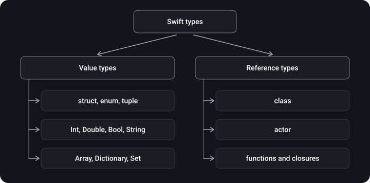
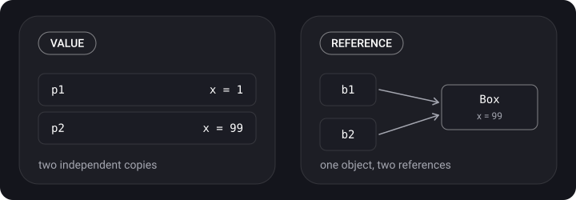
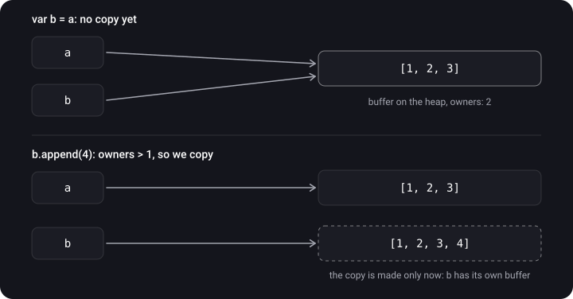

> **What you'll learn**
>
> - How a value type differs from a reference type and which types are which
> - What happens on assignment and when passing to a function
> - How `inout` and `mutating` work
> - The difference between `==` and `===`
> - How Copy-on-Write works and how to write it yourself
> - How a deep copy differs from a shallow copy

> **Prerequisites:** topics [01](../memory-segments-memorylayout/)–[02](../stack-heap/) — the stack, the heap, "the reference is on the stack, the object is on the heap".

## Analogy: a photocopy and a link to a document

- **Value type** — a photocopy. You gave a colleague a copy of the contract, they crossed something out — your copy hasn't changed.
- **Reference type** — a link to a shared Google doc. You gave the link, your colleague edited the text — you see the edit, because there is only one document.
- **Copy-on-Write** — a clever document department. It hands everyone a "read-only" link. It makes a real copy only when someone picks up a pen to change something.

## Step 1. Two kinds of types



> **Value type** — on assignment or passing, the **value** is copied. Every variable has its own independent copy.
>
> **Reference type** — the **reference** is copied. All variables point to the same object.

```swift
struct Point { var x: Int }
var p1 = Point(x: 1)
var p2 = p1          // a copy
p2.x = 99

class Box { var x = 1 }
let b1 = Box()
let b2 = b1          // the same reference
b2.x = 99
```

<details>
<summary>What are p1.x and b1.x equal to?</summary>

`p1.x == 1` — `p2` got an independent copy. `b1.x == 99` — `b1` and `b2` point to the same object.

</details>



## Step 2. Passing to a function

```swift
func resetValue(_ point: Point) {
    var copy = point
    copy.x = 0         // we change only the local copy
}

func resetReference(_ box: Box) {
    box.x = 0          // we change the shared object
}
```

- Value type → the function receives a **copy**. Nothing changes outside.
- Reference type → the function works with **the same object**. The changes are visible outside.

## Step 3. `inout` — "give me back the modified value"

By default a value parameter is a constant copy. `inout` lets a function modify the caller's variable:

```swift
func double(_ value: inout Int) {
    value *= 2
}

var number = 21
double(&number)    // & is an explicit signal: the variable may be modified
print(number)      // 42
```

**How it works:** the model is "copy in, copy out" (copy-in copy-out). The value is passed into the function, the function changes it, and when it finishes the result is written back to the original variable. The compiler usually optimizes this into passing an address, but you should not rely on it as "pass by reference".

## Step 4. `mutating` — a method that changes a struct

```swift
struct Counter {
    var value = 0
    mutating func increment() {
        value += 1
    }
}

var counter = Counter()
counter.increment()      // ✅

let fixed = Counter()
fixed.increment()        // ❌ compile-time error
```

An ordinary struct method receives `self` as a constant and cannot change it. A `mutating` method receives `self` as an `inout` parameter: it can change fields and even assign `self = Counter()` as a whole. You can't call such a method on a `let` constant — by definition a constant must not be changed.

## Step 5. `==` and `===`

- **`==`** — is the **data** the same? Works for types that implement `Equatable`.
- **`===`** — is it the same **object** in memory? Classes only.

```swift
let a = Box(), b = Box()
a === b      // false — two different objects, even if the fields are equal
a === a      // true
```

## Step 6. How to choose value or reference

| Choose struct if… | Choose class if… |
| --- | --- |
| It matters whether the data is the same (`==`) | It matters whether it is the very same object (`===`) |
| Copies should live independently | You need shared mutable state |
| A data model: a coordinate, settings, a server response | An entity with identity and a lifecycle: a service, a controller, a connection |

**On multithreading.** Value types help avoid races: if every thread got **its own copy**, there is nothing to share. But this only works when copying happens. One and the same `var` variable that two threads access at once is a data race, even if it holds an `Int` (see tutorial «Concurrency → 03»).

## Step 7. Copy-on-Write

For a small struct, a full copy on every assignment is cheap. For an array of a million elements it is expensive. So `Array`, `Dictionary`, `Set` and `String` use **Copy-on-Write (CoW)**:

1. `var b = a` — there is no real copy, both point to one buffer on the heap.
2. As long as nobody changes the data, the buffer is shared.
3. The first attempt to change `b` → the check "am I the only owner of the buffer?" → no → a copy is created and the change is made to that copy.



**Your own CoW.** A wrapper around a class plus an `isKnownUniquelyReferenced` check:

```swift
final class Storage<T> {
    var value: T
    init(_ value: T) { self.value = value }
}

struct CoWBox<T> {
    private var storage: Storage<T>

    init(_ value: T) { storage = Storage(value) }

    var value: T {
        get { storage.value }
        set {
            if isKnownUniquelyReferenced(&storage) {
                storage.value = newValue          // the only owner — change in place
            } else {
                storage = Storage(newValue)        // there are other owners — make a copy
            }
        }
    }
}
```

- `Storage` is a class, so several `CoWBox`es can share one instance.
- On write, `isKnownUniquelyReferenced` checks whether the storage has other owners. If not, we change it in place; if so, we create our own.

> **Key point:** CoW is not a property of all structs. Your own `struct` is copied immediately on assignment. Deferred copying exists only in the standard collections and in types where you wrote CoW yourself, as above.

## Step 8. Deep copy and shallow copy

- **Shallow copy** — only the reference is copied. The "copy" points to the same object.
- **Deep copy** — the entire contents are copied, and you get an independent object.

```swift
class Engine { var power = 100 }
struct Car { var engine: Engine }

var car1 = Car(engine: Engine())
var car2 = car1           // the struct is copied…
car2.engine.power = 500   // …but engine is a reference!
```

<details>
<summary>What is car1.engine.power equal to?</summary>

**500.** Copying a struct copies its fields. The `engine` field is a reference, so the reference was copied, and both cars share one engine. This is a shallow copy inside a value type.

</details>

You can't get a deep copy of a class automatically: implement `NSCopying` or write your own `copy()` method that creates a new instance with copied fields.

## Step 9. A preview of topic 04

Reference types almost always live on the heap. Value types usually live on the stack, but there are exceptions: a value hidden behind a protocol (`any Protocol`), a variable captured by an escaping closure, a field inside a class, and others. They are covered in [topic 04](../value-types-on-heap-existential/).

## Common mistakes

- "My struct is copied lazily, like an array". No: CoW exists only in collections and wherever you wrote it yourself.
- Mixing up `==` and `===`. For structs `===` is not applicable at all.
- Forgetting `mutating` on a method that changes a struct's fields.
- Assuming that a copy of a struct with a class inside is completely independent.
- "A value type is thread-safe". A copy is safe, not a shared variable.

## Cheat sheet

```text
Value     = struct, enum, tuple, Int, String, Array… → the value is copied
Reference = class, actor, closures                    → the reference is copied

inout     = copy-in copy-out, called with &
mutating  = a struct method gets self as inout; can't be called on let
==        = is the data equal;  === = is it the same object (classes only)

CoW       = Array/Dictionary/Set/String: a copy on the first write,
            if the buffer has > 1 owner (isKnownUniquelyReferenced)
Shallow   = the reference is copied;  Deep = the entire contents are copied
struct with a class inside → a copy of the struct shares the class object
```

## Self-check questions

<details>
<summary>1. Which of these are value types and which are reference types: struct, class, enum, closure, tuple, actor?</summary>

Value: struct, enum, tuple. Reference: class, closure, actor.

</details>

<details>
<summary>2. A function changed the struct passed to it. Will the original change?</summary>

No, unless the parameter is `inout`: the function worked with a copy.

</details>

<details>
<summary>3. When does Array actually get copied?</summary>

On the first attempt to change an array whose buffer has more than one owner. The assignment `let b = a` by itself copies nothing.

</details>

<details>
<summary>4. Why can't a mutating method be called on a let?</summary>

`mutating` changes the value, and `let` is an immutable constant.

</details>

<details>
<summary>5. A struct contains a class field. What happens after var b = a and a change to that object through b?</summary>

The change will be visible through `a` too: when the struct was copied, only the reference to the object was copied.

</details>

<details>
<summary>6. How does a shallow copy differ from a deep copy?</summary>

A shallow copy copies the reference — the "copy" points to the same object. A deep copy copies all the contents and creates an independent object.

</details>

## Sources

- [The difference between a value type and a reference type in iOS Swift](https://russianblogs.com/article/7507894894/) (in Russian)
- [Lesson 06. Value types and reference types](https://www.youtube.com/watch?v=YUh3vnzwXOs) (video, in Russian)
- [Memory management in Swift](https://swiftme.ru/upravlenie-pamyatyu-v-swift-8281/#usememory) (in Russian)
- [Value Types and Reference Types in Swift](https://www.vadimbulavin.com/value-types-and-reference-types-in-swift/)
- [Kirill Averyanov — Copy on Write in Swift](https://www.youtube.com/watch?v=66g_pD3s7TY&t=15s) (video, in Russian)
- [iOS Memory Management (Part 3): Reference and Value Type, Copy on Write, Stack and Heap](https://youtu.be/w5GvKG9doTg?t=110) (video, in Russian)
- [Type Erasure, Copy on write in Swift](https://www.youtube.com/watch?v=A9MYXaEBu_Y) (video, in Russian)
- [Copy-on-write](https://habr.com/ru/articles/673372/) (in Russian)
