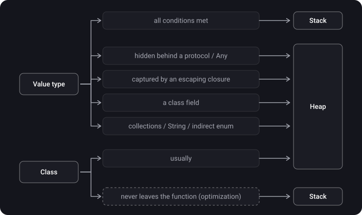
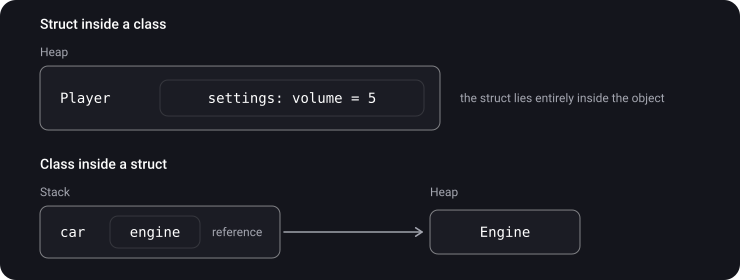
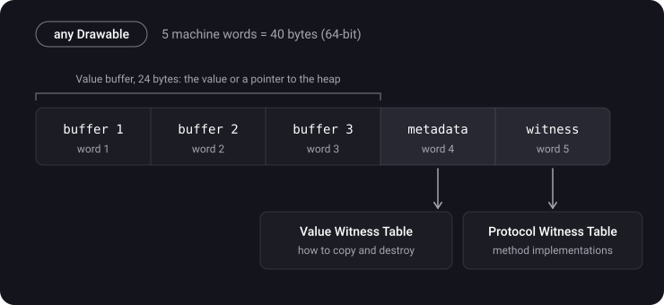

> **What you'll learn**
>
> - Why the rule "value → stack, reference → heap" is only an approximation
> - In which cases a struct ends up on the heap
> - How an escaping closure captures variables and how a capture list helps
> - How the existential container is laid out and why it weighs 40 bytes
> - When a class can end up on the stack

> **Prerequisites:** topics [01](../memory-segments-memorylayout/)–[03](../value-reference-copying/) — the stack and the heap, value/reference types, Copy-on-Write.

## Analogy: a locker

The stack is your personal shelf on your desk: fast, but space is limited, and at the end of the day (when the function returns) everything on it is thrown away.

Sometimes an item doesn't belong on the shelf:

- **A protocol** — you are given a standard fixed-size locker (3 slots). A small item fits inside. A big one goes to the warehouse (the heap), and the locker holds a receipt.
- **An escaping closure** — you want to take the item with you after the workday ends. It has to be moved from the desk to the warehouse, otherwise it will be thrown out with everything else.
- **A struct inside a class** — the item lies in a box, and the box is already in the warehouse. So the item is in the warehouse too.

## Step 1. When a value can live on the stack

The compiler puts a value on the stack if **all** of these conditions hold:

1. The size is known in advance.
2. The lifetime does not extend beyond the function.
3. The value is not shared with anyone else by reference.

As soon as one condition breaks, the data moves to the heap. Let's see where that happens.



## Step 2. Case 1 — a value behind a protocol (or `Any`)

A variable of type `any Drawable` can store any struct: 8 bytes, 16 or 500. The compiler doesn't know the size in advance, so it uses a fixed-size container — the **existential container** (details in step 6):

- a value of **up to 24 bytes** sits right inside the container;
- a value of **more than 24 bytes** goes to the heap, and the container keeps a pointer.

```swift
protocol Drawable { func draw() }

struct Dot: Drawable {            // 16 bytes — fits
    var x, y: Double
    func draw() {}
}

struct Rect: Drawable {           // 32 bytes — doesn't fit
    var x, y, width, height: Double
    func draw() {}
}

let a: any Drawable = Dot(x: 0, y: 0)                     // inside the container
let b: any Drawable = Rect(x: 0, y: 0, width: 1, height: 1) // on the heap
```

The same goes for `Any` and for fields of type `Any` — that is an existential container too.

## Step 3. Case 2 — an escaping closure

```swift
func makeCounter() -> () -> Int {
    var count = 0
    return {
        count += 1
        return count
    }
}

let counter = makeCounter()
counter()
counter()
```

<details>
<summary>What will the second call to counter() return, and where does count live?</summary>

**2.** The closure outlived the `makeCounter` function, and `count` outlived it along with the closure. If `count` lived in the stack frame, it would vanish when the function returned. So the compiler puts it into a "box" on the heap, and the closure holds a reference to that box.

</details>

**How a closure captures variables:**

- **Without a capture list** the variable is captured **by reference**: the closure sees its current value and can change it.
- **With a capture list** `[x]` the value is **copied** at the moment the closure is created.

```swift
var x = 1
let byReference = { print(x) }
let byValue = { [x] in print(x) }
x = 2

byReference()   // 2 — sees the current value
byValue()       // 1 — a copy made at creation
```

## Step 4. Case 3 — a struct inside a class and vice versa

```swift
struct Settings { var volume = 5 }

final class Player {
    var settings = Settings()   // Settings lives INSIDE the Player object → on the heap
}

final class Engine {}
struct Car {
    let engine = Engine()       // the struct holds a reference (8 bytes), the Engine object is on the heap
}
```



## Step 5. Case 4 — variable-size data

Already familiar from [topic 02](../stack-heap/): for `Array`, `Dictionary`, `Set` and `String` the variable itself is small, while the data lives in a buffer on the heap. `indirect enum` belongs here too: its recursive cases are stored on the heap.

## Step 6. The existential container — how it is laid out

> **Existential container** — a fixed-size wrapper for a value whose type is known only through a protocol (`any P`).



- **Value buffer (24 bytes)** — the value itself if it fits, or a pointer to a box on the heap.
- **Value Witness Table** — an "instruction manual" for handling the type. It holds the operations `allocate` (allocate heap memory if the value doesn't fit in the buffer), `copy`, `destruct`, `deallocate`.
- **Protocol Witness Table** — a table that records, for a concrete type, which function implements each protocol method. The call `a.draw()` goes through it: "find the address of `draw` in the table and jump there".

Let's check the sizes:

```swift
MemoryLayout<Dot>.size            // 16
MemoryLayout<Rect>.size           // 32
MemoryLayout<any Drawable>.size   // ?
```

<details>
<summary>How many bytes will any Drawable take, and does it depend on what is inside?</summary>

**40 bytes** on a 64-bit platform — for both `Dot` and `Rect`. The container is always the same size, which is exactly why an `[any Drawable]` array can store different types mixed together: every element is 40 bytes.

</details>

**The cost of the container:**

- possible heap allocation for large values;
- indirect method calls through the Protocol Witness Table instead of direct ones;
- copying through the Value Witness Table.

**How to avoid it.** If the concrete type is known at compile time, use generics or `some`:

```swift
func render(_ shape: any Drawable) { shape.draw() }   // a container, an indirect call
func render(_ shape: some Drawable) { shape.draw() }  // no container, the compiler knows the type
```

## Step 7. The reverse case — a class on the stack

The compiler can place a class instance on the stack if it has **proved** that the reference never leaves the function (the stack promotion optimization). Then neither a heap allocation nor reference counting is needed.

> This is an optimizer decision, not a language guarantee. Don't write code relying on it — it is enough to know it happens.

## Step 8. Nuances

- Wherever the data lives, a value type's **copy semantics** are preserved: a struct on the heap still behaves like a value.
- The `any` keyword (Swift 5.6+) simply makes the existential container visible in code: `let x: Drawable` and `let x: any Drawable` are the same thing.

## Common mistakes

- "A struct never ends up on the heap". It does: behind a protocol, in an escaping capture, inside a class.
- "A big struct moves to the heap by itself". Size alone has nothing to do with it — what matters is the packaging.
- Confusing the container (40 bytes) with the value inside it.
- Thinking a capture list works "by reference". The opposite: a capture list holds a copy.
- Writing `any Protocol` where generics or `some` would do, and paying for the container needlessly.

## Cheat sheet

```text
Stack if: size known + doesn't outlive the function + not shared

Value → heap when:
  any Protocol / Any, value > 24 bytes    → a box on the heap
  captured by an escaping closure         → a box on the heap
  a class field                           → inside the object on the heap
  Array/String/Dictionary/Set, indirect   → data on the heap

Capture list:  [x] → a copy at creation;  no list → by reference
Existential container = 24 (buffer) + 8 (metadata/VWT) + 8 (PWT) = 40 bytes
some / generics → no container;  any → a container
Class on the stack → only an optimization (stack promotion)
```

## Self-check questions

<details>
<summary>1. Name three cases when a struct ends up on the heap.</summary>

A value behind a protocol or `Any` if it doesn't fit in 24 bytes; a variable captured by an escaping closure; a struct that is a field of a class. Also the data of collections and `String`.

</details>

<details>
<summary>2. What does an existential container consist of and how much does it weigh?</summary>

A 3-word value buffer (24 bytes), a pointer to the type metadata with the Value Witness Table (8 bytes), a pointer to the Protocol Witness Table (8 bytes). 40 bytes in total on a 64-bit platform.

</details>

<details>
<summary>3. What will the code below print?</summary>

```swift
var name = "Anna"
let greet = { [name] in print(name) }
name = "Boris"
greet()
```

"Anna". The variable in the capture list was copied at the moment the closure was created.

</details>

<details>
<summary>4. How does some Drawable differ from any Drawable in terms of memory?</summary>

With `some` the compiler knows the concrete type and works with it directly — with no container and no indirect calls. With `any` the value is packed into an existential container.

</details>

<details>
<summary>5. Can a class instance end up on the stack?</summary>

Yes, as an optimization: if the compiler has proved that the reference does not leave the function. It is not a language guarantee.

</details>

## Sources

- [iOS Memory Management (Part 3): Reference and Value Type, Copy on Write, Stack and Heap](https://youtu.be/w5GvKG9doTg?t=527) (video, in Russian)
- [Understanding the existential container in Swift](https://habr.com/ru/articles/949268/) (in Russian)
- [Swift. The any and some keywords. The existential container.](https://www.youtube.com/watch?v=wlgDcPr7P3k&t=1s) (video, in Russian)
- [WWDC 2016 — Understanding Swift Performance](https://developer.apple.com/videos/play/wwdc2016/416/)
