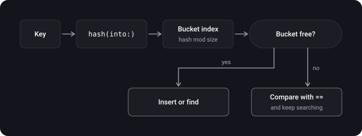
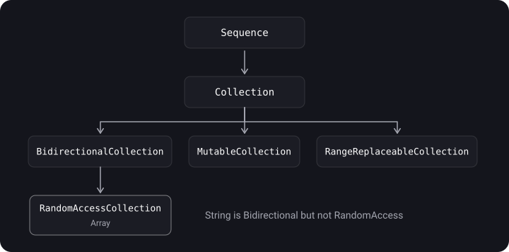

> **What you'll learn**
>
> - How `Array`, `Set`, `Dictionary` are built and what complexity their operations have
> - What a hash table, a hash function and a collision are
> - `Equatable`, `Hashable`, `Comparable` and the synthesis rules
> - Walkthroughs of interview tasks on `Hashable`
> - `Sequence`, `Collection`, slices and lazy collections
> - `count` and `capacity`, `ContiguousArray`, an array of weak references, a safe subscript

> **Prerequisites:** [tutorial 01](../structs-classes-enums/) (copy-on-write), [tutorial 07](../protocols-extensions-casting/) (protocols), [tutorial 06](../closures-higher-order/) (`map`, `filter`).

## Analogy: a cabinet with cells and an address book

- **Array** — a row of numbered cells. Grabbing the "third" one is instant. Inserting in the middle means shifting everything after it. Searching by contents means going through the cells one by one.
- **Dictionary / Set** — an address book with a table of contents: from the name you immediately calculate the "page" and open it. The calculation of the "page" is the hash function; if two names have the same page, that is a collision.

## Step 1. Array

> **Array** — an ordered collection of elements of the same type. The elements lie **contiguously** in a heap buffer; the `Array` itself is a struct holding a reference to this buffer (that is why it has copy-on-write, [tutorial 01](../structs-classes-enums/)).

```swift
var array = Array(repeating: 2.5, count: 3)   // [2.5, 2.5, 2.5]
array += [1.0]                                 // append an array
for (index, value) in array.enumerated() {     // index and value
    print(index, value)
}
```

**`count` and `capacity`.** `count` is how many elements there are now, `capacity` is how many fit without reallocating memory. When `count` hits `capacity`, the array allocates a larger buffer (typically twice as large) and copies the elements. If you know the size in advance, `reserveCapacity` creates the buffer right away:

```swift
var numbers = [Int]()
numbers.reserveCapacity(1000)
print(numbers.count)               // 0
print(numbers.capacity >= 1000)    // true
```

Reallocation is usually not a problem: the buffer grows geometrically, so a million `append`s cause only about twenty reallocations. Reserving makes sense for huge arrays or for paths where latency matters (an audio buffer).

**Slices.** `ArraySlice` is a "window" into the same buffer. It is created in O(1), without copying elements, and **keeps the original indices**:

```swift
let list = [10, 20, 30, 40, 50]
let slice = list[1..<4]            // ArraySlice<Int>: [20, 30, 40]
print(slice.startIndex)            // 1 — the indices are not renumbered!
print(slice[1])                    // 20
let copy = Array(slice)            // a new array, indices from 0, the elements are copied
```

A slice keeps the whole original buffer alive for as long as it exists — for long-term storage, copy it into an `Array`.

**Complexity of `Array` operations:**

| Operation | Complexity | Explanation |
| --- | --- | --- |
| `array[i]`, `count` | O(1) | direct access by index |
| `append` | O(1) amortized | the buffer is rarely doubled at O(n), but on average it is O(1) per operation |
| `removeLast` | O(1) | nothing is shifted |
| `insert(_:at:)`, `remove(at:)`, `removeFirst` | O(n) | elements are shifted |
| `contains`, `firstIndex(of:)` | O(n) | linear search |
| `removeAll` | O(n) | the elements have to be released; for simple types the optimizer can speed it up |
| `sorted()` | O(n log n) | sorting |

## Step 2. Set and Dictionary

> **Set** — an unordered collection of **unique** values. **Dictionary** — an unordered collection of "key→value" pairs with unique keys. The elements of a `Set` and the keys of a `Dictionary` must be `Hashable`.

```swift
var genres: Set<String> = ["Rock", "Classical", "Hip hop"]
genres.insert("Rock")           // a duplicate — nothing changes
print(genres.count)             // 3
print(genres.contains("Jazz"))  // false — O(1) on average

var ages: [String: Int] = ["Anna": 30]
ages["Boris"] = 25                         // insertion
for (name, age) in ages { print(name, age) }   // the order is not guaranteed
let names = Array(ages.keys)
```

| Operation | Set | Dictionary |
| --- | --- | --- |
| insert / lookup / remove | O(1) on average | O(1) on average |
| worst case (many collisions) | O(n) | O(n) |

**`nil` in a dictionary.** Assigning `dict[key] = nil` **removes** the key. To store a key with a `nil` value (when `Value` is an Optional), use `.some(nil)`:

```swift
var d: [String: Int?] = ["a": 1]
d["a"] = nil          // the key "a" is removed
d["b"] = .some(nil)   // the key "b" is stored, the value is nil
print(d.count)        // 1
```

**Other collections.** `OrderedSet`, `OrderedDictionary`, `Deque`, `Heap` — in the **swift-collections** package (a separate SwiftPM package from Apple, not part of the standard library).

## Step 3. The hash table and collisions

> **Hash function** turns a value into an integer (a hash). A **hash table** uses the hash to compute an element's position in an array of buckets. A **collision** is when two different values land in the same bucket.



## Step 4. Equatable, Hashable, Comparable

> **`Equatable`** — has `==`. **`Hashable`** — extends `Equatable`, adds `hash(into:)`. **`Comparable`** — extends `Equatable`, adds `<` (the others, `>`, `<=`, `>=`, come automatically).

**The main rule:** if `a == b`, then `a` and `b` **must** have the same hashes. The converse is false: equal hashes don't mean equality (that is a collision).

**Compiler synthesis.** The compiler generates `==` and `hash(into:)` itself if you declared the conformance **in the type's original declaration** and:

- `struct` — all stored properties are `Hashable`;
- `enum` — all associated values are `Hashable` (an enum without associated values conforms automatically).

```swift
struct Point: Hashable { var x: Int; var y: Int }       // everything is synthesized
enum Direction: Hashable { case north, south }          // so is this

class Value: Hashable {                                  // a class — by hand
    var a = 1
    static func == (lhs: Value, rhs: Value) -> Bool { lhs.a == rhs.a }
    func hash(into hasher: inout Hasher) { hasher.combine(a) }
}
```

Synthesis won't work for classes, for a struct with a non-`Hashable` field and for an enum with a non-`Hashable` associated value. To compare identity with `===`, a `class` doesn't need an `Equatable` implementation.

**The rule when writing by hand:** in `hash(into:)` combine the same fields that you compare in `==` (or a subset of them), never more.

```swift
struct User: Hashable {
    let id: Int
    let name: String
    static func == (l: User, r: User) -> Bool { l.id == r.id }   // equality by id
    func hash(into hasher: inout Hasher) { hasher.combine(id) }  // hash by id only
}
```

**Comparable:**

```swift
struct Version: Comparable {
    let major: Int
    let minor: Int
    static func < (l: Version, r: Version) -> Bool {
        (l.major, l.minor) < (r.major, r.minor)    // tuple comparison
    }
}
print(Version(major: 1, minor: 2) < Version(major: 1, minor: 10))   // true
```

## Step 5. Hashable tasks

**Task 1.** All hashes are the same, but the values are different. What does it print?

```swift
class KeyObject: Hashable {
    static func == (lhs: KeyObject, rhs: KeyObject) -> Bool { lhs.a == rhs.a }
    let a: Int
    func hash(into hasher: inout Hasher) { hasher.combine(0) }   // always the same contribution
    init(a: Int) { self.a = a }
}

let key1 = KeyObject(a: 1)
let key2 = KeyObject(a: 2)
var dict = [KeyObject: String]()
dict[key1] = "hi"
print(dict[key2], dict[key1])
```

<details>
<summary>Answer</summary>

`nil Optional("hi")`. The hashes of `key1` and `key2` match, so the dictionary looks into the same bucket, but confirms the match through `==`: `key2 != key1`, so no value is found for `key2`. Correct, but inefficient: lookup degrades to O(n).

</details>

**Task 2.** Different objects with the same `a`:

```swift
class KeyObject2: Hashable {
    static func == (lhs: KeyObject2, rhs: KeyObject2) -> Bool { lhs.a == rhs.a }
    let a: Int
    func hash(into hasher: inout Hasher) { hasher.combine(a) }
    init(a: Int) { self.a = a }
}

let key1 = KeyObject2(a: 1)
let key2 = KeyObject2(a: 1)       // a different object, but == gives true
var dict = [KeyObject2: String]()
dict[key1] = "hi"
print(dict[key2], dict[key1])
```

<details>
<summary>Answer</summary>

`Optional("hi") Optional("hi")`. From `Hashable`'s point of view this is one and the same key: the hash and `==` match, even though these are different objects in memory.

</details>

**Task 3.** All keys match by hash, but `==` is by field (a struct):

```swift
struct KeyObject3: Hashable {
    let a: Int
    func hash(into hasher: inout Hasher) { hasher.combine(0) }
}
let k1 = KeyObject3(a: 1)
let k2 = KeyObject3(a: 3)
var dict = [KeyObject3: String]()
dict[k1] = "Hi"
dict[k2] = "hello"
print(dict[k2] as Any)
```

<details>
<summary>Answer</summary>

`Optional("hello")`. `==` is synthesized by `a`, so the keys are different. Everything works correctly, but lookup is O(n) because of mass collisions.

</details>

**When does a key lookup become O(n)?** When many keys have the same hash (a bad hash function or an input set specially chosen to cause collisions).

## Step 6. Sequence and Collection

> **`Sequence`** — a type that provides sequential access to elements through an iterator (`makeIterator()`). Implementing it gives you `for-in`, `map`, `filter`, `contains` and other methods "for free".

```swift
struct Countdown: Sequence, IteratorProtocol {
    var count: Int
    mutating func next() -> Int? {
        if count == 0 { return nil }
        defer { count -= 1 }
        return count
    }
}

for i in Countdown(count: 3) { print(i) }   // 3, 2, 1
print(Countdown(count: 3).map { $0 * 10 })  // [30, 20, 10]
```



`Collection` adds indices and repeated traversal; `RandomAccessCollection` — O(1) access by index (`Array`). `String` is a `BidirectionalCollection`, but not a `RandomAccessCollection` ([tutorial 11](../strings-unicode/)).

## Step 7. Lazy collections

> **`.lazy`** defers computation until the moment the elements are actually requested, and runs the chain of operations element by element.

```swift
let numbers = [1, 2, 3, 6, 9]

let lazyResult = numbers.lazy
    .filter { print("filter \($0)"); return $0 % 2 == 0 }
    .map { print("map \($0)"); return $0 * 2 }

print("chain created")        // nothing has been computed yet
print(lazyResult.first as Any)         // exactly as much as needed runs here
// chain created
// filter 1
// filter 2
// map 2
// Optional(4)
```

## Step 8. An array of weak references

An array holds objects **strongly**. To store weak references (for example, a list of observers), you need a wrapper or a special collection.

| Approach | Pros | Cons |
| --- | --- | --- |
| Your own `Weak<T>` wrapper | type-safe, order is preserved | `nil` elements have to be removed manually |
| `NSPointerArray.weakObjects()` | order is preserved, has `compact()` | no typing (a cast with `as?`) |
| `NSHashTable<T>.weakObjects()` | automatic cleanup, typed | no order |

```swift
final class Weak<T: AnyObject> {
    weak var value: T?
    init(_ value: T) { self.value = value }
}

final class Stuff { }

var observers: [Weak<Stuff>] = []
var s: Stuff? = Stuff()
observers.append(Weak(s!))
s = nil                                  // the object was deallocated
observers.removeAll { $0.value == nil }  // manual cleanup
print(observers.count)                   // 0

let table = NSHashTable<Stuff>.weakObjects()   // Foundation
```

## Step 9. A safe subscript and ContiguousArray

An out-of-bounds index is a crash. A safe variant through an `extension`:

```swift
extension Collection {
    subscript(safe index: Index) -> Element? {
        index >= startIndex && index < endIndex ? self[index] : nil
    }
}

extension Array {
    subscript(index: Int, default defaultValue: @autoclosure () -> Element) -> Element {
        indices.contains(index) ? self[index] : defaultValue()
    }
}

let names = ["Anna", "Boris"]
print(names[safe: 5] as Any)                       // nil
print(names[7, default: "Anonymous"])              // Anonymous
```

**`ContiguousArray`** — an array that is guaranteed to store its elements contiguously. It matters for class elements and `@objc` protocols: in that case an ordinary `Array` may be bridged to `NSArray`, while `ContiguousArray` is not, and so it is faster and more predictable. For struct and enum elements the difference is usually unnoticeable.

## Common mistakes

- Doing `insert(at: 0)`/`removeFirst()` in a loop over an array → O(n²).
- Searching an array with `contains` inside a loop instead of using a `Set` → O(n²).
- Relying on the order of elements of a `Set`/`Dictionary`.
- Writing `==` over some fields and `hash(into:)` over others (equal objects with different hashes break the collection).
- Thinking that `hashValue` is unique or stable between launches.
- Storing a mutable field that is part of the hash in a dictionary key: after it changes, the key will "get lost" in the table.
- Taking `Array(slice)` for a "slice" and thinking there is no copying.

<details>
<summary>A tricky question: why can a slice lead to a memory leak?</summary>

`ArraySlice` shares the buffer with the original array and keeps all of it alive. If you took a slice of a huge array and keep it for a long time, the entire original buffer stays in memory. For long-term storage, copy with `Array(slice)`.

</details>

## Cheat sheet

```text
Array       [i] O(1)  append O(1)* (amortized)  insert/remove(at:) O(n)  contains O(n)
Set         insert/contains/remove O(1) avg, O(n) worst; elements are Hashable
Dictionary  get/set/remove O(1) avg, O(n) worst; keys are Hashable; dict[k] = nil removes

Hashable: a == b  =>  a.hash == b.hash   (the converse is false)
          hash(into:) together with ==;  the hash is randomized on every launch

arr[1..<4]                 // ArraySlice (shared buffer, O(1), indices preserved)
Array(arr[1..<4])          // a copy
arr.lazy.filter{}.map{}    // lazy, element by element
reserveCapacity(n)         // allocate the buffer in advance
```

## Self-check questions

<details>
<summary>1. What is the complexity of operations on Array, Set, Dictionary?</summary>

Array: access by index O(1), `append` amortized O(1), `insert`/`remove` in the middle and search O(n). Set/Dictionary: O(1) on average, O(n) in the worst case with many collisions.

</details>

<details>
<summary>2. How does count differ from capacity?</summary>

`count` is the number of elements, `capacity` is the capacity of the current buffer without reallocation. `reserveCapacity` allocates space in advance.

</details>

<details>
<summary>3. What is a collision and how does Swift deal with it?</summary>

Two different keys produced the same index in the table. Swift uses open addressing with linear probing, comparing candidates through `==`; the table grows when it fills up.

</details>

<details>
<summary>4. What are the rules of Hashable?</summary>

Equal objects must have the same hash; the hash is computed in `hash(into:)` through `Hasher`; it is not unique and is randomized on every launch.

</details>

<details>
<summary>5. When does the compiler synthesize Equatable and Hashable?</summary>

For a struct — if all stored properties are Hashable; for an enum — if all associated values are Hashable. For a class — never, you have to write it by hand.

</details>

<details>
<summary>6. What is the difference between a slice and a copy of an array?</summary>

A slice (`ArraySlice`) shares the buffer and is created in O(1), preserving the indices; `Array(slice)` copies the elements into a new buffer.

</details>

<details>
<summary>7. How do you store weak references in an array?</summary>

A `Weak<T>` wrapper (type-safe, manual cleanup), `NSPointerArray.weakObjects()` (order, `compact()`), `NSHashTable.weakObjects()` (no order, automatic cleanup).

</details>

## Sources

- [Collection Types — The Swift Programming Language](https://docs.swift.org/swift-book/documentation/the-swift-programming-language/collectiontypes/)
- [Array — Apple Developer Documentation](https://developer.apple.com/documentation/swift/array)
- [Hashable — Apple Developer Documentation](https://developer.apple.com/documentation/swift/hashable)
- [SE-0206: Hashable Enhancements](https://github.com/swiftlang/swift-evolution/blob/main/proposals/0206-hashable-enhancements.md)
- [Swift Collections — swiftlang/swift-collections](https://github.com/apple/swift-collections)
