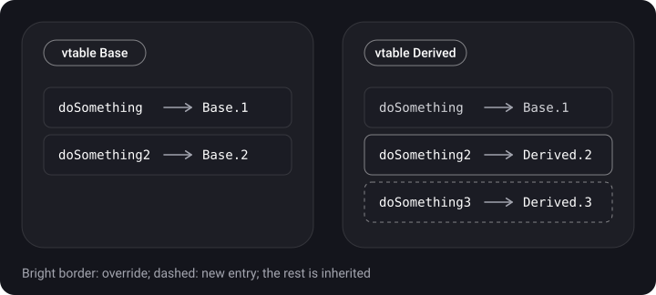
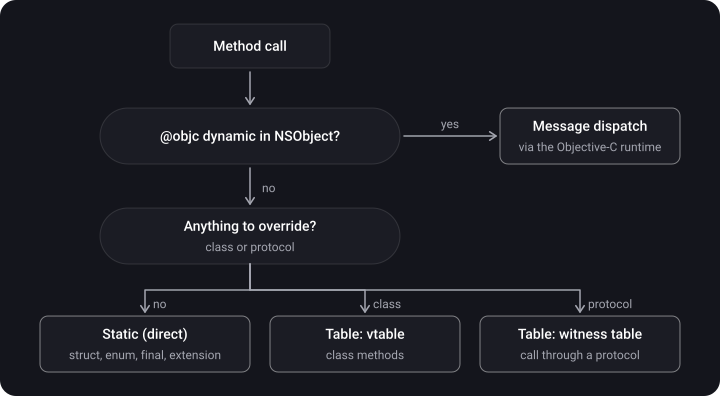

> **What you'll learn**
>
> - What method dispatch is and why it is needed
> - The three kinds: static (direct), table (vtable / witness table), message
> - Which dispatch is chosen for struct, class, protocols, extension, `final`, `private`, `@objc dynamic`
> - How to check the dispatch through SIL
> - Method swizzling, KVC and KVO
> - Walkthroughs of interview dispatch tasks

> **Prerequisites:** [tutorial 01](../structs-classes-enums/) (struct/class), [tutorial 03](../init-inheritance-access/) (`final`, `override`), [tutorial 07](../protocols-extensions-casting/) (protocols, extension), [tutorial 08](../generics-any-some/) (existential container).

## Analogy: who answers the phone

You call an office and ask: "get the invoice".

- **Static dispatch** — you know the accountant's direct number and call her straight away. Fast, but only if exactly one person can answer.
- **Table dispatch** — you call the reception desk and look up the right department in a directory of positions: each department has its own directory, and the number in it may differ.
- **Message dispatch** — you shout into the room "invoice, please!" and wait until somebody answers; everything is decided on the fly, and you can even swap out whoever answers.

## Step 1. What dispatch is

> **Method dispatch** — the process of choosing a concrete implementation of a method when it is called: which memory address to jump to in order to execute the needed instructions.

Method call → **dispatch** → execution of the method body.

## Step 2. Static (direct) dispatch

The compiler knows that the method has **exactly one implementation** — the address is baked into the call. The fastest kind; it allows **inlining**: the compiler can substitute the function body in place of the call.

**When it is static:**

- methods of `struct`, `enum` (no inheritance — nothing to override);
- `final class` and `final` members;
- `private` and `fileprivate` methods — nobody can override them in another file; and with Whole Module Optimization enabled, the compiler can prove there are no overrides for `internal` ones too;
- methods declared in an `extension` (including a protocol `extension`);
- `static` methods (this is `class final`);
- the optimizer can "devirtualize" even a virtual call if it knows the concrete type for certain.

```swift
final class Fast {                       // final → all methods are static
    func doSomething() { print("fast") }
}

class Slow {
    func doSomething() { doPrivate() }   // vtable (unless devirtualized)
    private func doPrivate() { }         // static: it can't be overridden
}

extension Slow {
    func fromExtension() { }             // static: a method in an extension
}
```

**Whole Module Optimization (WMO)** — a build mode in which the compiler sees the whole module at once: it can find out that a method has no overrides and make the call static or inline it. You should enable it in Release builds (in Xcode it is on by default in Release).

**Inlining:**

```swift
func addOne(to num: Int) -> Int { num + 1 }
let twoPlusOne = addOne(to: 2)
// after optimization it may become: let twoPlusOne = 2 + 1 — there is no call anymore
```

## Step 3. Table dispatch

**Table (dynamic) dispatch** works at runtime: the call goes through a table of pointers to implementations. There are two varieties.

- **Virtual table (vtable)** — every class has a table of its methods; a subclass copies the parent's table and replaces the overridden entries. It is needed for inheritance and `override`.
- **Protocol witness table (PWT)** — for each "type + protocol" pair, a table in which every protocol requirement points to that type's implementation. It is used for calls through a protocol (`any P`, an unspecialized generic).

```swift
class Base {
    func doSomething()  { print("Base 1") }   // in Base's vtable
    func doSomething2() { print("Base 2") }
}
class Derived: Base {
    override func doSomething2() { print("Derived 2") }  // its own entry in Derived's vtable
    func doSomething3() { print("Derived 3") }            // a new entry
}

let obj: Base = Derived()
obj.doSomething2()   // Derived 2 — chosen by the vtable of the real type
```



## Step 4. Message dispatch

> **Message dispatch** — an Objective-C mechanism: calling a method is sending a **message** (a selector) to an object. The runtime looks for the implementation by selector in the object's class, then up the chain of superclasses; if it doesn't find one — `unrecognized selector`, a crash.

- It works at runtime and is the most expensive of the three, but it has a **method cache**, so repeated calls are faster.
- It allows changing behavior at runtime: **method swizzling**, KVO (isa-swizzling), `UIAppearance`, Core Data.
- In Swift it is enabled for members marked `@objc dynamic` (`dynamic` requires `@objc` to work through the Objective-C runtime), and also for members of `NSObject` subclasses that are declared `@objc` in an `extension`.

```swift
import Foundation

class Base: NSObject {
    @objc dynamic func hello() -> String { "base" }   // message dispatch
}
class Derived: Base {
    override func hello() -> String { "derived" }
}

let b: Base = Derived()
print(b.hello())   // derived
```

`@objc` and `dynamic` are different things. `@objc` makes a member visible to the Objective-C runtime (a selector is generated), but by itself it doesn't change the dispatch of Swift calls: an ordinary call of such a method may remain static or table. `dynamic` is what forces Swift to call the method through message sending.

## Step 5. What gets chosen and when

The choice is affected by two factors: (1) what kind of type it is (struct / class / protocol / NSObject) and (2) where the method is declared — in the original declaration or in an `extension`.

| Where the method is declared | struct / enum | class | protocol (requirement) | NSObject subclass |
| --- | --- | --- | --- | --- |
| In the main declaration | static | vtable | witness table | vtable; with `@objc dynamic` — message |
| In an `extension` | static | static | static (default implementations and methods that aren't requirements) | static; with `@objc` in the extension — message |
| `final` / `private` | — | static | — | static (for non-`dynamic`) |



> **How to check it yourself.** Print the intermediate SIL code: `swiftc -emit-silgen MyFile.swift`. In it: `function_ref` — static dispatch, `class_method` — vtable, `witness_method` — witness table, `objc_method` — message dispatch. For optimized code: `swiftc -O -emit-sil MyFile.swift`.

## Step 6. Dispatch tasks

**Task 1.** What does this code print?

```swift
protocol P { }
extension P {
    func method() { print("from protocol") }
}
struct C: P {
    func method() { print("from struct") }
}

let firstObject = C()
firstObject.method()
let secondObject: P = C()
secondObject.method()
```

<details>
<summary>Answer</summary>

`from struct`, then `from protocol`. `method` is not part of `P`'s requirements, so its call is dispatched statically by the variable's type: `C` → the struct's method, `P` → the extension's method. Add `func method()` to the protocol — and the second line becomes `from struct`.

</details>

**Task 2.** What does this code print? The method is in the protocol's requirements, and the subclass doesn't override it but "duplicates" it:

```swift
protocol StaticProto { func foo() }

extension StaticProto {
    func foo() { print("StaticProto") }
}

class ClassA: StaticProto { }           // provides the default implementation from the extension

class ClassB: ClassA {
    func foo() { print("ClassB") }       // this is not an override: ClassA has no foo of its own
}

let x: StaticProto = ClassB()
x.foo()
```

<details>
<summary>Answer</summary>

`StaticProto`. The witness table is built for `ClassA`, which has only the implementation from the extension. `ClassB` inherits this witness table, and its `foo` is a new method, not an override, and doesn't get into the table.

</details>

**Task 3.** The same, but `ClassA` implements the method itself, and the subclasses override it:

```swift
protocol VirtualProto { func foo() }
extension VirtualProto { func foo() { print("VirtualProto") } }

class ClassA: VirtualProto { func foo() { print("ClassA") } }
class ClassB: ClassA { override func foo() { print("ClassB") } }
class ClassC: ClassB { override func foo() { print("ClassC") } }

let x: VirtualProto = ClassC()
x.foo()
```

<details>
<summary>Answer</summary>

`ClassC`. The witness table entry points to `ClassA.foo`, which is called through the **vtable** — and in the vtable of the real class `ClassC` its override sits at that slot.

</details>

## Step 7. Method swizzling

> **Method swizzling** — replacing a method's implementation at runtime: the Objective-C runtime swaps the pointers to the implementations of two selectors in the class's table. **isa swizzling** — replacing the class of a specific object.

```swift
import Foundation

final class Greeter: NSObject {
    @objc dynamic func greet() -> String { "hello" }
    @objc dynamic func shout() -> String { "HELLO" }
}

let m1 = class_getInstanceMethod(Greeter.self, #selector(Greeter.greet))!
let m2 = class_getInstanceMethod(Greeter.self, #selector(Greeter.shout))!
method_exchangeImplementations(m1, m2)

print(Greeter().greet())   // HELLO — the implementations were swapped
```

Pros and risks: swizzling lets you intercept calls in system classes (logging, analytics), but it makes the code non-obvious: behavior changes away from the call site, and it is easy to get conflicts and infinite recursion.

## Step 8. KVC and KVO

> **KVC (Key-Value Coding)** — access to an object's properties by string name at runtime. **KVO (Key-Value Observing)** — subscribing to changes of an object's property (an implementation of the Observer pattern).

Both mechanisms work through the Objective-C runtime — you need an `NSObject` subclass and `@objc dynamic` on the property.

```swift
import Foundation

final class Person: NSObject {
    @objc dynamic var age = 0
}

let person = Person()

// KVC
person.setValue(30, forKey: "age")
print(person.value(forKey: "age") as Any)   // Optional(30)

// KVO (Swift-friendly API)
let token = person.observe(\.age, options: [.old, .new]) { _, change in
    print("age: \(change.oldValue ?? -1) -> \(change.newValue ?? -1)")
}
person.age = 31      // age: 30 -> 31
token.invalidate()   // unsubscribe
```

**How it works.** KVO is implemented through **isa-swizzling**: on the first `observe` the runtime dynamically creates a subclass (`NSKVONotifying_Person`), replaces the object's `isa`, and overrides its setters so that they notify observers. That is why `dynamic` is needed: without it the setter call won't go through the replaced class.

**KVO in Combine:**

```swift
import Combine

let cancellable = person.publisher(for: \.age)
    .sink { print("age changed: \($0)") }
// age changed: 31   <- right on subscription (.initial is on by default)
person.age = 32
// age changed: 32
```

**Rules for working with KVO:**

- keep the token (`NSKeyValueObservation`) — when it is deallocated, the subscription is removed; in `deinit` you can call `invalidate()`;
- KVO is available only for `NSObject` subclasses and `@objc dynamic` properties;
- the old style — `addObserver(_:forKeyPath:options:context:)` and `observeValue(forKeyPath:...)` — is still available, but the new closure-based API is safer.

In SwiftUI code, instead of KVO you usually use the `@Observable` macro (the Observation framework, iOS 17+) or `ObservableObject` — they don't depend on the Objective-C runtime (the «SwiftUI» topic).

## Common mistakes

- Thinking that everything in Swift is dispatched dynamically (or everything statically).
- Adding a method to a protocol `extension` without a requirement and expecting polymorphism.
- Overriding a method declared in a class `extension` without `@objc` (a compile error).
- Making a property KVO-observable without `@objc dynamic`.
- Not keeping the KVO token — the subscription disappears immediately.
- Swizzling methods "just in case": hidden side effects and infinite recursion.
- Claiming in an interview that `final` "protects" against overriding without mentioning the dispatch optimization.

<details>
<summary>A tricky question: what dispatch does a method in a class extension have?</summary>

Static. That is why a method in an `extension` can't be overridden in a subclass (the compiler won't allow it), unless it is `@objc` in an `NSObject` subclass — then it is message dispatch.

</details>

## Cheat sheet

```text
static   : struct/enum, final, private, extension methods, static func  (fast, can be inlined)
vtable   : class methods (override)
witness  : protocol requirements (a call through any P)
message  : @objc dynamic in NSObject (swizzling, KVO)

SIL: function_ref=static  class_method=vtable  witness_method=PWT  objc_method=message
WMO in Release helps the compiler devirtualize calls

KVO: @objc dynamic var x; obj.observe(\.x) { ... }  // keep the token
KVC: obj.setValue(v, forKey: "x"); obj.value(forKey: "x")
swizzling: class_getInstanceMethod + method_exchangeImplementations
```

## Self-check questions

<details>
<summary>1. What is dispatch and what kinds are there?</summary>

Choosing a method's implementation at call time. Static (direct), table (vtable for classes, witness table for protocols), message (Objective-C).

</details>

<details>
<summary>2. In which cases is dispatch static?</summary>

struct/enum, `final`, `private`, methods in an extension, `static` methods; also when the optimizer (WMO) has proven there are no overrides.

</details>

<details>
<summary>3. How does a vtable differ from a witness table?</summary>

A vtable is a table of a class's methods (inheritance, override). A protocol witness table is a table of implementations of a protocol's requirements for a specific type.

</details>

<details>
<summary>4. How does @objc differ from dynamic?</summary>

`@objc` makes a member available to the Objective-C runtime; `dynamic` forces it to be called through message sending.

</details>

<details>
<summary>5. How does KVO work under the hood?</summary>

Isa-swizzling: the runtime dynamically creates a subclass with overridden setters that notify observers, and replaces the object's class. It needs `NSObject` and `@objc dynamic`.

</details>

<details>
<summary>6. What is swizzling and does it work in Swift?</summary>

Replacing method implementations through the Objective-C runtime. It works for `@objc dynamic` methods and methods of Objective-C classes; for ordinary Swift methods the behavior isn't guaranteed.

</details>

<details>
<summary>7. What does the code from task 1 print and why?</summary>

`from struct`, `from protocol`: the method is not part of the protocol's requirements, so the choice is made by the variable's static type.

</details>

## Sources

- [Using Key-Value Observing in Swift — Apple Developer](https://developer.apple.com/documentation/swift/using-key-value-observing-in-swift)
- [Key-Value Coding Programming Guide — Apple Developer Archive](https://developer.apple.com/library/archive/documentation/Cocoa/Conceptual/KeyValueCoding/)
- [Swift Intermediate Language (SIL) — swiftlang/swift, docs/SIL](https://github.com/swiftlang/swift/blob/main/docs/SIL/SIL.md)
- [Type Layout — swiftlang/swift, docs/ABI](https://github.com/swiftlang/swift/blob/main/docs/ABI/TypeLayout.rst)
- [Optimization Options — swift.org](https://github.com/swiftlang/swift/blob/main/docs/OptimizationTips.rst)
