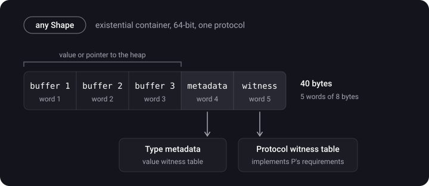

> **What you'll learn**
>
> - What generics are, type constraints and `where`
> - Associated types: why they exist and why a protocol with them can't simply be used as a type
> - How a generic differs from `Any`
> - The existential type `any P`: how it is laid out in memory (the existential container)
> - The opaque type `some P` and how it differs from `any P`
> - Type erasure: why it is needed and how `any` with primary associated types replaces it

> **Prerequisites:** [tutorial 07](../protocols-extensions-casting/) (protocols, extension), [tutorial 01](../structs-classes-enums/) (stack/heap).

## Analogy: a form template and a sealed envelope

- **Generic** — a blank form "Type: ___". Each time it is used, the form is filled in with a concrete type, and the rules are checked immediately.
- **`any P`** — an envelope with a black box: inside is "something that can do P", and the concrete type is revealed only at work time (at runtime).
- **`some P`** — a sealed envelope: you don't know what is inside, but the compiler knows exactly, and it is always the same type.

## Step 1. Generics

> **Generic** — a function or type parameterized by a type. One piece of code works with different types without duplication, and type safety is checked at compile time.

`T` in angle brackets is a **type parameter** (a placeholder). The name can be anything, written with a capital letter: `T`, `Element`, `Key`/`Value`.

```swift
func swapValues<T>(_ a: inout T, _ b: inout T) {
    let temp = a
    a = b
    b = temp
}

var x = 1, y = 2
swapValues(&x, &y)            // x == 2, y == 1
var s1 = "a", s2 = "b"
swapValues(&s1, &s2)          // the same code for String
```

**Generic types** — this is how `Array<Element>`, `Dictionary<Key, Value>`, `Optional<Wrapped>` are built:

```swift
struct Stack<Element> {
    private var items: [Element] = []
    mutating func push(_ item: Element) { items.append(item) }
    mutating func pop() -> Element? { items.popLast() }
}

extension Stack {                          // the extension already knows about Element
    var top: Element? { items.last }
}

var stack = Stack<String>()
stack.push("uno"); stack.push("dos")
print(stack.top as Any)   // Optional("dos")
```

**Type constraints.** By itself `T` can't do anything: you can't compare two `T`s. To compare, you need to require `Equatable`:

```swift
func findIndex<T: Equatable>(of value: T, in array: [T]) -> Int? {
    for (index, item) in array.enumerated() where item == value {
        return index
    }
    return nil
}
```

The key of `Dictionary<Key: Hashable, Value>` is built exactly like this: without `Hashable` a dictionary can't find a key ([tutorial 10](../collections-hashable-complexity/)). You can constrain by a protocol or by a superclass: `<T: SomeProtocol>`, `<T: SomeClass>`.

> Generics are **parametric polymorphism**: a function works the same way for any type that satisfies the constraints. If inside you write `if T == String {...} else {...}`, the point of the generic is lost — an ordinary overload or a protocol is better.

**Specialization.** The compiler can make its own optimized copy of a generic for each type that is used (specialization): calls become static and can be inlined. If specialization isn't possible (for example, a type from another module without `@inlinable`), the code works through type metadata and witness tables — slower.

## Step 2. Associated types

> **`associatedtype`** — a type placeholder inside a protocol. The concrete type isn't specified until a type adopts the protocol.

```swift
protocol Container {
    associatedtype Item
    mutating func append(_ item: Item)
    var count: Int { get }
    subscript(i: Int) -> Item { get }
}

struct IntStack: Container {
    private var items: [Int] = []
    mutating func push(_ x: Int) { items.append(x) }

    mutating func append(_ item: Int) { push(item) }   // Item is inferred as Int
    var count: Int { items.count }
    subscript(i: Int) -> Int { items[i] }
}
```

You can pin the type explicitly with `typealias Item = Int`, but usually the compiler infers it itself. An associated type can be constrained: `associatedtype Item: Equatable`. Refinements go through `where`:

```swift
func allItemsMatch<C1: Container, C2: Container>(_ a: C1, _ b: C2) -> Bool
    where C1.Item == C2.Item, C1.Item: Equatable {
    guard a.count == b.count else { return false }
    for i in 0..<a.count where a[i] != b[i] { return false }
    return true
}
```

Without `where` this function won't compile: you can't compare `a[i] != b[i]` until it is known that they are the same type and that it is `Equatable`. `where` is also used in `extension Container where Item: Equatable` and in `associatedtype Iterator: IteratorProtocol where Iterator.Element == Element`.

## Step 3. Generic versus Any

```swift
let anyArray: [Any] = [1, "hello", true]     // the types are erased
let n = anyArray[0] as? Int                  // a cast is needed, errors show up at runtime

let ints: [Int] = [1, 2, 3]                  // Array<Int>: the compiler knows what is inside
```

A generic preserves types and checks them at compile time. `Any` erases the type and moves the check to runtime.

## Step 4. The existential type any P

```swift
protocol Shape { func area() -> Double }
struct Circle: Shape { var r: Double; func area() -> Double { .pi * r * r } }
struct Square: Shape { var side: Double; func area() -> Double { side * side } }

let shapes: [any Shape] = [Circle(r: 1), Square(side: 2)]   // different types in one array
let total = shapes.reduce(0) { $0 + $1.area() }             // the call goes through the witness table
```

How much space can a value of an arbitrary type take? Unknown. That is why `any P` is stored in a fixed-size wrapper — an **existential container**.



**Consequences for an interview:**

- an `[any P]` array stores fixed-size elements (40 bytes per element), not the values directly;
- small values (≤ 3 words) sit inside, large ones in a separate heap allocation;
- the method call is dynamic, through the witness table ([tutorial 09](../dispatch-objc-runtime/)), and inlining is hindered;
- a protocol with an `associatedtype` or `Self` requirements can't be used as a type on its own without `any`: you need `any Container` (Swift 5.7+) or a generic constraint.

## Step 5. Opaque types some P

> **Opaque type (Swift 5.1)** — `some P` as a return type hides the concrete type from the caller, but **preserves its identity** for the compiler. The function always returns one and the same concrete type.

```swift
func makeShape() -> some Shape { Circle(r: 5) }

let shape = makeShape()
print(shape.area())      // the call is static: the compiler knows it is a Circle
```

This is how SwiftUI is built: `var body: some View` — the entire hierarchy `VStack<TupleView<(Text, Button<Text>)>>` is hidden, but the compiler knows it.

**Using a protocol with an associated type as an example:**

```swift
protocol Car {
    associatedtype Engine
    var engine: Engine { get }
    init(engine: Engine)
}

struct Ferrari: Car {
    enum Engine { case fuel, electric }
    var engine: Engine
}
struct Tesla: Car { var engine: String }

final class CarFactory {
    // ✅ one concrete hidden type — the caller doesn't know which one
    func makeGoodCar() -> some Car { Ferrari(engine: .electric) }

    // ✅ the choice of type is on the caller's side
    func buildGoodCar<T: Car>(engine: T.Engine) -> T { T(engine: engine) }
}

let ferrari: Ferrari = CarFactory().buildGoodCar(engine: .fuel)
```

If you need to return **different** types depending on a condition, `some` doesn't fit, you need `any`:

```swift
func makeRandomCar() -> any Car {                     // ok: the container can hold any Car
    if Bool.random() { return Ferrari(engine: .fuel) }
    else { return Tesla(engine: "model-s") }
}

// func makeOpaqueRandomCar() -> some Car {          // error: return statements must have the same type
//     if Bool.random() { return Ferrari(engine: .fuel) }
//     else { return Tesla(engine: "model-s") }
// }
```

| Property | `some P` (opaque) | `any P` (existential) |
| --- | --- | --- |
| Concrete type | one, known to the compiler | any, determined at runtime |
| Different types in one array | not allowed | allowed |
| Call dispatch | static is possible, faster | through the witness table, slower |
| Associated types / `Self` | work without restrictions | no access to them without "opening" the type |
| Two calls of the function — one type | yes | no guarantee |
| Memory | the same as the concrete type | a fixed container |

**Swift 5.7:** `some` can also be written in parameters — this is a shorthand for a generic (SE-0341):

```swift
func printAll(_ items: some Sequence<Int>) {      // ≈ func printAll<S: Sequence>(_ items: S) where S.Element == Int
    for i in items { print(i) }
}
```

**Primary associated types (SE-0346).** A protocol can declare its primary associated types in angle brackets: `protocol Sequence<Element>`. Then you can write `any Collection<Int>` and `some Sequence<String>`.

## Step 6. Type erasure

> **Type erasure** — a technique in which a concrete type is hidden behind a wrapper so that values of different types can be handled uniformly through a common interface.

The standard "erasers": `AnySequence`, `AnyCollection`, `AnyIterator`, `AnyHashable`, `AnyPublisher` (Combine), `AnyView` (SwiftUI).

The task: there is a protocol with two associated types, and a class that must store any implementation with the given types.

```swift
protocol ObjectSender {
    associatedtype ParamType
    associatedtype ResultType
    func send(_ param: ParamType) -> ResultType
}

class ObjectOneSenderImpl: ObjectSender {
    func send(_ param: Int) -> String { "\(param)" }
}
class ObjectTwoSenderImpl: ObjectSender {
    func send(_ param: String) -> Int { Int(param) ?? 0 }
}

// the class has to store such a protocol:
// class MetricaService { var mapper: ObjectSender }   // error: needs any ObjectSender, and the types aren't fixed
```

**Solution 1 — the classic wrapper ("ancient technology"):**

```swift
struct AnyObjectSender<P, R>: ObjectSender {
    private let sendClosure: (P) -> R

    init<S: ObjectSender>(_ sender: S) where S.ParamType == P, S.ResultType == R {
        self.sendClosure = sender.send       // the closure is the "erased" type
    }
    func send(_ param: P) -> R { sendClosure(param) }
}

final class MetricaService {
    var mapper: AnyObjectSender<Int, String>
    init(mapper: AnyObjectSender<Int, String>) { self.mapper = mapper }
}

let service = MetricaService(mapper: AnyObjectSender(ObjectOneSenderImpl()))
print(service.mapper.send(1))   // "1"
```

**Solution 2 — the modern one:** primary associated types + `any`. A manual wrapper is often no longer needed:

```swift
protocol Sender<Input, Output> {
    associatedtype Input
    associatedtype Output
    func send(_ input: Input) -> Output
}

struct IntToString: Sender {
    func send(_ input: Int) -> String { "\(input)" }
}

final class Metrica {
    var mapper: any Sender<Int, String>
    init(mapper: any Sender<Int, String>) { self.mapper = mapper }
}
```

## Common mistakes

- Mixing up `some` and `any`: expecting different types from `some` in different `return` branches.
- Using `[Any]` where a generic or a protocol would do: type safety is lost.
- Hoping that `any P` is free: it is a 40-byte container, dynamic dispatch, possible allocations.
- Writing `if T == Int` inside a generic instead of a protocol constraint.
- Forgetting `where C1.Item == C2.Item` → the elements can't be compared.
- Storing `AnyView` where `some View` or `@ViewBuilder` would work: information for diffing is lost.

<details>
<summary>A tricky question: what is the difference between a generic and Any?</summary>

A generic is "one concrete type, chosen at the moment of use": the compiler checks the types, no casts are needed, specialization is possible. `Any` is "any type at every moment": the type is erased, and checks and casts move to runtime.

</details>

## Cheat sheet

```swift
func f<T: Equatable>(_ a: T, _ b: T) -> Bool { a == b }
func g<C: Container>(_ c: C) where C.Item: Hashable { }
protocol P { associatedtype Item }

let x: any Shape = Circle(r: 1)          // existential (a box, runtime)
func h() -> some Shape { Circle(r: 1) }  // opaque (one type, known to the compiler)
func k(_ s: some Sequence<Int>) { }      // generic shorthand

any Collection<Int>                      // primary associated type

// existential container (64-bit, 1 protocol) = 3-word buffer + metadata + 1 witness table = 40 bytes
```

## Self-check questions

<details>
<summary>1. How does a generic differ from Any?</summary>

A generic preserves the type and is checked at compile time; `Any` erases the type, and casts are done at runtime.

</details>

<details>
<summary>2. What is an associated type and why is where needed?</summary>

A type placeholder inside a protocol. `where` refines the requirements: type equality, protocol conformance.

</details>

<details>
<summary>3. How big is an existential container and what does it consist of?</summary>

For a protocol without a class constraint on 64 bits — 5 words (40 bytes): a 3-word buffer (the value or a pointer to the heap), a pointer to the type metadata, and a pointer to the protocol witness table (one for each protocol).

</details>

<details>
<summary>4. How does some differ from any?</summary>

`some` is one concrete type, hidden from the caller but known to the compiler; `any` is a container for any conforming type, determined at runtime.

</details>

<details>
<summary>5. Is it allowed to return different types from a some function?</summary>

No: all `return`s must return one type. You need `any` or a wrapper/enum.

</details>

<details>
<summary>6. Why is type erasure needed and what replaces it today?</summary>

To store a protocol with associated types without specifying a concrete implementation. Today `any Protocol<Type>` with primary associated types is often enough.

</details>

<details>
<summary>7. How is an erasing wrapper built by hand?</summary>

A generic struct that conforms to the protocol, stores the concrete implementation's methods in closures and forwards calls to them.

</details>

## Sources

- [Generics — The Swift Programming Language](https://docs.swift.org/swift-book/documentation/the-swift-programming-language/generics/)
- [Opaque and Boxed Protocol Types — The Swift Programming Language](https://docs.swift.org/swift-book/documentation/the-swift-programming-language/opaquetypes/)
- [Type Layout (existential containers) — swiftlang/swift, docs/ABI](https://github.com/swiftlang/swift/blob/main/docs/ABI/TypeLayout.rst)
- [SE-0244: Opaque Result Types](https://github.com/swiftlang/swift-evolution/blob/main/proposals/0244-opaque-result-types.md)
- [SE-0335: Introduce existential any](https://github.com/swiftlang/swift-evolution/blob/main/proposals/0335-existential-any.md)
- [SE-0341: Opaque Parameter Declarations](https://github.com/swiftlang/swift-evolution/blob/main/proposals/0341-opaque-parameters.md)
- [SE-0346: Lightweight same-type requirements for primary associated types](https://github.com/swiftlang/swift-evolution/blob/main/proposals/0346-light-weight-same-type-syntax.md)
