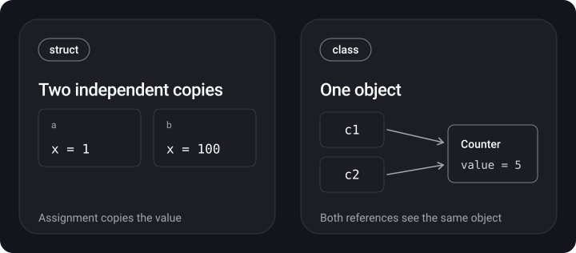

> **What you'll learn**
>
> - How a value type differs from a reference type and what that means for copying and mutation
> - What is actually stored on the stack and on the heap (and why "struct = stack" is a simplification)
> - How copy-on-write works and how to write it yourself
> - What `deinit` is and when it is called
> - Enums in Swift: associated values, raw values, `indirect`, `CaseIterable`
> - Nested types and `inout`
> - When to choose a struct and when a class

> **Prerequisites:** basic Swift syntax — `let`/`var`, functions, `if`/`switch`, arrays.

## Analogy: a document in the cloud and a document on a flash drive

Imagine you need to hand a report to a colleague.

- **Struct** — you save the report to a flash drive and hand it over. Your colleague now has their own copy: whatever they edit, your original stays unchanged.
- **Class** — you send a link to a shared document in the cloud. You and your colleague look at the same file: an edit by one of you is visible to both.
- **Deinit** — when the last person has closed their access to the cloud file, the file is deleted. As long as anyone still holds a link, it stays alive.
- **Copy-on-write** — a "smart flash drive": as long as nobody edits anything, no copy is made and everyone reads the same file. The copy is created at the moment of the first edit.

## Step 1. Value semantics and reference semantics

> **Value type** — on assignment, when passed to a function and when returned, the value is copied. Each variable owns its own independent copy. These include `struct`, `enum`, tuples, as well as `Int`, `String`, `Array`, `Dictionary`, `Set` (all of them are structs).
>
> **Reference type** — on assignment only the reference is copied, and the object stays single. These include `class`, closures and functions, `actor`.

```swift
struct Point { var x: Int; var y: Int }

var a = Point(x: 1, y: 2)
var b = a          // copy
b.x = 100
print(a.x, b.x)    // 1 100

final class Counter { var value = 0 }

let c1 = Counter()
let c2 = c1        // a second reference to the same object
c2.value = 5
print(c1.value)    // 5
print(c1 === c2)   // true — it is one and the same object
```



> `let` on a class makes the **reference** a constant, not the contents of the object: `c1.value = 7` works, but `c1 = Counter()` does not. `let` on a struct makes **the whole value** immutable, including its fields.

## Step 2. Comparing struct and class

| Feature | struct | class |
| --- | --- | --- |
| Semantics | value (copied) | reference (the reference is copied) |
| Inheritance | no | yes |
| Initializer | memberwise one is generated automatically | needs its own `init` if the properties have no default values |
| `deinit` | no | yes |
| Reference counting (ARC) | no | yes |
| Identity (`===`) | no, only value equality (`==`) | yes |
| Type casting `as?`/`is` along the hierarchy | only to protocols | yes |
| Changing fields from a method | needs `mutating` | not needed |
| Method dispatch | static | via vtable (if the class is not `final`) |

```swift
struct Counter2 {
    var value = 0
    mutating func increment() { value += 1 }   // without mutating — a compile error
}

let fixed = Counter2()
// fixed.increment()   // error: let makes the whole value immutable
```

<details>
<summary>Can you skip writing an initializer for a struct?</summary>

Yes. The compiler generates a memberwise initializer for all stored properties. If you declare your own `init` **inside** the struct body, the memberwise initializer disappears. The workaround: declare your own `init` in an `extension` — then both remain (more in [tutorial 03](../init-inheritance-access/)).

</details>

<details>
<summary>Why don't structs have inheritance?</summary>

Inheritance is needed for subtypes with a shared reference identity and dynamic dispatch. Value types have no identity, and their size is fixed at compile time: a subclass could be bigger than its parent, and the value would have an unpredictable size. Behavior is reused through protocols and composition ([tutorial 07](../protocols-extensions-casting/)).

</details>

## Step 3. Where data is stored: the stack and the heap

> **Stack** — a fast memory region with LIFO discipline: a function's frame is created on call and disappears on return. The size of the values is known in advance.
>
> **Heap** — a region for objects with an arbitrary lifetime. Allocation and deallocation are more expensive: finding space, synchronization, reference counting.

The first thing people usually say: "structs live on the stack, classes on the heap". This is a simplification that breaks down in several places.

**A struct's data lives on the heap when:**

- the struct is a **property of a class** (or an element of another heap object): it is embedded in the object's memory;
- the struct is **captured** by an `@escaping` closure (the closure's context lives on the heap; [tutorial 06](../closures-higher-order/));
- the struct is stored in `Any` or in `any Protocol`, and its size exceeds the container's buffer ([tutorial 08](../generics-any-some/));
- the struct owns a **heap buffer** — like `Array`, `String`, `Dictionary`: the header itself is small, and the elements sit in a separate allocation.

**A class instance may end up on the stack when** the optimizer proves that the object does not "escape" the function (stack promotion). This is an optimization, not a language guarantee — you can't rely on it.

```swift
func work() {
    let p = Point(x: 1, y: 2)   // most likely on the stack or in registers
    let c = Counter()           // formally the heap; with a successful optimization it may move to the stack
    _ = (p, c)
}
```

> The right wording for an interview: "Value semantics does not guarantee stack placement, and reference semantics does not guarantee the heap. Placement is decided by the compiler and the optimizer. By default structs are cheaper, because they have no reference counting and no heap allocation."

## Step 4. Copy-on-write

> **Copy-on-write (COW)** — deferred copying: the value is copied only on the first mutation, if the buffer is shared by several owners.

The standard library collections (`Array`, `Dictionary`, `Set`, `String`) are structs, but under the hood they hold a reference to a heap buffer. On assignment the reference to the buffer is copied (cheap), and a real copy is made only on write, when the buffer is shared.

```swift
var original = [1, 2, 3]
var copy = original      // the buffer is shared, no copy yet
copy.append(4)           // the buffer is duplicated here
print(original)          // [1, 2, 3]
print(copy)              // [1, 2, 3, 4]
```

**Your own COW** is built on `isKnownUniquelyReferenced`: it returns `true` if exactly one strong reference points to the object.

```swift
final class Storage {
    var items: [Int]
    init(items: [Int]) { self.items = items }
}

struct IntBag {
    private var storage = Storage(items: [])

    var items: [Int] { storage.items }

    mutating func append(_ x: Int) {
        if !isKnownUniquelyReferenced(&storage) {
            storage = Storage(items: storage.items)   // the buffer is shared — copy it
        }
        storage.items.append(x)
    }
}

var a = IntBag(); a.append(1)
var b = a            // both point to the same Storage
b.append(2)          // b gets its own copy
print(a.items, b.items)   // [1] [1, 2]
```

<details>
<summary>Why does it work this way?</summary>

After `var b = a`, two structs point to a single `Storage`, so `isKnownUniquelyReferenced` returns `false`, and `b` makes a copy. On its next write `a` will see a single reference and will not copy anything. There is no extra copy on every write — that is the point.

</details>

> COW by itself does not make code thread-safe: mutating one variable from two threads at the same time is a data race (see the concurrency tutorial, chapter «Concurrency problems»).

## Step 5. The deinitializer

> **`deinit`** — a special class method that is called automatically before an instance is deallocated, when the strong reference count (ARC) has dropped to zero.

```swift
final class FileHandle2 {
    let name: String
    init(name: String) { self.name = name; print("open \(name)") }
    deinit { print("close \(name)") }   // release resources, remove subscriptions
}

func demo() {
    let h = FileHandle2(name: "a.txt")
    _ = h
}   // on leaving the function the only reference goes away
demo()
// open a.txt
// close a.txt
```

Rules:

- only classes (and actors) have it; structs and enums do not, the compiler manages them;
- a class has at most one `deinit`, with no parameters and no return value;
- you cannot call it directly;
- in a hierarchy, the subclass's `deinit` is called before the parent's `deinit`, and the parent's is called automatically;
- if the object is held by a strong reference cycle, `deinit` will never be called — that is a leak (more in the [chapter on ARC](../../memory/mrc-to-arc/) in the «Memory» topic).

## Step 6. Enum

An enum in Swift is a **value type** with a finite set of cases (`case`). It is more powerful than in C: it can have methods, computed properties and initializers, and can conform to protocols.

```swift
enum CompassPoint: CaseIterable {
    case north, south, east, west

    var opposite: CompassPoint {
        switch self {
        case .north: return .south
        case .south: return .north
        case .east:  return .west
        case .west:  return .east
        }
    }
}

print(CompassPoint.allCases.count)   // 4
print(CompassPoint.east.opposite)    // west
```

**Raw values** — each case is assigned a value of the same type (`Int`, `String`, `Character`, `Double`):

```swift
enum Planet: Int {
    case mercury = 1, venus, earth, mars   // the following values go up by 1
}
print(Planet.earth.rawValue)       // 3
print(Planet(rawValue: 4) as Any)  // Optional(Planet.mars)
print(Planet(rawValue: 9) as Any)  // nil — the raw value initializer is failable
```

**Associated values** — each case carries its own data:

```swift
enum Barcode {
    case upc(Int, Int, Int, Int)
    case qrCode(String)
}
let code = Barcode.qrCode("https://swift.org")
switch code {
case .upc(let a, let b, let c, let d): print(a, b, c, d)
case .qrCode(let url): print(url)
}
```

- A `switch` over an enum must be **exhaustive**: if you miss a `case`, it is a compile error.
- Raw values and associated values cannot be combined in one enum.
- Every `case` is unique. `==` is synthesized automatically if the enum has no associated values or all of them are `Equatable`. For an enum with associated values you need to declare `: Equatable` (or `: Hashable`) explicitly.

**A recursive enum** needs `indirect`: the compiler moves the values to the heap, otherwise the size of the type would be infinite.

```swift
indirect enum Expr {
    case number(Int)
    case add(Expr, Expr)
    case mul(Expr, Expr)
}

func eval(_ e: Expr) -> Int {
    switch e {
    case .number(let n):  return n
    case .add(let l, let r): return eval(l) + eval(r)
    case .mul(let l, let r): return eval(l) * eval(r)
    }
}
print(eval(.add(.number(2), .mul(.number(3), .number(4)))))   // 14
```

**Enum evolution.** If an enum comes from a library and may get new cases, add an `@unknown default` branch to the `switch` — the compiler will warn you when an unhandled case appears.

> `Optional` and `Result` are also ordinary standard library enums. Optional is covered in detail in [tutorial 04](../optional/), errors in [tutorial 05](../errors-defer-control-flow/).

## Step 7. Nested types

A type can be declared inside another type. This groups related code, avoids name conflicts and shows that the type is only needed in the context of its parent.

```swift
struct Car {
    enum Kind { case sedan, coupe, convertible }
    var kind: Kind
}

let myCar = Car(kind: .coupe)
let k: Car.Kind = .sedan        // from outside — through the parent's name
```

A nested type follows its own access level: it does not automatically become `public` if the parent is `public` ([tutorial 03](../init-inheritance-access/)).

## Step 8. inout

> **`inout`** — a parameter that the function can modify, and thereby modify the variable at the call site. It is passed with `&`.

```swift
func increment(_ value: inout Int, by amount: Int) {
    value += amount
}

var score = 10
increment(&score, by: 5)
print(score)   // 15
```

**The law of exclusive access.** While a variable is being accessed through `inout`, nobody else can use it — the compiler checks this statically, and at runtime for global variables and class properties.

```swift
func balance(_ x: inout Int, _ y: inout Int) {
    let sum = x + y
    x = sum / 2
    y = sum - x
}

var a = 42
// balance(&a, &a)   // compile error: overlapping accesses to 'a'
```

## Step 9. What to choose: struct or class

**Use `struct` by default** — this is what Apple advises in its documentation and in the Swift API Design Guidelines. Switch to `class` when you need:

- **identity and shared mutable state** ("a single source of truth", for example a cache, a session, a view model);
- **inheritance** from Objective-C/UIKit classes (`UIViewController`, `NSObject`);
- **`deinit`** to release resources;
- Objective-C interop, KVO.

Why structs win by default:

- a copy is safe: no other part of the code will change your data unexpectedly;
- there is no reference counting and no retain cycles;
- values are easier to pass between threads (a struct made of `Sendable` fields is `Sendable`);
- the code is easier to reason about: a change is visible only at the point of assignment.

**Noncopyable types (`~Copyable`, Swift 5.9).** A struct or enum can be made "noncopyable": the value cannot be copied, it can only be passed on (`consuming`) or borrowed (`borrowing`). This gives unique ownership of a resource (a file, a socket) with `deinit` and without ARC. For an interview it is enough to know that this is possible and why.

## Common mistakes

- Mutating a shared object from several places and expecting it to be a "copy" — that is how a class works.
- Writing a struct with many class fields and hoping for "value" semantics: copying the struct copies the references, not the objects.
- Forgetting `mutating` in a struct method or `indirect` in a recursive enum.
- Writing a `deinit` with logic that resurrects `self` (stores it somewhere) — the object will be deallocated anyway.
- Assuming that `let` on a class protects its fields from modification.
- Claiming in an interview that "structs are always on the stack" without caveats.

<details>
<summary>A tricky question: what does this code print?</summary>

```swift
struct S { var arr = [1, 2, 3] }
var s1 = S()
var s2 = s1
s2.arr.append(4)
print(s1.arr.count, s2.arr.count)
```

Answer: `3 4`. An array is a value type with COW, so `s2.arr.append(4)` creates a copy of the buffer, and `s1` is not affected.

</details>

## Cheat sheet

```swift
// Value vs reference
struct S {}  enum E {}              // copied
class C {}   actor A {}             // the reference is copied

// Identity / equality
a === b        // the same object (classes only)
a == b         // value equality (Equatable)

// Mutation
mutating func f() { }               // in struct / enum
func g(_ x: inout Int) { x += 1 }   // call: g(&v)

// COW
if !isKnownUniquelyReferenced(&storage) { storage = copy }

// Enum
enum E: CaseIterable { case a, b }  // E.allCases
enum R: Int { case a = 1 }          // R(rawValue: 1)
indirect enum Tree { case leaf, node(Tree, Tree) }

// Deinitialization
deinit { /* classes only, called when refcount == 0 */ }
```

## Self-check questions

<details>
<summary>1. How does a value type differ from a reference type?</summary>

A value type is copied on assignment and when passed; for a reference type only the reference to a single object is copied.

</details>

<details>
<summary>2. Is a struct always on the stack and a class always on the heap?</summary>

No. A struct's data ends up on the heap if the struct is a property of a class, is captured by an `@escaping` closure, sits in a large existential container, or owns a buffer (like `Array`). A class instance can be placed on the stack by the optimizer. The language gives no guarantees here.

</details>

<details>
<summary>3. What is copy-on-write and how do you check whether a copy is needed?</summary>

The buffer is copied only on mutation, if the buffer is shared by several owners. The check is `isKnownUniquelyReferenced(&reference)`.

</details>

<details>
<summary>4. When is deinit called and can it fail to be called?</summary>

When the strong reference count drops to zero. It will not be called if there is a strong reference cycle (a leak) or if the process terminated abnormally.

</details>

<details>
<summary>5. How does an enum with associated values differ from an enum with raw values?</summary>

Associated values are different data for each case, set at creation time. Raw values are fixed values of one type, set at declaration. They cannot be combined.

</details>

<details>
<summary>6. Why does a recursive enum need indirect?</summary>

Without it the size of the type would be infinite: the value would contain itself. `indirect` moves the associated values to the heap.

</details>

<details>
<summary>7. How does inout actually work?</summary>

Semantically it is copy-in copy-out: the value is copied into the parameter and written back after the return. The compiler may pass the address as an optimization. The law of exclusive access applies.

</details>

## Sources

- [Structures and Classes — The Swift Programming Language](https://docs.swift.org/swift-book/documentation/the-swift-programming-language/classesandstructures/)
- [Enumerations — The Swift Programming Language](https://docs.swift.org/swift-book/documentation/the-swift-programming-language/enumerations/)
- [Deinitialization — The Swift Programming Language](https://docs.swift.org/swift-book/documentation/the-swift-programming-language/deinitialization/)
- [Memory Safety — The Swift Programming Language](https://docs.swift.org/swift-book/documentation/the-swift-programming-language/memorysafety/)
- [Choosing Between Structures and Classes — Apple Developer](https://developer.apple.com/documentation/swift/choosing-between-structures-and-classes)
- [SE-0390: Noncopyable structs and enums](https://github.com/swiftlang/swift-evolution/blob/main/proposals/0390-noncopyable-structs-and-enums.md)
- [Type Layout — swiftlang/swift, docs/ABI](https://github.com/swiftlang/swift/blob/main/docs/ABI/TypeLayout.rst)
