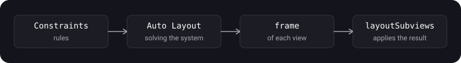

> **What you'll learn**
>
> - What Auto Layout is and how constraints produce a view's size and position
> - A constraint as an equation: attributes, relations, multiplier, constant, priority
> - How to create constraints: `NSLayoutConstraint`, `NSLayoutAnchor`, activation
> - Why `translatesAutoresizingMaskIntoConstraints = false`
> - `UILayoutGuide`, safe area, margins, `keyboardLayoutGuide`
> - The autoresizing mask: the old mechanism and how it relates to Auto Layout
> - `UIStackView`, as well as constraint conflicts and ambiguity and how to fix them

> **Prerequisites:** tutorial [01](../uiview-window-coordinates/) — `UIView`, `frame` and `bounds`, points; tutorial [03](../view-lifecycle/) — `layoutSubviews` and the moment when the geometry is final.

## Analogy: arranging furniture by rules

You don't give the movers exact coordinates for every cabinet. You give **rules**: "the sofa 20 cm from the left wall", "the table in the center", "the wardrobe no wider than half the room", "the lamp by the window if possible".

- **Constraint** — one placement rule.
- **Auto Layout** — the crew that finds an arrangement satisfying all the rules by itself. If the room is widened or a cabinet is added, it recalculates everything on its own.
- **Priority** — how mandatory a rule is. "The sofa by the wall" is a must, "the lamp by the window" is nice to have.
- **Conflict** — the rules contradict each other ("the sofa 20 cm from the wall" and "50 cm from the same wall").
- **Ambiguity** — there are too few rules, and things can be arranged in different ways ("the sofa on the left", but it isn't said how far from the floor).

## Step 1. What Auto Layout is

> **Auto Layout** is an interface layout system based on constraints. It dynamically calculates the size and position of all views in the hierarchy according to the rules you set, and recalculates them when something changes.

- **External changes:** screen rotation, different screen sizes, window resizing (for example, in Split View on iPad).
- **Internal changes:** the content changed (longer text, another language, another font), a view was shown or hidden.
- The main advantage: you don't need to write code that manually adjusts the interface for every size. You describe the relationships between elements, and the system computes the positions.
- A constraint is an equation (or inequality). A set of constraints forms a system of equations and inequalities; if it has a single solution, the system knows exactly the position and size of every view.



**A valid layout** is a set of constraints with **exactly one** solution (Apple calls it unambiguous and non-conflicting). Two types of errors:

- **Ambiguous** — more than one solution, there are not enough rules.
- **Conflicting** — no solutions, the rules contradict each other.

## Step 2. A constraint as an equation

Every constraint is a linear equation:

```text
item1.attribute1 = multiplier × item2.attribute2 + constant
```

For example: "the second button's leading edge is 8 points to the right of the first button's trailing edge":

```text
button2.leading = 1.0 × button1.trailing + 8.0
```

- `attribute1` and `attribute2` are variables that Auto Layout can change while solving. You set the rest when creating the constraint.
- A constraint is **not an assignment**. Auto Layout doesn't just copy the right-hand side into the left: it can change either attribute or both so that the equation holds.
- That is why the sides can be swapped if you invert the multiplier and the constant. These two constraints are equivalent: `button2.leading = 1.0 × button1.trailing + 8.0` and `button1.trailing = 1.0 × button2.leading - 8.0`.

**What a constraint consists of:**

| Part | Meaning | Examples |
| --- | --- | --- |
| **Attributes** | Which properties of the two objects are linked | `width`, `height`, `leading`, `trailing`, `left`, `right`, `top`, `bottom`, `centerX`, `centerY`, `firstBaseline`, `lastBaseline` |
| **Relation** | Equal, greater than or equal, less than or equal | Lets you set minimum and maximum sizes and insets, not only fixed ones |
| **Multiplier** | How many times the second attribute is multiplied | `width = 0.5 × superview.width` (half the width), aspect ratio |
| **Constant** | An offset added to the second attribute | An inset in points |
| **Priority** | How important it is to satisfy the constraint | From 1 to 1000 |

**Priorities (per Apple's documentation):**

- Priorities range from 1 to 1000. Priority 1000 is **required**; anything below 1000 is optional. **By default all constraints are required.**
- Auto Layout first solves the required constraints, then the optional ones in descending order of priority. If an optional one can't be satisfied, it gets as close as possible to the desired result and moves on.
- The priority constants: `.required` (1000), `.defaultHigh` (750), `.defaultLow` (250). They are also the typical values for content hugging and compression resistance priorities (tutorial [05](../autolayout-layout-pass/)).

<details>
<summary>Why does Auto Layout use leading and trailing instead of left and right?</summary>

`leading` and `trailing` take the writing direction into account: in left-to-right languages (English, Russian) leading is the left edge, while in right-to-left languages (Arabic, Hebrew) it is the right one. An interface built on `leading` and `trailing` is mirrored automatically when the language changes. `left` and `right` are absolute. You can't mix `leading`/`trailing` with `left`/`right` in one constraint: the compiler lets it through (both are `NSLayoutXAxisAnchor`), but it will crash at launch (this is stated directly in Apple's documentation).

</details>

## Step 3. How to create a constraint: NSLayoutConstraint

> **`NSLayoutConstraint`** is a class describing a relationship between two interface objects that the layout system must satisfy. Constraints can be set in Interface Builder or in code.

The direct way is the full initializer:

```swift
let view1 = UIView()
let view2 = UIView()
view.addSubview(view1)
view.addSubview(view2)

view1.translatesAutoresizingMaskIntoConstraints = false   // see step 4
view2.translatesAutoresizingMaskIntoConstraints = false

// view1.width = 1.0 × view2.width + 0
let widthConstraint = NSLayoutConstraint(item: view1,
                                         attribute: .width,
                                         relatedBy: .equal,
                                         toItem: view2,
                                         attribute: .width,
                                         multiplier: 1.0,
                                         constant: 0)

NSLayoutConstraint.activate([widthConstraint])
```

**Activation:**

- A created constraint does nothing by itself. It must be **activated**: `constraint.isActive = true` or `NSLayoutConstraint.activate([...])`. To turn it off: `isActive = false` or `NSLayoutConstraint.deactivate([...])`.
- `NSLayoutConstraint.activate([])` takes an array: managing a group of constraints with one call is more convenient.
- After creation you can change `constant` and `priority` (with the caveat below). `firstItem`, `firstAttribute`, `relation`, `secondItem`, `secondAttribute` and `multiplier` are read-only; to change them you need a new constraint.
- You can toggle a constraint between active and inactive to change the layout dynamically without recreating it.
- Constraints can also be created the old way — through the Visual Format Language (`NSLayoutConstraint.constraints(withVisualFormat:...)`), but anchors are more convenient.

> On an installed (active) constraint you can't change the priority **from required to optional** and back: you'll get a runtime error like "Mutating a priority from required to not on an installed constraint is not supported". To toggle, use priority `999` instead of `1000`, or recreate the constraint.

## Step 4. translatesAutoresizingMaskIntoConstraints

This property controls how a view gets into Auto Layout.

> **`translatesAutoresizingMaskIntoConstraints`** is a Boolean that determines whether the view's autoresizing mask is translated into Auto Layout constraints.

- If `true`, the system creates a set of constraints that replicate the behavior of the view's autoresizing mask. Such constraints **define the size and position** of the view, so your own size and position constraints will conflict with them.
- For Auto Layout to compute the view's size and position itself, set `false` and provide an unambiguous, non-conflicting set of constraints.
- **The default is `true`** for views you create in code. If you add a view in Interface Builder, the system sets `false` itself.
- Set the property on a subview **from its parent or from the controller**, not inside the view itself. Don't set it on `self` inside a custom view's code: that way the parent can't control its layout.
- Don't change the value for views managed by UIKit classes: `UITableViewCell`, `arrangedSubviews` of a `UIStackView`, a controller's `view`. They lay everything out automatically.

```swift
let label = UILabel()
label.translatesAutoresizingMaskIntoConstraints = false   // on the subview, from the controller
view.addSubview(label)

NSLayoutConstraint.activate([
    label.centerXAnchor.constraint(equalTo: view.centerXAnchor),
    label.centerYAnchor.constraint(equalTo: view.centerYAnchor)
])
```

> The most common beginner mistake in Auto Layout from code: forgetting `translatesAutoresizingMaskIntoConstraints = false`. Then "Unable to simultaneously satisfy constraints" floods the console, or the view ends up not where you expect. This is the first thing to check.

## Step 5. NSLayoutAnchor — constraints without extra code

> **`NSLayoutAnchor`** is a factory for creating constraints in a fluent API style. Instead of creating an `NSLayoutConstraint` directly, you take a view (or a `UILayoutGuide`), pick its anchor property (`leadingAnchor`, `topAnchor`, `widthAnchor`, etc.) and call a method that returns a constraint.

**Advantages** (per Apple's documentation): the code is cleaner, shorter and easier to read; the anchor subclasses give compile-time type checking, which helps avoid creating invalid constraints. There are also no format strings (VFL), and therefore no typos in them.

**Anchor types.** `NSLayoutAnchor` itself isn't used directly; one of its subclasses is:

| Type | What it is for | Anchors |
| --- | --- | --- |
| `NSLayoutXAxisAnchor` | Horizontal constraints | `leadingAnchor`, `trailingAnchor`, `leftAnchor`, `rightAnchor`, `centerXAnchor` |
| `NSLayoutYAxisAnchor` | Vertical constraints | `topAnchor`, `bottomAnchor`, `centerYAnchor`, `firstBaselineAnchor`, `lastBaselineAnchor` |
| `NSLayoutDimension` | Sizes | `widthAnchor`, `heightAnchor` |

**Methods for creating constraints:**

- `constraint(equalTo:)` and `constraint(equalTo:constant:)` — equality;
- `constraint(greaterThanOrEqualTo:)` — greater than or equal;
- `constraint(lessThanOrEqualTo:)` — less than or equal.
- For dimensions: `constraint(equalToConstant:)`, `constraint(equalTo:multiplier:)` and their inequality counterparts.
- The returned constraints **must be activated** (`isActive = true` or `NSLayoutConstraint.activate`).

```swift
// Align the centers of two views
view1.centerXAnchor.constraint(equalTo: view2.centerXAnchor).isActive = true
view1.centerYAnchor.constraint(equalTo: view2.centerYAnchor).isActive = true

// The view's height = 100 points
view1.heightAnchor.constraint(equalToConstant: 100).isActive = true

// Width = 2 × height (a 2:1 aspect ratio)
view1.widthAnchor.constraint(equalTo: view1.heightAnchor, multiplier: 2.0).isActive = true
```

**Activate a group with one call** — it is both shorter and more convenient to manage:

```swift
NSLayoutConstraint.activate([
    card.topAnchor.constraint(equalTo: view.safeAreaLayoutGuide.topAnchor, constant: 16),
    card.leadingAnchor.constraint(equalTo: view.leadingAnchor, constant: 16),
    card.trailingAnchor.constraint(equalTo: view.trailingAnchor, constant: -16),
    card.heightAnchor.constraint(equalToConstant: 120)
])
```

> Insets on the right and bottom are set with a **negative** constant: `trailing = superview.trailing - 16`. The constant is added to the second attribute, it doesn't "push away from the edge".

A small helper that removes the repetition of "pin to the edges":

```swift
extension UIView {
    func pinEdges(to other: UIView, insets: UIEdgeInsets = .zero) {
        translatesAutoresizingMaskIntoConstraints = false
        NSLayoutConstraint.activate([
            topAnchor.constraint(equalTo: other.topAnchor, constant: insets.top),
            leadingAnchor.constraint(equalTo: other.leadingAnchor, constant: insets.left),
            trailingAnchor.constraint(equalTo: other.trailingAnchor, constant: -insets.right),
            bottomAnchor.constraint(equalTo: other.bottomAnchor, constant: -insets.bottom)
        ])
    }
}
```

## Step 6. Layout guides: UILayoutGuide, safe area, margins, keyboard

> **`UILayoutGuide`** is a rectangular area that can interact with Auto Layout. It is **not a view**: it is not part of the view hierarchy, and simply defines a rectangle in the coordinate system of its owning view.

**Why.** It used to be that "empty placeholder views" were used for blank gaps between views or for grouping elements. They have a cost: the overhead of creation, extra load on every hierarchy operation, and worst of all — an invisible view can **intercept touches** meant for others. `UILayoutGuide` does the same jobs more safely and cheaply.

**How to create one (per Apple's documentation):**

1. Create a `UILayoutGuide()`.
2. Add it to a view: `view.addLayoutGuide(_:)`.
3. Define its position and size through Auto Layout (it has the same anchors: `leadingAnchor`, `widthAnchor` and others).

An example — equal gaps between three buttons (two guides of equal width):

```swift
let space1 = UILayoutGuide()
let space2 = UILayoutGuide()
view.addLayoutGuide(space1)
view.addLayoutGuide(space2)

saveButton.translatesAutoresizingMaskIntoConstraints = false
cancelButton.translatesAutoresizingMaskIntoConstraints = false
clearButton.translatesAutoresizingMaskIntoConstraints = false

NSLayoutConstraint.activate([
    space1.widthAnchor.constraint(equalTo: space2.widthAnchor),          // the gaps are equal
    saveButton.trailingAnchor.constraint(equalTo: space1.leadingAnchor),
    cancelButton.leadingAnchor.constraint(equalTo: space1.trailingAnchor),
    cancelButton.trailingAnchor.constraint(equalTo: space2.leadingAnchor),
    clearButton.leadingAnchor.constraint(equalTo: space2.trailingAnchor),
    // the buttons' vertical position
    saveButton.centerYAnchor.constraint(equalTo: view.centerYAnchor),
    cancelButton.centerYAnchor.constraint(equalTo: view.centerYAnchor),
    clearButton.centerYAnchor.constraint(equalTo: view.centerYAnchor)
])
```

**A guide as a container** — you can "pack" a group of views into an invisible rectangle and work with it as a whole without adding an extra view:

```swift
let container = UILayoutGuide()
view.addLayoutGuide(container)

NSLayoutConstraint.activate([
    label.leadingAnchor.constraint(equalTo: container.leadingAnchor),
    textField.leadingAnchor.constraint(equalTo: label.trailingAnchor, constant: 8),
    textField.trailingAnchor.constraint(equalTo: container.trailingAnchor),
    textField.topAnchor.constraint(equalTo: container.topAnchor),
    textField.bottomAnchor.constraint(equalTo: container.bottomAnchor),
    label.firstBaselineAnchor.constraint(equalTo: textField.firstBaselineAnchor),
    // pin the container as a whole to the layout margins
    container.leadingAnchor.constraint(equalTo: view.layoutMarginsGuide.leadingAnchor),
    container.trailingAnchor.constraint(equalTo: view.layoutMarginsGuide.trailingAnchor),
    container.topAnchor.constraint(equalTo: view.safeAreaLayoutGuide.topAnchor, constant: 20)
])
```

> Grouping through a guide doesn't change the view hierarchy: it only affects how Auto Layout works with those views. For stronger encapsulation there are container views and container view controllers. Also, the priorities of optional constraints inside a guide are still compared with priorities outside (Apple).

**Built-in guides:**

| Guide | What it represents | Note |
| --- | --- | --- |
| `safeAreaLayoutGuide` | The part of the view not covered by navigation bars, the tab bar, toolbars and other ancestors (the notch, the Home indicator) | iOS 11+. For a root view it accounts for the status bar, visible bars and the controller's `additionalSafeAreaInsets`. While the view is not on screen, the edges equal the view's bounds |
| `layoutMarginsGuide` | The area inside the view's layout margins | `UIView` has no anchors for margins; this guide is used for them |
| `keyboardLayoutGuide` | Tracks the keyboard's position in your layout | iOS 15+ |

```swift
// Pin the input field to the top of the keyboard
NSLayoutConstraint.activate([
    inputBar.leadingAnchor.constraint(equalTo: view.leadingAnchor),
    inputBar.trailingAnchor.constraint(equalTo: view.trailingAnchor),
    inputBar.bottomAnchor.constraint(equalTo: view.keyboardLayoutGuide.topAnchor)
])
```

Without the keyboard the guide's bottom coincides with the bottom of the safe area; with the keyboard it rises along with it, and `inputBar` follows without any keyboard notification subscriptions. More about the keyboard — tutorial [11](../layout-keyboard-animations/).

## Step 7. Autoresizing mask

> **Autoresizing mask** is the old mechanism that automatically changes a view's size and position when its superview's size changes. It is set with the `autoresizingMask` property (type `UIView.AutoresizingMask`), a combination of options.

By default the mask is empty (`[]`): the view **doesn't change** when the parent's size changes. When a view's bounds change, it automatically resizes its subviews according to each one's mask.

| Option | What it gives |
| --- | --- |
| `flexibleLeftMargin` | The left margin can change: the distance from the view's left edge to the parent's left edge |
| `flexibleRightMargin` | The right margin can change |
| `flexibleTopMargin` | The top margin can change |
| `flexibleBottomMargin` | The bottom margin can change |
| `flexibleWidth` | The view's width can change along with the parent's width |
| `flexibleHeight` | The view's height can change along with the parent's height |

```swift
let myView = UIView()
myView.backgroundColor = .red
myView.frame = CGRect(x: 0, y: 0, width: 100, height: 100)
myView.autoresizingMask = [.flexibleBottomMargin, .flexibleRightMargin]
self.view.addSubview(myView)
```

**How to read a mask.** An option means "this part can change". `myView` has flexible bottom and right margins, while its size and left/top margins are fixed. So the view is "pinned" to the top-left corner: as the parent grows it stays in the corner and keeps its 100 × 100 size, and only the gap on the right and at the bottom grows.

- If several options are enabled along one axis, the size difference is distributed **proportionally** among the flexible parts: the larger a flexible part, the more it grows. For example, `flexibleWidth` and `flexibleRightMargin` without `flexibleLeftMargin`: the left margin is fixed, the width and the right margin grow — the view is pressed to the left.
- The typical "stretch to fill the parent" mask: `[.flexibleWidth, .flexibleHeight]`.
- If the mask's behavior isn't enough, Apple suggests making a container view and overriding `layoutSubviews()` in it.

**Comparison:**

| Criterion | Autoresizing mask | Auto Layout |
| --- | --- | --- |
| Relationship to other views | Only to the parent | To any views in the hierarchy |
| Capabilities | Flexible margins and sizes relative to the parent | Inequalities, priorities, multipliers, guides |
| Accounting for intrinsic size | No | Yes (tutorial [05](../autolayout-layout-pass/)) |
| When it fits | Simple cases, a manual `view.frame`, legacy code | Adaptive interfaces, dynamic content |

## Step 8. UIStackView — layout without manual constraints

**`UIStackView`** is a view that lays out a set of views in a column or a row. Internally it uses Auto Layout, while its own position and (optionally) size are up to you.

- Lays out **`arrangedSubviews`** along its axis (`axis`) in array order.
- **`axis`** — the vertical or horizontal axis.
- **`distribution`** — how the arranged views are laid out **along** the axis.
- **`alignment`** — how they are laid out **across** the axis.
- **`spacing`** — the minimum gap between views.
- `isLayoutMarginsRelativeArrangement` — lay out relative to the layout margins rather than the edges.

```swift
let stack = UIStackView(arrangedSubviews: [avatarView, nameLabel, followButton])
stack.axis = .vertical
stack.alignment = .center
stack.spacing = 12
stack.translatesAutoresizingMaskIntoConstraints = false
view.addSubview(stack)

NSLayoutConstraint.activate([
    stack.topAnchor.constraint(equalTo: view.safeAreaLayoutGuide.topAnchor, constant: 24),
    stack.leadingAnchor.constraint(equalTo: view.leadingAnchor, constant: 16),
    stack.trailingAnchor.constraint(equalTo: view.trailingAnchor, constant: -16)
])
// we don't set the stack's height: it will be computed from the content
```

- The stack's position must be set through Auto Layout: usually pinning two adjacent edges is enough. Without additional constraints the size is computed from the content: along the axis — the sum of all views' sizes plus the gaps, across — the size of the largest view.
- For every distribution except `fillEqually`, the size along the axis is computed from the arranged views' `intrinsicContentSize` (tutorial [05](../autolayout-layout-pass/)).
- **`arrangedSubviews` is always a subset of `subviews`.** Remove a view from `arrangedSubviews` and the stack stops managing its position, but it stays in the hierarchy and is displayed. To remove it entirely, call `removeFromSuperview()`.
- The order of `arrangedSubviews` is the order in the stack, the order of `subviews` is the z-order. They are independent.
- **`isHidden = true` on an arranged view** hides it and removes it from the layout, and the rest shift. The change can be animated in a `UIView.animate` block.

```swift
UIView.animate(withDuration: 0.25) {
    self.errorLabel.isHidden = true          // the stack will recalculate the layout
}
```

> Don't change `translatesAutoresizingMaskIntoConstraints` on arranged views: the stack manages them itself (Apple). When adding constraints to views inside a stack, watch for conflicts: as a rule, it is safe to constrain the dimension along which the view's size comes down to its intrinsic content size.

## Step 9. Conflicts and ambiguity

The two main problems with a valid layout (step 1):

| Problem | Cause | What you see | How to fix |
| --- | --- | --- | --- |
| **Ambiguity** | Not enough rules: the position or size isn't fully determined | The view ends up "in the wrong place" or "jumps"; there are warnings in the View Debugger; `view.hasAmbiguousLayout` | Add the missing constraints (usually the width, the height or one of the coordinates is missing) |
| **Conflict** | Two or more constraints contradict each other | In the console: "Unable to simultaneously satisfy constraints"; the system itself breaks one of the optional or extra constraints | Remove the extra one, lower one's priority to `999`, check `translatesAutoresizingMaskIntoConstraints` |

- The conflict log lists the constraints; the system chooses which one to "break" in order to keep going.
- To make the log easier to read, give constraints **identifiers**:

```swift
let height = header.heightAnchor.constraint(equalToConstant: 120)
height.identifier = "header.height"   // this name will appear in the conflict log
height.isActive = true
```

- The WTF Auto Layout service helps decipher the log: it visualizes the conflicting constraints from the log.
- The View Debugger in Xcode helps find the problematic view.

**Typical causes of conflicts:**

- `translatesAutoresizingMaskIntoConstraints` isn't turned off (step 4);
- the width or height is set both as a number and as a relation to other views that gives a different value;
- two required constraints pull a view to different positions;
- constraints are added again on every call of a method (for example, in `layoutSubviews`) and pile up.

## Common mistakes

- Forgetting `translatesAutoresizingMaskIntoConstraints = false` on a view created in code.
- Creating a constraint and not activating it (`isActive = true` or `activate`).
- Activating a constraint before both views are added to a common hierarchy: a crash.
- Mixing `leading`/`trailing` with `left`/`right` in one constraint: a crash at launch.
- Making the right and bottom inset constant positive: instead of an inset you get going past the edge.
- Not setting the size or position along one of the axes: an ambiguous layout.
- Changing the priority of an active constraint from 1000 to lower (or vice versa): a runtime error.
- Adding constraints on every `layoutSubviews`/`updateConstraints`/screen appearance without removing the old ones: constraints pile up and conflict.
- Changing `translatesAutoresizingMaskIntoConstraints` on `arrangedSubviews`, a cell or a controller's root view.
- Using an empty placeholder view where a `UILayoutGuide` is enough.
- Calling `UIStackView` "an example of Auto Layout": it is a view that uses it.

<details>
<summary>What happens if you set a view's frame manually when its translatesAutoresizingMaskIntoConstraints = false and it has constraints?</summary>

On the next layout pass Auto Layout recalculates the frame from the constraints and overwrites the value. So use either constraints or a manual `frame` (usually in `layoutSubviews`), but not both for the same view.

</details>

## Cheat sheet

```swift
// The equation: item1.attr1 = multiplier × item2.attr2 + constant
// Priority: 1...1000, 1000 (required) by default; < 1000 are optional

// Preparing a view
view.translatesAutoresizingMaskIntoConstraints = false   // on the subview, from the controller
parent.addSubview(view)                                  // before creating constraints

// Anchors
view.topAnchor.constraint(equalTo: other.bottomAnchor, constant: 8)
view.widthAnchor.constraint(equalToConstant: 100)
view.widthAnchor.constraint(equalTo: view.heightAnchor, multiplier: 2)
view.leadingAnchor.constraint(greaterThanOrEqualTo: other.trailingAnchor)
NSLayoutConstraint.activate([ ... ])       // isActive = true
NSLayoutConstraint.deactivate([ ... ])
c.constant = 20                            // can be changed; c.priority = .init(999)

// Guides
view.safeAreaLayoutGuide            // iOS 11+
view.layoutMarginsGuide
view.keyboardLayoutGuide            // iOS 15+
let g = UILayoutGuide(); view.addLayoutGuide(g)

// Autoresizing mask
view.autoresizingMask = [.flexibleWidth, .flexibleHeight]   // [] by default

// Stack view
let s = UIStackView(arrangedSubviews: [a, b])
s.axis = .vertical; s.alignment = .center; s.spacing = 8

// Debugging
c.identifier = "header.height"
view.hasAmbiguousLayout
```

## Self-check questions

<details>
<summary>1. What is a constraint and how is it written?</summary>

A linear equation (or inequality): `item1.attribute1 = multiplier × item2.attribute2 + constant`. Plus a priority (1–1000). Auto Layout doesn't assign a value, it picks attributes so that all constraints hold.

</details>

<details>
<summary>2. How does an ambiguous layout differ from a conflicting one?</summary>

Ambiguous — more than one solution, there are not enough rules. Conflicting — no solutions, the rules contradict each other. A valid layout has exactly one solution.

</details>

<details>
<summary>3. Why do you need translatesAutoresizingMaskIntoConstraints = false?</summary>

By default, for views created in code the value is `true`: the system creates constraints from the autoresizing mask, which define the view's size and position. Your own size and position constraints will conflict with them. The value `false` turns off the automatic creation. It is set on a subview from its parent or controller, not inside the view itself and not on views managed by UIKit.

</details>

<details>
<summary>4. How is NSLayoutAnchor better than using NSLayoutConstraint directly?</summary>

The code is shorter and reads better; the anchor subclasses (`NSLayoutXAxisAnchor`, `NSLayoutYAxisAnchor`, `NSLayoutDimension`) give compile-time type checking. But completely invalid constraints are still possible, for example mixing `leading` and `left` — a crash at launch.

</details>

<details>
<summary>5. Why UILayoutGuide if you can use an empty view?</summary>

A guide is not part of the view hierarchy, is cheaper, and can't intercept touches meant for other views. It solves the same tasks: empty gaps, centering a group of elements, encapsulating part of a layout.

</details>

<details>
<summary>6. What is an autoresizing mask and what does the "stretch to fill the parent" mask look like?</summary>

The old mechanism that changes a view's size and position when the superview's size changes. Empty by default. To stretch to fill the parent: `[.flexibleWidth, .flexibleHeight]`. The system turns the mask into constraints while `translatesAutoresizingMaskIntoConstraints = true`.

</details>

<details>
<summary>7. How do you attach an element to the keyboard without notifications?</summary>

Through `view.keyboardLayoutGuide` (iOS 15+): pin the element's bottom edge to `view.keyboardLayoutGuide.topAnchor`. The guide follows the keyboard by itself.

</details>

## Sources

- [NSLayoutConstraint — Apple Developer Documentation](https://developer.apple.com/documentation/uikit/nslayoutconstraint)
- [NSLayoutAnchor — Apple Developer Documentation](https://developer.apple.com/documentation/uikit/nslayoutanchor)
- [UILayoutGuide — Apple Developer Documentation](https://developer.apple.com/documentation/uikit/uilayoutguide)
- [translatesAutoresizingMaskIntoConstraints — Apple Developer Documentation](https://developer.apple.com/documentation/uikit/uiview/translatesautoresizingmaskintoconstraints)
- [autoresizingMask — Apple Developer Documentation](https://developer.apple.com/documentation/uikit/uiview/autoresizingmask-swift.property)
- [safeAreaLayoutGuide — Apple Developer Documentation](https://developer.apple.com/documentation/uikit/uiview/safearealayoutguide)
- [keyboardLayoutGuide — Apple Developer Documentation](https://developer.apple.com/documentation/uikit/uiview/keyboardlayoutguide)
- [UIStackView — Apple Developer Documentation](https://developer.apple.com/documentation/uikit/uistackview)
- [Auto Layout Guide: Anatomy of a Constraint — Apple (archive)](https://developer.apple.com/library/archive/documentation/UserExperience/Conceptual/AutolayoutPG/AnatomyofaConstraint.html)
- [Auto Layout basics — concept, structure, usage — Habr (in Russian)](https://habr.com/ru/articles/312782/)
- [Setting up Auto Layout in code — Habr (in Russian)](https://habr.com/ru/articles/690940/)
- [Autolayout and its mathematical side — lexone.ru (in Russian)](https://www.lexone.ru/operating-systems/ios/math-of-autolayout.html)
- [iOS RSSchool 2021. Autolayout — YouTube](https://www.youtube.com/watch?v=lLusB0H3R7Q)
- [WTF Auto Layout — deciphering conflict logs](https://www.wtfautolayout.com/?example=true)
- [Find A Problematic View In The View Debugger — dasdom.dev](https://dasdom.dev/find-a-view-in-view-debugger/)
- [Using the new keyboardLayoutGuide to avoid the keyboard — apptractor (in Russian)](https://apptractor.ru/info/articles/ispolzuem-novyy-keyboardlayoutguide-chtoby-spastis-ot-klaviatury.html?ysclid=m6ay01xtzi328363485)
