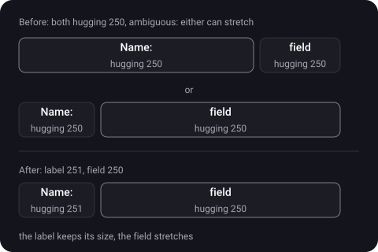
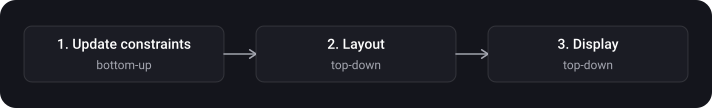
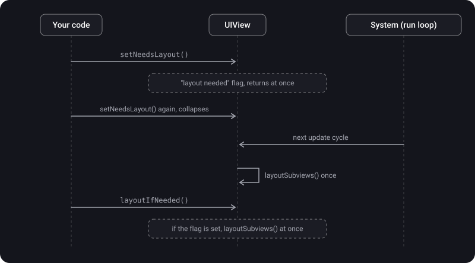

> **What you'll learn**
>
> - What `intrinsicContentSize` is and where it exists and where it doesn't
> - Content hugging and compression resistance: who gives way when a view is cramped or when there is too much room
> - The Auto Layout cycle: update constraints → layout → display and the hierarchy traversal order
> - `updateConstraints()`, `layoutSubviews()`, `setNeedsLayout()`, `layoutIfNeeded()`: the difference and when to call which
> - How to animate a constraint change properly
> - Typical priority tasks: two labels in a row, localization, "no wider than N"

> **Prerequisites:** tutorial [04](../autolayout-constraints/) — constraints, anchors, constraint priorities (1–1000); tutorial [03](../view-lifecycle/) — when `layoutSubviews` is called; tutorial [02](../calayer-drawing/) — `draw(_:)`.

## Analogy: a view is a spring

Every view is a spring with a natural length. When it is stretched or compressed, it resists with a certain force.

- **`intrinsicContentSize`** is the spring's natural length with no pressure.
- **Content hugging** is how strongly the spring resists **stretching** ("I don't want to be longer").
- **Compression resistance** is how strongly it resists **compression** ("I don't want to be shorter").
- When two springs of equal stiffness stand in one row and there is more or less room than needed, it is unclear which one gives way. Then the arrangement is ambiguous and you need to make the stiffness different.

## Step 1. Intrinsic content size

> **`intrinsicContentSize`** is a view's natural size, taking into account only the view's own properties. It is the width and height the view "wants" to have, based on its content, in order to display it in full.

- For a `UILabel` it is the size of the text in the chosen font; for a `UIButton` — the title with insets; for a `UIImageView` — the size of the image.
- Thanks to this, a view has a natural width and height, and we don't set them by hand. For a complete layout Auto Layout needs x, y, width and height. Usually "a button 20 points from the top and centered horizontally" is enough: Auto Layout takes the button's size from its intrinsic size.
- A plain `UIView` without content has no natural size: `UIView.noIntrinsicMetric` is used for such a dimension. For such a view you need to set the size with constraints explicitly.

**For your own view** with content the system doesn't know about, override `intrinsicContentSize` and call `invalidateIntrinsicContentSize()` when it changes. Then the system will take the new size into account on the next layout pass.

```swift
final class TagView: UIView {
    var text = "" {
        didSet {
            label.text = text
            invalidateIntrinsicContentSize()     // the content-based size changed
        }
    }

    private let label = UILabel()

    override init(frame: CGRect) {
        super.init(frame: frame)
        label.translatesAutoresizingMaskIntoConstraints = false
        addSubview(label)
        NSLayoutConstraint.activate([
            label.centerXAnchor.constraint(equalTo: centerXAnchor),
            label.centerYAnchor.constraint(equalTo: centerYAnchor)
        ])
    }

    required init?(coder: NSCoder) { fatalError("init(coder:) has not been implemented") }

    // text plus insets; doesn't depend on the view's frame
    override var intrinsicContentSize: CGSize {
        let textSize = label.intrinsicContentSize
        return CGSize(width: textSize.width + 16, height: textSize.height + 8)
    }
}
```

> Intrinsic size **must not depend on the view's frame**: the system has no way to dynamically pass a new width based on a changed height (Apple). That is why for multi-line text the width is usually set with constraints, and a `UILabel` with `numberOfLines = 0` will pick the height for that width itself.

## Step 2. Content Hugging and Compression Resistance

When constraints pull a view larger or smaller than its intrinsic size, Auto Layout looks at two priorities for each view (for each axis, horizontal and vertical):

> **Content hugging priority** is the priority with which a view resists **growing** beyond its intrinsic size. The higher it is, the more tightly the view "hugs" its content and refuses to stretch.
>
> **Content compression resistance priority** is the priority with which a view resists **shrinking** below its intrinsic size. The higher it is, the more firmly the view holds on to its size and refuses to narrow.

```swift
label.setContentHuggingPriority(.defaultHigh, for: .horizontal)                 // don't stretch in width
label.setContentCompressionResistancePriority(.required, for: .horizontal)      // don't compress in width

let hugging = label.contentHuggingPriority(for: .horizontal)
let resistance = label.contentCompressionResistancePriority(for: .vertical)
```

| Priority | What it means | When it matters |
| --- | --- | --- |
| Higher **hugging** | The view doesn't want to be larger than its content | Constraints demand a larger size than the intrinsic one (there is a lot of room) |
| Higher **compression resistance** | The view doesn't want to be smaller than its content | Constraints demand a smaller size than the intrinsic one (there is little room) |

- The priorities of these properties are the same as for constraints: from 1 to 1000 (`UILayoutPriority`).
- For standard elements, hugging is usually `defaultLow` (250) by default and compression resistance is `defaultHigh` (750). This is exactly how Apple describes a button: `defaultLow` is the level at which the button hugs its content horizontally, and `defaultHigh` is the level at which it resists compression.
- Don't override `contentCompressionResistancePriority(for:)` in a subclass: set the default values when creating the view (typically `defaultLow` or `defaultHigh`) — an Apple recommendation.

**Example 1: who stretches (hugging).** There are two views in a row: the "Name:" label and a text field. The row's width is fixed, and there is more room than both views need together. Somebody has to stretch.



```swift
nameLabel.setContentHuggingPriority(.defaultLow + 1, for: .horizontal)   // 251: the label doesn't stretch
textField.setContentHuggingPriority(.defaultLow, for: .horizontal)       // 250: the field stretches
```

Apple recommends the same technique in its stack view example: the text field's hugging is lower than the label's, and the field stretches.

**Example 2: who compresses (compression resistance).** Now there is little room: the "Price:" label and a long value. So that the value gets shortened (or wrapped) rather than the label, the label's compression resistance is set higher:

```swift
titleLabel.setContentCompressionResistancePriority(.defaultHigh + 1, for: .horizontal)   // 751: the label doesn't compress
valueLabel.setContentCompressionResistancePriority(.defaultHigh, for: .horizontal)       // 750: the value compresses
valueLabel.numberOfLines = 0                                                            // and wraps onto new lines
```

<details>
<summary>Why is the layout ambiguous if both views have the same hugging and there is a lot of room?</summary>

Both views resist stretching equally, and the system has no reason to prefer one over the other: either one can be stretched. Interface Builder will show a "Content Priority Ambiguity" warning. The solution is to make the priorities explicitly different (251 and 250, as above).

</details>

**A mnemonic:**

| Situation | What to do |
| --- | --- |
| There is a lot of room, one view should stretch | Raise hugging on the one that should **not** stretch |
| There is little room, one view should compress | Raise compression resistance on the one that should **not** compress |
| Text must not be truncated | Compression resistance `.required` (1000) on the label + don't set a fixed width |
| Two views with the same priority and ambiguity | Separate the priorities by 1 (251 and 250, 751 and 750) |

## Step 3. The Auto Layout cycle: update → layout → display

Every frame the system goes through three phases (per WWDC and the objc.io article) that depend on each other:



| Phase | Traversal direction | What happens | Methods |
| --- | --- | --- | --- |
| **1. Update constraints** | Bottom-up (from subview to superview) | A view can update its constraints before layout; a "measurement pass" that prepares data for layout | `updateConstraints()`, `setNeedsUpdateConstraints()`, `updateConstraintsIfNeeded()` |
| **2. Layout** | Top-down (from superview to subview) | The system copies the calculated frames from the Auto Layout engine into the views | `layoutSubviews()`, `setNeedsLayout()`, `layoutIfNeeded()` |
| **3. Display (render)** | Top-down | The view draws its content into the layer. This phase always happens, even if Auto Layout isn't used | `draw(_:)`, `setNeedsDisplay()` (tutorial [02](../calayer-drawing/)) |

- Each phase depends on the previous one: display depends on layout, layout on update constraints. So display will trigger layout if it is pending, and layout will trigger update constraints if the constraint system has unapplied changes (the objc.io article).
- It is **not a one-way street**: layout is an iterative process, and layout can dirty the constraints again. So it is important not to start feedback loops (steps 4 and 5).
- This whole trio is part of the render loop, which can run up to 120 times per second (WWDC 2018, High Performance Auto Layout).

## Step 4. updateConstraints

> **`updateConstraints()`** is the method in which a view updates its constraints. The system calls it before layout if you marked the view via `setNeedsUpdateConstraints()`.

**What Apple says:**

- You need to override the method **almost never**. It is often cleaner and simpler to update the constraint right after the change, for example directly in a button's action. Override only if updating in place is too slow or the view makes a lot of redundant changes.
- The implementation should be as efficient as possible: **don't deactivate all constraints and then activate the ones you need**. Keep track of your constraints, check them on every pass and change only what's needed.
- **Don't call `setNeedsUpdateConstraints()` inside `updateConstraints()`**: it schedules another pass and creates a feedback loop.
- **`super.updateConstraints()` as the last step** of the implementation.

```swift
final class CardView: UIView {
    var isCompact = false {
        didSet { setNeedsUpdateConstraints() }       // marked: updateConstraints needs to be called
    }

    // created once and not recreated elsewhere
    private var compactConstraints: [NSLayoutConstraint] = []
    private var regularConstraints: [NSLayoutConstraint] = []

    override func updateConstraints() {
        // we switch only the needed set, we don't recreate everything
        if isCompact {
            NSLayoutConstraint.deactivate(regularConstraints)
            NSLayoutConstraint.activate(compactConstraints)
        } else {
            NSLayoutConstraint.deactivate(compactConstraints)
            NSLayoutConstraint.activate(regularConstraints)
        }
        super.updateConstraints()                     // as the last step
    }
}
```

> WWDC 2015 (Mysteries of Auto Layout) clarifies: changing a constraint inside `updateConstraints` is faster than elsewhere, because the engine processes all the changes of that pass as a batch. But Apple's rule still stands: don't override this method without a real reason. Measure first, then optimize.

## Step 5. layoutSubviews, setNeedsLayout, layoutIfNeeded

> **`layoutSubviews()`** is the method inside which the subviews' sizes and positions are recalculated. The default implementation uses constraints to calculate the subviews' size and position.

- Override it only if autoresizing and constraints don't give the behavior you need; then you can set the subviews' `frame` directly.
- **Never call it directly.** To request layout: `setNeedsLayout()` (deferred) or `layoutIfNeeded()` (immediate).
- In an override, call `super.layoutSubviews()`.

**Three methods that are easy to confuse:**

| Method | What it does | When to call |
| --- | --- | --- |
| `layoutSubviews()` | The layout itself: calculating the subviews' frames | **Don't call**; only override for precise manual setup |
| `setNeedsLayout()` | Marks layout as stale; the recalculation happens in the next cycle. Returns immediately | When you need to recalculate layout later, together with other changes |
| `layoutIfNeeded()` | If layout updates are pending, performs them **immediately**, treating the receiver as the root of the subtree. If nothing is pending, does nothing | When you need up-to-date frames right now (before an animation, for measuring) |



**`setNeedsLayout()`:**

- Call it on the **main thread** when you want to change the layout of subviews. The method records the request and returns control immediately.
- Because the method doesn't start the update right away, you can mark many views before any of them is updated: all layout updates are gathered into one cycle, which is usually better for performance (Apple).

**`layoutIfNeeded()`:**

- Treats the receiver as the root and lays out the subtree from it. It is usually called on the view that contains all the views that need to update (most often — on the controller's root view).
- If there are no pending updates, the method finishes without changing the layout and without calling the layout callbacks.
- Frequent immediate interface updates are expensive: use it as needed.

```swift
override func layoutSubviews() {
    super.layoutSubviews()

    // setting a subview's frame manually: only when constraints don't fit
    let padding: CGFloat = 10
    let width = bounds.width - 2 * padding
    previewView.frame = CGRect(x: padding, y: padding, width: width, height: 50)
}
```

## Step 6. Animating a constraint change

Constraint changes can be animated (WWDC 2015). The scheme: change a constraint — and **inside the animation block** make the system apply layout. Then the new frames happen smoothly.

```swift
// Make sure there are no accumulated unapplied changes — otherwise they will be animated too
view.layoutIfNeeded()

bottomConstraint.constant = 200              // 1) change the constraint BEFORE the block

UIView.animate(withDuration: 0.3) {
    self.view.layoutIfNeeded()               // 2) layout inside the block: the frame changes are animated
}
```

- Call `layoutIfNeeded()` on the **root view** that contains all the views being changed: it re-lays out the subtree from the receiver.
- The first `view.layoutIfNeeded()` call before the constraint change flushes already pending changes: without it, unrelated shifts also end up in the animation if layout was pending earlier.

## Step 7. Sizing by content (self-sizing)

To find out what size a view will get with its constraints without displaying it on screen, there is `systemLayoutSizeFitting(_:)`:

```swift
// the smallest size that satisfies the constraints
let compact = cardView.systemLayoutSizeFitting(UIView.layoutFittingCompressedSize)

// with a fixed width — height by content (for example, for long text)
let fitted = cardView.systemLayoutSizeFitting(
    CGSize(width: 320, height: UIView.layoutFittingCompressedSize.height),
    withHorizontalFittingPriority: .required,
    verticalFittingPriority: .fittingSizeLevel
)
```

- This is the basis of **self-sizing cells** in lists: the cell gets its height from constraints by itself (tutorial [08](../lists/)).
- `UILayoutPriority.fittingSizeLevel` is the priority with which the view wants to match the target size in this calculation.

## Step 8. Typical priority tasks

**"Width no more than 320, and preferably 90% of the screen width".** A required constraint for the limit and an optional one for the preference:

```swift
let maxWidth = card.widthAnchor.constraint(lessThanOrEqualToConstant: 320)           // required
let preferred = card.widthAnchor.constraint(equalTo: view.widthAnchor, multiplier: 0.9)
preferred.priority = .defaultHigh                                                     // 750, optional
NSLayoutConstraint.activate([maxWidth, preferred])
```

On a narrow screen "90%" wins, on a wide one (iPad) the 320 limit wins.

**"Two labels in a row".** The text field stretches (step 2): the labels get higher hugging. The long value compresses — the label gets higher compression resistance.

**"Localization truncates the button text".** Don't give the button a fixed width; let it grow by its intrinsic size, and make its compression resistance `.required` or higher than that of neighboring views.

**"The label must wrap".** `numberOfLines = 0` and limit the width with constraints: the label will pick the height itself from its intrinsic size.

## Common mistakes

- Confusing hugging and compression resistance: hugging is against stretching, compression is against shrinking.
- Leaving the same priorities on two neighboring views: an ambiguous layout.
- Setting a fixed width where the intrinsic size is needed: localization and Dynamic Type will cut the text.
- Thinking `intrinsicContentSize` is the minimum size: it is the natural size.
- Making the intrinsic size depend on the view's `frame`.
- Not calling `invalidateIntrinsicContentSize()` after changing the content in your own view.
- Calling `layoutSubviews()` directly instead of `setNeedsLayout()` or `layoutIfNeeded()`.
- Mixing up the directions: update constraints is bottom-up, layout is top-down.
- Calling `setNeedsUpdateConstraints()` inside `updateConstraints()`: a feedback loop.
- Deactivating all constraints and recreating them in `updateConstraints()`: change only what changed.
- Forgetting `super.updateConstraints()` at the end of the implementation.
- Animating a constraint by calling `layoutIfNeeded()` not on the root view or not inside a `UIView.animate` block.
- Changing the constraint inside the animation block instead of changing it before the block and doing layout inside.

<details>
<summary>Which view will Auto Layout compress if there is little room and all views have equal compression resistance?</summary>

It is impossible to say for sure: the layout is ambiguous, the system will pick one of the options, and it may change from one warning to the next. Always make the priorities of neighboring views on one axis different.

</details>

## Cheat sheet

```swift
// Intrinsic size
override var intrinsicContentSize: CGSize { ... }     // the natural size, not the minimum; doesn't depend on frame
invalidateIntrinsicContentSize()                        // the content changed
UIView.noIntrinsicMetric                                // no natural size along the axis

// Hugging / Compression (250 / 750 by default for standard elements)
v.setContentHuggingPriority(.defaultHigh, for: .horizontal)                // don't stretch
v.setContentCompressionResistancePriority(.required, for: .horizontal)     // don't compress
// neighboring views on one axis: different priorities (251 and 250)

// The cycle: update constraints (bottom-up) -> layout (top-down) -> display (top-down)
setNeedsUpdateConstraints()   // mark
override func updateConstraints() { /* change only what's needed */ super.updateConstraints() }   // super last
setNeedsLayout()             // deferred, main thread, collapses
layoutIfNeeded()            // immediately, if pending; the root is the receiver
override func layoutSubviews() { super.layoutSubviews(); /* frames manually */ }   // don't call directly

// Animating a constraint
view.layoutIfNeeded()
c.constant = 200
UIView.animate(withDuration: 0.3) { view.layoutIfNeeded() }

// Size by constraints
v.systemLayoutSizeFitting(UIView.layoutFittingCompressedSize)

// "No wider than N, preferably 90%"
widthAnchor.constraint(lessThanOrEqualToConstant: 320)                 // required
let p = widthAnchor.constraint(equalTo: view.widthAnchor, multiplier: 0.9); p.priority = .defaultHigh
```

## Self-check questions

<details>
<summary>1. What is intrinsic content size? Is it a view's minimum size?</summary>

It is the view's natural size based on its content (text, image), independent of the frame. Not the minimum: the view can be compressed below it, the system will just resist with the compression resistance priority. A plain `UIView` doesn't have one (`noIntrinsicMetric`).

</details>

<details>
<summary>2. How does content hugging differ from compression resistance?</summary>

Hugging is the priority with which a view resists stretching beyond its intrinsic size (there is too much room). Compression resistance is the priority with which a view resists shrinking below its intrinsic size (there is little room). Both are per axis, from 1 to 1000.

</details>

<details>
<summary>3. Two labels in a row: which one stretches if the priorities are the same?</summary>

Ambiguous: the system will pick one of the options. To define the behavior, raise hugging (for example to 251) on the one that shouldn't stretch.

</details>

<details>
<summary>4. Which phases does a view with Auto Layout go through, and in which direction?</summary>

Update constraints (bottom-up, from subview to superview), layout (top-down), display (top-down, always, even without Auto Layout). Each phase depends on the previous one.

</details>

<details>
<summary>5. How does setNeedsLayout differ from layoutIfNeeded?</summary>

`setNeedsLayout()` only marks layout as stale and returns immediately; the recalculation happens in the next cycle, and several calls collapse. `layoutIfNeeded()` performs pending layout immediately for the subtree from the receiver; if nothing is pending, it does nothing.

</details>

<details>
<summary>6. How do you animate a constraint change?</summary>

First `view.layoutIfNeeded()` to flush accumulated changes, then change `constant` before the block, and inside `UIView.animate` call `view.layoutIfNeeded()` on the root view.

</details>

<details>
<summary>7. When should you override updateConstraints(), and what is forbidden in it?</summary>

Almost never: it is better to update a constraint right after the change. It is needed if updating in place is too slow or there are many redundant changes. You must not call `setNeedsUpdateConstraints()` inside (a loop), and you shouldn't deactivate everything and recreate it; `super.updateConstraints()` goes last.

</details>

## Sources

- [intrinsicContentSize — Apple Developer Documentation](https://developer.apple.com/documentation/uikit/uiview/intrinsiccontentsize)
- [invalidateIntrinsicContentSize — Apple Developer Documentation](https://developer.apple.com/documentation/uikit/uiview/invalidateintrinsiccontentsize())
- [contentHuggingPriority — Apple Developer Documentation](https://developer.apple.com/documentation/uikit/uiview/contenthuggingpriority(for:))
- [contentCompressionResistancePriority — Apple Developer Documentation](https://developer.apple.com/documentation/uikit/uiview/contentcompressionresistancepriority(for:))
- [UILayoutPriority — Apple Developer Documentation](https://developer.apple.com/documentation/uikit/uilayoutpriority)
- [updateConstraints — Apple Developer Documentation](https://developer.apple.com/documentation/uikit/uiview/updateconstraints())
- [setNeedsLayout — Apple Developer Documentation](https://developer.apple.com/documentation/uikit/uiview/setneedslayout())
- [layoutIfNeeded — Apple Developer Documentation](https://developer.apple.com/documentation/uikit/uiview/layoutifneeded())
- [layoutSubviews — Apple Developer Documentation](https://developer.apple.com/documentation/uikit/uiview/layoutsubviews())
- [Mysteries of Auto Layout, Part 1 — WWDC15 (Apple)](https://developer.apple.com/videos/play/wwdc2015/218/)
- [Mysteries of Auto Layout, Part 2 — WWDC15 (Apple)](https://developer.apple.com/videos/play/wwdc2015/219/)
- [High Performance Auto Layout — WWDC18 (Apple)](https://developer.apple.com/videos/play/wwdc2018/220/)
- [Advanced Auto Layout Toolbox — objc.io](https://www.objc.io/issues/3-views/advanced-auto-layout-toolbox/)
- [UIView Auto Layout life cycle — vadimbulavin.com](https://www.vadimbulavin.com/view-auto-layout-life-cycle/)
- [Best practices for updating UIView layout — gist (in Russian)](https://gist.github.com/just-evseev/60ff3f4d10cd46c00bb4f0799d40fed1)
- [Compression Resistance and Hugging Priority \| SWIFT — YouTube](https://www.youtube.com/watch?v=QPETRhylwVw&list=PL6ZiiwR0cAz6zkjJyJLmc928zHUtgABuw&index=12)
- [What is intrinsic content size — YouTube (in Russian)](https://www.youtube.com/watch?v=QionbYwgIoA)
- [LayoutSubviews vs layoutIfNeeded — YouTube](https://www.youtube.com/watch?v=F4TCmHpYDWY&t=475s)
