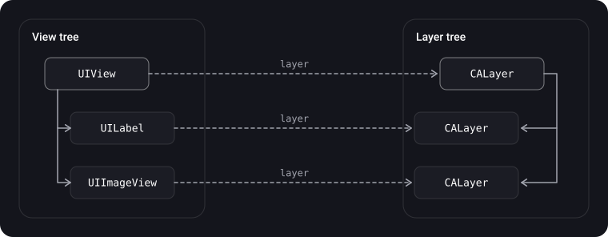
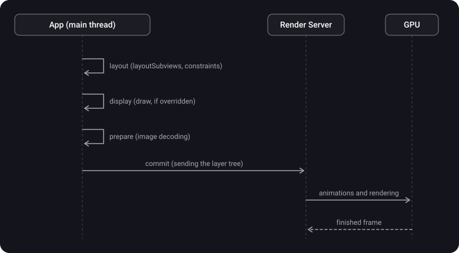

> **What you'll learn**
>
> - What `CALayer` is and how it relates to `UIView`
> - How a layer differs from a view, and why "layer on the GPU, view on the CPU" is an oversimplification
> - Visual layer properties: corners, border, shadow; why the shadow "disappears" with clipping
> - Implicit and explicit animations; the model layer and the presentation layer
> - `CAShapeLayer` and `UIBezierPath`
> - How `draw(_:)` and `setNeedsDisplay()` work and when it is better not to use them
> - How a frame reaches the screen (simplified) and what an offscreen pass is

> **Prerequisites:** tutorial [01](../uiview-window-coordinates/) — `UIView`, the view hierarchy, `frame` and `bounds`, points and pixels.

## Analogy: layers of transparent film

Picture a stack of transparent sheets, like in old cartoons. Each sheet has its own element drawn on it, and on top lies a frame the viewer looks through.

- **`CALayer`** is one sheet: it has a picture, a position, opacity, a shadow.
- **`UIView`** is the operator who handles that sheet: decides where to put it and listens for whether the viewer poked it with a finger. The sheet itself doesn't "hear" touches.
- **Animation** — instead of swapping the sheet, you ask for it to be moved smoothly, and a separate mechanism moves the stack, not your code.
- **`draw(_:)`** — drawing the picture on the sheet by hand. It is more expensive than placing a ready-made silhouette (`CAShapeLayer`).

## Step 1. What CALayer is

> **`CALayer`** is a Core Animation object that manages image-based content and lets you animate it. Layers often serve as the backing store for views, but can also be used without a view.

- `CALayer` inherits **directly from `NSObject`**, not from `UIResponder`. So a layer has no interface for handling touches and doesn't take part in the responder chain.
- A layer can hold content (`contents` — usually an image), geometry (`position`, `bounds`, `transform`) and visual attributes (background, border, shadow, opacity).
- Changing a layer property is the main way to start an animation.
- All graphics in a view ultimately happen on layers: a view draws into its layer, not onto the screen itself.

> `UIView` can respond to events, `CALayer` cannot. The layer is responsible for "how it looks", the view for "how it reacts".

Comparing a view and a layer:

| Capability | `UIView` | `CALayer` |
| --- | --- | --- |
| Parent class | `UIResponder` | `NSObject` |
| Touches and responder chain | Yes | No |
| Auto Layout | Yes | No (layers don't take part in Auto Layout) |
| Drawing and visual properties (shadow, border) | Through the layer | Directly |
| Animations | High-level API (`UIView.animate`) | The full set: implicit and explicit, `CAAnimation` |
| Hierarchy | subviews | sublayers (simpler, without the responder chain overhead) |
| Specialized subclasses | Many (UIKit) | `CAShapeLayer`, `CAGradientLayer`, `CATextLayer`, etc. |

> `CALayer` has a `hitTest(_:)` method: it returns the deepest descendant of the layer that contains the point. But it only finds a layer. Touch delivery, gestures and the responder chain are on the view's side.

## Step 2. A layer inside a view

Every view has a backing layer (`layer`). The view creates and configures it itself; most often it is a plain `CALayer`.



- The view hierarchy is mirrored by the layer hierarchy: add a subview and a sublayer appears.
- **A view is the delegate of its layer.** If the layer was created by a view, the view sets itself as its delegate, and this should not be changed (per Apple's documentation). That is exactly why a view can respond to layer requests such as `draw(_:)`.
- A view's geometry is its layer's geometry: the view's `frame`, `bounds` and `center` reflect the layer's properties (`position`, `bounds`).
- You can change the type of the backing layer by overriding `layerClass` in a `UIView` subclass:

```swift
final class GradientView: UIView {
    // UIKit calls this once when the view is created
    override class var layerClass: AnyClass { CAGradientLayer.self }

    // convenient typed access
    var gradientLayer: CAGradientLayer { layer as! CAGradientLayer }
}

let v = GradientView()
v.gradientLayer.colors = [UIColor.systemBlue.cgColor, UIColor.systemPurple.cgColor]
```

> The `layerClass` approach is more convenient than adding a `CAGradientLayer` as a sublayer: the backing layer follows the view's size and the view's animations by itself, and you don't need to update its `frame` by hand.

## Step 3. Visual layer properties

Part of a view's styling is done not in UIKit but through the layer:

```swift
let layer = cardView.layer

layer.cornerRadius = 12                  // rounded corners
layer.borderWidth = 1                    // border
layer.borderColor = UIColor.separator.cgColor   // a layer color is a CGColor, not a UIColor

layer.shadowColor = UIColor.black.cgColor        // shadow
layer.shadowOpacity = 0.2
layer.shadowOffset = CGSize(width: 0, height: 2)
layer.shadowRadius = 8
```

| Property | What it does | Note |
| --- | --- | --- |
| `cornerRadius` | Rounds the corners of the layer's background and border | The content (`contents`) is not clipped by itself |
| `masksToBounds` | Clips sublayers (and content) to the layer's bounds; for a view the counterpart is `clipsToBounds` | Together with rounding, it clips to the rounded outline |
| `maskedCorners` | Which of the 4 corners to round | `[.layerMinXMinYCorner, .layerMaxXMinYCorner]` — the top ones |
| `cornerCurve` | The corner curve type; `.continuous` is the "iOS rounding" | iOS 13+ |
| `borderWidth`, `borderColor` | A border along the layer's outline | `borderColor` is `CGColor?` |
| `shadowOpacity` / `shadowRadius` / `shadowOffset` / `shadowColor` | Shadow parameters | By default `shadowOpacity = 0`, so there is no shadow |
| `shadowPath` | A predefined shadow shape | Speeds up rendering dramatically, see step 8 and tutorial [10](../ui-performance/) |

> Shadow and clipping **conflict**: `masksToBounds = true` also clips the shadow itself, because it is drawn outside the layer. So a card with a shadow and rounded content is built from **two** layers: the outer one draws the shadow (without clipping), the inner one clips the content.

```swift
final class ShadowCardView: UIView {
    private let contentView = UIView()     // inner: rounding and clipping

    override init(frame: CGRect) {
        super.init(frame: frame)
        // outer view: only the shadow
        layer.shadowColor = UIColor.black.cgColor
        layer.shadowOpacity = 0.2
        layer.shadowRadius = 8
        layer.shadowOffset = CGSize(width: 0, height: 2)

        // inner: rounding and content clipping
        contentView.layer.cornerRadius = 12
        contentView.layer.masksToBounds = true
        addSubview(contentView)
    }

    required init?(coder: NSCoder) { fatalError("init(coder:) has not been implemented") }

    override func layoutSubviews() {
        super.layoutSubviews()
        contentView.frame = bounds
        // the shadow shape is set in advance — the GPU doesn't have to derive it from the content
        layer.shadowPath = UIBezierPath(roundedRect: bounds, cornerRadius: 12).cgPath
    }
}
```

## Step 4. Layer geometry and sublayers

A layer has its own geometry, in terms of which a view's `frame` is a derived property:

- **`position`** — the position of the layer's **anchorPoint** in the superlayer's coordinate system.
- **`anchorPoint`** — the anchor point inside `bounds`, as a fraction from 0 to 1. By default (0.5, 0.5) — the center. The layer rotates and scales around it.
- **`bounds`** — the size and its own coordinate system.
- **`transform`** — a `CATransform3D`; a view has a simplified `CGAffineTransform`.
- **`zPosition`** — the Z position, for drawing order.

> For a view, `center` is exactly the backing layer's `position` with the default anchorPoint (0.5, 0.5). That is why `center` and `bounds` are the "honest" parameters for positioning a view with a transform, see tutorial [01](../uiview-window-coordinates/).

**Manually added sublayers don't take part in Auto Layout.** If you created a `CAShapeLayer` and added it via `layer.addSublayer`, you need to update its `frame` yourself:

```swift
private let shape = CAShapeLayer()

override func layoutSubviews() {
    super.layoutSubviews()
    shape.frame = bounds                                  // the layer won't stretch by itself
    shape.path = UIBezierPath(ovalIn: bounds).cgPath      // and the path — for the new size
}
```

> In a view controller the same trick goes in `viewDidLayoutSubviews()`: by then the view's bounds are already final (tutorial [03](../view-lifecycle/)).

## Step 5. Layer animations

A layer is animated by changing its properties. Every animatable property has an associated **implicit** animation. The properties that can be animated are marked with the word Animatable in Apple's documentation (`opacity`, `position`, `bounds`, `backgroundColor`, `cornerRadius`, `shadow*`, `transform`, etc.).

**An implicit animation** — it is enough to change the property, and Core Animation interpolates the value itself. For a standalone layer the default duration is 0.25 s:

```swift
let standalone = CALayer()              // not a view's backing layer
standalone.frame = CGRect(x: 0, y: 0, width: 50, height: 50)
view.layer.addSublayer(standalone)

// later, when the layer is already in the hierarchy:
standalone.opacity = 0.2                 // animates by itself (0.25 s)
```

```swift
view.layer.opacity = 0.5                        // outside a block — no animation

UIView.animate(withDuration: 0.3) {
    view.layer.opacity = 0.5                    // inside a block — animated
}

CATransaction.begin()
CATransaction.setDisableActions(true)           // for a standalone layer — no implicit animation
standalone.opacity = 1
CATransaction.commit()
```

**An explicit animation** — you create a `CAAnimation` yourself and add it to the layer:

```swift
let fade = CABasicAnimation(keyPath: "opacity")
fade.fromValue = 1
fade.toValue = 0
fade.duration = 0.3

layer.opacity = 0                 // set the final value yourself!
layer.add(fade, forKey: "fade")   // the animation is only a visual "playback"
```

<details>
<summary>Why set layer.opacity = 0 if there is already an animation?</summary>

An explicit animation changes only what is visible on screen, not the value of the property itself. When it ends, the layer "returns" to its real value. If you don't change it, the layer becomes opaque again after the animation. So you first set the final value of the property, and add the animation only to show the path to it.

</details>

This explains why a layer has two "trees" in Core Animation:

| Layer | What it stores | How to get it |
| --- | --- | --- |
| **Model layer** | The target, "real" property values; what you read and write | `layer` or `layer.model()` |
| **Presentation layer** | The current on-screen state at each moment of the animation (a copy) | `layer.presentation()` |

This is needed, for example, to find where a finger landed on a **moving** view: its model `frame` is already final, while on screen it is still travelling. The on-screen position comes from `layer.presentation()`.

## Step 6. CAShapeLayer and UIBezierPath

> **`CAShapeLayer`** is a layer that draws a cubic Bézier spline in its own coordinate system. The shape is set by the **`path`** property (`CGPath`). **`UIBezierPath`** is a UIKit class that describes 2D shapes and curves; its `cgPath` is assigned to `path`.

**Advantages of `CAShapeLayer`:**

- **Performance.** No `draw(_:)` is needed: the shape is drawn during compositing, without creating a bitmap of the view's content on the CPU. Per Apple's documentation, the shape is converted to screen space before rasterization where possible, to preserve resolution.
- **Animations.** `path`, `fillColor`, `strokeColor`, `lineWidth`, `strokeStart`, `strokeEnd` and others are animatable.
- **Flexibility.** Fill, outline, thickness, dashed lines (`lineDashPattern`), line cap and join styles.

**Creating a `UIBezierPath` path:**

- `move(to:)`, `addLine(to:)`, `addCurve(to:controlPoint1:controlPoint2:)`, `addArc(withCenter:radius:startAngle:endAngle:clockwise:)`, `close()`;
- ready-made shapes: `UIBezierPath(rect:)`, `UIBezierPath(ovalIn:)`, `UIBezierPath(roundedRect:cornerRadius:)`.

```swift
let shapeLayer = CAShapeLayer()
let bezierPath = UIBezierPath()

// Example path: a triangle
bezierPath.move(to: CGPoint(x: 50, y: 0))
bezierPath.addLine(to: CGPoint(x: 100, y: 100))
bezierPath.addLine(to: CGPoint(x: 0, y: 100))
bezierPath.close()

shapeLayer.path = bezierPath.cgPath
shapeLayer.fillColor = UIColor.red.cgColor
shapeLayer.strokeColor = UIColor.black.cgColor
shapeLayer.lineWidth = 2

yourView.layer.addSublayer(shapeLayer)
```

> The main property of `CAShapeLayer` is `path`; `UIBezierPath` is there to describe that path conveniently.

**Animating line drawing via `strokeEnd`** is a typical trick for progress indicators and "drawing" a checkmark:

```swift
let ring = CAShapeLayer()
ring.path = UIBezierPath(ovalIn: bounds.insetBy(dx: 4, dy: 4)).cgPath
ring.fillColor = UIColor.clear.cgColor
ring.strokeColor = UIColor.systemBlue.cgColor
ring.lineWidth = 4
ring.lineCap = .round
ring.strokeEnd = 0
layer.addSublayer(ring)

let draw = CABasicAnimation(keyPath: "strokeEnd")
draw.fromValue = 0
draw.toValue = 1
draw.duration = 1
ring.strokeEnd = 1                      // the final value
ring.add(draw, forKey: "draw")
```

**A shape via a mask** — rounding only the top corners:

```swift
let path = UIBezierPath(roundedRect: bounds,
                        byRoundingCorners: [.topLeft, .topRight],
                        cornerRadii: CGSize(width: 16, height: 16))
let mask = CAShapeLayer()
mask.path = path.cgPath
view.layer.mask = mask      // the alpha channel of the mask layer becomes the view's mask
```

> A mask (`layer.mask`) causes an offscreen pass on the GPU (step 8). For simple corner rounding, `cornerRadius` and `maskedCorners` are better; keep masks for complex shapes.

## Step 7. Drawing via draw(_:) and setNeedsDisplay()

If the standard layer properties and `CAShapeLayer` are not enough, you can teach the view to draw itself.

> **`draw(_:)`** is a `UIView` method in which a subclass draws content using Core Graphics and UIKit. The default implementation does nothing.

**What Apple's documentation says:**

- UIKit creates a graphics context and configures it so that its origin matches the origin of the view's `bounds`. You can get the context via `UIGraphicsGetCurrentContext()`, but don't keep a strong reference to it: it can change between calls.
- The method is called when the view is first shown or when something invalidates its visible part.
- **Never call `draw(_:)` directly.** To redraw, call `setNeedsDisplay()` or `setNeedsDisplay(_:)`.
- Draw only within the passed `rect`. If `isOpaque == true`, the method must fill the `rect` completely with opaque content.
- If the view only shows a background color or you set the content through the layer directly, there is no need to override `draw(_:)`.

> **`setNeedsDisplay()`** marks the view as needing a redraw, remembers the request and returns immediately. The redraw happens in the next drawing cycle, when all marked views are updated.

```swift
final class ProgressBarView: UIView {
    var progress: CGFloat = 0 {
        didSet { setNeedsDisplay() }     // the content changed — ask for a redraw
    }

    override init(frame: CGRect) {
        super.init(frame: frame)
        isOpaque = false                 // corners are rounded, the background isn't solid
        backgroundColor = .clear
    }

    required init?(coder: NSCoder) { fatalError("init(coder:) has not been implemented") }

    override func draw(_ rect: CGRect) {
        let radius = bounds.height / 2
        UIColor.systemGray5.setFill()
        UIBezierPath(roundedRect: bounds, cornerRadius: radius).fill()

        let value = min(max(progress, 0), 1)
        UIColor.systemBlue.setFill()
        let fillRect = CGRect(x: 0, y: 0, width: bounds.width * value, height: bounds.height)
        UIBezierPath(roundedRect: fillRect, cornerRadius: radius).fill()
    }
}
```

**When to call `setNeedsDisplay()`:**

- The **content or appearance** that the drawing in `draw(_:)` depends on changes (properties that affect the picture).
- **Not needed** if you just change the view's geometry (`frame`, `bounds`): per Apple's documentation, the view is usually not redrawn then, and its ready content is adjusted according to `contentMode`. If you need a redraw on resize, set `contentMode = .redraw`.
- **Not needed** when you add a subview (`UIImageView`, `UIButton`) or change one: they draw themselves.

<details>
<summary>Why is draw(_:) more expensive than CAShapeLayer?</summary>

With an overridden `draw(_:)`, a bitmap store of roughly `bounds × scale` is allocated for the view, and drawing happens on the CPU through Core Graphics. The result is cached in the layer until the next `setNeedsDisplay()`. Any change requires redrawing the whole bitmap (or part of it) on the CPU and sending it to the system again. `CAShapeLayer` stores only the path description and is drawn during compositing, with no bitmap of its own, and changes to `strokeEnd`, `fillColor`, `path` can be animated by Core Animation itself. So if a shape can be expressed with a layer, a layer is better. In detail about the cost of custom drawing — tutorial [10](../ui-performance/).

</details>

| Approach | When it fits | Cost |
| --- | --- | --- |
| Layer properties (`cornerRadius`, `border`, `shadow`) | Simple styling | Low; a shadow without `shadowPath` and clipping with rounding cause an offscreen pass |
| `CAShapeLayer` and `UIBezierPath` | Vector shapes, outlines, progress, animatable figures | Low |
| `draw(_:)` and Core Graphics | Complex custom drawing that standard layers don't offer | Medium and up: bitmap and CPU, a redraw on every `setNeedsDisplay()` |
| A ready image (`UIGraphicsImageRenderer`) | A static picture that has to be shown many times (avatars, icons) | Once at creation; cheap afterwards |

Pre-rendering an image with a round shape (to avoid `cornerRadius` + `masksToBounds` in lists, see tutorial [10](../ui-performance/)):

```swift
func roundedImage(from source: UIImage, size: CGSize) -> UIImage {
    let renderer = UIGraphicsImageRenderer(size: size)
    return renderer.image { _ in
        let rect = CGRect(origin: .zero, size: size)
        UIBezierPath(ovalIn: rect).addClip()     // clip to a circle
        source.draw(in: rect)
    }
}
```

## Step 8. How a frame reaches the screen (simplified)

To understand why some techniques are fast and others are not, a pipeline diagram is useful. Its details are internals of the system, so it is given in simplified form.



- In the **app** (main thread), events, layout and preparation of layer contents happen, then the layer tree is sent in a batch to a separate process (the Render Server).
- The **Render Server** plays back animations and renders the frame through the GPU. That is why implicit and explicit layer animations keep playing smoothly even if the app's main thread is busy (but a frozen UI with such an animation is not the same as a responsive one).
- The screen refreshes 60 or 120 times per second (ProMotion): the main thread has about 16.7 ms or 8.3 ms per frame (tutorial [10](../ui-performance/)).

**Offscreen pass.** Normally the GPU draws a layer straight into the frame buffer. But some effects require it to first render the layer into a separate buffer and then composite it. This is more expensive: a context switch and extra memory. Such effects include (based on Apple WWDC materials and [objc.io](http://objc.io) articles):

| Effect | How to speed it up |
| --- | --- |
| A shadow without `shadowPath` | Set `shadowPath` |
| A mask (`layer.mask`) | Use `cornerRadius` or a pre-made image |
| `cornerRadius` together with `masksToBounds` (when there is something to clip) | A pre-rendered image; don't enable `masksToBounds` if the content doesn't go beyond the bounds |
| `shouldRasterize = true` (caching the layer into a bitmap) | Enable it only for complex layers that change rarely, and set `rasterizationScale` |
| Visual effects (blur, `UIVisualEffectView`) | Use deliberately, not in every list cell |

How to find such layers: in the simulator, Debug → Color Offscreen-Rendered Yellow, and also Instruments (more in tutorial [10](../ui-performance/)).

## Step 9. Useful CALayer subclasses

Core Animation provides specialized layers that are often simpler and faster than custom drawing:

| Layer | What it is for |
| --- | --- |
| `CAShapeLayer` | Vector shapes from a `path` |
| `CAGradientLayer` | Gradients (linear, radial, conic) |
| `CATextLayer` | Text in a layer (without a backing view) |
| `CAReplicatorLayer` | Copies of a layer with variations (indicators, effects) |
| `CAEmitterLayer` | Particles (confetti, snow) |
| `CAScrollLayer` | A scrollable layer |
| `CATiledLayer` | Tiles for very large images |
| `CAMetalLayer` | A surface for rendering with Metal |
| `CATransformLayer` | A layer for 3D hierarchies (without flattening the transform) |

## Common mistakes

- Expecting `view.layer.opacity = x` to animate by itself: outside `UIView.animate` the view's backing layer changes instantly.
- Adding an explicit animation but not changing the final property value: when it ends, the layer "jumps" back.
- Turning on `masksToBounds` and wondering why the shadow vanished: you need two layers or two views.
- Creating a sublayer (`CAShapeLayer`) and not updating its `frame` and `path` on resize: it doesn't take part in Auto Layout.
- Calling `draw(_:)` directly instead of `setNeedsDisplay()`.
- Calling `setNeedsDisplay()` on every geometry change (an unnecessary redraw).
- Drawing everything in `draw(_:)` even for simple shapes: `CAShapeLayer` or a ready image is cheaper.
- Using `UIColor` instead of `CGColor` in layer properties (`borderColor`, `shadowColor`, `fillColor`).
- Leaving `isOpaque = true` and not filling the whole `rect` in `draw(_:)`: black areas appear.
- Setting `shouldRasterize = true` on a frequently changing layer: the cache is constantly recreated.

<details>
<summary>Why doesn't a layer's border color change when the theme changes (light/dark)?</summary>

`CGColor` is a static value. A dynamic `UIColor` (`.separator`, `.label`) gets "frozen" for the current theme at the moment `.cgColor` is assigned, and the layer won't update by itself when the theme changes. The solution: update such properties when the appearance changes (for example, in `traitCollectionDidChange`, or via `registerForTraitChanges` in newer iOS versions) and take the color through `resolvedColor(with: traitCollection)`.

</details>

## Cheat sheet

```swift
// The backing layer and its type
view.layer                                         // the view's CALayer
override class var layerClass: AnyClass { CAGradientLayer.self }

// Styling
layer.cornerRadius = 12; layer.masksToBounds = true     // clip to the rounding
layer.maskedCorners = [.layerMinXMinYCorner]            // which corners
layer.borderWidth = 1; layer.borderColor = color.cgColor
layer.shadowOpacity = 0.2; layer.shadowPath = path.cgPath
// shadow + clipping = two layers (outer - shadow, inner - clipping)

// Animations
UIView.animate(withDuration: 0.3) { view.layer.opacity = 0 }
let a = CABasicAnimation(keyPath: "opacity"); a.toValue = 0; a.duration = 0.3
layer.opacity = 0; layer.add(a, forKey: "fade")         // set the final value yourself
layer.presentation()                                    // what is on screen right now
CATransaction.setDisableActions(true)                   // turn off implicit ones

// Shapes
shape.path = UIBezierPath(ovalIn: rect).cgPath
shape.fillColor = UIColor.red.cgColor
shape.strokeEnd = 1                                     // animatable

// Drawing
override func draw(_ rect: CGRect) { /* Core Graphics */ }   // don't call directly
setNeedsDisplay()                                            // the content changed
contentMode = .redraw                                        // redraw on resize

// Outside Auto Layout
override func layoutSubviews() { super.layoutSubviews(); shape.frame = bounds }
```

## Self-check questions

<details>
<summary>1. How does UIView differ from CALayer?</summary>

`UIView` inherits from `UIResponder`: it responds to touches, takes part in the responder chain and Auto Layout, and has a high-level animation API. `CALayer` inherits from `NSObject`: it is responsible for content, geometry and visual properties (shadow, border), can be animated, but doesn't handle events.

</details>

<details>
<summary>2. Is it true that a view is rendered on the CPU and a layer on the GPU?</summary>

No, that is an oversimplification. Layer contents (including `draw(_:)`) are prepared on the CPU in the app. Layer compositing and animations are performed by a separate process, the Render Server, using the GPU.

</details>

<details>
<summary>3. Why doesn't view.layer.opacity = 0.5 animate, while standaloneLayer.opacity = 0.5 does?</summary>

For a view's backing layer UIKit disables implicit animations and enables them only inside `UIView.animate`. Standalone layers have implicit animations on by default, with a duration of about 0.25 s.

</details>

<details>
<summary>4. What are the model layer and the presentation layer?</summary>

The model layer stores the target property values (what you read and write). The presentation layer is a copy that reflects the on-screen state at each moment of the animation (`layer.presentation()`).

</details>

<details>
<summary>5. Why does a view with masksToBounds = true lose its shadow? How do you get both rounding and a shadow?</summary>

`masksToBounds` clips everything outside the layer's bounds, including the shadow. The solution: two layers or two views — the outer one draws the shadow, the inner one clips the content. Set `shadowPath` for the shadow.

</details>

<details>
<summary>6. When should you call setNeedsDisplay(), and what happens after the call?</summary>

When the content or appearance that the drawing in `draw(_:)` depends on changes. The method only marks the view and returns immediately; `draw(_:)` will be called by the system in the nearest drawing cycle, and several calls collapse into one redraw. If only the geometry changes, no redraw is needed: the content is adjusted according to `contentMode`.

</details>

<details>
<summary>7. How is CAShapeLayer better than drawing in draw(_:)?</summary>

It needs no bitmap of its own and no Core Graphics on the CPU, it is drawn during compositing and animates well (`path`, `strokeEnd`, `fillColor`). In `draw(_:)` any change forces the content to be redrawn on the CPU.

</details>

## Sources

- [CALayer — Apple Developer Documentation](https://developer.apple.com/documentation/quartzcore/calayer)
- [CAShapeLayer — Apple Developer Documentation](https://developer.apple.com/documentation/quartzcore/cashapelayer)
- [draw(_:) — Apple Developer Documentation](https://developer.apple.com/documentation/uikit/uiview/draw(_:))
- [setNeedsDisplay() — Apple Developer Documentation](https://developer.apple.com/documentation/uikit/uiview/setneedsdisplay())
- [Animating Layer Content — Core Animation Programming Guide (Apple, archive)](https://developer.apple.com/library/archive/documentation/Cocoa/Conceptual/CoreAnimation_guide/CreatingBasicAnimations/CreatingBasicAnimations.html)
- [Changing a Layer’s Default Behavior — Core Animation Programming Guide (Apple, archive)](https://developer.apple.com/library/archive/documentation/Cocoa/Conceptual/CoreAnimation_guide/ReactingtoLayerChanges/ReactingtoLayerChanges.html)
- [Getting Pixels onto the Screen — objc.io](https://www.objc.io/issues/3-views/moving-pixels-onto-the-screen/)
- [Getting to know CALayer — Habr (in Russian)](https://habr.com/ru/articles/309506/)
- [iOS RSSchool 2020. UIView, CALayer, UIWindow — YouTube](https://www.youtube.com/watch?v=rvTNLQgBfYw&t=806s)
- [View vs Layer: what is the difference \| SWIFT — YouTube (in Russian)](https://www.youtube.com/watch?v=kx1vVe7__ec&list=PL6ZiiwR0cAz6zkjJyJLmc928zHUtgABuw&index=10)
