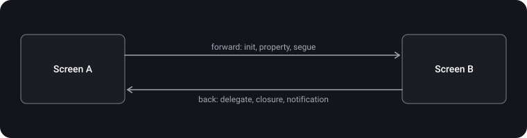

> **What you'll learn**
>
> - Two directions of data passing: "forward" (A → B) and "back" (B → A)
> - Forward: a custom init, properties, a segue and `prepare(for:sender:)`, creating from a storyboard via `creator`
> - Back: delegates, closures, `NotificationCenter` — when to use which and their limitations
> - Why a delegate must be `weak` and closures need `[weak self]`
> - How `UIAppearance` works: global and nested styles, when they are applied and what they don't support
> - How to style `UINavigationBar` in modern iOS versions

> **Prerequisites:** tutorial [03](../view-lifecycle/) — the `UIViewController` lifecycle; tutorial [07](../responder-chain-gestures/) — target-action and the responder chain; the basics of ARC (`strong`, `weak`) and closures in Swift.

## Analogy: an assignment and feedback

You give a colleague a task and want them to report the result.

- **Forward.** You hand over everything needed right away, when giving the task (init), or report later (a property).
- **Back.** You ask them to reply in one of three ways:
  - **a delegate** — you leave a phone number with rules (a protocol: "call there and say such-and-such phrases");
  - **a closure** — you leave a sealed envelope with the instruction "read when you're done";
  - **`NotificationCenter`** — you pin an announcement on a board: whoever is standing at the board at that moment will see it. Those who come later get nothing.

## Step 1. Two directions and an overview of the ways

First you need to understand the direction:



| Way | Direction | Coupling | When it fits |
| --- | --- | --- | --- |
| Custom init | Forward | Everything needed must be passed at creation | A screen is meaningless without data (a user profile) |
| Properties | Forward | Data can be set after creation | Optional or updatable data; a screen from a storyboard |
| Segue and `prepare(for:sender:)` | Forward | A storyboard transition creates the controller itself, you configure it before it is shown | Storyboard-based projects |
| Delegate | Back | A protocol: one-to-one, a weak reference | Several events, an explicit contract |
| Closure | Back | A local handler without a protocol | One or two events, a quick result |
| `NotificationCenter` | Either direction, one-to-many | No direct link, the sender doesn't know the receivers | The event matters to many unrelated screens |

## Step 2. Forward: A → B

**1. Custom init.** Controller B is created with everything it needs. The most reliable option: dependencies are constants (`let`), and without them the screen can't be created.

```swift
final class ProfileViewController: UIViewController {
    private let user: User

    init(user: User) {
        self.user = user
        super.init(nibName: nil, bundle: nil)
    }

    required init?(coder: NSCoder) {
        fatalError("init(coder:) is not supported — the screen is created in code")
    }
}

// presenting
navigationController?.pushViewController(ProfileViewController(user: user), animated: true)
```

**2. Properties.** You created the controller — set a property. Simple, but only you can remember to set it: the compiler won't force you. That is why the property is usually optional (or a `var` with a sensible default value).

```swift
let details = DetailsViewController()
details.item = item                 // set before presenting
navigationController?.pushViewController(details, animated: true)
```

**3. Segue.** In a storyboard the transition creates the controller itself. Data can be passed in `prepare(for:sender:)`. Per Apple's documentation, the method is called when the segue is about to be performed, and the new controller is configured in it before it is shown. `segue` has references to both controllers, and `sender` is the object that initiated the transition (for example, the cell that was tapped).

```swift
override func prepare(for segue: UIStoryboardSegue, sender: Any?) {
    guard segue.identifier == "showDetails",
          let details = segue.destination as? DetailsViewController,
          let cell = sender as? UITableViewCell,
          let indexPath = tableView.indexPath(for: cell) else { return }
    details.item = items[indexPath.row]
}
```

The downsides of a segue: string identifiers and type casting (a typo in the name is a silent error), and the controller itself is created without your involvement, so `let` dependencies can't be passed.

**A custom init and a storyboard.** Since iOS 13 there is a way to build a controller from a storyboard with your own initializer: `instantiateViewController(identifier:creator:)`. In `creator` you create the controller with your own init that takes an `NSCoder`; per Apple's documentation, it must call the parent's `init(coder:)` (otherwise it is a programmer error), and after that initialize its own properties. If you return `nil`, the standard `init(coder:)` is used.

```swift
let storyboard = UIStoryboard(name: "Main", bundle: nil)
let profile = storyboard.instantiateViewController(identifier: "Profile") { coder in
    ProfileViewController(coder: coder, user: user)
}

final class ProfileViewController: UIViewController {
    private let user: User

    init?(coder: NSCoder, user: User) {
        self.user = user
        super.init(coder: coder)         // required
    }

    required init?(coder: NSCoder) { fatalError("use init(coder:user:)") }
}
```

## Step 3. Back: a delegate

Delegation lets class B talk to A **without knowing its type**: B knows only the protocol. The two classes aren't tightly coupled, and any class can implement the protocol.

**Four key components:**

1. the delegate protocol;
2. a `delegate` property in the class that delegates;
3. the class that will be the delegate conforms to the protocol and assigns itself;
4. the delegating class calls a method from the protocol at the right moment.

```swift
// 1) the protocol is class-bound (AnyObject), so the delegate can be stored weak
protocol ColorPickerDelegate: AnyObject {
    func colorPicker(_ picker: ColorPickerViewController, didSelect color: UIColor)
}

final class ColorPickerViewController: UIViewController {
    // 2) the delegate property is weak
    weak var delegate: ColorPickerDelegate?

    @objc private func doneTapped() {
        delegate?.colorPicker(self, didSelect: selectedColor)    // 4) we call it
        dismiss(animated: true)
    }
}

// 3) screen A conforms to the protocol and assigns itself
extension SettingsViewController: ColorPickerDelegate {
    func colorPicker(_ picker: ColorPickerViewController, didSelect color: UIColor) {
        view.backgroundColor = color
    }
}

let picker = ColorPickerViewController()
picker.delegate = self
present(picker, animated: true)
```

**Why `weak`.** A holds B (for example, as `presentedViewController` or in the navigation stack), and B holds A through `delegate`. If both are strong, a cycle arises: neither will be deallocated. In Swift cycles must be broken by the programmer (`weak` or `unowned`, the "Automatic Reference Counting" chapter of The Swift Programming Language). A `weak` reference is always optional and is allowed only for classes, so the delegate protocol is declared as `AnyObject`.

The naming convention (how delegate methods are named in UIKit): the first parameter is the sender itself (`colorPicker(_:didSelect:)`), the verbs `will` and `did` mean "before" and "after", `should` is a question with an answer. Optional methods in a Swift protocol are made through an `extension` with a default implementation.

## Step 4. Back: closures (completion handlers)

A closure replaces a delegate: the interface is defined by a property that stores the closure. A big advantage is that it is easy to use: it is defined locally, without a separate protocol and method. A closure can even return a value to the calling code, so passing data is possible in both directions.

```swift
final class SecondViewController: UIViewController {
    var onSave: ((String) -> Void)?           // a callback closure

    @objc private func saveTapped() {
        onSave?(textField.text ?? "")         // pass the value back
        dismiss(animated: true)
    }
}

// in FirstViewController
let second = SecondViewController()
second.onSave = { [weak self] text in         // [weak self] — to avoid a retain cycle
    self?.resultLabel.text = text
}
present(second, animated: true)
```

**When closures are useful:**

- you don't need the protocol approach, you need a quick way to pass data;
- a closure has to be passed through several classes: without a closure you'd have to build a cascade of function calls, but with a closure you can just pass a block of code.

**Closure or delegate:**

| Criterion | Delegate | Closure |
| --- | --- | --- |
| Many events (`will`, `did`, `should`...) | Convenient: one protocol groups them | You need many closure properties |
| One event with a result | Possible, but wordy | Short and local |
| Returning a value in response | A protocol method can return a value | Also possible, the closure's type defines the return |
| Leak risk | `weak var delegate` | `[weak self]` in the closure |
| Debugging | Easy to find the implementation by the protocol | The code is next to where the screen is created |

> A closure that is stored in a child screen's property and captures the parent's `self` with a strong reference creates a retain cycle if the parent also holds the child (a modally presented screen is held by its parent). By default use `[weak self]` in closures that are stored (escaping).

## Step 5. NotificationCenter

> **`NotificationCenter`** is a broadcast mechanism that lets you send information to all registered observers. The Observer pattern. Every app has a default center (`NotificationCenter.default`); one center delivers notifications only within a single program.

**Three parts of the work:** observing (subscribing), posting, responding to a notification.

```swift
extension Notification.Name {
    static let profileDidUpdate = Notification.Name("profileDidUpdate")   // your own name as a constant
}

// posting (anywhere)
NotificationCenter.default.post(name: .profileDidUpdate,
                                object: self,
                                userInfo: ["name": "Anna"])

// subscribing with a selector
NotificationCenter.default.addObserver(self,
                                       selector: #selector(profileUpdated(_:)),
                                       name: .profileDidUpdate,
                                       object: nil)

@objc private func profileUpdated(_ notification: Notification) {
    let name = notification.userInfo?["name"] as? String     // userInfo is a [AnyHashable: Any] dictionary
    nameLabel.text = name
}
```

**Block-based subscription and what is dangerous in it (per Apple's documentation):**

- `addObserver(forName:object:queue:using:)` returns a **token** (an opaque observer object). The center holds both the token and the block with a strong reference until you remove the subscription.
- The subscription must be removed (`removeObserver`) before the system deallocates the object named in the subscription.
- If `self` holds the token with a strong reference, the block needs `[weak self]` (otherwise a retain cycle).
- The `queue` parameter: with `nil` the block runs **synchronously on the sender's thread**. If you update the interface, specify `OperationQueue.main`.

```swift
private var token: NSObjectProtocol?

override func viewDidLoad() {
    super.viewDidLoad()
    token = NotificationCenter.default.addObserver(
        forName: .profileDidUpdate, object: nil, queue: .main
    ) { [weak self] note in
        self?.nameLabel.text = note.userInfo?["name"] as? String
    }
}

deinit {
    if let token { NotificationCenter.default.removeObserver(token) }
}
```

**When it fits:** the screens aren't connected to each other; many screens need to respond to one notification (for example, "the profile changed", "signed out") or one screen to several. It doesn't fit an ordinary "from B to A" result: the link is implicit, and the data flow is hard to trace.

**Modern ways of receiving.** Per Apple's documentation, besides `addObserver` there are:

- `notifications(named:object:)` — an asynchronous sequence of notifications (`for await`);
- `publisher(for:object:)` — a Combine publisher;
- typed Swift messages `NotificationCenter.MainActorMessage` and `NotificationCenter.AsyncMessage` (with strong typing and actor isolation awareness).

```swift
// an asynchronous sequence: no token, the subscription lives as long as the task does
let task = Task {
    for await note in NotificationCenter.default.notifications(named: .profileDidUpdate) {
        print(note.userInfo ?? [:])
    }
}
// task.cancel() — stop the subscription
```

## Step 6. What to choose

| Task | Way |
| --- | --- |
| A screen must have the data | A custom init (in a storyboard — `instantiateViewController(identifier:creator:)`) |
| Optional data or setup after creation | A property |
| A storyboard transition | `prepare(for:sender:)` (or `creator`) |
| Several events back, an explicit contract | A delegate |
| One one-off event back (chose, saved) | A closure |
| The event matters to many unrelated screens | `NotificationCenter` |
| Shared state that everyone needs to see | A separate data object (a model, a service) that is passed through init and subscribed to (the architecture tutorials) |

## Step 7. UIAppearance

> **`UIAppearance`** is a protocol that gives access to a class's **appearance proxy**. Through the proxy you can configure the look of all instances of a class once (text color, background, etc.).

- This is supported by classes that conform to `UIAppearanceContainer`, and the needed accessors are marked `UI_APPEARANCE_SELECTOR` (a property without this mark can't be configured through the proxy). The list of classes includes `UIView`, `UIBarItem`, `UILabel`, `UIButton`, `UINavigationBar`, `UITabBar`, `UITableView`, `UISwitch` and other subclasses.

**Three kinds of configuration (per Apple's documentation):**

1. **For all instances** — `appearance()`.
2. **For instances inside a container** — `appearance(whenContainedInInstancesOf:)`.
3. **For a set of traits** — `appearance(for:)` with a `UITraitCollection`.

```swift
// all labels in the app
UILabel.appearance().textColor = .label

// buttons: Swift returns the same type, no casting needed
UIButton.appearance().setTitleColor(.white, for: .normal)
UIButton.appearance().backgroundColor = .systemBlue

// only labels inside your own card
UILabel.appearance(whenContainedInInstancesOf: [CardView.self]).textColor = .secondaryLabel
```

**When it is applied.** Per Apple's documentation, styles are applied **when a view enters a window**, and don't change a view that is already in a window. To update an already displayed view, remove it from the hierarchy and put it back. So styles are set **early**: at launch (in `AppDelegate`/`SceneDelegate`, before screens are shown).

**Which setting wins.** In any hierarchy the "outermost" proxy wins; if they are equal, specificity decides (the depth of the container chain). UIKit takes the first unambiguous match, reading the hierarchy from the window down.

**The navigation bar in modern iOS.** For `UINavigationBar` since iOS 13 the appearance is set with `UINavigationBarAppearance` objects in `standardAppearance` and `scrollEdgeAppearance`. Per Apple's documentation, if `scrollEdgeAppearance` is `nil`, UIKit takes `standardAppearance` with a **transparent background**; in iOS 15 this property works for all navigation bars. So the "vanished" background color when the content is scrolled to the top is a typical mistake: only `standardAppearance` was configured. You need to set both (and `compactAppearance` if necessary).

```swift
let appearance = UINavigationBarAppearance()
appearance.configureWithOpaqueBackground()
appearance.backgroundColor = .systemBlue
appearance.titleTextAttributes = [.foregroundColor: UIColor.white]

UINavigationBar.appearance().standardAppearance = appearance
UINavigationBar.appearance().scrollEdgeAppearance = appearance     // without this the background at the content's edge will be transparent
```

> `UIAppearance` is convenient for basic global styles (the navigation bar color, the font of labels). For repeated custom elements (a button with rounded corners and a shadow), your own subclass in which the look is set right in the class code is often more reliable.

## Common mistakes

- A delegate without `weak`: a retain cycle, screens aren't released from memory.
- A delegate protocol without `AnyObject`: `weak` won't compile for it.
- A reference to the concrete class A in B instead of a protocol: tight coupling and a cycle.
- Keeping a closure with a strong `self` in a screen's property: a leak. You need `[weak self]`.
- Passing everything through `NotificationCenter` without need: an implicit link, hard to debug.
- Expecting a notification to "wait" for a screen that subscribes later: nobody will receive it.
- Not removing a block-based observer and not keeping the token: the subscription stays alive and holds the block.
- Updating the UI in a block-based subscription with `queue: nil`: the block runs on the sender's thread, which may not be the main one.
- Trying to pass a `let` dependency to a controller created by a segue: it is created without your init (you need `creator`).
- Not calling the parent's `init(coder:)` in `creator`: a programmer error.
- Configuring properties through `appearance()` after the view is already in a window: it won't affect it.
- Expecting properties without `UI_APPEARANCE_SELECTOR` to work with `UIAppearance` (for example, `layer.cornerRadius`).
- Setting only `standardAppearance` on `UINavigationBar` and being surprised by the transparent background at the content's edge.

<details>
<summary>Why is a delegate weak and a closure [weak self]? Always?</summary>

This is about a strong reference cycle. If A holds B and B holds A (through `delegate` or through a closure that captured `self`), neither will be deallocated. `[weak self]` isn't always needed: for non-escaping closures there is no cycle. It is needed for closures that are stored in properties or in a block-based `NotificationCenter` subscription.

</details>

## Cheat sheet

```swift
// FORWARD
ProfileVC(user: user)                                  // custom init: a let dependency
vc.item = item                                         // a property
override func prepare(for segue: UIStoryboardSegue, sender: Any?) { /* destination */ }
storyboard.instantiateViewController(identifier: "id") { coder in VC(coder: coder, user: u) }  // iOS 13

// BACK
protocol XDelegate: AnyObject { func x(_ x: XVC, didSelect v: V) }
weak var delegate: XDelegate?
var onSave: ((String) -> Void)?                        // in the receiver: { [weak self] v in ... }
NotificationCenter.default.post(name: .n, object: self, userInfo: ["k": v])
token = center.addObserver(forName: .n, object: nil, queue: .main) { [weak self] n in ... }   // remove the token in deinit
// a notification isn't stored: a late subscriber won't receive it

// UIAppearance
UILabel.appearance().textColor = .label                // before the view appears in a window
UILabel.appearance(whenContainedInInstancesOf: [CardView.self]).textColor = .secondaryLabel
// only UI_APPEARANCE_SELECTOR properties; the outermost proxy wins
UINavigationBar.appearance().standardAppearance = a; UINavigationBar.appearance().scrollEdgeAppearance = a
```

## Self-check questions

<details>
<summary>1. What ways of passing data between screens do you know? How do you divide them by direction?</summary>

Forward (A → B): a custom init, properties, a segue with `prepare(for:sender:)`. Back (B → A): a delegate, a closure, `NotificationCenter`.

</details>

<details>
<summary>2. How is a custom init better than a property, and how do you build a controller from a storyboard with your own init?</summary>

A custom init makes the dependency mandatory (`let`): the compiler won't let you forget it. For a storyboard — `instantiateViewController(identifier:creator:)` (iOS 13): in `creator` the controller is created with its own init, which must call `init(coder:)`.

</details>

<details>
<summary>3. How does delegation work? Why is the delegate weak and why is the protocol AnyObject?</summary>

A protocol, a `delegate` property, a delegate class, a call of a protocol method. The delegate is `weak` to avoid a strong reference cycle; `weak` is allowed only for classes, so the protocol is declared as `AnyObject`.

</details>

<details>
<summary>4. When is a closure better than a delegate, and when not?</summary>

A closure — for one or two events and a quick local result. A delegate — when there are many events and an explicit contract is needed. Both carry a leak risk: `weak var delegate` and `[weak self]`.

</details>

<details>
<summary>5. What happens if a notification is posted before anyone has subscribed to it? On which thread does the block run?</summary>

Such a subscriber won't receive it: the center keeps no history. With `queue: nil` the block runs synchronously on the sender's thread; for the UI you specify the main queue.

</details>

<details>
<summary>6. How do you unsubscribe from a block-based NotificationCenter subscription, and what happens if you don't?</summary>

The token returned by `addObserver(forName:...)` must be passed to `removeObserver(_:)` before the object is deallocated. Otherwise the center keeps holding the block and the token with strong references; without `[weak self]` this is a leak.

</details>

<details>
<summary>7. How does UIAppearance work? When is it applied and what are its limitations?</summary>

Through a class's appearance proxy (for all instances, inside a container, for traits). It is applied when a view enters a window and doesn't affect an already displayed view. It works only with properties marked `UI_APPEARANCE_SELECTOR`. In a conflict the outermost proxy wins, then the depth of the chain decides.

</details>

## Sources

- [UIAppearance — Apple Developer Documentation](https://developer.apple.com/documentation/uikit/uiappearance)
- [scrollEdgeAppearance — Apple Developer Documentation](https://developer.apple.com/documentation/uikit/uinavigationbar/scrolledgeappearance)
- [prepare for segue — Apple Developer Documentation](https://developer.apple.com/documentation/uikit/uiviewcontroller/prepare(for:sender:))
- [instantiateViewController identifier creator — Apple Developer Documentation](https://developer.apple.com/documentation/uikit/uistoryboard/instantiateviewcontroller(identifier:creator:))
- [NotificationCenter — Apple Developer Documentation](https://developer.apple.com/documentation/foundation/notificationcenter)
- [addObserver forName object queue using — Apple Developer Documentation](https://developer.apple.com/documentation/foundation/notificationcenter/addobserver(forname:object:queue:using:))
- [post name object userInfo — Apple Developer Documentation](https://developer.apple.com/documentation/foundation/notificationcenter/post(name:object:userinfo:))
- [Automatic Reference Counting — The Swift Programming Language](https://docs.swift.org/swift-book/documentation/the-swift-programming-language/automaticreferencecounting/)
- [iOS BEST PRACTICES — A basic implementation of delegate methods in UIKit — Mad Brains Techno, YouTube (in Russian)](https://www.youtube.com/watch?v=FpNXqhtdVmI&list=PLw6SJ6q6-1YowmlGVks5a088XrSbihJu-&index=15)
