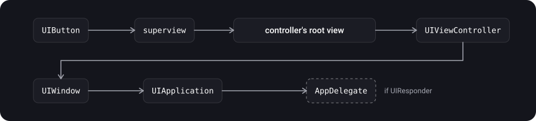
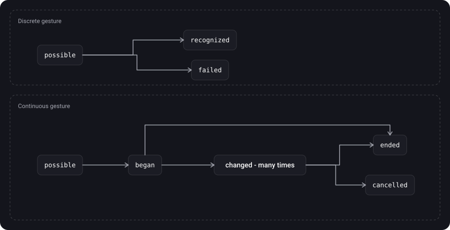
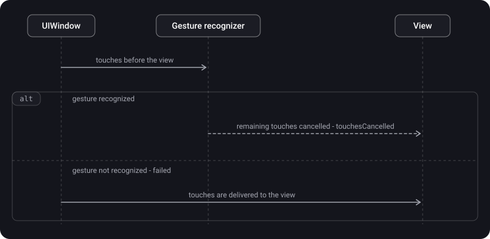

> **What you'll learn**
>
> - What `UIResponder` and the responder chain are: who is in it and in what order
> - What the first responder is and how it differs from "the view the touch landed in"
> - How actions travel along the responder chain and why `target: nil`
> - How `UIControl` works: target-action, events, states, tracking
> - How `UIGestureRecognizer` works: classes, states, discrete and continuous
> - Who receives touches first: the gesture or the view, and how to resolve gesture conflicts
> - When you need your own gesture recognizer

> **Prerequisites:** tutorial [06](../touches-hittest/) — `UIEvent`, `UITouch`, `hitTest`; tutorial [03](../view-lifecycle/) — `UIViewController` and its view.

## Analogy: a request at a company

You submit a request to an employee. If they can't resolve it, it goes to the department head, then to the director, then higher.

- **Responder chain** is this ladder of authorities: view → its controller → window → app.
- **First responder** is the one the request reached first.
- **`UIControl`** is a "service window with a ready-made service": you say what you want (a tap, a value change), and the window itself deals with the touches and calls the right person.
- **Gesture recognizer** is an attentive secretary: reads the request **before** the employee and decides whether it is their case (pinch, long press). If the secretary took the case, the request is no longer passed to the employee.

## Step 1. UIResponder and the responder chain

> **`UIResponder`** is an abstract interface for responding to and handling events. Responders are the foundation of event handling in a UIKit app.

Responders (per Apple's documentation): `UIApplication`, `UIViewController`, all `UIView`s (including `UIWindow`), as well as `UIScene` and `UIAccessibilityElement`.

**For which events you override methods:**

- touches: `touchesBegan`, `touchesMoved`, `touchesEnded`, `touchesCancelled`;
- button presses: `pressesBegan`, `pressesChanged`, `pressesEnded`, `pressesCancelled`;
- motion (shake): `motionBegan`, `motionEnded`, `motionCancelled`;
- remote control: `remoteControlReceived(with:)`.

If a responder didn't handle an event, it forwards it to the next one in the **responder chain** — a chain of responders. UIKit manages it dynamically, by set rules. The next responder is returned by the `next` property.

**Who stands after whom (per Apple's documentation):**

- `UIView`: if it is a controller's root view, the next one is its controller; otherwise — its superview.
- `UIViewController`: the next one is its view's superview (if the controller is presented modally by another controller, then per Apple's article the next one becomes the presenting view controller).
- `UIWindow`: the next one is `UIApplication`.
- `UIApplication`: there is no next one, but if the app delegate is a `UIResponder` and hasn't taken part in handling yet, the next one will be the app delegate.



You can look at the chain in code:

```swift
extension UIResponder {
    func printResponderChain() {
        var responder: UIResponder? = self
        while let current = responder {
            print(type(of: current))
            responder = current.next
        }
    }
}

// button.printResponderChain() for a screen that is the window's rootViewController:
// UIButton
// UIView               (the controller's root view)
// MyViewController
// UIWindow
// UIApplication
// AppDelegate
```

> If the screen sits in a container (for example, `UINavigationController`), service views and the container itself appear between the controller and the window. The exact set of intermediate types depends on the iOS version: rely on the principle "the chain goes **up** the hierarchy", not on the specific names of service classes.

## Step 2. First responder

> **First responder** is the responder that UIKit picks as the first recipient of an event. Which object it becomes depends on the event type.

| Event type | First responder |
| --- | --- |
| Touch | The view where the touch occurred (the result of hit-testing, tutorial [06](../touches-hittest/)) |
| Press (physical buttons) | The focused object |
| Shake, remote control, editing commands | The object that you or UIKit designate |

**Methods for managing the first responder (per Apple's documentation):**

- `canBecomeFirstResponder` — whether the object can become one.
- `becomeFirstResponder()` — **asks UIKit** to make the object the first responder in its window.
- `canResignFirstResponder` and `resignFirstResponder()` — whether it is ready to give up that status, and the notification of giving it up.
- `isFirstResponder` — whether it is one right now.

A classic example is the keyboard: when the user taps a `UITextField` or `UITextView`, the view becomes the first responder and shows its input view, i.e. the system keyboard. For your own view you can assign your own `inputView`.

```swift
textField.becomeFirstResponder()      // show the keyboard
textField.resignFirstResponder()      // hide the keyboard
view.endEditing(true)                 // hide the keyboard of any first responder inside the view
```

## Step 3. Actions along the responder chain

The responder chain is used not only for events but also for **actions**. When a control's target is `nil`, UIKit takes `nil` and goes up the chain until it finds a responder that has a method with the needed name. This is how, for example, edit menu items work: `cut`, `copy`, `paste` are looked up along the chain.

The mechanics (from Apple's documentation):

1. UIKit takes the first responder of the chain and asks `canPerformAction(_:withSender:)`: can it handle this action.
2. If not, it asks the next one via `target(forAction:withSender:)`.
3. It repeats until it finds one that can, or the chain ends. Then the action is ignored.

```swift
open func canPerformAction(_ action: Selector, withSender sender: Any?) -> Bool
open func target(forAction action: Selector, withSender sender: Any?) -> Any?
```

A practical technique — `target: nil`:

```swift
// on a button located somewhere inside the Home controller or below it
button.addTarget(nil, action: #selector(HomeViewController.didTapSomething), for: .touchUpInside)

// in HomeViewController
@objc func didTapSomething() {
    // will fire if HomeViewController is in the button's responder chain
}
```

Action method signatures: no parameters, with `sender`, or with `sender` and `event` (`UIEvent`). An action method must be visible to the Objective-C runtime (`@objc`).

Sending your own action along the chain from code:

```swift
UIApplication.shared.sendAction(#selector(HomeViewController.didTapSomething),
                                to: nil, from: self, for: nil)
```

## Step 4. UIControl

> **`UIControl`** is the base class for controls: visual elements that convey a specific action or intention in response to user interactions. Buttons, sliders and switches are controls.

- `UIControl` instances are not created directly: it is an extension point for your own controls, while the ready-made ones are `UIButton`, `UISwitch`, `UISlider`, `UITextField`, `UISegmentedControl`, `UIStepper`, etc.
- `UIControl` inherits from `UIView`, and therefore from `UIResponder`.
- Controls report interaction through the **target-action** mechanism: instead of tracking touches yourself, you write an action method, and the control takes over all the work of tracking touches and decides when to call your method.

```swift
button.addTarget(self, action: #selector(saveTapped), for: .touchUpInside)
slider.addTarget(self, action: #selector(valueChanged(_:)), for: .valueChanged)

@objc private func saveTapped() { }
@objc private func valueChanged(_ sender: UISlider) { }
```

Since iOS 14 an action can be passed as a closure through `UIAction`:

```swift
let action = UIAction { [weak self] _ in self?.save() }
button.addAction(action, for: .touchUpInside)
```

The target of `addTarget` is usually a controller or its root view. `UIControl` doesn't hold the target with a strong reference, while a closure in `UIAction` holds everything it captured (`[weak self]`, otherwise a leak, tutorial [09](../data-passing-appearance/)).

**`UIControl.Event` events:**

| Event | When |
| --- | --- |
| `touchDown` | The user touched the element |
| `touchUpInside` | The finger was released inside the element's bounds (the usual button "tap") |
| `touchUpOutside` | The finger was released outside the bounds |
| `touchDragInside`, `touchDragOutside`, `touchDragEnter`, `touchDragExit` | The finger moves inside, outside, enters or leaves the bounds |
| `touchCancel` | The system interrupted the touch |
| `valueChanged` | The value changed (a slider, a switch) |
| `primaryActionTriggered` | The primary action fired |
| `editingDidBegin`, `editingChanged`, `editingDidEnd`, `editingDidEndOnExit` | Text field editing events |

**States (`UIControl.State`).** The state determines the appearance and whether the element can accept interaction. It is a bit mask: `normal`, `highlighted`, `disabled`, `selected`, `focused`. They are managed by the properties `isEnabled`, `isSelected`, `isHighlighted`. If you disable a control (`isEnabled = false`), the user can't interact with it.

**How a control catches touches.** For your own controls Apple advises always using the tracking methods rather than `UIResponder`'s touch methods:

- `beginTracking(_:with:)` — a touch entered the control's bounds;
- `continueTracking(_:with:)` — the touch was updated;
- `endTracking(_:with:)` — the touch ended;
- `cancelTracking(with:)` — tracking was cancelled.

Helper properties: `isTracking` (whether tracking is in progress), `isTouchInside` (whether the touch is currently inside the bounds). That is how a button understands "the finger left the button" by itself (recall tutorial [06](../touches-hittest/): `touch.view` doesn't change, and the control checks the coordinates itself).

```swift
final class RatingControl: UIControl {
    private(set) var rating = 1 {
        didSet {
            sendActions(for: .valueChanged)     // notify the subscribers
            setNeedsDisplay()
        }
    }

    override func beginTracking(_ touch: UITouch, with event: UIEvent?) -> Bool {
        updateRating(with: touch)
        return true                              // true — keep tracking
    }

    override func continueTracking(_ touch: UITouch, with event: UIEvent?) -> Bool {
        updateRating(with: touch)
        return true
    }

    private func updateRating(with touch: UITouch) {
        let x = touch.location(in: self).x
        let value = Int(x / bounds.width * 5) + 1
        rating = min(max(value, 1), 5)           // from 1 to 5
    }
}
```

If you subclass `UIControl` directly, you need to maintain the appearance and state yourself, and send the action when the value changes (`sendActions(for:)`). To observe or alter how actions are dispatched in a ready-made control, override `sendAction(_:to:for:)`.

## Step 5. UIGestureRecognizer

> **A gesture recognizer** separates the logic of recognizing a sequence of touches (or other input) from the action taken on the result. When it recognizes a common gesture (or a change to it), it sends an action message to each designated target.

- A recognizer works with the touches that hit-tested into a particular view and all its subviews, so it must be attached to it: `view.addGestureRecognizer(_:)`.
- **A recognizer doesn't take part in the view's responder chain.** It stands aside from the regular chain.
- You can subscribe several target-action pairs; they are independent and don't accumulate.
- Action method signatures: `func handle()` or `func handle(_ sender: UIGestureRecognizer)`. Through `sender` you can ask for details: `location(in:)`, `scale` for pinch, `rotation` for rotation.

**Ready-made classes:**

| Class | Gesture | Type |
| --- | --- | --- |
| `UITapGestureRecognizer` | Tap (including multiple taps) | Discrete |
| `UISwipeGestureRecognizer` | Swipe in a given direction | Discrete |
| `UILongPressGestureRecognizer` | Long press | **Continuous** |
| `UIPanGestureRecognizer` | Dragging (scrolling in any direction) | Continuous |
| `UIScreenEdgePanGestureRecognizer` | Dragging from the screen edge (the "back" gesture) | Continuous |
| `UIPinchGestureRecognizer` | A two-finger pinch (zoom) | Continuous |
| `UIRotationGestureRecognizer` | A two-finger rotation | Continuous |

There is also `UIHoverGestureRecognizer` — for a pointer that is over a view.

**Discrete and continuous:**

- A **discrete** gesture happens once per touch sequence and sends one action. It works like a button: you set an action, and it is called once when the event occurs.
- A **continuous** gesture calls the action **many times**, on every significant change. `UIPanGestureRecognizer`, for example, calls the action every time the finger moves so that you can update the interface.

```swift
let tap = UITapGestureRecognizer(target: self, action: #selector(handleTap(_:)))
cardView.addGestureRecognizer(tap)

@objc private func handleTap(_ gesture: UITapGestureRecognizer) {
    let point = gesture.location(in: cardView)        // once, when the tap happens
}

let pan = UIPanGestureRecognizer(target: self, action: #selector(handlePan(_:)))
cardView.addGestureRecognizer(pan)

private var startCenter = CGPoint.zero

@objc private func handlePan(_ gesture: UIPanGestureRecognizer) {
    switch gesture.state {
    case .began:
        startCenter = cardView.center
    case .changed:                                    // many times while the finger moves
        let t = gesture.translation(in: view)
        cardView.center = CGPoint(x: startCenter.x + t.x, y: startCenter.y + t.y)
    case .ended, .cancelled, .failed:
        break                                         // finish or roll back
    default:
        break
    }
}
```

**States (`UIGestureRecognizer.State`).** All recognizers begin a touch sequence in the `possible` state.

| State | What it means |
| --- | --- |
| `possible` | The recognizer is ready to work, hasn't recognized anything yet |
| `began` | A continuous gesture has begun |
| `changed` | The gesture changed (the finger moved); optional, can happen many times |
| `ended` (a.k.a. `recognized`) | The gesture ended. The constants `recognized` and `ended` are synonyms |
| `cancelled` | The gesture was cancelled (the analog of `touchesCancelled`) |
| `failed` | The gesture wasn't recognized (for example, two fingers were expected but one touched) |



> You can turn off a recognizer with the `isEnabled` property (`true` by default). If you set `false`, it stops receiving events.

## Step 6. Gestures and touches: who receives first

The most important rule (Apple): **the window delivers touches to the gesture recognizer before the view it is attached to.**

- If the recognizer analyzed the stream of touches and did **not** recognize the gesture, the view receives all the touches of the sequence in full.
- If it recognized it, the remaining touches are cancelled for the view.

**The link with hit-testing and the responder chain.** Through `hitTest` the system finds the deepest view under the finger and collects all the recognizers in the chain of its superviews up to `UIWindow`. The recognizers themselves are not in the responder chain.



The behavior is defined by three recognizer properties (the default values, per Apple, determine the usual order):

| Property | What it does |
| --- | --- |
| `cancelsTouchesInView` | If the gesture is recognized, the remaining touches are detached from the view; those already delivered are cancelled via `touchesCancelled`. If not recognized, the view receives all the touches |
| `delaysTouchesBegan` | Until the recognizer fails recognition, the window holds back delivery of `began` phase touches to the view. If it later recognizes the gesture, the view won't receive those touches |
| `delaysTouchesEnded` | The same for the `ended` phase: until the recognizer fails, the window holds those touches. If it recognizes the gesture, the touches are cancelled via `touchesCancelled` |

A button inside a view with a `UITapGestureRecognizer`: usually a tap on the button (a single tap) goes to the button itself, and the tap gesture on the parent doesn't fire at that moment. This is how the archived Event Handling Guide for UIKit Apps describes it. I didn't find this in Apple's current documentation and couldn't verify it against it, so check it in your own code.

## Step 7. UIGestureRecognizerDelegate: gesture conflicts

The delegate lets you fine-tune a recognizer's behavior and the relationships between recognizers. For example, allow simultaneous recognition or set a dynamic "failure" requirement.

| Method | When it is needed |
| --- | --- |
| `gestureRecognizerShouldBegin(_:)` | Allow or forbid the start of recognition (for example, pan only horizontally) |
| `gestureRecognizer(_:shouldReceive:)` | Decide whether to receive a specific touch (for example, ignore touches on buttons) |
| `gestureRecognizer(_:shouldRecognizeSimultaneouslyWith:)` | Allow two recognizers to work at the same time (pinch and rotation over an image) |
| `gestureRecognizer(_:shouldRequireFailureOf:)` and `shouldBeRequiredToFailBy` | Set "the other one must fail first" |

**A single and a double tap on one view.** If you attach both recognizers, a double tap fires as two single taps. To prevent this, the single one has to wait for the double one to fail:

```swift
let singleTap = UITapGestureRecognizer(target: self, action: #selector(handleSingleTap))
let doubleTap = UITapGestureRecognizer(target: self, action: #selector(handleDoubleTap))
doubleTap.numberOfTapsRequired = 2

singleTap.require(toFail: doubleTap)       // the single one waits for the double one to fail
view.addGestureRecognizer(singleTap)
view.addGestureRecognizer(doubleTap)
```

The same can be done through the delegate methods; `require(toFail:)` is simpler when the dependency is permanent. The delegate is needed when the dependency is dynamic.

```swift
extension ViewController: UIGestureRecognizerDelegate {
    func gestureRecognizer(_ gestureRecognizer: UIGestureRecognizer,
                           shouldRecognizeSimultaneouslyWith other: UIGestureRecognizer) -> Bool {
        true                                   // for example, pinch and rotation together
    }

    func gestureRecognizerShouldBegin(_ gestureRecognizer: UIGestureRecognizer) -> Bool {
        guard let pan = gestureRecognizer as? UIPanGestureRecognizer else { return true }
        let velocity = pan.velocity(in: view)
        return abs(velocity.x) > abs(velocity.y)   // begin only if the movement is mostly horizontal
    }
}
```

## Step 8. When you need your own recognizer

When the ready-made ones can't handle the task. For example, you need your own gesture (a "checkmark") or your own continuous recognizer for press force.

- You need to subclass `UIGestureRecognizer` and import the `UIKit.UIGestureRecognizerSubclass` module: it makes the `state` property writable and declares the methods a subclass must override or call.
- The subclass **must** set `state` on transitions and periodically reset it by overriding `reset()`.

```swift
import UIKit.UIGestureRecognizerSubclass

// recognizes a finger moving down by 100 pt without a strong sideways deviation
final class SwipeDownRecognizer: UIGestureRecognizer {
    private var startPoint = CGPoint.zero

    override func touchesBegan(_ touches: Set<UITouch>, with event: UIEvent) {
        guard touches.count == 1, let touch = touches.first else {
            state = .failed                       // not one finger — not our gesture
            return
        }
        startPoint = touch.location(in: view)
    }

    override func touchesMoved(_ touches: Set<UITouch>, with event: UIEvent) {
        guard let touch = touches.first else { return }
        let point = touch.location(in: view)
        if abs(point.x - startPoint.x) > 50 {
            state = .failed                       // moved sideways
        } else if point.y - startPoint.y > 100 {
            state = .recognized                   // the discrete gesture is recognized
        }
    }

    override func reset() {
        startPoint = .zero                        // get ready for the next attempt
    }
}
```

## Step 9. What to choose

| Task | Tool |
| --- | --- |
| A button tap, a value change, text input | `UIControl` with target-action or `UIAction` |
| A tap, swipe, pan, pinch, long press on an arbitrary view | A ready-made gesture recognizer |
| A non-standard gesture | Your own `UIGestureRecognizer` subclass |
| Drawing with a finger, completely non-standard touch handling | Overriding `touchesBegan` and the rest (tutorial [06](../touches-hittest/)) |
| Pass an action up the hierarchy | An action with `target: nil` along the responder chain |
| Show or hide the keyboard | `becomeFirstResponder`, `resignFirstResponder`, `endEditing(_:)` |

## Common mistakes

- Thinking `becomeFirstResponder` "forces" it to receive all events: it is a request, and for touches the first recipient remains the view from hit-testing.
- Trying to reach a screen "from the side" through `target: nil` (for example, the root controller of a navigation stack): the chain goes only up.
- Forgetting `@objc` on an action method for `#selector`.
- Creating a `UIControl` directly instead of a ready-made subclass or your own subclass.
- Using `UIResponder`'s touch methods in a `UIControl` subclass instead of `beginTracking` and the rest.
- Calling `UILongPressGestureRecognizer` discrete: it is continuous, and the action is called several times.
- Not handling `cancelled` and `failed` in a continuous gesture: the interface is left in an intermediate state.
- Attaching a single and a double tap without `require(toFail:)`: the double fires as two singles.
- Forgetting `view.addGestureRecognizer` (a recognizer must be attached to a view).
- Holding a strong reference to the controller in a `UIAction` closure: a leak.
- Attaching a recognizer to a `UILabel` or `UIImageView` and forgetting `isUserInteractionEnabled = true` (tutorial [06](../touches-hittest/)).
- Not importing `UIKit.UIGestureRecognizerSubclass` in a recognizer subclass and not overriding `reset()`.

<details>
<summary>Why doesn't a gesture on the parent fire when you tap a button inside?</summary>

A button is a `UIControl`, and usually its default action (a single tap) takes priority over a tap gesture on the parent (this is how the archived Event Handling Guide describes it; verify it in practice). For the parent to receive the tap, you need to intercept the touch differently: for example, give the recognizer a delegate and decide through `gestureRecognizer(_:shouldReceive:)`, or make something other than the parent itself the tap zone.

</details>

## Cheat sheet

```swift
// Responder chain (upward): view -> superview ... -> VC -> window -> UIApplication -> AppDelegate
responder.next

// First responder
textField.becomeFirstResponder(); textField.resignFirstResponder(); view.endEditing(true)
// touch events -> the view from hit-testing; isFirstResponder -> keyboard, editing commands

// Action along the chain
button.addTarget(nil, action: #selector(Home.didTap), for: .touchUpInside)   // @objc in Home
// goes UP: containers, presenting, AppDelegate; not to neighbors

// UIControl
control.addTarget(self, action: #selector(tapped), for: .touchUpInside)
control.addAction(UIAction { _ in }, for: .valueChanged)    // iOS 14+
beginTracking / continueTracking / endTracking / cancelTracking
sendActions(for: .valueChanged)
UIControl.State: normal, highlighted, disabled, selected, focused

// Gestures
view.addGestureRecognizer(UITapGestureRecognizer(target: self, action: #selector(tap)))
// discrete: Tap, Swipe   continuous: Pan, ScreenEdgePan, Pinch, Rotation, LongPress
// states: possible -> began -> changed* -> ended | cancelled ; possible -> failed
// discrete: possible -> recognized | failed
singleTap.require(toFail: doubleTap)
delegate: gestureRecognizerShouldBegin / shouldRecognizeSimultaneouslyWith / shouldReceive / shouldRequireFailureOf
// a gesture receives touches BEFORE the view; cancelsTouchesInView, delaysTouchesBegan/Ended
```

## Self-check questions

<details>
<summary>1. What is the responder chain and in what order are the responders in it?</summary>

A chain of responders along which an unhandled event is passed upward. The order is defined by the `next` property: view → its controller (if it is the root view) or superview → controller → the superview of its view → window → `UIApplication` → `AppDelegate` (if it is a `UIResponder`).

</details>

<details>
<summary>2. How does the first responder differ from the view that received the touch?</summary>

For a touch event the first responder is the view from hit-testing. But `isFirstResponder == true` is held by the object receiving the keyboard and editing commands (for example, a text field). `becomeFirstResponder` merely asks UIKit to make the object one.

</details>

<details>
<summary>3. What does target: nil mean for an action and where does such an action reach?</summary>

UIKit goes up the responder chain until it finds a responder with a method of the needed name (via `canPerformAction` and `target(forAction:withSender:)`). It reaches only ancestors in the chain: parent containers, the presenting controller, `AppDelegate`. It won't reach screens "from the side" (for example, the root of a navigation stack).

</details>

<details>
<summary>4. How does UIControl report the user's actions?</summary>

Through target-action: `addTarget(_:action:for:)` or `addAction(_:for:)` (iOS 14+) for the needed event (`touchUpInside`, `valueChanged`, etc.). The control tracks touches itself through `beginTracking` and the other tracking methods.

</details>

<details>
<summary>5. How does a discrete gesture differ from a continuous one? Which type is long press?</summary>

A discrete one happens once per touch sequence and sends one action (tap, swipe). A continuous one sends an action on every change (pan, pinch, rotation). Long press is continuous: `began` after the hold, `changed` on movement, `ended` on release.

</details>

<details>
<summary>6. Who receives touches first — the view or the gesture recognizer?</summary>

The gesture recognizer. The window delivers touches to the recognizer before the view. If the recognizer didn't recognize the gesture, the view receives all the touches; if it did, the remaining touches are cancelled for the view (`cancelsTouchesInView`).

</details>

<details>
<summary>7. How do you make a single tap not fire on a double tap?</summary>

`singleTap.require(toFail: doubleTap)`. The single recognizer will wait for the double one to fail, and only then fire. Dynamic dependencies are set through `shouldRequireFailureOf` in the delegate.

</details>

## Sources

- [UIResponder — Apple Developer Documentation](https://developer.apple.com/documentation/uikit/uiresponder)
- [next — Apple Developer Documentation](https://developer.apple.com/documentation/uikit/uiresponder/next)
- [Using responders and the responder chain to handle events — Apple Developer Documentation](https://developer.apple.com/documentation/uikit/using-responders-and-the-responder-chain-to-handle-events)
- [UIControl — Apple Developer Documentation](https://developer.apple.com/documentation/uikit/uicontrol)
- [UIGestureRecognizer — Apple Developer Documentation](https://developer.apple.com/documentation/uikit/uigesturerecognizer)
- [UIGestureRecognizerDelegate — Apple Developer Documentation](https://developer.apple.com/documentation/uikit/uigesturerecognizerdelegate)
- [UILongPressGestureRecognizer — Apple Developer Documentation](https://developer.apple.com/documentation/uikit/uilongpressgesturerecognizer)
- [Handling gestures in iOS — Habr (in Russian)](https://habr.com/ru/articles/584100/)
- [Responder Chain, or how to pass user actions between components properly — Habr (in Russian)](https://habr.com/ru/companies/psb/articles/597759/)
- [iOS Responder Chain, or what they ask at interviews — temofeev.ru (in Russian)](https://temofeev.ru/info/articles/ios-responder-chain-ili-chto-sprashivayut-na-sobesedovanii/)
- [UIGestureRecognizer: theory, practice, customization — Medium (Yandex Maps, in Russian)](https://medium.com/yandex-maps-mobile/uigesturerecognizer-tutorial-83f2128e479d)
- [Responder chain and Hit testing \| SWIFT — YouTube](https://www.youtube.com/watch?v=xzzvV1WUfms)
