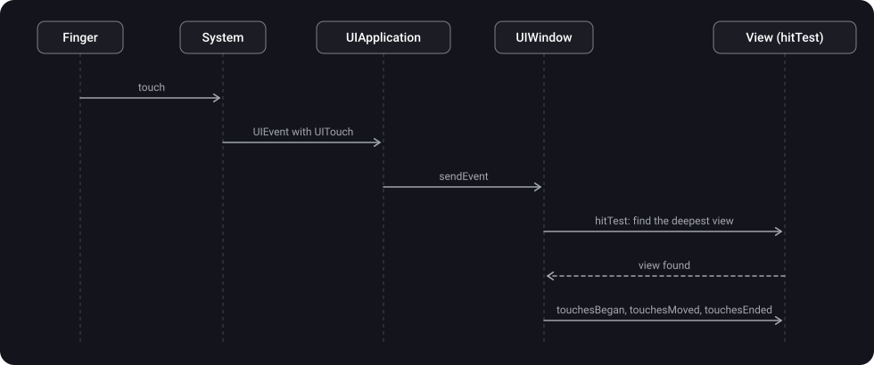

> **What you'll learn**
>
> - How a touch travels from a finger to a view: `UIEvent` → `UIApplication` → `UIWindow` → `hitTest`
> - What `UIEvent` and `UITouch` are, their lifetime and the touch phases
> - How `hitTest(_:with:)` and `point(inside:with:)` work, and which views it skips
> - Why a view might not receive touches (a checklist)
> - How to enlarge the tap area and how to let touches pass "through" a view
> - Basic manual handling with `touchesBegan`, `touchesMoved`, `touchesEnded`, `touchesCancelled`

> **Prerequisites:** tutorial [01](../uiview-window-coordinates/) — `UIView`, `UIWindow`, `frame` and `bounds`, `convert`: without them it is unclear in which coordinate system the touch point is given.

## Analogy: a courier in an office building

A courier brings a parcel addressed "a point on the facade" and doesn't know who it is for.

- **A touch (`UITouch`, `UIEvent`)** is the parcel with a point as its address.
- **`UIApplication` and `UIWindow`** are the checkpoint and the reception: they accept the parcel and pass it deeper into the building.
- **`hitTest`** is the courier himself: he enters the building and asks every office: "is this point yours?". If so, he goes deeper, into the smaller rooms. If not, that office and all its rooms are skipped.
- **`point(inside:)`** is the question at the door: "is the point inside your boundaries?".
- **The addressee** is the deepest room where the point actually ended up. If it didn't accept the parcel, the parcel is passed higher (the responder chain, tutorial [07](../responder-chain-gestures/)).

## Step 1. From a finger to a view

1. The user touches the screen.
2. The hardware and the system notify the app about the touch.
3. UIKit packages the data into a **`UIEvent`** object: it holds the touches (`UITouch`) with coordinates, time, phase and the number of fingers.
4. `UIApplication` dispatches the event to a suitable responder via `sendEvent(_:)`; there it reaches the **`UIWindow`**.
5. The window starts **hit-testing** — it looks for the deepest view that the point landed in.
6. The found view receives the touch (`touchesBegan` and so on); if it doesn't handle it, the touch goes up the responder chain.



`UIApplication.sendEvent(_:)` can be overridden in a `UIApplication` subclass to intercept all incoming events (for example, for logging or an inactivity timer). Each intercepted event must then be passed on by calling `super.sendEvent(event)` (an Apple requirement), otherwise the interface stops responding. Event delivery from the system to the app goes through the main thread's run loop (details — in the [RunLoop tutorial](../../concurrency/runloop/) from the "Concurrency" topic, chapter 07).

## Step 2. UIEvent

> **`UIEvent`** is an object describing a single user interaction with the app.

**Event types** (per Apple's documentation):

| Type | What it is | Where it is delivered |
| --- | --- | --- |
| Touch | Touches by a finger or Apple Pencil | The view where the touch began |
| Motion | Shaking the device (this is not Core Motion data) | The object that you or UIKit designated |
| Remote-control | Commands from a headset or accessory (pause, next track) | The object that you or UIKit designated |
| Press | Physical buttons: a gamepad, the Apple TV Remote | The focused object |

- An event has a `type` and a `subtype`.
- A touch event contains one or more `UITouch`es — one for each finger on the screen. Access: `allTouches`, `touches(for: view)`.
- **During a multitouch sequence UIKit reuses the same `UIEvent` object.** Don't keep a reference to the event or to the objects it returns. If you need the data outside the handling method, copy it from `UITouch` or `UIEvent` into your own structures.
- Touches don't arrive one by one: `UIResponder` methods receive a `Set<UITouch>` and a `UIEvent`:

```swift
open func touchesBegan(_ touches: Set<UITouch>, with event: UIEvent?)
open func touchesMoved(_ touches: Set<UITouch>, with event: UIEvent?)
open func touchesEnded(_ touches: Set<UITouch>, with event: UIEvent?)
open func touchesCancelled(_ touches: Set<UITouch>, with event: UIEvent?)
```

- For touch events in a view, by default `touches` holds only one touch. To receive several, set `isMultipleTouchEnabled = true` on the view.

## Step 3. UITouch

> **`UITouch`** is an object representing the location, size, movement and force of a touch on the screen. A unique `UITouch` object exists for each finger touching the screen.

**What UITouch stores:**

- where it happened: `view` and `window`; coordinates in the system you need — `location(in:)`, the previous position — `previousLocation(in:)`;
- the phase (`phase`), the time (`timestamp`), the number of taps (`tapCount`);
- the approximate touch radius (`majorRadius`), the force (`force`; on devices with 3D Touch or Apple Pencil), the touch type (`type`);
- `gestureRecognizers` — which gesture recognizers are currently handling this touch.

**The life of a UITouch (per Apple's documentation):**

- When a touch begins, UIKit creates a `UITouch` and associates it with a view. As it moves, UIKit updates **the same object**. When the touch ends, the object is released.
- The only thing that doesn't change is `view`: even if the finger has moved outside the original view, `touch.view` stays the same. That is why the whole touch sequence (from `began` to `ended`) goes to one view.
- You can keep a reference to a touch during a multitouch sequence, but you must release it when the sequence is over. Copy the data you need for later.

**Touch phases (`UITouch.Phase`):**

| Phase | What happens | How many times |
| --- | --- | --- |
| `.began` | A finger first touched the screen; the `UITouch` has just been created | Always first, once |
| `.moved` | The finger is moving across the screen | Many times |
| `.stationary` | The finger is pressed but hasn't moved since the last event | Many times |
| `.ended` | The finger lifted off the screen; the `UITouch` will not appear again | Once |
| `.cancelled` | The system stopped tracking (for example, the user held the device up to their face; also system events like an incoming call or notification can interrupt a touch) | Instead of `.ended`, once |

The enumeration has three more cases for a mouse pointer and similar devices: `.regionEntered`, `.regionMoved`, `.regionExited` (the pointer entered the window, moves without pressing, left the window). For finger touches the first five matter.

An example: a draggable view. When overriding the touch methods without `super`, override **all four** (an Apple requirement), even if some are empty:

```swift
final class DraggableView: UIView {
    override func touchesBegan(_ touches: Set<UITouch>, with event: UIEvent?) {
        // nothing for now: you could highlight the view on press
    }

    override func touchesMoved(_ touches: Set<UITouch>, with event: UIEvent?) {
        guard let touch = touches.first, let parent = superview else { return }
        let current = touch.location(in: parent)              // the point in the superview's coordinate system
        let previous = touch.previousLocation(in: parent)
        center.x += current.x - previous.x                     // shift the view by the difference
        center.y += current.y - previous.y
    }

    override func touchesEnded(_ touches: Set<UITouch>, with event: UIEvent?) {
        // the finger is released
    }

    override func touchesCancelled(_ touches: Set<UITouch>, with event: UIEvent?) {
        // the system interrupted the touch: restore the state if needed
    }
}
```

> For dragging and the like, in practice a `UIPanGestureRecognizer` is more often used (tutorial [07](../responder-chain-gestures/)): it encapsulates the logic of working with `UITouch`. Manual `touches...` are needed for non-standard logic (drawing with a finger, complex multitouch scenarios).

## Step 4. hitTest — finding the view the touch landed in

> **`hitTest(_:with:)`** is a `UIView` method that returns the "farthest" descendant of the current view in the hierarchy (including itself) that contains the given point. It returns `nil` if the point is entirely outside this view's hierarchy.

- `point` is a point in the receiver's **local coordinate system** (its `bounds`, tutorial [01](../uiview-window-coordinates/)).
- `event` is the event that caused the method call. If you call it outside event handling, you can pass `nil`.

**How it works (per Apple's documentation):**

- The method traverses the hierarchy, calling `point(inside:with:)` on each subview. If it returned `true`, the search continues inside its subviews until the topmost (frontmost) view with this point is found.
- If a view doesn't contain the point, its branch of the hierarchy is **skipped entirely**.
- The method **ignores** views that are hidden (`isHidden`), have interaction disabled (`isUserInteractionEnabled = false`), or have `alpha` less than 0.01.
- The method **doesn't take the content** of a view into account: it may return a view even if the point landed on a transparent part of its image.
- **Points outside a view's `bounds` don't count as a hit**, even if they actually lie inside one of its subviews. This happens when `clipsToBounds == false` and a subview extends beyond its parent's bounds.
- When the system calls the method for event routing, the view is expected to be part of a `UIWindow` hierarchy.


A simplified implementation based on Apple's description (the real one inside UIKit is more complex). It helps to understand the algorithm:

```swift
override func hitTest(_ point: CGPoint, with event: UIEvent?) -> UIView? {
    // 1) the view doesn't participate if it is hidden, non-interactive or almost transparent
    guard isUserInteractionEnabled, !isHidden, alpha >= 0.01 else { return nil }

    // 2) the point must be inside bounds; otherwise the whole branch is skipped
    guard self.point(inside: point, with: event) else { return nil }

    // 3) subviews — from the topmost (the last in the array) to the bottom one
    for subview in subviews.reversed() {
        let converted = subview.convert(point, from: self)   // into the subview's coordinate system
        if let hit = subview.hitTest(converted, with: event) {
            return hit
        }
    }

    // 4) nothing deeper was found — the hit is on the view itself
    return self
}
```

- `point(inside:with:)` is a separate method: it returns `true` if the point (in the view's local coordinate system) lies inside `bounds`. To change the "tap area" of the view itself, all you need is to override it.
- `hitTest` calls `point(inside:)` at every point of the traversal, so both functions must be fast: they are called on every touch.

> After hit-testing, the found view is the first recipient of the event. In Apple's terms this is the "first responder for the touch event" (the view where the touch occurred). Don't confuse it with a view whose `isFirstResponder == true` (for example, a text field with the keyboard, which receives keyboard events): these are different things. Gestures (tutorial [07](../responder-chain-gestures/)) receive touches **before** the view itself: if the gesture recognizers didn't recognize the sequence, the touches are delivered to the view, and if the view didn't handle them, they are passed up the responder chain.

## Step 5. Why a view doesn't receive touches: a checklist

The most common problem is "I tap the button and nothing happens". Check in order:

| Cause | Explanation |
| --- | --- |
| `isUserInteractionEnabled == false` | For a plain `UIView` it is `true` by default, but some UIKit classes have a different value (for example, for `UILabel` and `UIImageView` it is `false`). Touches are ignored and removed from the queue |
| The parent has `isUserInteractionEnabled == false` | The whole branch is skipped: hit-testing will not reach the child |
| `isHidden == true` or `alpha` less than 0.01 | Skipped by hit-testing (Apple) |
| The point is outside the parent's `bounds` | Even if the subview is visible (`clipsToBounds == false`), the touch won't reach it unless the parent contains the point |
| Another view overlaps it | The search goes from the topmost view to the bottom one; a transparent but not hidden view (`backgroundColor = .clear`) will still intercept the touch: hit-testing doesn't look at the content |
| An animation is running | During an animation, interaction is temporarily disabled on all participating views (Apple). To keep it, specify the `.allowUserInteraction` option |
| The view is not in a window hierarchy | For event routing a view must be part of a `UIWindow` hierarchy |
| A gesture recognizer intercepted the touch | Gesture recognizers receive touches before the view (tutorial [07](../responder-chain-gestures/)) |

> The View Debugger in Xcode (Debug View Hierarchy) shows which views overlap each other and where their bounds are. A handy test: put a `print` in your view's `hitTest` to see which view exactly receives the touch.

## Step 6. Enlarging the tap area

A small button is hard to tap. To simply enlarge the tap area, take `bounds.insetBy` with negative values and override `point(inside:with:)`:

```swift
class CustomButton: UIButton {
    override func point(inside point: CGPoint, with event: UIEvent?) -> Bool {
        return bounds.insetBy(dx: -10, dy: -10).contains(point)   // the area is 10 pt larger on all sides
    }
}
```

Apple's HIG recommends at least 44 × 44 points for tappable elements. A variant that brings only small views up to 44 × 44:

```swift
override func point(inside point: CGPoint, with event: UIEvent?) -> Bool {
    let dx = max(0, 44 - bounds.width) / 2      // how much to add on each side for the width
    let dy = max(0, 44 - bounds.height) / 2     // and for the height
    return bounds.insetBy(dx: -dx, dy: -dy).contains(point)
}
```

> The expanded area works **only if the touch reaches the view at all**. If the expanded zone extends beyond the parent's `bounds`, the parent's `hitTest` discards that point and it won't reach the view (points outside `bounds` don't count as a hit, step 4). So a button right at the edge of its parent won't get extra area outside: the parent needs to expand its area too (or you need to leave margins in the layout).

| What you need | What to override |
| --- | --- |
| Enlarge or shrink the tap area of the view itself | `point(inside:with:)` |
| Pass a touch to another view, hide them from subviews, let touches pass "through" | `hitTest(_:with:)` |

## Step 7. Typical hitTest techniques

**Touches "through" a transparent overlay.** A full-screen container covers the layer below, but touches on empty space must pass to the views underneath:

```swift
final class PassthroughView: UIView {
    override func hitTest(_ point: CGPoint, with event: UIEvent?) -> UIView? {
        let hit = super.hitTest(point, with: event)
        return hit === self ? nil : hit      // on empty space the touch "falls through"
    }
}
```

If `hitTest` returned `nil`, the system looks for the next view under the finger. The overlay's subviews still receive touches, because `super.hitTest` returns them rather than `self`.

**A button protruding beyond its parent's bounds.** For example, the central button of a custom tab bar that protrudes above the top edge. The parent will discard a point outside its `bounds` (step 4), so its `hitTest` needs to be extended:

```swift
final class CustomTabBarContainer: UIView {
    override func hitTest(_ point: CGPoint, with event: UIEvent?) -> UIView? {
        if let hit = super.hitTest(point, with: event) { return hit }   // the usual case

        // the point is outside bounds: ask the subviews manually
        for subview in subviews.reversed()
        where subview.isUserInteractionEnabled && !subview.isHidden && subview.alpha >= 0.01 {
            let converted = subview.convert(point, from: self)
            if let hit = subview.hitTest(converted, with: event) { return hit }
        }
        return nil
    }
}
```

## Step 8. What's next: gestures and the responder chain

Touches are only the beginning. After the target is found, two mechanisms decide what happens next (tutorial [07](../responder-chain-gestures/)):

- **Gesture recognizers** receive touches **before** the view. If they didn't recognize the sequence, UIKit sends the touches to the view.
- **The responder chain**: if the view didn't handle the touches, they are passed up: first the superview, then the root view's view controller, the window, `UIApplication`. The default implementation of `touchesBegan` does exactly this — forwards the message up the chain, which is why `super` is called for unhandled touches.

## Common mistakes

- Thinking a subview outside its parent's `bounds` will receive a touch if `clipsToBounds == false`: it is visible, but can't be tapped.
- Overriding `hitTest` with `return self` to enlarge the area: the subviews will break. You need `point(inside:with:)`.
- Overriding `touchesBegan` without `super` and not overriding the other three methods.
- Keeping a reference to a `UIEvent` or `UITouch` after the sequence ends: you need to copy the data.
- Not handling `touchesCancelled`: when the system interrupts, the interface is left in an intermediate state.
- Passing a point in the wrong coordinate system: `hitTest` and `point(inside:)` expect the receiver's local system.
- Assuming that the transparent part of an image doesn't accept touches: hit-testing doesn't look at the content.
- Not knowing that `UILabel` and `UIImageView` have `isUserInteractionEnabled` set to `false` by default: a gesture on them won't work until you turn interaction on.
- Thinking a view accepts touches during an animation: by default it doesn't, you need `.allowUserInteraction`.
- Buttons smaller than 44 × 44 pt without enlarging the tap area.

<details>
<summary>Why doesn't touch.view change when the finger moves outside the view's bounds?</summary>

That is how UIKit works: hit-testing happens once, at the start of the touch. The whole `began` → `moved` → `ended` sequence is delivered to the same view, even if the finger has moved outside it. That is why a `UIControl` button tracks "the finger left the button" by itself, from the touch coordinates (tutorial [07](../responder-chain-gestures/)).

</details>

## Cheat sheet

```swift
// The touch path
// finger -> UIEvent(UITouch) -> UIApplication.sendEvent -> UIWindow -> hitTest -> view.touchesBegan...
// if the view didn't handle it -> responder chain (upward)

// Methods
override func touchesBegan/Moved/Ended/Cancelled(_ touches: Set<UITouch>, with event: UIEvent?)
// without super -> override all four
touch.location(in: view), touch.previousLocation(in: view), touch.phase, touch.tapCount
view.isMultipleTouchEnabled = true   // several fingers

// Phases: began -> moved / stationary -> ended | cancelled
// A UITouch lives from began to ended, one per finger; touch.view doesn't change

// hitTest
view.hitTest(point, with: event)           // point in local coordinates
view.point(inside: point, with: event)     // inside bounds?
// skips: isHidden, !isUserInteractionEnabled, alpha < 0.01, a point outside bounds

// The tap area
override func point(inside point: CGPoint, with event: UIEvent?) -> Bool {
    bounds.insetBy(dx: -10, dy: -10).contains(point)
}

// Touches "through"
let hit = super.hitTest(point, with: event); return hit === self ? nil : hit
```

## Self-check questions

<details>
<summary>1. How does a touch get from a finger to the right view?</summary>

The system passes the event to the app, and UIKit packages it into a `UIEvent` with `UITouch`es. `UIApplication` dispatches it via `sendEvent`, and the window starts hit-testing — a search for the deepest view containing the point. The found view receives `touchesBegan` and onward.

</details>

<details>
<summary>2. What does hitTest(_:with:) do, and which views does it skip?</summary>

It returns the deepest descendant (including itself) that contains the point, or `nil`. It traverses the hierarchy via `point(inside:with:)`. It skips hidden views, views with interaction disabled and with `alpha` less than 0.01; and a branch where the point is outside `bounds`. It doesn't take the view's content (transparent pixels) into account.

</details>

<details>
<summary>3. Why doesn't a subview that extends beyond its parent's bounds receive touches?</summary>

`hitTest` doesn't count points outside a view's `bounds` as a hit and ignores that view together with all its subviews, even when `clipsToBounds == false`. To fix this, override the parent's `hitTest` and ask the subviews manually.

</details>

<details>
<summary>4. How does hitTest differ from point(inside:with:)? What should you override to enlarge the tap area?</summary>

`point(inside:with:)` answers whether the point is inside this view's `bounds`. `hitTest` finds the deepest view in the hierarchy and calls `point(inside:)` on each. To enlarge the tap area, override `point(inside:with:)` (`bounds.insetBy(dx: -10, dy: -10).contains(point)`).

</details>

<details>
<summary>5. How many phases does UITouch have and what do they mean?</summary>

Five for finger touches: `began` (the first touch, once), `moved`, `stationary` (the finger is pressed, hasn't moved), `ended` (lifted, once), `cancelled` (the system interrupted). Plus three "region" phases for a mouse pointer.

</details>

<details>
<summary>6. What is the "first recipient" of a touch event, and who receives touches first — the view or the gesture recognizer?</summary>

For a touch event it is the view where the touch occurred (the result of hit-testing). Gesture recognizers receive touches before the view; if they didn't recognize the sequence, the touches go to the view.

</details>

<details>
<summary>7. How do you make a transparent overlay let touches on empty space pass through?</summary>

Override `hitTest`: call `super.hitTest`, and if the result is the view itself, return `nil`, otherwise return the result. The subviews remain tappable.

</details>

## Sources

- [hitTest — Apple Developer Documentation](https://developer.apple.com/documentation/uikit/uiview/hittest(_:with:))
- [point inside — Apple Developer Documentation](https://developer.apple.com/documentation/uikit/uiview/point(inside:with:))
- [UITouch — Apple Developer Documentation](https://developer.apple.com/documentation/uikit/uitouch)
- [UITouch.Phase — Apple Developer Documentation](https://developer.apple.com/documentation/uikit/uitouch/phase-swift.enum)
- [UIEvent — Apple Developer Documentation](https://developer.apple.com/documentation/uikit/uievent)
- [touchesBegan — Apple Developer Documentation](https://developer.apple.com/documentation/uikit/uiresponder/touchesbegan(_:with:))
- [isUserInteractionEnabled — Apple Developer Documentation](https://developer.apple.com/documentation/uikit/uiview/isuserinteractionenabled)
- [UIApplication sendEvent — Apple Developer Documentation](https://developer.apple.com/documentation/uikit/uiapplication/sendevent(_:))
- [Using responders and the responder chain to handle events — Apple Developer Documentation](https://developer.apple.com/documentation/uikit/using-responders-and-the-responder-chain-to-handle-events)
- [Taking the hit with hitTest — Medium (Yandex Maps, in Russian)](https://medium.com/yandex-maps-mobile/%D0%B4%D0%B5%D1%80%D0%B6%D0%B8%D0%BC-%D1%83%D0%B4%D0%B0%D1%80-%D1%81-hittest-542653d51a8c)
- [Handling gestures in iOS — Habr (in Russian)](https://habr.com/ru/articles/584100/)
- [Responder chain and Hit testing \| SWIFT — YouTube](https://www.youtube.com/watch?v=xzzvV1WUfms)
