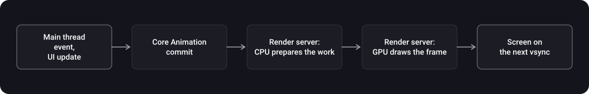

> **What you'll learn**
>
> - What a hitch and a hang are, how much time a frame gets and who takes part in it
> - Why you must not block the main thread: the watchdog, Main Thread Checker
> - Offscreen rendering, color blending, `shouldRasterize`, `shadowPath`: what they are and how to find and fix them
> - How to work with images: decoding, thumbnails, cache layers
> - Smooth lists: cell prefetching, data prefetching, `reconfigureItems`
> - What to measure with: Instruments, the simulator's debug options, `CADisplayLink`

> **Prerequisites:** tutorial [02](../calayer-drawing/) — `CALayer`, `draw(_:)`; tutorial [08](../lists/) — reuse, tables and collections; the "Concurrency" topic ([RunLoop tutorial](../../concurrency/runloop/)) — the main thread and queues.

## Analogy: a kitchen with a conveyor of frames

Every 16.7 ms (at 120 Hz — every 8.3 ms) a finished dish must reach the serving counter.

- **The main thread** is the only cook, who prepares the order and answers customers' questions.
- **The render server** is the waiter who serves the dish to the table.
- **A hitch** — the dish wasn't ready in time: the customer looks at the previous one again.
- **A hang** — the cook gets stuck on a long task, and nobody answers questions. If the cook is stuck for a really long time, the owner (the watchdog) fires him.

## Step 1. The frame budget

> **A hitch** is a brief "stutter" in smooth on-screen motion (while scrolling, dragging, animating) when a frame isn't ready at the needed moment. Even a few milliseconds are noticeable (Apple).

**How much time per frame (Apple):**

- 60 Hz — every 16.7 ms (1 s / 60); 120 Hz — every 8.3 ms (1 s / 120).
- During interaction the screen refreshes at the maximum rate the device supports; when there is nothing to update, the rate may drop.
- The app must fit event handling, UI updates and the Core Animation commit into one vsync interval. Then the render server gets another interval.



**Two kinds of hitch (Apple):**

| Kind | Cause | Where to look |
| --- | --- | --- |
| **Commit hitch** | The app didn't finish the commit before the commit deadline, most often because of a delay on the main thread | Heavy code on the main thread: layout, cell configuration, decoding |
| **Render hitch** | The app made it in time, but the render server couldn't render in time: the scene is too complex | Heavy effects: offscreen rendering, blending, blurs, many layers |

Per Apple's documentation, a render hitch is usually the app's fault too: a UI update that is too complex. To find a hitch you need to look at both the main thread and the render server.

**Hitch rate** is an Xcode Organizer metric: milliseconds of pause per second (ms/s). Per Apple: up to 10 ms/s is good, up to 25 a warning, up to 50 critical, over 50 requires immediate attention.

**A hitch and a hang are not the same thing.** A hang is a long unresponsiveness of the main thread on a discrete action (a tap): a delay of about 100 ms is already noticeable. A hitch is a missed frame deadline during continuous motion, where even delays of a couple of milliseconds are noticeable. But the cause is often the same: heavy work on the main thread; if you remove the hangs, many hitches disappear.

## Step 2. The main thread

Only interface work should remain on the main thread. Events are processed one at a time, so a long task delays everything behind it, including scrolling and taps.

**What typically blocks the main thread (per Apple's documentation):**

- synchronous networking;
- processing large amounts of data (large JSON, 3D models);
- a synchronous lightweight migration of a large Core Data store;
- Vision analysis requests.

**Hidden synchronous networking.** Initializers that take a URL (for example `String(contentsOf:)` or `Data(contentsOf:)` with `https`) implicitly make a synchronous network request. Also dangerous: reachability via `SCNetworkReachability` (synchronous by default), BSD DNS functions. On an office network this isn't visible, but for users on a weak network it happens.

> **The watchdog.** The operating system monitors the app's launch time and responsiveness and **terminates** an app that blocks the main thread for a long time. In the crash report the reason for such termination is the code `0x8badf00d` ("ate bad food"). The `scene-create` and `scene-update` markers in the description mean the app didn't render the first frame or didn't update the UI in time. The familiar "test on a simulator with good Wi-Fi" doesn't suffer from this: the real problem becomes visible on a bad network (Xcode can simulate one).

**The solution: heavy work off the main thread**, and return to the main one only to update the UI. For networking Apple recommends `URLSession` (asynchronous), and for network changes — `NWPathMonitor` instead of synchronous reachability.

```swift
@MainActor
final class FeedViewController: UIViewController {
    func reload() {
        Task {
            // the network doesn't block the main thread: await releases it
            let (data, _) = try await URLSession.shared.data(from: feedURL)

            // heavy parsing — in a background task
            let items = try await Task.detached(priority: .userInitiated) {
                try JSONDecoder().decode([Item].self, from: data)
            }.value

            apply(items)          // here we're on the main thread again (@MainActor): the UI update
        }
    }
}
```

**Main Thread Checker is not an "alternative" to the watchdog.** They do opposite things:

| Tool | What it does |
| --- | --- |
| Main Thread Checker (Xcode) | Checks that system APIs that must be called on the main thread (usually UI) are indeed called there. A diagnostic during development |
| The watchdog (operating system) | Kills an app that blocks the main thread for a long time |
| Your own "watchdog" in code | An observer of the main thread's run loop: logs "the thread has been stuck for N seconds" to find the place where it gets stuck before the system watchdog kills the app |

Main Thread Checker (per Apple) has minimal overhead: about 1–2% CPU and no more than 100 ms added to launch time, which is why Xcode enables it by default in development schemes. It substitutes only system APIs with known thread requirements, not all of them.

**A timer freezes during scrolling.** Timers are serviced by the run loop, and during scrolling UIKit switches it to the tracking mode (`UITrackingRunLoopMode`), giving priority to rendering. A timer created in the default mode stops firing while the user scrolls a list (this is how the article "How UI works in iOS" describes it). The solution is to add the timer to the run loop in `.common` mode. More about the run loop — in the [RunLoop tutorial](../../concurrency/runloop/) of the "Concurrency" topic.

```swift
let timer = Timer(timeInterval: 1.0, repeats: true) { _ in tick() }
RunLoop.main.add(timer, forMode: .common)      // works during scrolling too
```

## Step 3. Layout and work in the rendering cycle

Layout calculation and cell configuration are main thread work:

- Auto Layout works only on the main thread and can be slow on very complex hierarchies; for simple hierarchies it is fast enough;
- in complex feeds sizes are computed manually (`layoutSubviews` and `sizeThatFits`), and heavy size computations are moved to the background before the cell appears; the placement of views on screen itself stays on the main thread.

**Practical rules:**

- simplify the view hierarchy in cells (fewer views — fewer layers and layout computations);
- don't compute anything heavy in `cellForRowAt`, `layoutSubviews` and `willDisplay`: prepare the data (text, sizes, images) in advance, in the row's model;
- don't call `layoutSubviews`/`layoutIfNeeded` "just in case" (tutorial [05](../autolayout-layout-pass/)): extra traversals are expensive;
- don't flood the main thread's queue with small blocks without need: the run loop won't move on to rendering until it has processed the blocks from the main queue.

## Step 4. CPU drawing: draw(_:) and isOpaque

`draw(_:)` and `CGContext` draw a view's content on the CPU and on the main thread (tutorial [02](../calayer-drawing/)). On complex screens this is a straight road to a commit hitch. How to reduce the cost:

- don't redraw on every frame (`setNeedsDisplay` only when the content has really changed);
- make simple shapes and gradients with ready-made layers (`CAShapeLayer`, `CAGradientLayer`, tutorial [02](../calayer-drawing/)) rather than in `draw(_:)`;
- prepare heavy rendering (shadows, rounded images, effects) in advance in the background and cache the ready image (this is how the VK feed does it).

**`isOpaque`.** Per Apple's documentation, this is a hint to the drawing system: if a view is marked opaque, the system can optimize some of the drawing operations. An opaque view must fill all its `bounds` with fully opaque content; otherwise the result is unpredictable. The default value is `true`.

```swift
final class ChartView: UIView {
    override init(frame: CGRect) {
        super.init(frame: frame)
        isOpaque = true                    // we draw in draw(_:) ourselves and fill the whole bounds with opaque content
        backgroundColor = .white
    }
    required init?(coder: NSCoder) { fatalError("init(coder:) has not been implemented") }

    override func draw(_ rect: CGRect) {
        // ... draw the content on a white background
    }
}
```

## Step 5. Offscreen rendering

> **Offscreen rendering** is when a layer can't be drawn directly into the frame's final image, and the render server first draws it into a temporary buffer and then composites the result. This results in an extra rendering pass and extra memory.

**What can cause offscreen rendering**

| Layer property | Why | What to do |
| --- | --- | --- |
| `cornerRadius` with `masksToBounds` | The layer is drawn into a temporary buffer, the edges are clipped | A rounded background without clipping the content; round the image in advance (below) |
| Shadow (`shadowRadius` without `shadowPath`) | The system computes the shadow from the layer content's alpha channel | Set `shadowPath` |
| `mask` | Intermediate drawing of the layer and applying the mask | A ready image or a simple layer instead of a mask |
| `shouldRasterize = true` | The layer is rendered into a bitmap and then composited (Apple) | Only for static expensive content, with measurement |
| `UIVisualEffectView` (blur, vibrancy) | Built in several passes | Don't put it on every list cell |

**What Apple writes:**

- `cornerRadius` by default applies only to the layer's background and border; to clip the content (`contents`) to the rounded corners, you need `masksToBounds = true`.
- An explicit `shadowPath` "usually improves rendering performance"; without it the shadow is built from the layer's alpha channel.
- `shouldRasterize`: the layer is rendered as a bitmap in its own coordinate space and then composited; shadows and filters are included in the bitmap, but the layer's current `opacity` is not. `false` by default.

**Shadow: `shadowPath`.** If the shadow's shape is known in advance, specify it explicitly. Then the system doesn't have to derive the shape from the content. The path depends on the layer's size, so it is set after the size is known, in `layoutSubviews`:

```swift
final class CardView: UIView {
    override init(frame: CGRect) {
        super.init(frame: frame)
        layer.cornerRadius = 12
        layer.shadowColor = UIColor.black.cgColor
        layer.shadowOpacity = 0.2
        layer.shadowRadius = 8
        layer.shadowOffset = CGSize(width: 0, height: 4)
        // we don't set masksToBounds: it would clip the shadow itself too
    }
    required init?(coder: NSCoder) { fatalError("init(coder:) has not been implemented") }

    override func layoutSubviews() {
        super.layoutSubviews()
        layer.shadowPath = UIBezierPath(roundedRect: bounds, cornerRadius: layer.cornerRadius).cgPath
    }
}
```

**An avatar with rounded corners: round the image itself.** Instead of `cornerRadius` and `masksToBounds` on a `UIImageView`, draw the image with rounded corners in advance, so that the rounding becomes part of the bitmap.

```swift
func roundedImage(_ image: UIImage, size: CGSize, radius: CGFloat) -> UIImage {
    let renderer = UIGraphicsImageRenderer(size: size)
    return renderer.image { _ in
        let rect = CGRect(origin: .zero, size: size)
        UIBezierPath(roundedRect: rect, cornerRadius: radius).addClip()
        image.draw(in: rect)
    }
}
```

## Step 6. Color blending

> **Blending** is the stage at which the final color of a pixel is computed. If layers are semi-transparent, the GPU has to compute the color through all the overlapping layers.

- To find it: **Color Blended Layers** in the simulator's (or Xcode's) Debug menu; layers with blending are shown in red, without — in green.
- How to remove it: if a layer always sits on a solid background, give it an opaque `backgroundColor` of the same color: it looks the same, but no blending is needed.
- For opaque images, don't keep an alpha channel without need, and don't set `alpha < 1` where you can set a ready color.
- Blurs and vibrancy (`UIVisualEffectView`) are built in several passes, and repeated passes are expensive: remove unnecessary effects.

```swift
let label = UILabel()
label.backgroundColor = .white            // the same color as the background under it: not .clear
label.isOpaque = true                     // has no effect for UILabel (Apple); what matters is the opaque backgroundColor itself
```

## Step 7. Images

The renderer can only display a bitmap — raw pixels. PNG, JPEG, HEIC are compressed and need to be **decoded**. If you do nothing, `UIImageView` decodes the image on the **main thread** at commit (per WWDC21): a large image doesn't make it in time and you get a commit hitch.

**What to do (iOS 15+, Apple):**

- **Prepare the image in advance**, off the main thread. There is an API for preparing an image for display (the synchronous variant can be run on any thread, the asynchronous ones — on UIKit's internal serial queue). The result is a new `UIImage` with only the pixel data the renderer needs.
- **Make a thumbnail for the view's size**: `preparingThumbnail(of:)`. If the source image is much larger than the view, decoding it at full size is extra memory overhead (Apple). The method returns `nil` if the image isn't backed by a `CGImage` or the data is corrupted.
- **While the image is loading, keep a placeholder** that is cheap to show synchronously.
- **Cache prepared images sparingly** (WWDC21): they hold raw pixels, i.e. a lot of memory. Save the original to disk, not the prepared version.

```swift
final class PhotoCell: UICollectionViewCell {
    private let imageView = UIImageView()
    private var loadTask: Task<Void, Never>?

    override func prepareForReuse() {
        super.prepareForReuse()
        loadTask?.cancel()                  // cancel the previous row's task (tutorial 08)
    }

    func configure(with item: Item, targetSize: CGSize) {
        imageView.image = UIImage(named: "placeholder")      // cheap, synchronous
        loadTask = Task { [weak self] in
            guard let original = await ImageStore.shared.image(for: item.url) else { return }
            // decoding and downscaling — in a background task, not on the main thread
            let thumbnail = await Task.detached(priority: .userInitiated) {
                original.preparingThumbnail(of: targetSize)
            }.value
            guard !Task.isCancelled else { return }
            self?.imageView.image = thumbnail
        }
    }
}
```

## Step 8. Smooth lists: prefetching and the life of a cell

The techniques below are from the WWDC21 talk "Make blazing fast lists and collection views" and Apple's documentation.

**The life of a cell** has two phases: **preparation** (take a cell from the queue or create one, configure the data, compute the size) and **display** (`willDisplay`, the cell is visible, then `didEndDisplaying`).

**Cell prefetching (iOS 15+).** When the frame commit is fast and there is time left, the system prepares the next cell in advance. Then up to twice as much time is available per cell without a hitch. For `UICollectionView` this is an extension of what appeared in iOS 10; in iOS 15 it works for lists, all compositional layouts and for `UITableView`. To get it, it is enough to build the app with the iOS 15 SDK. Plus energy efficiency: fast cell preparation lets the system work in a less costly mode.

**What it requires from you:**

- A cell must be fully configured **in the preparation phase**. Don't wait for the moment the cell becomes visible to do heavy work.
- A prepared cell may **never be displayed** (the user abruptly reversed the scroll).
- The same cell may be displayed **more than once** for one `indexPath`: after `didEndDisplaying` a cell no longer goes straight to the reuse pool.

**Other rules (WWDC21):**

- **Create the cell registration (`CellRegistration`) once, outside the cell provider.** If you create it inside the provider, the collection view never reuses cells (the reuse queue is kept per registration instance).
- **If data arrives later (an image from the network), don't update the captured cell directly**: by the time the response arrives it may already be configured for another item. Instead, tell the data source that the item needs to be reconfigured: `reconfigureItems` (tutorial [08](../lists/)). Everything that updates the cell stays in one place — in the registration's handler. `reconfigureItems` is preferable to `reloadItems`: it reuses the existing cell rather than taking a new one.
- **Data prefetching** is the place where network loads start in advance: this way the user sees the placeholder less often.

```swift
extension FeedViewController: UICollectionViewDataSourcePrefetching {
    func collectionView(_ collectionView: UICollectionView, prefetchItemsAt indexPaths: [IndexPath]) {
        for indexPath in indexPaths {
            ImageStore.shared.startLoading(items[indexPath.item].url)       // start loading in advance
        }
    }

    func collectionView(_ collectionView: UICollectionView, cancelPrefetchingForItemsAt indexPaths: [IndexPath]) {
        for indexPath in indexPaths {
            ImageStore.shared.cancelLoading(items[indexPath.item].url)      // the user went in the other direction
        }
    }
}
// collectionView.prefetchDataSource = self
```

## Step 9. Measurements: find first, optimize second

"Measure first, then optimize": investigate only on **real devices** and in **release builds** (without the debugger, with optimizations enabled). The simulator doesn't give the full picture about the hardware.

| Tool | What for |
| --- | --- |
| Instruments | Time Profiler (where time is spent), templates for hitches/hangs, including the Hitches instrument (Apple; not available on visionOS) |
| Xcode Organizer | The Hitches metric: hitch rate across all users in milliseconds of pause per second |
| Color Blended Layers (the simulator's or Xcode's Debug menu) | Layers with blending |
| Color Offscreen-Rendered Yellow (the simulator's Debug menu) | Layers with an offscreen pass |
| Main Thread Checker | UI calls from the background |
| `CADisplayLink` in code | Your own "stutter" metric for regression tests |

**Your own metric via `CADisplayLink`.** The timer fires at the screen's refresh rate. If significantly more time passed between two firings than the expected frame interval, the main thread was busy. But this method only catches problems in the app: a **render hitch** (the render server didn't make it) isn't visible this way.

```swift
final class HitchMonitor {
    private var link: CADisplayLink?
    private var lastTimestamp: CFTimeInterval = 0

    func start() {
        link = CADisplayLink(target: self, selector: #selector(tick(_:)))
        link?.add(to: .main, forMode: .common)
    }

    func stop() {
        link?.invalidate()                       // CADisplayLink holds the target strongly: without stop() a leak
        link = nil
    }

    @objc private func tick(_ link: CADisplayLink) {
        defer { lastTimestamp = link.timestamp }
        guard lastTimestamp != 0 else { return }

        let actual = link.timestamp - lastTimestamp          // how much has passed
        let expected = link.duration                         // how much should have (1 / rate)
        if actual > expected * 1.5 {
            print("Possible hitch: \(Int((actual - expected) * 1000)) ms")
        }
    }
}
```

## Step 10. Checklist: symptom → cause → what to do

| Symptom | Likely cause | What to do |
| --- | --- | --- |
| The app "freezes" for a couple of seconds, then responds | A hang: long work on the main thread (network, parsing, database) | Move the work off the main thread; check the crash report for `0x8badf00d` |
| Stutter when a new cell appears | A commit hitch: heavy cell configuration or layout | Simplify the cell; prepare data in advance; check prefetching |
| Stutter at the moment an image appears | Decoding a large image on the main thread | Prepare in the background, a thumbnail for the view's size |
| Smooth on a simple screen, stutter on a screen with shadows and blur | A render hitch: an offscreen pass, blending, many layers | `shadowPath`; no `mask`; opaque backgrounds; remove unnecessary effects |
| A timer doesn't tick during scrolling | The timer is in the default mode | Add it to the run loop in `.common` mode |

## Common mistakes

- Synchronous networking on the main thread, including hidden (`Data(contentsOf:)` with `https`, `SCNetworkReachability`): the watchdog will kill the app.
- Treating Main Thread Checker and the watchdog as alternatives: they are different things.
- Trusting only the "on a simulator with a good network" test: real problems are visible on a device and on a bad network.
- Confusing a hitch (a missed frame) and a hang (a long unresponsiveness).
- Heavy work in `cellForRowAt`, `layoutSubviews`, `willDisplay`.
- Drawing in `draw(_:)` what can be done with a ready layer, and redrawing on every frame.
- Thinking `isOpaque = true` will speed up a `UILabel` or `UIButton`: for system classes the property has no effect.
- A shadow without `shadowPath`.
- Setting `masksToBounds` on the top layer with a shadow: it will clip the shadow itself.
- Enabling `shouldRasterize` for an animated or frequently changing layer without measuring.
- Decoding huge images at full size for a small `UIImageView` instead of making a thumbnail.
- Caching prepared (decompressed) images without a limit, or saving them to disk.
- Creating a cell registration inside the cell provider: cells aren't reused.
- Updating a cell directly from an asynchronous response (it is already a different item): you need `reconfigureItems`.
- Doing heavy work only when the cell becomes visible: with prefetching this work must already be done.
- Not calling `invalidate()` on a `CADisplayLink`: a leak (a strong reference to the target).
- Optimizing by feel, without Instruments, on a simulator or in a debug build.

<details>
<summary>What is the difference between a commit hitch and a render hitch? How do you tell them apart?</summary>

A commit hitch: the app didn't finish the Core Animation commit before the commit deadline: look in the main thread's work. A render hitch: the app made it in time, but the render server couldn't render the complex scene. You tell them apart by the trace in Instruments (the time on the main thread versus the time on the render server).

</details>

## Cheat sheet

```swift
// Budget: 60 Hz = 16.7 ms, 120 Hz = 8.3 ms. Main thread → commit → render server (CPU, GPU) → screen
// hitch: a missed frame (commit hitch: the main thread; render hitch: the render server)
// hang: unresponsiveness over ~100 ms; the watchdog kills the app (0x8badf00d)

// The main thread
let (data, _) = try await URLSession.shared.data(from: url)          // the network, asynchronously
let items = await Task.detached { try decode(data) }.value          // heavy work — to the background
RunLoop.main.add(timer, forMode: .common)                           // the timer doesn't freeze during scrolling

// Layers
layer.shadowPath = UIBezierPath(roundedRect: bounds, cornerRadius: r).cgPath   // in layoutSubviews
// cornerRadius without masksToBounds — only background and border; masksToBounds clips the content
// isOpaque — only for subclasses with draw(_:); no effect on system classes
// An opaque backgroundColor — less blending

// Images
image.preparingThumbnail(of: viewSize)      // iOS 15, off the main thread; a placeholder while loading

// Lists
// build with the iOS 15 SDK → cell prefetching; prefetchDataSource — for the network
// create the registration once outside the provider; update your own item — reconfigureItems

// Measurements: a real device, release; Instruments, Organizer (hitch rate), Color Blended Layers, Color Offscreen-Rendered
```

## Self-check questions

<details>
<summary>1. How much time does a frame get and what is a hitch?</summary>

16.7 ms at 60 Hz and 8.3 ms at 120 Hz. A hitch is a missed deadline: the new frame isn't ready in time, and the previous one stays on screen longer, which is noticeable in continuous motion.

</details>

<details>
<summary>2. What is the difference between a hitch and a hang? What does the watchdog do?</summary>

A hang is a long unresponsiveness of the main thread on a discrete action (about 100 ms is already noticeable). A hitch is a missed frame in continuous motion. The watchdog kills an app that blocks the main thread for a long time; in the crash report this is `0x8badf00d`.

</details>

<details>
<summary>3. How does Main Thread Checker differ from the watchdog?</summary>

Main Thread Checker is an Xcode debugging tool: it catches UI API calls not from the main thread. The watchdog is an operating system mechanism that terminates an unresponsive app.

</details>

<details>
<summary>4. What is offscreen rendering and what can cause it? How do you find and fix it?</summary>

The render server draws a layer into a temporary buffer and only then composites it. Causes: clipping content to a rounding (`masksToBounds`), a shadow without `shadowPath`, `mask`, visual effects. It is found in the simulator's Debug menu ("Color Offscreen-Rendered Yellow") and in Instruments. Fixes: `shadowPath`, a pre-rounded image, simple layers instead of a mask.

</details>

<details>
<summary>5. What is color blending and how do you fight it? When is isOpaque useful?</summary>

Blending is computing a pixel's final color through semi-transparent layers. It is found with "Color Blended Layers". It is fixed with opaque backgrounds. `isOpaque` is a hint to the system for subclasses with their own `draw(_:)`; for system classes it has no effect.

</details>

<details>
<summary>6. How do you work with large images in a list to avoid stutter?</summary>

Decoding must not happen on the main thread: make a thumbnail for the view's size in the background (`preparingThumbnail(of:)`, iOS 15), show a placeholder, start loading in prefetching, and when the response comes late, update the cell via `reconfigureItems`. Prepared images take a lot of memory: cache sparingly.

</details>

<details>
<summary>7. How does cell prefetching work and what are its consequences for cell code?</summary>

The system prepares the next cell in spare time after a fast commit. A cell must be fully configured in the preparation phase; a prepared cell may not be displayed, or may be displayed several times for one `indexPath`. The registration is created once outside the cell provider.

</details>

## Sources

- [Understanding hitches in your app — Apple Developer Documentation](https://developer.apple.com/documentation/xcode/understanding-hitches-in-your-app)
- [Understanding hangs in your app — Apple Developer Documentation](https://developer.apple.com/documentation/xcode/understanding-hangs-in-your-app)
- [Improving app responsiveness — Apple Developer Documentation](https://developer.apple.com/documentation/xcode/improving-app-responsiveness)
- [Addressing watchdog terminations — Apple Developer Documentation](https://developer.apple.com/documentation/xcode/addressing-watchdog-terminations)
- [Diagnosing memory, thread, and crash issues early — Apple Developer Documentation](https://developer.apple.com/documentation/xcode/diagnosing-memory-thread-and-crash-issues-early)
- [cornerRadius — Apple Developer Documentation](https://developer.apple.com/documentation/quartzcore/calayer/cornerradius)
- [shouldRasterize — Apple Developer Documentation](https://developer.apple.com/documentation/quartzcore/calayer/shouldrasterize)
- [shadowPath — Apple Developer Documentation](https://developer.apple.com/documentation/quartzcore/calayer/shadowpath)
- [isOpaque — Apple Developer Documentation](https://developer.apple.com/documentation/uikit/uiview/isopaque)
- [preparingThumbnail — Apple Developer Documentation](https://developer.apple.com/documentation/uikit/uiimage/preparingthumbnail(of:))
- [Make blazing fast lists and collection views — WWDC21 (Apple)](https://developer.apple.com/videos/play/wwdc2021/10252/)
- [Complex collection layouts in iOS, using the VK feed as an example — Habr (in Russian)](https://habr.com/ru/companies/vk/articles/481626/)
- [How UI works in iOS — sidorov.tech (in Russian)](https://sidorov.tech/all/ustroystvo-ui-v-ios/)
- [Render optimization in iOS — Habr (in Russian)](https://habr.com/ru/articles/647177/)
- [Implementing a main thread watchdog on iOS — Jesse Squires](https://www.jessesquires.com/blog/2022/08/11/implementing-a-main-thread-watchdog-on-ios/)
- [Offscreen Rendering in iOS — Stackademic](https://blog.stackademic.com/offscreen-rendering-in-ios-faf9cbe488ea)
