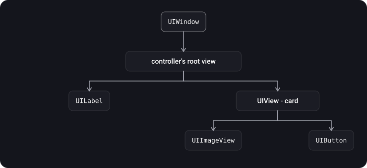
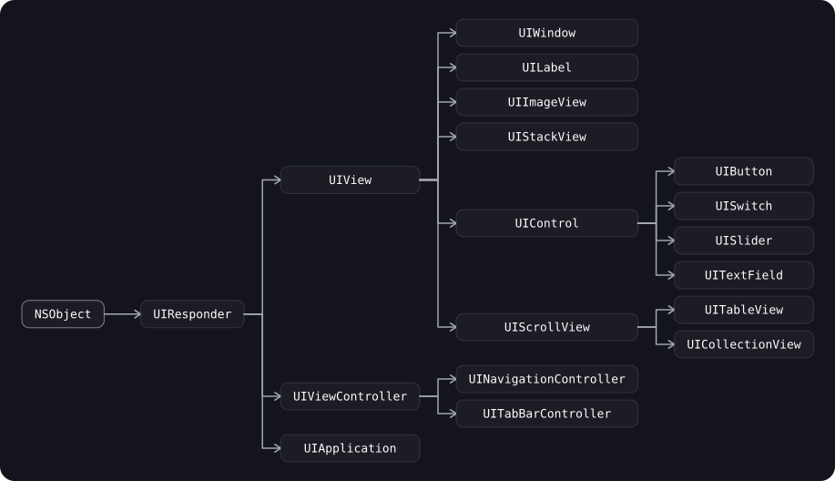
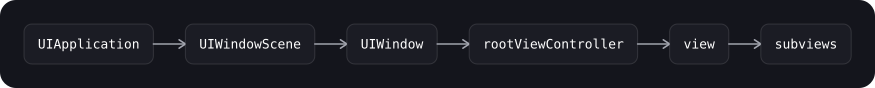
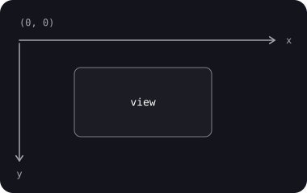
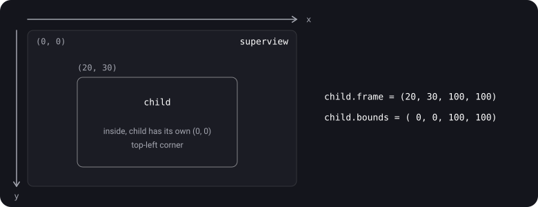
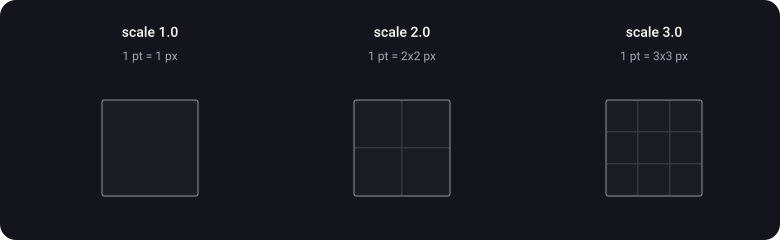

> **What you'll learn**
>
> - What `UIView` is and how a screen's hierarchy is built from views
> - What `UIView` inherits from and where `UIWindow`, `UIViewController` and `UIControl` sit in that chain
> - What `UIWindow` does and how the app's root screen appears
> - How `frame` differs from `bounds`, and where `center` and `transform` come in
> - What a point and a pixel are, and why the scale factor is needed
> - How to convert coordinates between views with `convert`

> **Prerequisites:** basic Swift syntax: classes, inheritance, structs (`CGPoint`, `CGSize`, `CGRect` are structs).

## Analogy: shelving units on a shop wall

Picture a shop wall with shelving units hanging on it, and smaller shelves standing on the units.

- **`UIWindow`** is the wall itself: everything is attached to it, and it is the wall that shows where the customer pointed.
- **`UIView`** is a rectangular shelving unit. Other units can stand on it (subviews), and it stands on someone else's unit (superview).
- **`frame`** is where a unit stands *on its parent unit*: measured from the parent's top-left corner.
- **`bounds`** is the unit's own ruler: where its "zero" is when measured from the inside. Move the ruler's zero and all the contents "slide" (this is how scrolling works).
- **point** is a division on the blueprint (a size in the layout), **pixel** is a dot in the print. The scale factor says how many times more detailed the print is than the blueprint.

## Step 1. What UIView is

> **`UIView`** is the base class for all visible interface elements in UIKit. It is a rectangular area on the screen with its own coordinate system that can display content and (as a subclass of `UIResponder`) respond to touches.

- Every button, label, image and table cell is a `UIView` or one of its subclasses.
- A view can contain other views (**subviews**) and itself lives inside one (its **superview**). This produces a tree — the view hierarchy.
- `UIView` inherits from `UIResponder`, so it takes part in event handling (touch, responder chain — tutorials [06](../touches-hittest/) and [07](../responder-chain-gestures/)).
- Every view owns a **layer** — a `CALayer` object that does the actual display. It is available through the `layer` property.

> `UIView` is a thin wrapper over `CALayer`. It adds what the layer lacks: touch handling, participation in the responder chain, Auto Layout and a convenient high-level animation API. Drawing and geometry are handled by the layer (in detail — tutorial [02](../calayer-drawing/)).

## Step 2. The view hierarchy

Views form a tree. The root is `UIWindow`, it holds the view controller's root view, and then come nested subviews.



```swift
let card = UIView()
let label = UILabel()

card.addSubview(label)           // label becomes a subview of the card
view.addSubview(card)            // the card is a subview of the root view

print(label.superview === card)  // true
print(card.subviews.count)       // 1

label.removeFromSuperview()      // remove it from the hierarchy
```

- **The order of subviews = the drawing order (z-order).** The last one in the `subviews` array is drawn on top of the previous ones. To change the order: `bringSubviewToFront(_:)`, `sendSubviewToBack(_:)`, `insertSubview(_:at:)`.
- **The parent owns its children:** `superview.subviews` holds strong references to the subviews, while a child's `superview` is a weak reference. That is why a view removed from the hierarchy with no other references is deallocated.
- By default a subview is **not clipped** by its parent's bounds. Clipping is turned on with `clipsToBounds = true`.

<details>
<summary>Why can a subview be visible outside its parent but impossible to tap?</summary>

Drawing and touch handling are different mechanisms. Drawing outside the parent's bounds is allowed (`clipsToBounds == false`), but when looking for the touch target the system first checks whether the point falls inside the parent's `bounds`, and only then descends to its subviews. A point outside the parent never reaches the child. In detail — tutorial [06](../touches-hittest/) (`hitTest`).

</details>

## Step 3. The UIKit class hierarchy



- `UIResponder` is the common ancestor of everything that takes part in event handling: `UIView`, `UIViewController`, `UIApplication`.
- `UIWindow` is a **subclass of `UIView`**, so it is a view too, just a special one: the root of the hierarchy.
- `UIViewController` is **not** a `UIView`. A controller owns the root view (`view`) but is not displayed itself.
- `UITableView` and `UICollectionView` are subclasses of `UIScrollView` (tutorial [08](../lists/)).
- `UIControl` is the base for interactive elements with target-action (tutorial [07](../responder-chain-gestures/)).

## Step 4. UIWindow

> **`UIWindow`** is the backdrop of the app's user interface and the object that delivers events to your views. A window has no visual appearance of its own: it contains the views managed by the root view controller.

**What a window does:**

- Holds **`rootViewController`** — the controller the interface starts from (`UINavigationController`, `UITabBarController` or your own).
- Delivers events: touches go to the window where they occurred; events without coordinates (for example, from the keyboard) go to the **key window**. There is exactly one key window at any moment (`isKeyWindow`).
- Defines the **position along the Z axis** through `windowLevel`: which window is above which.
- Can convert coordinates to the window's system and back (`convert(_:to:)`, `convert(_:from:)`).
- Is attached to a scene (`UIWindowScene`) and a screen.

> Most apps need **one** window on the main screen. Extra windows are rarely needed: for example, for an external display or for overlays on top of the whole interface. Subclassing `UIWindow` is also almost never necessary: it is more convenient to implement behavior in controllers.

How a window is created in a modern scene-based app (iOS 13 and later):

```swift
final class SceneDelegate: UIResponder, UIWindowSceneDelegate {
    var window: UIWindow?

    func scene(_ scene: UIScene,
               willConnectTo session: UISceneSession,
               options connectionOptions: UIScene.ConnectionOptions) {
        guard let windowScene = scene as? UIWindowScene else { return }

        let window = UIWindow(windowScene: windowScene)
        window.rootViewController = UINavigationController(
            rootViewController: HomeViewController()
        )
        window.makeKeyAndVisible()   // show it and make it the key window
        self.window = window         // keep the window with a strong reference!
    }
}
```



How to get the window from code today. `UIApplication.shared.keyWindow` is marked deprecated (since iOS 13), because with several scenes there is no longer a single "main window of the app". Use the window of a specific view or scene:

```swift
let window = view.window                       // this view's window (nil if the view is not on screen)
let scene = view.window?.windowScene           // the window's scene
```

## Step 5. The UIKit coordinate system

In UIKit the origin is the **top-left corner**, the X axis points right, and the Y axis points **down**. All values are in points (step 6).



**Two rectangles of one view:**

> **`frame`** is the view's position and size in the coordinate system of its **superview**. It is used to place the view inside its parent.
>
> **`bounds`** is the view's position and size in its **own** coordinate system. It is used to place content and subviews inside the view itself.

| Property | Coordinate system | What it defines | When `transform` ≠ identity |
| --- | --- | --- | --- |
| `frame` | superview | Where the view stands in its parent, and its size | The value is **undefined** (per Apple's documentation it should be ignored) |
| `bounds` | its own | The view's size and the "origin" of its content | Does not change |
| `center` | superview | The view's center point | Does not change |

**How they are related (per Apple's documentation):**

- By default `bounds.origin` = (0, 0), and `bounds.size` equals `frame.size`.
- Setting `frame` changes `center` and the size in `bounds`.
- Changing the size in `bounds` stretches or shrinks the view **relative to its center** and changes the size in `frame`.
- If `transform` is not the identity, position the view through `center` and change its size through `bounds`, but not through `frame`.
- Changes to `frame` and `bounds` can be animated; `draw(_:)` is not called in the process (unless `contentMode = .redraw` is set).



What will be printed? Test yourself.

```swift
let parent = UIView(frame: CGRect(x: 50, y: 100, width: 300, height: 300))
let child = UIView(frame: CGRect(x: 20, y: 30, width: 100, height: 100))
parent.addSubview(child)

print(child.frame)    // (20.0, 30.0, 100.0, 100.0)  — in parent's coordinates
print(child.bounds)   // (0.0, 0.0, 100.0, 100.0)    — in its own

parent.bounds.origin = CGPoint(x: 0, y: 50)   // shift parent's "ruler zero"

print(child.frame)    // ???
```

<details>
<summary>The answer and why</summary>

`(20.0, 30.0, 100.0, 100.0)` — `child.frame` did not change: it is defined in parent's coordinate system, and we moved neither child nor parent. What changed is parent's own coordinate system: its origin is now at y = 50 relative to its top edge. So on screen child **moved up by 50 pt** relative to parent's top edge (it was 30 from the top, now it is at y = –20, i.e. partly out past the top). On screen (if parent sits at (50, 100) in the window) child's top ends up at y = 100 + 30 – 50 = 80. This is exactly how scrolling works: `UIScrollView` shifts `bounds.origin`, and the subviews "travel" along with the content.

</details>

**Transform and `frame`:**

```swift
let v = UIView(frame: CGRect(x: 100, y: 100, width: 100, height: 100))
v.transform = CGAffineTransform(rotationAngle: .pi / 4)   // rotate by 45°

print(v.bounds)   // (0.0, 0.0, 100.0, 100.0) — unchanged
print(v.center)   // (150.0, 150.0)           — unchanged
print(v.frame)    // ≈ (79.29, 79.29, 141.42, 141.42)
```

> After a rotation, `frame` in practice returns the **bounding rectangle** (about 141.42 × 141.42 instead of 100 × 100). But Apple documents this value as **undefined**, so don't build logic on it and don't assign `frame` on a rotated or scaled view. Use `center` and `bounds`.

**Converting coordinates between views:**

```swift
// a point from child's coordinate system into parent's
let pointInParent = child.convert(CGPoint(x: 10, y: 10), to: parent)

// the same, but with a rectangle and in the opposite direction
let rectInChild = child.convert(parent.bounds, from: parent)

// to: nil — into window coordinates (if the view is in a window)
let rectInWindow = child.convert(child.bounds, to: nil)
```

## Step 6. Point and Pixel

> **Point** is a logical unit of measurement in UIKit. All `frame`s, `bounds`, insets and sizes in code are given in points. **Pixel** is a physical dot of the screen. They are linked by the **scale factor**.

- The system converts points to pixels at the rendering stage.
- On a regular display 1 point = 1 pixel (scale 1.0). On Retina displays the scale factor is 2.0 or 3.0, and one point is covered by 4 or 9 pixels respectively.
- Thanks to this, the same layout in points looks the same size on devices with different pixel densities, just sharper on denser ones.



Examples from Apple's documentation:

| Example | Size in points | Scale | Pixels |
| --- | --- | --- | --- |
| iPhone X | 375 × 812 | 3.0 | 1125 × 2436 |
| A 50 × 50 pt view at scale 2.0 | 50 × 50 | 2.0 | 100 × 100 (view bitmap) |

**Native scale.** On some devices the physical resolution is not a multiple of the UIKit scale. For example, iPhone 8 Plus: in UIKit it is 414 × 736 pt at scale 3.0 (that is, 1242 × 2208 is rendered internally), while the physical screen is 1080 × 1920 px, `nativeScale` ≈ 2.608. iOS first draws at the UIKit scale and then downsamples to physical pixels. This matters for games and Metal, but not for an ordinary UIKit interface.

How to find the scale in code. `UIScreen.main` is deprecated (since iOS 16); it is better to take it from the view's environment:

```swift
let scale = traitCollection.displayScale      // the current scale for this view
let viewScale = contentScaleFactor            // the scale at which the view draws its content

// Aligning a value to a pixel boundary so lines don't get "smeared"
func pixelAligned(_ value: CGFloat) -> CGFloat {
    (value * scale).rounded() / scale
}
```

- That is why a 1 pt thin line at @3x is 3 pixels; if a coordinate is not a multiple of the pixel size, the line is smeared across neighboring pixels.

## Step 7. How to write your own view properly

A typical template for a view subclass: two initializers (from code and from Storyboard/Nib), shared setup in one place.

```swift
final class CardView: UIView {
    // from code
    override init(frame: CGRect) {
        super.init(frame: frame)
        setup()
    }

    // from Storyboard / Nib — required, otherwise it won't compile
    required init?(coder: NSCoder) {
        super.init(coder: coder)
        setup()
    }

    private func setup() {
        backgroundColor = .secondarySystemBackground
        layer.cornerRadius = 12            // a layer property (tutorial 02)
        clipsToBounds = true
    }
}
```

> If you place a view with Auto Layout (tutorial [04](../autolayout-constraints/)), **don't set its `frame` manually**: the system will compute position and size. Setting `frame` by hand is appropriate where you calculate positions yourself, for example in `layoutSubviews()` (tutorial [05](../autolayout-layout-pass/)).

## Common mistakes

- Mixing up `frame` and `bounds`: using a subview's `frame` for calculations inside the view itself (it should be `bounds`).
- Reading `frame` after a `transform`: the value is undefined, and the logic breaks on rotation or scaling.
- Specifying view sizes in pixels instead of points.
- Manually setting `frame` on a view positioned by Auto Layout: layout will overwrite the value later.
- Forgetting to keep `window` as a strong reference in `SceneDelegate`: the window is deallocated and the screen disappears.
- Expecting a subview to be clipped by its parent's bounds: that requires `clipsToBounds = true`.
- Using `UIApplication.shared.keyWindow` and `UIScreen.main` in new code: in multi-window apps they give a wrong or outdated answer.

<details>
<summary>How does UIView differ from UIViewController?</summary>

`UIView` is a rectangular area of the interface: it draws content and receives touches. `UIViewController` manages a view and its lifecycle: it creates the root view, reacts to the screen appearing and disappearing, and takes part in navigation. A controller is not displayed itself; it is responsible for its view and that view's subviews.

</details>

## Cheat sheet

```swift
// Hierarchy
parent.addSubview(child)                 // child on top of the others
child.removeFromSuperview()
parent.bringSubviewToFront(child)
parent.clipsToBounds = true              // clip subviews to the bounds

// Geometry (points; origin is the top-left corner, y points down)
view.frame    // in the superview's system — place the view
view.bounds   // in its own system         — place the content
view.center   // center in the superview's system
// transform != .identity -> don't use frame, use center and bounds

// Converting coordinates
view.convert(point, to: otherView)       // to: nil — into the window
view.convert(rect,  from: otherView)

// Window
UIWindow(windowScene: scene)
window.rootViewController = vc
window.makeKeyAndVisible()
view.window                              // the view's window

// Points and pixels
pixels = points * scale                  // scale: 1.0 / 2.0 / 3.0
traitCollection.displayScale             // the current scale
```

## Self-check questions

<details>
<summary>1. How does frame differ from bounds?</summary>

`frame` is the view's rectangle in the superview's coordinate system (where it stands in its parent). `bounds` is the rectangle in its own coordinate system (the size and the origin of the content). By default `bounds.origin` = (0, 0), and the size matches the size of `frame`.

</details>

<details>
<summary>2. What happens to frame and bounds when a view is rotated via transform?</summary>

`bounds` and `center` do not change. Per Apple's documentation the value of `frame` becomes undefined (in practice it is the bounding rectangle of the rotated view), so it should be ignored and not assigned.

</details>

<details>
<summary>3. What happens to the subviews if the parent's bounds.origin is changed?</summary>

Their `frame` does not change, but on screen they shift in the opposite direction relative to the parent's new coordinate system. This is the principle behind scrolling in `UIScrollView`.

</details>

<details>
<summary>4. What are a point and a pixel, and how are they related?</summary>

A point is a logical UIKit unit; all sizes and coordinates are given in points. A pixel is a physical dot of the screen. They are linked by the scale factor: pixels = points × scale. On Retina the scale is 2.0 or 3.0.

</details>

<details>
<summary>5. What does UIWindow do, and how many windows does an app usually need?</summary>

A window is the root of the view hierarchy: it holds `rootViewController`, delivers events, sets the Z-axis level and converts coordinates. One window on the main screen is usually enough.

</details>

<details>
<summary>6. Is UIViewController a subclass of UIView? What else inherits from UIResponder?</summary>

No. `UIViewController` and `UIView` are both subclasses of `UIResponder`, but not of each other. `UIApplication` also inherits from `UIResponder`.

</details>

<details>
<summary>7. Why is UIApplication.shared.keyWindow deprecated?</summary>

With the arrival of scenes (iOS 13) an app can have several windows in several scenes, and there is no longer "one main window". The window you need is taken from the view (`view.window`) or from the scene.

</details>

## Sources

- [frame — Apple Developer Documentation](https://developer.apple.com/documentation/uikit/uiview/frame)
- [bounds — Apple Developer Documentation](https://developer.apple.com/documentation/uikit/uiview/bounds)
- [UIWindow — Apple Developer Documentation](https://developer.apple.com/documentation/uikit/uiwindow)
- [contentScaleFactor — Apple Developer Documentation](https://developer.apple.com/documentation/uikit/uiview/contentscalefactor)
- [scale (UIScreen) — Apple Developer Documentation](https://developer.apple.com/documentation/uikit/uiscreen/scale)
- [Displays — iOS Device Compatibility Reference (Apple, archive)](https://developer.apple.com/library/archive/documentation/DeviceInformation/Reference/iOSDeviceCompatibility/Displays/Displays.html)
- [iOS RSSchool 2020. UIView, CALayer, UIWindow — YouTube](https://www.youtube.com/watch?v=rvTNLQgBfYw&t=806s)
- [Frame & Bounds \| SWIFT — YouTube](https://www.youtube.com/watch?v=pLXwrbdU7eI&list=PL6ZiiwR0cAz6zkjJyJLmc928zHUtgABuw&index=11)
- [Swift — Bounds vs. Frame, iOS Interview Question — YouTube](https://www.youtube.com/watch?v=Nfzy1qgxSAg)
- [Frames vs Bounds — Beginning Scroll Views in iOS — YouTube](https://www.youtube.com/watch?v=Bw8BblNmMzw)
