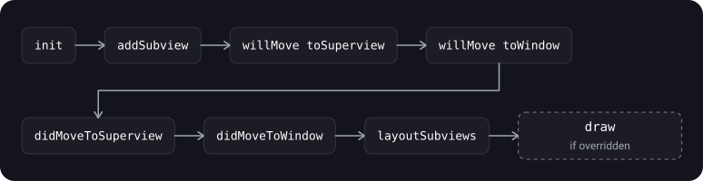

> **What you'll learn**
>
> - What `UIViewController` is responsible for and how its view is created lazily
> - The full order of lifecycle methods and what to do in each of them
> - How `viewIsAppearing` differs from `viewWillAppear` and why it is the best place to configure geometry
> - When `viewWillLayoutSubviews` and `viewDidLayoutSubviews` are called and why many times
> - What happens on screen rotation and size changes (`viewWillTransition`)
> - The lifecycle of `UIView` itself: `willMove`, `didMoveToSuperview`, `didMoveToWindow`
> - How to hide the tab bar properly

> **Prerequisites:** tutorial [01](../uiview-window-coordinates/) — `UIView`, the view hierarchy, `UIWindow`; tutorial [02](../calayer-drawing/) — `CALayer`, `draw(_:)`.

## Analogy: a theater performance

The controller is the director, the view is the set on the stage.

- **`loadView`** and **`viewDidLoad`** — the set is brought in and assembled, the props are laid out. Done once, when the set is first needed (lazily).
- **`viewWillAppear`** — the actors are waiting in the wings. The stage is still empty.
- **`viewIsAppearing`** — the set is already on the stage, the lights are set, the dimensions are known, but the curtain is still closed.
- **`viewDidAppear`** — the curtain is open, the audience is watching.
- **`viewWillDisappear`** and **`viewDidDisappear`** — the actors leave the stage, the curtain has closed.
- **`deinit`** — the play is taken off the repertoire, the set is dismantled.
- The same play can be performed many times in a row: the set is assembled once, while the stage entrances repeat.

## Step 1. What UIViewController does

> **`UIViewController`** is an object that manages the view hierarchy of a UIKit app. The root view lives in its `view` property.

**The main responsibilities of a controller (per Apple's documentation):**

- updating the contents of views, usually in response to changes in data;
- responding to user interactions with views;
- resizing views and managing the layout of the whole interface;
- coordinating with other objects, including other controllers.

- A controller is a `UIResponder`: it sits in the responder chain between the root view and its superview (tutorial [07](../responder-chain-gestures/)).
- **The root view gets its size from its owner:** either the parent controller or the window (for the window's root controller).
- **A controller is the only owner of its view and its subviews.** You can't share one view between two controllers.
- **The view is created lazily:** the first access to `view` creates or loads it. Until then `view` is `nil`, and `isViewLoaded` returns `false`.

> If you need to touch the view without creating it, use `viewIfLoaded` or `isViewLoaded`. Accessing `view` makes the controller load the interface.

## Step 2. How a controller's view is created

There are three ways, with one result: the root view ends up in the `view` property.

| Way | Which initializer | When |
| --- | --- | --- |
| Storyboard | `init(coder:)` | The controller is created from a storyboard (Apple calls this way the preferred one) |
| Nib (xib) | `init(nibName:bundle:)` | The screen is described in a nib file, the controller is created from code |
| Code | your own `init`, the view is created in `loadView()` or in `viewDidLoad()` | All the layout is in code |

> **`loadView()`** is the method that creates the controller's root view. The controller itself calls it when someone asks for `view` and it is `nil`.

- **Never call `loadView()` directly.**
- Override it only if you build the root view **entirely in code**: create a view and assign it to the `view` property. **Don't call `super.loadView()`** in that case.
- If the screen is made in Interface Builder, you **must not** override `loadView()`.
- If `loadView()` is not overridden and there is no nib, the controller creates a plain empty `UIView`.
- For extra view setup, use `viewDidLoad()`.

```swift
final class ProfileViewController: UIViewController {
    private let profileView = ProfileView()   // your own UIView subclass (tutorial 01)

    override func loadView() {
        view = profileView                    // without super.loadView()
    }

    override func viewDidLoad() {
        super.viewDidLoad()
        // extra setup: delegates, subscriptions, data
        profileView.onTapEdit = { [weak self] in self?.showEditor() }
    }

    private func showEditor() { /* ... */ }
}
```

## Step 3. The order of lifecycle methods

The order for a controller's first presentation (per Apple's documentation):


| Method | When it is called | How many times |
| --- | --- | --- |
| `init(coder:)` / `init(nibName:bundle:)` / your own `init` | Creating the controller | Once |
| `loadView()` | The view was requested and doesn't exist yet | Once (again after the view is released) |
| `viewDidLoad()` | After the view is loaded into memory | Once per view load |
| `viewWillAppear(_:)` | Before the view is added to the hierarchy | Every presentation |
| `viewIsAppearing(_:)` | After being added to the hierarchy and laid out by the superview; traits and geometry are up to date | Once per presentation |
| `viewWillLayoutSubviews()` | Before laying out the subviews | Many times (every `layoutSubviews`) |
| `viewDidLayoutSubviews()` | After laying out the subviews | Many times |
| `viewDidAppear(_:)` | After the view has appeared and the transition has finished | Every presentation |
| `viewWillDisappear(_:)` | Before the view is removed from the hierarchy | Every dismissal |
| `viewDidDisappear(_:)` | After the view was removed | Every dismissal |

What will be printed on the **first** presentation if every method has a `print`?

```swift
// loadView (if overridden)
// viewDidLoad
// viewWillAppear
// viewIsAppearing
// viewWillLayoutSubviews
// viewDidLayoutSubviews
// viewDidAppear
```

<details>
<summary>And on the second presentation (coming back to the screen)?</summary>

`viewWillAppear`, `viewIsAppearing`, then, if needed, the `viewWillLayoutSubviews` and `viewDidLayoutSubviews` pair, then `viewDidAppear`. `loadView` and `viewDidLoad` are not called again: the view is already loaded and lives as long as the controller. The layout pair may not be called at all if the layout hasn't changed, but `viewIsAppearing` is called in any case.

</details>

## Step 4. What to do in each method

| Method | What goes here | What not to do |
| --- | --- | --- |
| `viewDidLoad` | One-time setup: add subviews, constraints, assign delegate and dataSource, subscriptions, initial data | Rely on final sizes and geometry: they don't exist yet |
| `viewWillAppear` | Actions that must happen **before** the transition starts: access to `transitionCoordinator` for alongside animations; paired subscriptions (register here, unsubscribe in `viewDidDisappear`) that don't depend on geometry | Configure the view by size or traits: they aren't up to date yet |
| `viewIsAppearing` | Updating the view by traits and geometry; scrolling to the needed cell before display; calculations that need the size | Heavy computations: the method is in the same transaction as `viewWillAppear` |
| `viewDidAppear` | Starting animations, video or sound, starting data collection (network) | Changing the appearance the user already sees: there will be a noticeable "jump" |
| `viewWillDisappear` | Saving changes or state | Stopping things that are still needed while the screen is visible |
| `viewDidDisappear` | Stopping tasks that aren't needed without a screen: notification subscriptions, sensor observation, network calls | Doing heavy work: the transition is already over |

> **Call `super`** in all overrides. Not every `will` has a "paired" `did` (a transition can be cancelled, for example by the back gesture). If a process is started in `will`, finish it both in the corresponding `did` and in the opposite `will` (Apple).

## Step 5. viewIsAppearing — the best place to configure the view

> **`viewIsAppearing(_:)`** is a callback the system calls after the controller's view has been added to the hierarchy and laid out by its superview. By then the controller and the view have up-to-date trait collections and correct geometry (size, safe area).

- It is called **after** `viewWillAppear` and **before** `viewDidAppear`, in the same transaction (`CATransaction`) as `viewWillAppear`: the user sees changes made in either method at the same time.
- It is called **once** per appearance, even if no layout is required. The layout callbacks (`viewWillLayoutSubviews` and `viewDidLayoutSubviews`) may fire many times.
- Apple recommends using it instead of `viewWillAppear` in almost every case where you need to update the view.

| State at the time of the callback | `viewWillAppear` | `viewIsAppearing` |
| --- | --- | --- |
| The transition coordinator is available for alongside animations | Yes | No |
| The view has been added to the hierarchy | No | Yes |
| Trait collections are updated | No | Yes |
| Geometry (size, safe area) is accurate | No | Yes |

```swift
override func viewIsAppearing(_ animated: Bool) {
    super.viewIsAppearing(animated)

    // collectionView's sizes are already up to date — you can compute the scroll position
    if let indexPath = selectedIndexPath {
        collectionView.scrollToItem(at: indexPath,
                                    at: .centeredVertically,
                                    animated: false)
    }
}
```

## Step 6. Layout callbacks: viewWillLayoutSubviews and viewDidLayoutSubviews

The system calls them **every time** the controller's view performs `layoutSubviews()`: on size change, rotation, constraint change. During one presentation this can happen **several times**, and at any moment while the view is visible.

- **`viewWillLayoutSubviews()`** — the view is about to lay out its subviews. The root view's bounds are already final here (the first such moment).
- **`viewDidLayoutSubviews()`** — the layout is done; you can finish configuring whatever depends on the final frames.

```swift
private let gradient = CAGradientLayer()

override func viewDidLayoutSubviews() {
    super.viewDidLayoutSubviews()
    gradient.frame = headerView.bounds          // a layer doesn't take part in Auto Layout (tutorial 02)
}
```

> Do only light work in the layout callbacks: they are called often. Don't call `setNeedsLayout()` on the same view here and don't change constraints in a way that triggers layout again: you'll get an infinite loop (tutorial [05](../autolayout-layout-pass/)).

## Step 7. Rotation and size change: viewWillTransition

Since iOS 8 the rotation methods (`willRotate`, `didRotate`, etc.) are **deprecated**. A rotation is a **change of size** of the controller's view, which `viewWillTransition(to:with:)` reports.

- UIKit calls the method **before** the view's size changes. UIKit calls it on the window's root controller, which passes it down the controller hierarchy.
- In the `coordinator` parameter you can animate your own changes together with the transition.
- Always call `super` so that UIKit passes the message on.

```swift
override func viewWillTransition(to size: CGSize,
                                 with coordinator: any UIViewControllerTransitionCoordinator) {
    super.viewWillTransition(to: size, with: coordinator)

    coordinator.animate(alongsideTransition: { _ in
        // animation alongside the rotation: adapt the interface to the new size
        self.headerHeightConstraint.constant = size.width > size.height ? 60 : 120
        self.view.layoutIfNeeded()
    }, completion: { _ in
        // the transition is finished
    })
}
```

## Step 8. Memory: didReceiveMemoryWarning and deinit

> **`didReceiveMemoryWarning()`** is called when the system has determined that free memory is low. Override it to release excess memory, and call `super`. Don't call the method yourself.

```swift
override func didReceiveMemoryWarning() {
    super.didReceiveMemoryWarning()
    imageCache.removeAllObjects()      // release what can be recreated
}
```

> **`deinit`** is Swift's deinitializer: it is called when the controller is deallocated (no strong references to it remain). It is not a view lifecycle method.

- A quick leak check: add `deinit { print("\(Self.self) deinit") }` and close the screen. No message means someone is holding the controller (a retain cycle through a closure, a delegate with a strong reference, etc., tutorial [09](../data-passing-appearance/)).
- A controller closed with the back gesture but not deallocated is a typical symptom of a leak.

## Step 9. The UIView lifecycle

A view has its own callbacks: they report changes to the hierarchy, and you use them in your own subclasses.

| Method | What it reports | Note |
| --- | --- | --- |
| `init(frame:)` / `init(coder:)` | Creating the view | Shared setup in one place (tutorial [01](../uiview-window-coordinates/)) |
| `willMove(toSuperview:)` | The superview is about to change; the argument is `nil` if the view is being removed | The default implementation does nothing |
| `willMove(toWindow:)` | The view's window is about to change | The argument is `nil` if the view leaves the window |
| `didMoveToSuperview()` | The superview changed (added or removed) | Handy for setup that needs a superview |
| `didMoveToWindow()` | The view's window changed | `window` may be `nil`: the view was removed, or added to a superview that isn't in a window |
| `layoutSubviews()` | Laying out the subviews | Don't call directly: `setNeedsLayout()` or `layoutIfNeeded()` (tutorial [05](../autolayout-layout-pass/)) |
| `draw(_:)` | Drawing the content | Don't call directly: `setNeedsDisplay()` (tutorial [02](../calayer-drawing/)) |

The typical order when adding a view to an already displayed superview (observed in practice; Apple doesn't explicitly guarantee it):



```swift
final class ClockView: UIView {
    private var timer: Timer?

    override func didMoveToWindow() {
        super.didMoveToWindow()
        if window != nil {
            // the view is on screen — start the updates
            timer = Timer.scheduledTimer(withTimeInterval: 1, repeats: true) { [weak self] _ in
                self?.setNeedsDisplay()
            }
        } else {
            // the view left the screen — stop them
            timer?.invalidate()
            timer = nil
        }
    }
}
```

## Step 10. Child controllers (containers)

A controller can hold other controllers as **children** — this is how `UINavigationController` and `UITabBarController` work. Apple's documentation requires: link the child to its parent **before** adding its view to the hierarchy, and break the link after removing the view. This way UIKit routes events and appearance callbacks correctly.

```swift
// add a child
addChild(child)
view.addSubview(child.view)
child.view.frame = containerView.bounds
child.didMove(toParent: self)

// remove a child
child.willMove(toParent: nil)
child.view.removeFromSuperview()
child.removeFromParent()
```

- By default appearance and rotation callbacks are **forwarded automatically** to children.
- The methods `addChild`, `removeFromParent`, `willMove(toParent:)`, `didMove(toParent:)` are needed only by the container's implementation, not by clients.

## Step 11. Why the view disappeared: isBeingPresented and others

The same `viewDidDisappear` is called both when moving forward and when closing the screen. To tell them apart there are flags:

| Property | When `true` |
| --- | --- |
| `isBeingPresented` | The controller is in the process of being presented modally |
| `isBeingDismissed` | The controller is being dismissed by its ancestors |
| `isMovingToParent` | The controller is being added to a parent (for example, a push in navigation) |
| `isMovingFromParent` | The controller is being removed from a parent (for example, a pop) |

```swift
override func viewDidDisappear(_ animated: Bool) {
    super.viewDidDisappear(animated)
    if isMovingFromParent || isBeingDismissed {
        // the screen is closed for good, not just covered by another one
        cleanUp()
    }
}
```

<details>
<summary>Why isn't viewWillAppear called on the controller after a sheet is closed?</summary>

Presenting on top of a controller differs by style. With `fullScreen`, the presenting controller's view is removed from the hierarchy after the presentation, it receives `viewWillDisappear` and `viewDidDisappear`, and on dismissal — `viewWillAppear` and `viewDidAppear`. With `overFullScreen` (and sheet styles like `pageSheet`), the presenting view stays in the hierarchy: Apple's documentation says so for `overFullScreen`, while in practice the same is seen with the card-style sheet, so the appearance callbacks don't arrive for the screen underneath. If you need to react to a sheet closing, use `presentationControllerDidDismiss` (the `UIAdaptivePresentationControllerDelegate` delegate) or a closure and notify the owner explicitly.

</details>

## Step 12. Hiding the tab bar

```swift
// Way 1: on push, before the screen is shown
let detail = DetailViewController()
detail.hidesBottomBarWhenPushed = true
navigationController?.pushViewController(detail, animated: true)

// Way 2: iOS 18+, explicitly hide or show
if #available(iOS 18.0, *) {
    tabBarController?.setTabBarHidden(true, animated: true)
}
```

## Common mistakes

- Configuring the view by size in `viewDidLoad` or `viewWillAppear`: the geometry isn't final yet; use `viewIsAppearing` or the layout callbacks.
- Forgetting `super` in lifecycle method overrides.
- Calling `super.loadView()` in your own `loadView()` implementation, or overriding `loadView()` on an Interface Builder screen.
- Accessing `view` in `init`: this loads the view too early.
- Starting subscriptions or timers in `viewDidLoad` and not stopping them: on the second presentation they get doubled or live on without a screen. Paired actions: start in `viewWillAppear` and stop in `viewDidDisappear`.
- Heavy work in `viewWillLayoutSubviews` and `viewDidLayoutSubviews`: they are called many times.
- Assuming `viewDidLoad` is called on every presentation: it is called once per view load.
- Treating `viewWillTransition` as an "after the rotation" event.
- Animating `tabBar.frame` by hand instead of `hidesBottomBarWhenPushed` and `setTabBarHidden`.
- Not checking `deinit` on a closed screen: leaks go unnoticed.

<details>
<summary>Why does viewDidLoad sometimes already have the right sizes and sometimes not?</summary>

In `viewDidLoad` the sizes and traits are only predicted by the system; for the root view they may match the final ones or may not (it depends on the container, safe area, rotation). The guarantee comes only after `viewIsAppearing`: the view is added to the hierarchy and laid out. So everything that depends on size is moved there or into the layout callbacks.

</details>

## Cheat sheet

```swift
// Order of the first presentation
// [init] -> loadView* -> viewDidLoad (once)
// -> viewWillAppear -> viewIsAppearing -> viewWillLayoutSubviews -> viewDidLayoutSubviews -> viewDidAppear
// Hiding: viewWillDisappear -> viewDidDisappear;  then deinit, if there are no references
// * loadView only if we create the root view in code (without super.loadView())

// What goes where
viewDidLoad()        // one-time setup (subviews, constraints, delegates)
viewWillAppear(_:)   // paired subscriptions, transitionCoordinator
viewIsAppearing(_:)  // setup by traits and geometry, scroll to a cell
viewDidAppear(_:)    // animations, video, network
viewWillDisappear(_:)// save state
viewDidDisappear(_:) // stop tasks, subscriptions

// Size and rotation
viewWillTransition(to:with:)   // BEFORE the size change; call super; animate in the coordinator

// Memory
didReceiveMemoryWarning()      // release what can be recreated; call super
deinit { }                     // check that the controller was deallocated

// Reason for leaving
isBeingPresented / isBeingDismissed / isMovingToParent / isMovingFromParent

// UIView
willMove(toSuperview:) / willMove(toWindow:) / didMoveToSuperview() / didMoveToWindow()
// removeFromSuperview() — an action, not a callback

// Tab bar
vc.hidesBottomBarWhenPushed = true       // before the push
tabBarController?.setTabBarHidden(true, animated: true)   // iOS 18+
```

## Self-check questions

<details>
<summary>1. In what order are the lifecycle methods called on a controller's first presentation?</summary>

`loadView` (if overridden) → `viewDidLoad` → `viewWillAppear` → `viewIsAppearing` → `viewWillLayoutSubviews` → `viewDidLayoutSubviews` → `viewDidAppear`. The layout pair may repeat.

</details>

<details>
<summary>2. How does viewDidLoad differ from viewWillAppear?</summary>

`viewDidLoad` is called once, when the view is loaded into memory; the geometry isn't final yet. `viewWillAppear` is called before every presentation. Neither is suitable for setup by size: use `viewIsAppearing` for that.

</details>

<details>
<summary>3. Why is viewIsAppearing better than viewWillAppear for configuring the view?</summary>

By the time of `viewIsAppearing` the view is already in the hierarchy and laid out by its superview; traits and geometry (size, safe area) are up to date. The method is in the same transaction as `viewWillAppear`, so changes are visible at the same time. It is called once per presentation. Back-deploys to iOS 13.

</details>

<details>
<summary>4. Why is viewDidLayoutSubviews called many times?</summary>

It fires on every `layoutSubviews()` of the root view: size change, rotation, constraint change, at any moment while the view is visible. So only light work is done in it.

</details>

<details>
<summary>5. When is viewWillTransition(to:with:) called, and what must you do in the override?</summary>

Before the controller's view changes size (in particular, on rotation). You must call `super`, and perform transition-related animations through `coordinator.animate(alongsideTransition:completion:)`.

</details>

<details>
<summary>6. What is wrong with treating removeFromSuperview as a "view lifecycle callback"?</summary>

It is an action that you call. The view then receives the callbacks `willMove(toSuperview: nil)`, `willMove(toWindow: nil)`, `didMoveToSuperview()` and `didMoveToWindow()`.

</details>

<details>
<summary>7. How do you check that a closed screen was released from memory?</summary>

Add a `deinit` with a `print`. If the message doesn't appear after the screen is closed, someone is holding the controller (a retain cycle).

</details>

## Sources

- [UIViewController — Apple Developer Documentation](https://developer.apple.com/documentation/uikit/uiviewcontroller)
- [viewIsAppearing(_:) — Apple Developer Documentation](https://developer.apple.com/documentation/uikit/uiviewcontroller/viewisappearing(_:))
- [loadView() — Apple Developer Documentation](https://developer.apple.com/documentation/uikit/uiviewcontroller/loadview())
- [didReceiveMemoryWarning() — Apple Developer Documentation](https://developer.apple.com/documentation/uikit/uiviewcontroller/didreceivememorywarning())
- [viewWillTransition — Apple Developer Documentation](https://developer.apple.com/documentation/uikit/uicontentcontainer/viewwilltransition(to:with:))
- [layoutSubviews() — Apple Developer Documentation](https://developer.apple.com/documentation/uikit/uiview/layoutsubviews())
- [didMoveToWindow() — Apple Developer Documentation](https://developer.apple.com/documentation/uikit/uiview/didmovetowindow())
- [hidesBottomBarWhenPushed — Apple Developer Documentation](https://developer.apple.com/documentation/uikit/uiviewcontroller/hidesbottombarwhenpushed)
- [setTabBarHidden — Apple Developer Documentation](https://developer.apple.com/documentation/uikit/uitabbarcontroller/settabbarhidden(_:animated:))
- [What’s new in UIKit — WWDC23 (Apple)](https://developer.apple.com/videos/play/wwdc2023/10055/)
- [UIViewController lifecycle — Habr (in Russian)](https://habr.com/ru/articles/654517/)
- [The UIViewController lifecycle in 2025: what changed and what became obsolete — Habr (in Russian)](https://habr.com/ru/articles/943778/)
- [UIViewController lifecycle — sparrowcode.io (in Russian)](https://sparrowcode.io/ru/tutorials/uiviewcontroller-lifecycle)
- [Interview questions: the UIViewController lifecycle — apptractor (in Russian)](https://apptractor.ru/info/techhype/voprosy-s-sobesedovaniy-zhiznennyy-tsikl-uiviewcontroller.html?ysclid=m1dqwmrc9p527680475)
