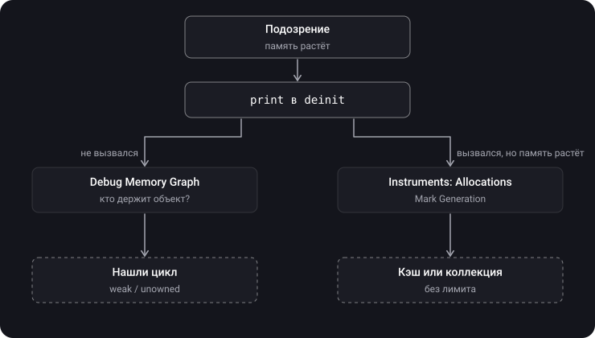

> **Что узнаешь**
>
> - Что такое утечка памяти и откуда она берётся в реальных приложениях
> - Как найти утечку: `deinit`, Memory Graph, Instruments
> - Что такое memory safety и от каких ошибок Swift защищает сам
> - Что такое правило эксклюзивного доступа
> - Почему утечка и нарушение memory safety — разные вещи

> **Нужно знать заранее:** темы [05](../mrc-to-arc/)–[06](../reference-types-retain-cycle/) — ARC, strong/weak/unowned, retain cycle.

## Аналогия: капающий кран и перила на лестнице

- **Утечка памяти** — капающий кран. Ничего не ломается сразу, но счёт за воду растёт. Через месяц — потоп (система убивает приложение за перерасход памяти).
- **Memory safety** — перила и ограждения на лестнице. Они не экономят воду, они не дают упасть: обратиться к несуществующей памяти, выйти за границу массива, прочитать неинициализированную переменную.

Это две разные проблемы: можно иметь идеальные перила и капающий кран одновременно.

## Шаг 1. Что такое утечка

> **Утечка памяти (memory leak)** — объект больше не нужен приложению, но на него остаётся strong-ссылка, поэтому ARC его не освобождает.

Утечка сама по себе не крашит приложение и не портит данные — она просто съедает память. Классический признак: открываешь и закрываешь один и тот же экран, а потребление памяти растёт ступеньками.

## Шаг 2. Откуда берутся утечки

| Источник | Кто кого держит | Как исправить |
| --- | --- | --- |
| Хранимое замыкание | объект → замыкание → `self` | `[weak self]` |
| Strong delegate | контроллер → view → delegate (контроллер) | `weak var delegate` |
| Повторяющийся `Timer` | run loop → таймер → замыкание / target → `self` | `[weak self]` • `invalidate()` при уходе с экрана |
| `NotificationCenter` с блоком | центр уведомлений → замыкание → `self` | `[weak self]` • `removeObserver(token)` |
| Синглтон или кэш без лимита | синглтон → массив → объекты | удалять ненужное, ограничивать размер (`NSCache`) |

<details>
<summary>Найди утечку</summary>

```swift
final class ClockViewController: UIViewController {
    private var timer: Timer?

    override func viewDidLoad() {
        super.viewDidLoad()
        timer = Timer.scheduledTimer(withTimeInterval: 1, repeats: true) { _ in
            self.updateTime()
        }
    }
}
```

Run loop держит повторяющийся таймер, таймер держит замыкание, замыкание держит `self`. Закрыли экран — контроллер остаётся в памяти, а таймер тикает вечно. Исправление: `{ [weak self] _ in self?.updateTime() }` и `timer?.invalidate()`, например в `viewDidDisappear`.

</details>

## Шаг 3. Как найти утечку

**Способ 1 — `deinit`.** Самый быстрый.

```swift
deinit { print("\(Self.self) освобождён") }
```

Закрыл экран, а сообщения нет — объект кто-то держит.

**Способ 2 — Debug Memory Graph**

1. Запусти приложение из Xcode, пройди подозрительный сценарий (открыть и закрыть экран несколько раз).
2. Нажми кнопку Debug Memory Graph (три соединённых кружка) на панели отладки.
3. Слева — список живых объектов. Если там три экземпляра закрытого контроллера — это утечка. Настоящие циклы помечены фиолетовым `!`.
4. Выбери объект — в центре граф: кто на него ссылается. Ищи стрелку, которая замыкает круг.

**Способ 3 — Instruments**

1. `Product → Profile` (`⌘I`) → шаблон **Leaks**.
2. Пройди сценарий. Красные отметки на шкале — найденные утечки.
3. Выбери утечку → в инспекторе **стек вызовов**, где объект был создан → отсюда понятно, что за объект и откуда.
4. Инструмент **Allocations** показывает все выделения памяти. Кнопка **Mark Generation**: сделай отметку, открой и закрой экран, сделай ещё одну. Всё, что выросло между отметками и не исчезло, — кандидаты в утечки.



> Leaks находит только память, до которой **нельзя** добраться (классические циклы). Если объект достижим — например, лежит в массиве синглтона, — Leaks его не покажет. Такую «брошенную память» (abandoned memory) ищут через Allocations и Mark Generation.

## Шаг 4. Memory safety

> **Memory safety** — гарантия, что программа не обращается к памяти недопустимым образом: не читает неинициализированное, не лезет за границы, не трогает освобождённое, не пишет в одну переменную из двух мест одновременно.

Что Swift делает по умолчанию:

1. **Инициализация до использования.** Компилятор не даст прочитать переменную, которой ничего не присвоено.
2. **Проверка границ.** `array[10]` при 5 элементах — контролируемый краш, а не чтение чужой памяти.
3. **ARC.** Не даёт освободить объект, пока на него есть strong-ссылка — нет обращений к удалённому объекту.
4. **Опционалы.** «Значения нет» нужно обработать явно, а не получить случайный `nil` в неожиданном месте.
5. **Строгая типизация.** Нельзя прочитать память одного типа как другой без явного `unsafe`-API.
6. **Эксклюзивный доступ.** Запись в переменную не может пересекаться с другим обращением к ней (шаг 5).

> Всё это отключается там, где в названии API есть `Unsafe`: `UnsafePointer`, `unowned(unsafe)`, `unsafeBitCast`. Там ответственность на тебе.

## Шаг 5. Эксклюзивный доступ

> **Правило эксклюзивности** (SE-0176): пока идёт запись в переменную, никакое другое обращение к ней не может пересекаться с этой записью.

Пример из документации Swift:

```swift
var stepSize = 1

func increment(_ number: inout Int) {
    number += stepSize      // читаем stepSize…
}

increment(&stepSize)        // …пока идёт запись в него же через inout
```

<details>
<summary>Что произойдёт?</summary>

Краш во время выполнения: «Simultaneous accesses to stepSize». `inout` открывает долгую запись в `stepSize` на всё время вызова, а внутри функции идёт чтение той же переменной. Доступы пересеклись.

Исправление — сделать явную копию: `var copy = stepSize; increment(&copy); stepSize = copy`.

</details>

Иногда конфликт виден уже компилятору:

```swift
var balance = 100
swap(&balance, &balance)    // ❌ ошибка компиляции: overlapping accesses
```

## Шаг 6. Утечка ≠ нарушение memory safety

|  | Утечка памяти | Нарушение memory safety |
| --- | --- | --- |
| Суть | Объект живёт дольше, чем нужен | Недопустимое обращение к памяти |
| Опасность | Растёт потребление памяти | Порча данных, краш, дыры в безопасности |
| Защищает ли Swift | Нет — циклы разрывает разработчик | Да, по умолчанию (кроме `Unsafe`-API) |
| Как искать | `deinit`, Memory Graph, Leaks, Allocations | Компилятор, краши с понятным сообщением, Address/Thread Sanitizer |

> Retain cycle — проблема **эффективности**, а не безопасности. Обращаться к «утёкшему» объекту совершенно безопасно — он жив и цел. Просто его никто не использует, а память он занимает.

## Типичные ошибки

- «Крашей нет — значит утечек нет». Утечка не крашит сразу; система убьёт приложение позже, в случайном месте.
- Искать только через Leaks. Достижимую, но ненужную память он не покажет — нужны Allocations и Mark Generation.
- Забывать `invalidate()` у повторяющегося `Timer`.
- Путать утечку и нарушение memory safety.
- Считать, что проверки эксклюзивности заменяют синхронизацию между потоками.

## Шпаргалка

```text
Утечка = ненужный объект держит strong-ссылка → память не возвращается
Источники: замыкание с self, strong delegate, Timer, NotificationCenter-блок, синглтон/кэш

Найти:
  print в deinit                         → держит ли кто-то объект
  Debug Memory Graph                     → кто именно держит (граф)
  Instruments → Leaks                    → недостижимые циклы
  Instruments → Allocations + Mark Gen.  → рост достижимой памяти

Memory safety (Swift по умолчанию):
  инициализация до использования, проверка границ, ARC, опционалы, типы,
  эксклюзивный доступ (SE-0176): запись не пересекается с другим доступом
  выключается в Unsafe-API
Между потоками → Thread Sanitizer, не проверки эксклюзивности
```

## Вопросы для самопроверки

<details>
<summary>1. Что такое утечка памяти?</summary>

Объект больше не нужен, но на него остаётся strong-ссылка, и ARC его не освобождает. Самая частая причина — retain cycle.

</details>

<details>
<summary>2. Назови три источника утечек, кроме цикла двух классов.</summary>

Хранимое замыкание, захватившее `self`; повторяющийся `Timer` без `invalidate`; блок-наблюдатель `NotificationCenter`; синглтон или кэш, который копит объекты.

</details>

<details>
<summary>3. Почему Leaks может не показать проблему, хотя память растёт?</summary>

Leaks ищет только недостижимую память. Если объекты достижимы (лежат в кэше или массиве синглтона), это «брошенная память» — её видно через Allocations и Mark Generation.

</details>

<details>
<summary>4. Что требует правило эксклюзивного доступа?</summary>

Запись в переменную не должна пересекаться по времени ни с каким другим обращением к той же переменной.

</details>

<details>
<summary>5. Ловят ли проверки эксклюзивности гонки между потоками?</summary>

Не гарантированно. Надёжно они работают внутри одного потока. Для гонок между потоками нужен Thread Sanitizer.

</details>

<details>
<summary>6. Опасно ли обращаться к объекту, который «утёк»?</summary>

Нет. Он жив и корректен — просто занимает память без пользы. Утечка — проблема эффективности, а не безопасности.

</details>

## Источники

- [Артём Колосов — Борьба с утечками памяти: от задачи до победы](https://www.youtube.com/watch?v=4yn19H07NSE&list=WL&index=15&pp=gAQBiAQB)
- [Memory leaks. Xcode instruments](https://www.youtube.com/watch?v=OSd8ilmCTGs)
- [Отслеживание утечек памяти в iOS-приложении со SwiftUI в Runtime](https://habr.com/ru/companies/banki/articles/836924/)
- [Как не потерять голову (и память) при поиске утечек в iOS](https://habr.com/ru/companies/simbirsoft/articles/723954/)
- [Поиск строгих ссылок в iOS-проекте с помощью Xcode](https://tproger.ru/articles/poisk-retain-cycle-s-pomoshhju-instrumentov-xcode)
- [Простой способ обнаружить retain cycle в UIViewController](https://habr.com/ru/articles/662708/)
- [Управление памятью в Swift - Mad Brains Техно 1.08.19](https://youtu.be/NF19v4Ef6KA?list=PLw6SJ6q6-1YowmlGVks5a088XrSbihJu-&t=1926)
- [The Swift Programming Language — Memory Safety](https://docs.swift.org/swift-book/documentation/the-swift-programming-language/memorysafety/)
- [SE-0176: Enforce Exclusive Access to Memory](https://github.com/apple/swift-evolution/blob/main/proposals/0176-enforce-exclusive-access-to-memory.md)
