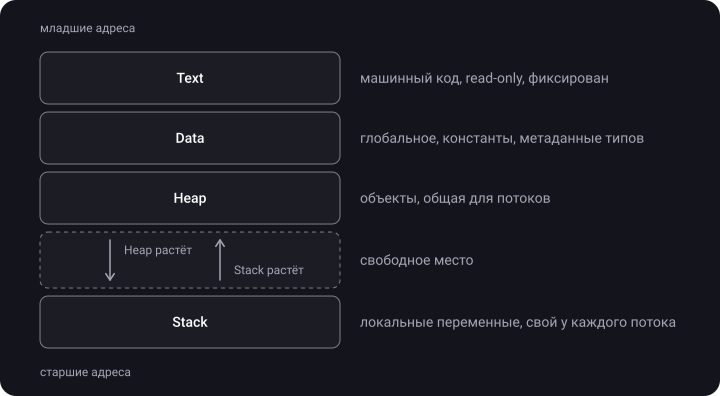
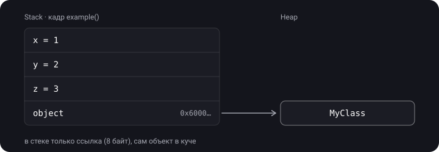
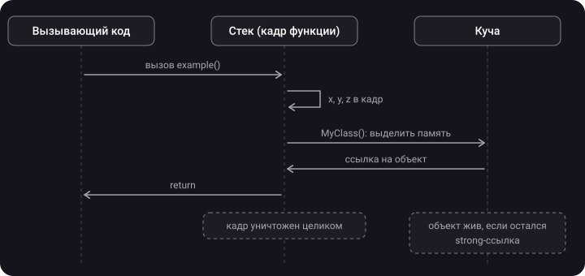
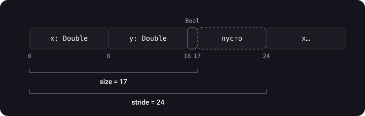

> **Что узнаешь**
>
> - Из каких четырёх областей состоит память запущенного приложения
> - Куда попадают переменная, объект класса, константа и сам код
> - Что происходит с памятью, когда функция вызывается и завершается
> - Что такое `size`, `stride` и `alignment` и как их посчитать руками

> **Нужно знать заранее:** базовый синтаксис Swift, разницу между `struct` и `class` на уровне «что это такое». Это стартовая тема блока.

## Аналогия: офисное здание

Представь запущенное приложение как офисное здание.

- **Text (код)** — стены и планировка. Их построили заранее (компилятор), во время работы их не перестраивают — только читают.
- **Data (глобальные данные)** — доска объявлений в холле. Висит весь рабочий день, видна всем сотрудникам.
- **Heap (куча)** — склад. Можно взять полку любого размера на любое время, но кто-то должен следить, когда полку пора освободить (это ARC).
- **Stack (стек)** — стопка бумаг на столе сотрудника. Кладёшь сверху, берёшь сверху. Закончил задачу — выбросил всю её стопку разом. У каждого сотрудника (потока) свой стол.

## Шаг 1. Четыре области памяти

> **Адресное пространство процесса** — вся память, которую система выделила приложению. Она делится на области с разными правилами.

1. **Text** — машинный код приложения. Только для чтения, размер фиксирован.
2. **Data** — глобальные и статические переменные, константы, метаданные типов (описание `class` / `struct` / `protocol`, а не их экземпляры).
3. **Heap** — объекты с собственным временем жизни: экземпляры классов и иногда value-типы ([тема 04](../value-types-on-heap-existential/)).
4. **Stack** — локальные переменные и параметры функций. Работает по принципу LIFO, у каждого потока свой.



> **Главное:** Text и Data формируются заранее и не меняют размер. Heap и Stack — динамические: растут и уменьшаются по ходу работы программы.

## Шаг 2. Что куда попадает — на примере кода

```swift
// Data: глобальная константа и сами объявления типов
let greeting = "Hello, world"
class MyClass { }
struct MyStruct { }

func example() {
    // Stack: локальные переменные функции
    var x = 1
    var y = 2
    let z = x + y

    // Stack: переменная-ссылка (8 байт указателя)
    // Heap:  сам объект MyClass
    let object = MyClass()
}
```

> `let object = MyClass()` — это **две** вещи в двух разных местах. Переменная `object` (по сути указатель) лежит в стеке. Объект, на который она указывает, — в куче. Путать их — самая частая ошибка в этой теме.



## Шаг 3. Что происходит при вызове функции

1. Вызвали функцию → система создаёт для неё **кадр стека** (stack frame).
2. Параметры и локальные переменные кладутся в этот кадр.
3. Создали объект класса → память выделяется в куче, в кадр попадает только ссылка.
4. Функция завершилась → кадр стека исчезает **целиком и мгновенно**.
5. Объект в куче **не исчезает** вместе с кадром. Он живёт, пока на него есть strong-ссылка (темы [05](../mrc-to-arc/)–[06](../reference-types-retain-cycle/)).



<details>
<summary>Функция создала объект и вернула его наружу через return. Что будет с объектом, когда кадр стека функции уничтожится?</summary>

Ничего плохого: объект живёт в куче, а не в кадре. Ссылку на него получил вызывающий код, так что strong-ссылка осталась, и объект продолжает жить. Исчезла только локальная переменная внутри функции.

</details>

## Шаг 4. MemoryLayout: сколько места занимает тип

Swift позволяет узнать, как тип лежит в памяти:

- **`size`** — сколько байт реально занимают данные;
- **`alignment`** — на адресе, кратном какому числу, должно начинаться значение;
- **`stride`** — расстояние между соседними элементами в массиве: `size`, округлённый вверх до кратного `alignment`.

```swift
struct Point {
    let x: Double     // 8 байт
    let y: Double     // 8 байт
    let isFilled: Bool // 1 байт
}

MemoryLayout<Point>.size       // ?
MemoryLayout<Point>.alignment  // ?
MemoryLayout<Point>.stride     // ?
```

<details>
<summary>Посчитай сам, потом открой ответ</summary>

- `size` = 8 + 8 + 1 = **17**
- `alignment` = максимум из выравниваний полей = **8** (у `Double`)
- `stride` = 17, округлённое вверх до кратного 8 = **24**

</details>

Почему `stride` больше `size`? Представь массив `[Point]`. Если бы элементы шли вплотную через 17 байт, второй `Point` начался бы с адреса 17 — не кратного 8, и его `Double` оказались бы невыровненными. Поэтому после каждого элемента добавляется 7 байт «прокладки»:



Порядок полей влияет на `size`. Если поставить `Bool` первым, компилятор Swift всё равно разместит поля в порядке объявления: `Bool` (1) + 7 байт прокладки + `Double` + `Double` → `size` = 24. Поэтому мелкие поля выгоднее объявлять в конце.

> На практике `MemoryLayout` нужен, когда работаешь с «сырой» памятью: `UnsafeRawPointer`, `UnsafeMutableRawBufferPointer`, бинарные форматы. Для выделения места под N элементов всегда бери `stride * N`, а не `size * N`.

## Шаг 5. Нюансы

- **Стек — на поток, куча — общая.** У каждого потока свой стек; куча одна на всё приложение и доступна всем потокам.
- **Четыре области — упрощение.** Реальная карта памяти подробнее: есть регистры процессора, отдельные секции для строковых литералов, загруженные системные библиотеки. Для iOS-разработки модели из четырёх областей достаточно.
- «Data segment» и «Global Data» — одно и то же, встречаются оба названия.

## Типичные ошибки

- «Переменная в стеке → и объект в стеке». Нет: в стеке только ссылка, объект — в куче.
- «Все struct всегда в стеке». Обычно да, но есть исключения ([тема 04](../value-types-on-heap-existential/)).
- Использовать `size` вместо `stride` при работе с массивами и сырой памятью → перезапись соседних данных.
- «Стек общий для приложения». Нет: стек у каждого потока свой.

## Шпаргалка

```text
Text   = код, read-only, фиксирован
Data   = глобальные/статические переменные, константы, метаданные типов
Heap   = объекты классов (+ value-типы в особых случаях), общая для потоков
Stack  = локальные переменные и параметры, LIFO, свой у каждого потока

let obj = MyClass()   → obj (ссылка) в стеке, объект в куче
Выход из функции      → кадр стека исчезает, объекты в куче — нет

size      = сколько байт занимают данные
alignment = максимум выравниваний полей
stride    = size, округлённый вверх до кратного alignment (шаг в массиве)
```

## Вопросы для самопроверки

<details>
<summary>1. Из каких четырёх областей состоит адресное пространство приложения?</summary>

Text (код), Data (глобальные данные), Heap (куча), Stack (стек).

</details>

<details>
<summary>2. Где лежит переменная let obj = MyClass(), а где — сам объект?</summary>

Переменная (указатель) — в стеке текущей функции. Объект `MyClass` — в куче.

</details>

<details>
<summary>3. Почему MemoryLayout&lt;Point&gt;.stride (24) больше size (17)?</summary>

`stride` — это `size`, округлённый вверх до кратного `alignment` (8). Иначе следующий элемент массива начался бы с невыровненного адреса.

</details>

<details>
<summary>4. Какая область доступна только для чтения?</summary>

Text — машинный код приложения.

</details>

<details>
<summary>5. Общий ли стек для всех потоков?</summary>

Нет. У каждого потока свой стек. Общая для всех потоков область — куча.

</details>

## Источники

- [Типы памяти в Swift (Swift 5)](https://www.youtube.com/watch?v=7oiVJMsLJAE)
- [Память в iOS. ARC. Part II — разбор вопросов с iOS собеседований](https://www.youtube.com/watch?v=hzdYoipYBfQ&t=550s)
