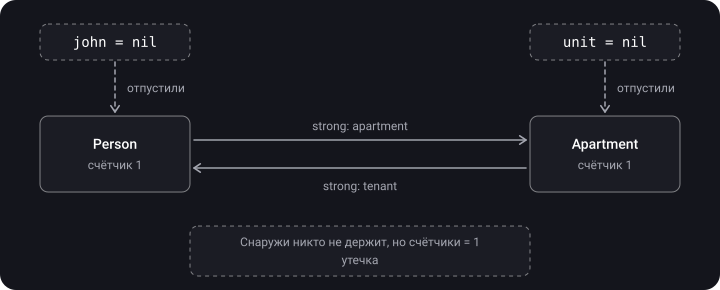
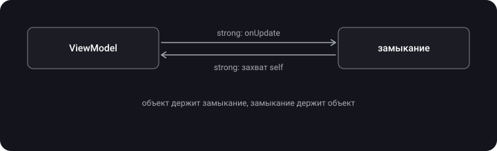

> **Что узнаешь**
>
> - Чем strong, weak и unowned ссылки отличаются друг от друга
> - Как два объекта «запирают» друг друга в памяти (retain cycle)
> - Как замыкание может держать свой же объект и как это исправить через `[weak self]`
> - Когда брать `weak`, а когда `unowned`
> - Как найти утечку в Xcode

> **Нужно знать заранее:** [тема 05](../mrc-to-arc/) — ARC считает сильные ссылки на объект и освобождает его, когда счётчик становится 0.

## Аналогия: собака на поводке

Объект — это собака в парке. Пока хоть кто-то держит её за поводок, она остаётся в парке. Когда все поводки отпущены, собака уходит домой: объект освобождается.

- **Strong** — держишь поводок. Пока держишь, собака никуда не уйдёт.
- **Weak** — просто смотришь на собаку. Не мешаешь ей уйти, а когда она ушла — видишь пустое место (`nil`).
- **Unowned** — ты так уверен, что собака рядом, что даже не смотришь. Позовёшь её, когда она уже ушла, — споткнёшься на ровном месте (краш).
- **Retain cycle** — две собаки держат в зубах поводки друг друга. Хозяева давно ушли, а собаки так и ходят по парку вечно.

## Шаг 1. Strong — держим поводок

> **Strong-ссылка** — ссылка по умолчанию. Она увеличивает счётчик ссылок объекта и не даёт ARC его освободить.

Любое `let` / `var` без пометок — это strong. Посмотрим, как меняется счётчик:

```swift
class Person {
    let name: String
    init(name: String) { self.name = name }
    deinit { print("\(name) освобождён") }
}

var a: Person? = Person(name: "Анна")   // счётчик: 1
var b = a                                // счётчик: 2
a = nil                                  // счётчик: 1 — объект жив
b = nil                                  // счётчик: 0 → «Анна освобождён»
```

> **Главное:** объект живёт, пока на него есть **хотя бы одна** strong-ссылка. Неважно, откуда она — из переменной, свойства другого объекта или замыкания.

## Шаг 2. Retain cycle — две собаки с поводками в зубах

> **Retain cycle** — два или больше объектов держат друг друга strong-ссылками. Их счётчики никогда не станут 0, и ни один `deinit` не вызовется.

Человек снимает квартиру, квартира знает своего жильца:

```swift
class Person {
    let name: String
    var apartment: Apartment?          // strong
    init(name: String) { self.name = name }
    deinit { print("\(name) освобождён") }
}

class Apartment {
    let number: Int
    var tenant: Person?                // тоже strong — вот проблема
    init(number: Int) { self.number = number }
    deinit { print("Квартира \(number) освобождена") }
}

var john: Person? = Person(name: "John")
var unit: Apartment? = Apartment(number: 73)
john?.apartment = unit
unit?.tenant = john
john = nil
unit = nil
```

<details>
<summary>Что напечатается?</summary>

**Ничего.** Ни один `deinit` не вызовется. Смотри таблицу ниже.

</details>

Следим за счётчиками строка за строкой:

| Строка | Счётчик Person | Счётчик Apartment | Кто держит |
| --- | --- | --- | --- |
| `john = Person(...)` | 1 | — | Person ← john |
| `unit = Apartment(...)` | 1 | 1 | Apartment ← unit |
| `john?.apartment = unit` | 1 | 2 | Apartment ← unit, Person |
| `unit?.tenant = john` | 2 | 2 | Person ← john, Apartment |
| `john = nil` | 1 | 2 | Person держит только Apartment |
| `unit = nil` | **1** | **1** | Держат только друг друга — утечка |



> ARC — это **не** сборщик мусора. Он не ищет «островки» объектов, до которых нельзя добраться из кода. Он только считает ссылки. Поэтому циклы — целиком ответственность разработчика.

## Шаг 3. Weak — просто смотрим на собаку

> **Weak-ссылка** не увеличивает счётчик. Когда объект освобождается, ARC сам записывает в неё `nil`.

Из этого следуют два правила. Weak-ссылка всегда:

- **опциональная** (`Person?`) — ей нужно состояние «объекта больше нет»;
- **`var`**, а не `let` — ARC должен иметь возможность записать туда `nil`.

Исправляем квартиру — меняем одно слово:

```swift
class Apartment {
    let number: Int
    weak var tenant: Person?           // ← теперь не держит жильца
    init(number: Int) { self.number = number }
    deinit { print("Квартира \(number) освобождена") }
}
```

Запускаем тот же код, что в шаге 2:

| Строка | Счётчик Person | Счётчик Apartment | Что происходит |
| --- | --- | --- | --- |
| `john?.apartment = unit` | 1 | 2 | как раньше |
| `unit?.tenant = john` | **1** | 2 | weak не считается |
| `john = nil` | 0 | 1 | «John освобождён», Person отпускает квартиру, `tenant` стал `nil` |
| `unit = nil` | — | 0 | «Квартира 73 освобождена» |

<details>
<summary>Что напечатается теперь и в каком порядке?</summary>

```text
John освобождён
Квартира 73 освобождена
```

Person освобождается первым, потому что после `john = nil` на него не осталось ни одной strong-ссылки. Уходя, он отпускает свою strong-ссылку на квартиру, и у той счётчик падает до 1. Последнюю ссылку снимает `unit = nil`.

</details>

## Шаг 4. Unowned — уверены, что собака рядом

> **Unowned-ссылка** тоже не увеличивает счётчик, но она **неопциональная**. ARC не обнуляет её. Если объект уже освобождён, обращение к ней — краш.

Подходит, когда один объект **не может существовать** без другого. Карта не бывает без клиента:

```swift
class Customer {
    let name: String
    var card: CreditCard?
    init(name: String) { self.name = name }
}

class CreditCard {
    let number: Int
    unowned let customer: Customer     // не держит, но и не бывает nil
    init(number: Int, customer: Customer) {
        self.number = number
        self.customer = customer
    }
}

// card.customer.name — разворачивать не нужно, в отличие от weak
```

А вот что будет, если «уверенность» подвела:

```swift
var anna: Customer? = Customer(name: "Анна")
let card = CreditCard(number: 1234, customer: anna!)
anna = nil                            // Customer освобождён, card жива
print(card.customer.name)             // 💥 краш: обращение к освобождённому объекту
```

> С `weak` в такой ситуации ты бы просто получил `nil`. С `unowned` — краш. Бери `unowned`, только если **точно** знаешь, что объект переживёт ссылку.

**Правило выбора:**

```text
Второй объект может умереть РАНЬШЕ?   → weak
Второй объект живёт НЕ МЕНЬШЕ?       → unowned
Не уверен?                            → weak
```

<details>
<summary>Для продвинутых: unowned(safe), unowned(unsafe) и опциональный unowned</summary>

- `unowned` = `unowned(safe)`: при обращении к освобождённому объекту — контролируемый краш.
- `unowned(unsafe)` — без проверки, как `__unsafe_unretained` в Objective-C: можно прочитать мусор из памяти вместо краша. Только для интеграции со старым кодом.
- `unowned var x: T?` — опциональный unowned. ARC **не** записывает в него `nil` автоматически, это делаешь ты сам.

</details>

## Шаг 5. Retain cycle в замыкании

Цикл возникает и с одним-единственным классом, если объект **хранит** замыкание, а замыкание **захватывает** `self`:

```swift
final class ProfileViewModel {
    var name = "Анна"
    var onUpdate: (() -> Void)?        // объект держит замыкание

    func bind() {
        onUpdate = {
            print(self.name)           // замыкание держит self
        }
    }
    deinit { print("ViewModel освобождена") }
}

var vm: ProfileViewModel? = ProfileViewModel()
vm?.bind()
vm = nil                               // deinit не вызовется
```



**Исправление — список захвата (capture list):**

```swift
func bind() {
    onUpdate = { [weak self] in
        guard let self else { return }  // объекта уже нет — просто выходим
        print(self.name)
    }
}
```

> Для цикла нужны **оба направления**: объект → замыкание и замыкание → объект. Если замыкание не хранится (выполнилось и забылось), цикла нет. Поэтому `[weak self]` не обязателен в `map`, `forEach`, `DispatchQueue.main.async` — подробнее в [туторе «Многопоточность → 02 · GCD»](../../concurrency/gcd/).

## Шаг 6. Как найти утечку

1. **Самый простой способ** — `print` в `deinit`. Закрыл экран, а в консоли тишина? Скорее всего, утечка.
2. **Debug Memory Graph** — кнопка с тремя кружками на панели отладки Xcode. Показывает все живые объекты и стрелки ссылок между ними; утечки помечены фиолетовым `!`.
3. **Instruments → Leaks** — ищет утечки во время работы приложения.

## Сводная таблица

|  | strong | weak | unowned |
| --- | --- | --- | --- |
| Увеличивает счётчик | да | нет | нет |
| Тип | любой | только опциональный | обычно неопциональный |
| `let` или `var` | оба | только `var` | оба |
| Объект освобождён | невозможно, пока держим | ссылка стала `nil` | обращение → краш |
| Цена | — | создаёт Side Table ([тема 07](../arc-internals/)) | Side Table не нужна |
| Когда брать | по умолчанию, владение | объект может умереть раньше | объект точно живёт не меньше |

## Типичные ошибки

- `unowned` «на всякий случай» → краш, когда порядок освобождения окажется другим.
- Хранимое замыкание (`var onTap: () -> Void`) без `[weak self]` → утечка экрана или ViewModel.
- «ARC автоматический, значит утечек не бывает» → ARC честно считает и цикл тоже.
- `[weak self]` везде подряд, даже где цикла быть не может → лишний шум в коде.
- Delegate объявлен как `var delegate: MyDelegate?` без `weak` → классический цикл контроллер ↔ view.

## Шпаргалка

```text
strong   = держит поводок, счётчик +1, по умолчанию
weak     = смотрит, счётчик не трогает, сам станет nil (всегда var + Optional)
unowned  = не держит и не проверяет, освобождён → краш

Retain cycle = A держит B, B держит A → оба вечны
Лечение      = одну из сторон сделать weak / unowned
Замыкания    = объект хранит замыкание + замыкание захватило self → [weak self]

Может умереть раньше? → weak.  Живёт не меньше? → unowned.  Не уверен? → weak.
НАЙТИ: print в deinit, Debug Memory Graph, Instruments → Leaks
```

## Вопросы для самопроверки

<details>
<summary>1. Чем weak отличается от unowned?</summary>

Оба не увеличивают счётчик. `weak` всегда опциональный и сам становится `nil`, когда объект освобождён. `unowned` неопциональный, ARC его не обнуляет, и обращение к освобождённому объекту крашит приложение.

</details>

<details>
<summary>2. Почему weak-ссылку нельзя объявить через let?</summary>

ARC должен записать в неё `nil` при освобождении объекта, а `let` менять нельзя.

</details>

<details>
<summary>3. Что такое retain cycle и почему ARC сам его не разрывает?</summary>

Два или больше объектов держат друг друга strong-ссылками, и их счётчики не падают до 0. ARC только считает ссылки и не анализирует, достижимы ли объекты из кода, — в отличие от сборщика мусора.

</details>

<details>
<summary>4. Как получить retain cycle, если в коде всего один класс?</summary>

Объект хранит замыкание в свойстве, а замыкание захватывает `self` strong-ссылкой. Объект держит замыкание, замыкание держит объект.

</details>

<details>
<summary>5. Нужен ли [weak self] в DispatchQueue.main.async?</summary>

Для отсутствия утечки — нет: очередь держит замыкание только до его выполнения, а объект это замыкание не хранит. Но `[weak self]` полезен, если не хочешь продлевать жизнь объекта до выполнения задачи.

</details>

<details>
<summary>6. Почему delegate обычно объявляют weak?</summary>

Делегат (например, контроллер) обычно сам владеет объектом, которому он делегат. Если ссылка на делегата тоже strong, получится цикл: контроллер ↔ view.

</details>

## Источники

- [Swift 4 — слабые ссылки](https://habr.com/ru/articles/341014/)
- [Поиск строгих ссылок в iOS-проекте с помощью Xcode](https://tproger.ru/articles/poisk-retain-cycle-s-pomoshhju-instrumentov-xcode)
- [Руководство по использованию unsafe в Swift](https://habr.com/ru/articles/887914/)
- [Swift: ARC и управление памятью](https://habr.com/ru/articles/451130/)
