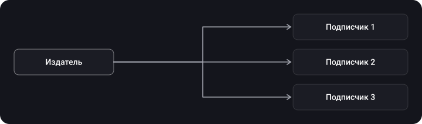
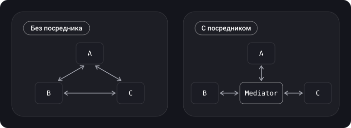

> **Что узнаешь**
>
> - как устроены поведенческие паттерны: Delegate, Observer, Chain of Responsibility, Strategy, State, Reactor, Template Method, Mediator;
> - какие способы «наблюдать за изменениями» есть в iOS (`NotificationCenter`, KVO, Combine, `@Observable`) и когда какой выбрать;
> - почему делегат должен быть `weak` и что такое responder chain;
> - как заменить «лапшу из `if`» стратегиями и состояниями.

> **Нужно знать заранее**
>
> Главы [01](../paradigms/)–[05](../structural-patterns/): протоколы, замыкания, композиция. Про ARC и retain cycle — из основ Swift.

## Аналогия: офис

**Delegate** — руководитель передаёт часть задач исполнителю по списку обязанностей. **Observer** — подписка на рассылку: издатель пишет, подписчики читают. **Chain of Responsibility** — заявка идёт по цепочке «менеджер → директор → совет», пока кто-то не решит. **Strategy** — выбираем способ доставки: курьер, почта, самовывоз. **State** — сотрудник ведёт себя по-разному в статусах «на работе», «в отпуске». **Reactor** — секретарь, который принимает все звонки и переводит их на нужных людей.

## Шаг 1. Delegate (делегат)

> Делегирование — шаблон проектирования, позволяющий классу или структуре передавать (делегировать) часть своих обязанностей экземпляру другого типа. (Swift book)

Цель — позволить объекту сообщать что-то владельцу **без знания его конкретного типа**. Протокол — это список обязанностей, которые берёт на себя делегат; пока он их не реализует, компилятор не даст «начать работу».

```swift
import Foundation

protocol DownloaderDelegate: AnyObject {          // AnyObject → можно хранить weak
    func downloader(_ downloader: Downloader, didFinishWith data: Data)
    func downloader(_ downloader: Downloader, didFailWith error: Error)
}

final class Downloader {
    weak var delegate: DownloaderDelegate?        // weak — иначе retain cycle

    func start() {
        // ... загрузка ...
        delegate?.downloader(self, didFinishWith: Data())
    }
}

final class ScreenViewModel: DownloaderDelegate {
    let downloader = Downloader()

    init() { downloader.delegate = self }

    func downloader(_ downloader: Downloader, didFinishWith data: Data) {
        print("Загружено \(data.count) байт")
    }
    func downloader(_ downloader: Downloader, didFailWith error: Error) {
        print("Ошибка: \(error)")
    }
}
```

> **Делегат почти всегда `weak`.** Владелец (`ScreenViewModel`) держит `downloader` сильной ссылкой; если `downloader` держит делегата сильно, получится цикл и утечка. Для этого протокол делегата помечают `AnyObject` (класс-only): `weak` работает только со ссылочными типами. (Дополнено.)

> **Необязательные методы.** В чисто Swift-протоколе опциональных требований нет; их эмулируют реализацией по умолчанию в `extension`:

```swift
extension DownloaderDelegate {
    func downloader(_ downloader: Downloader, didFailWith error: Error) { }
}
```

**Аналогия из исходников — менеджер и ассистент** (дополнено). Менеджеру всё равно, какого типа ассистент, лишь бы он выполнял список задач из протокола:

```swift
protocol ManagerDelegate: AnyObject {
    func doLaundry(for manager: Manager, laundry: [Clothes]) -> [Clothes]
    func howMuchMoneyDidWeMake() -> Int
}

final class Manager {
    weak var assistant: ManagerDelegate?     // менеджер зависит от протокола, а не от класса

    func performEndOfDayTasks(today: Weekday, dirtyClothes: [Clothes]) {
        switch today {
        case .monday:
            _ = assistant?.doLaundry(for: self, laundry: dirtyClothes)
        case .friday:
            if let profit = assistant?.howMuchMoneyDidWeMake() {
                print("We made \(profit) dollars this week boss!")
            }
        }
    }
}
```

Класс-помощник, принявший протокол, не скомпилируется, пока не реализует все требования. (Типы `Clothes` и `Weekday` тут условные; в исходнике ещё был шуточный метод `whatBearIsBest`, я его опустил.)

**Delegate или замыкание?** Если событий много и они связаны (набор из 3–5 методов, как у `UITableViewDelegate`), берут делегат. Если событие одно и одноразовое — проще замыкание-колбэк (`completion`).

## Шаг 2. Observer (наблюдатель)

Механизм подписки: один объект (издатель) уведомляет других (подписчиков) об изменении состояния. Издатель не знает конкретных подписчиков, подписывать и отписывать можно на лету. Отличие от Delegate: подписчиков может быть **много**, у делегата — один.



Своя минимальная реализация:

```swift
import Foundation

final class Publisher<Value> {
    private var observers: [UUID: (Value) -> Void] = [:]

    func subscribe(_ observer: @escaping (Value) -> Void) -> UUID {
        let id = UUID()
        observers[id] = observer
        return id
    }
    func unsubscribe(_ id: UUID) { observers[id] = nil }
    func send(_ value: Value) { observers.values.forEach { $0(value) } }   // порядок не гарантирован
}

let temperature = Publisher<Double>()
let token = temperature.subscribe { print("Температура: \($0)") }
temperature.send(21.5)
temperature.unsubscribe(token)
```

> В такой реализации подписчики оповещаются в **произвольном порядке** (словарь) — писать код, зависящий от порядка, нельзя. Это известный минус паттерна.

### Наблюдатели в iOS — что выбрать

| Способ | Когда | Замечания |
| --- | --- | --- |
| `NotificationCenter` | Широковещательные события (приложение стало активным, клавиатура) | Издатель и подписчик не знают друг друга; легко потерять контроль; блочные подписки нужно снимать вручную |
| KVO | Следить за свойством `NSObject`-наследника (в т.ч. системных классов) | Нужны `@objc dynamic`; наблюдение через `observe(_:options:changeHandler:)` |
| Combine (`@Published`, `Subject`) | Потоки значений, преобразования, объединение источников | Держи `AnyCancellable`, иначе подписка сразу умрёт |
| Observation (`@Observable`, iOS 17+) | Состояние для SwiftUI | Отслеживаются только реально прочитанные свойства; заменяет `ObservableObject` |

```swift
import UIKit
import Combine
import Observation

// NotificationCenter
final class ForegroundWatcher {
    private var token: NSObjectProtocol?

    init() {
        token = NotificationCenter.default.addObserver(
            forName: UIApplication.didBecomeActiveNotification,
            object: nil, queue: .main
        ) { [weak self] _ in self?.refresh() }         // [weak self] — чтобы не держать объект
    }
    deinit { if let token { NotificationCenter.default.removeObserver(token) } }
    private func refresh() { }
}

// KVO
final class Player: NSObject {
    @objc dynamic var volume: Float = 0.5
}
let player = Player()
let observation = player.observe(\.volume, options: [.new]) { _, change in
    print("Громкость:", change.newValue ?? 0)
}
player.volume = 0.8

// Combine
final class Counter { @Published var value = 0 }
let counter = Counter()
var bag = Set<AnyCancellable>()
counter.$value.sink { print("value =", $0) }.store(in: &bag)
counter.value = 1

// Observation (iOS 17+ / Swift 5.9+)
@Observable final class Settings { var isDark = false }
// В SwiftUI View достаточно прочитать settings.isDark — обновление подключится само.
```

## Шаг 3. Chain of Responsibility (цепочка обязанностей)

Запрос передаётся по цепочке обработчиков; каждый решает — обработать самому или отдать дальше. Отправитель не знает, кто именно обработает.

```swift
class Approver {
    var next: Approver?

    func approve(amount: Int) -> String {
        next?.approve(amount: amount) ?? "Отклонено"
    }
}

final class Manager: Approver {
    override func approve(amount: Int) -> String {
        amount <= 1_000 ? "Менеджер одобрил" : super.approve(amount: amount)
    }
}
final class Director: Approver {
    override func approve(amount: Int) -> String {
        amount <= 10_000 ? "Директор одобрил" : super.approve(amount: amount)
    }
}

let manager = Manager()
manager.next = Director()

print(manager.approve(amount: 500))      // Менеджер одобрил
print(manager.approve(amount: 5_000))    // Директор одобрил
print(manager.approve(amount: 50_000))   // Отклонено
```

### Главный пример в iOS — responder chain

События (касания, нажатия клавиш, `UIAction`) идут по иерархии `UIResponder`: вью → её родительские вью → `UIViewController` → `UIWindow` → `UIApplication` → делегат приложения. Каждый звено может обработать событие или передать его `next`.

```swift
import UIKit

extension UIView {
    /// Находит контроллер, которому принадлежит вью, идя по цепочке респондеров
    var owningViewController: UIViewController? {
        var responder: UIResponder? = self
        while let next = responder?.next {
            if let vc = next as? UIViewController { return vc }
            responder = next
        }
        return nil
    }
}
```

> Тот же принцип у middleware в серверных фреймворках и у цепочек обработчиков ошибок/валидаторов: каждый проверяет своё и передаёт дальше.

## Шаг 4. Strategy (стратегия)

Определяет семейство алгоритмов, инкапсулирует каждый и делает их **взаимозаменяемыми**; алгоритм можно менять независимо от клиента. Применяют, когда есть развилки в поведении (`if/switch` по способу расчёта, форматирования, сортировки).

```swift
protocol PriceStrategy {
    func price(for base: Double) -> Double
}

struct RegularPrice: PriceStrategy {
    func price(for base: Double) -> Double { base }
}
struct SalePrice: PriceStrategy {
    let percent: Double
    func price(for base: Double) -> Double { base * (1 - percent / 100) }
}
struct VIPPrice: PriceStrategy {
    func price(for base: Double) -> Double { base * 0.8 - 50 }
}

final class Checkout {
    var strategy: PriceStrategy
    init(strategy: PriceStrategy) { self.strategy = strategy }

    func total(for base: Double) -> Double { strategy.price(for: base) }
}

let checkout = Checkout(strategy: RegularPrice())
print(checkout.total(for: 1000))     // 1000
checkout.strategy = SalePrice(percent: 15)
print(checkout.total(for: 1000))     // 850
```

> В Swift стратегией часто служит **функция или замыкание**: `var pricing: (Double) -> Double`. Метод `sort(by:)` принимает именно стратегию сравнения. Протокол нужен, когда у стратегии есть состояние или несколько методов.

**Пример из SwiftUI (дополнено, из исходников).** Поля ввода телефона, почты и цены отличаются только форматированием текста. Форматирование выносят в стратегию, а одно шаблонное поле принимает любую:

```swift
import SwiftUI

protocol TextFieldFormatStrategy {
    func format(_ value: String) -> String
}

struct PhoneFormatStrategy: TextFieldFormatStrategy {
    func format(_ value: String) -> String {
        // Привести номер к виду +7 (XXX) XXX-XX-XX — реализация опущена
        value
    }
}

struct CustomTextField: View {
    let title: String
    let formatStrategy: TextFieldFormatStrategy
    @State private var text = ""

    var body: some View {
        TextField(title, text: $text)
            .onChange(of: text) { _, newValue in
                text = formatStrategy.format(newValue)
            }
    }
}
```

Новое поле (почта, цена) — это новая стратегия, а `CustomTextField` не меняется. В исходниках то же показано на форматтерах (`BoldTextFormatter`, `PhoneTextFormatter`, `MoneyTextFormatter` за общим протоколом): мелкие, атомарные стратегии легко тестировать, хранить, расширять и прятать за ними данные и логику. (Сигнатура `onChange(of:)` с двумя параметрами — iOS 17+; в старых версиях замыкание без аргументов.)

| Применять, когда | Не нужно, когда |
| --- | --- |
| Есть несколько вариантов алгоритма и нужно менять их на лету; нужно убрать разветвления `if/switch`; нужно скрыть детали алгоритма от клиента. | Вариантов всего два и они не меняются — хватит `if` (KISS). |

## Шаг 5. State (состояние)

Позволяет объекту менять поведение в зависимости от внутреннего состояния — со стороны кажется, что объект сменил класс. Применяют, когда в методах много условий, ветвь которых зависит от состояния: каждую ветвь выносят в отдельный тип.

Пример — соединение с сетью:

```swift
protocol ConnectionState {
    func send(_ request: String, in connection: Connection)
}

final class Connection {
    private(set) var state: ConnectionState = OfflineState()

    func set(state: ConnectionState) { self.state = state }
    func send(_ request: String) { state.send(request, in: self) }
}

struct OfflineState: ConnectionState {
    func send(_ request: String, in connection: Connection) {
        print("Нет сети — «\(request)» поставлен в очередь")
    }
}
struct OnlineState: ConnectionState {
    func send(_ request: String, in connection: Connection) {
        print("Отправлено: \(request)")
    }
}

let connection = Connection()
connection.send("GET /profile")          // офлайн
connection.set(state: OnlineState())
connection.send("GET /profile")          // онлайн
```

> В Swift состояния часто выражают `enum` с ассоциированными значениями: `enum LoadState { case idle, loading, loaded([Item]), failed(Error) }`. Экран переключает UI через `switch` по состоянию — это и есть State в лёгкой форме. Полноценные классы состояний нужны, когда у каждого состояния сложное поведение.

**Второй пример из исходников (дополнено) — авторизация.** `Context` хранит текущее состояние и передаёт вопросы ему; смена состояния — просто новый объект:

```swift
protocol State {
    func isAuthorized(context: Context) -> Bool
    func userId(context: Context) -> String?
}

final class UnauthorizedState: State {
    func isAuthorized(context: Context) -> Bool { false }
    func userId(context: Context) -> String? { nil }
}

final class AuthorizedState: State {
    let id: String
    init(userId: String) { self.id = userId }
    func isAuthorized(context: Context) -> Bool { true }
    func userId(context: Context) -> String? { id }
}

// Класс отвечает за управление состояниями
final class Context {
    private var state: State = UnauthorizedState()

    var isAuthorized: Bool { state.isAuthorized(context: self) }
    var userId: String? { state.userId(context: self) }

    func changeStateToAuthorized(userId: String) { state = AuthorizedState(userId: userId) }
    func changeStateToUnauthorized() { state = UnauthorizedState() }
}
```

Клиент просто спрашивает `context.isAuthorized`, а ветвлений `if user == nil` по коду нет. (`AuthorizedState` дописан мною — на скрине виден только `UnauthorizedState`.)

**Strategy vs State.** Структура почти одинакова (объект делегирует работу сменному помощнику). Разница в **кто меняет** и **зачем**: стратегию выбирает клиент снаружи и она обычно не меняется сама; состояния сами переключают друг друга по ходу работы.

## Шаг 6. Reactor (реактор)

Паттерн для событийно-ориентированных систем: один **синхронный цикл событий** принимает события от многих источников и раздаёт их подходящим обработчикам. Аналогия — телефонный оператор, который отвечает на звонки и переводит их нужным людям.

В iOS похожую роль играет **RunLoop / главный цикл**: он по умолчанию обрабатывает события — касания, таймеры, системные сигналы — синхронно, одно за другим на главном потоке. Отсюда правило «не блокируй главный поток».

Ключевая деталь — **синхронность**: если обработка завершений операций асинхронна (обработчику приходит уведомление «операция уже завершена»), это уже паттерн **Proactor**.

## Шаг 7. Template Method (шаблонный метод)

Задаёт **скелет алгоритма** в базовом типе, а конкретные шаги отдаёт подклассам: порядок действий фиксирован, детали переопределяются. Пример из исходников — запрос доступа к ресурсу (фото, камера, геолокация): порядок «проверили → запросили → сообщили результат» один, а что именно проверять и делать — у каждого ресурса своё.

```swift
class PermissionAccessor {
    // Шаблонный метод: порядок шагов зафиксирован
    final func requestAccessIfNeeded() {
        guard !hasAccess() else { didReceiveAccess(); return }   // шаг 1
        requestAccess { [weak self] granted in
            granted ? self?.didReceiveAccess() : self?.didRejectAccess()
        }
    }

    // Шаги, которые переопределяют наследники
    func hasAccess() -> Bool { fatalError("Переопредели в наследнике") }
    func requestAccess(_ completion: @escaping (Bool) -> Void) { fatalError("Переопредели в наследнике") }
    func didReceiveAccess() { }   // необязательный шаг — «хук»
    func didRejectAccess() { }
}

final class PhotoPermissionAccessor: PermissionAccessor {
    override func hasAccess() -> Bool { /* проверить статус PHPhotoLibrary */ false }
    override func requestAccess(_ completion: @escaping (Bool) -> Void) { completion(true) }
    override func didReceiveAccess() { print("Открываем галерею") }
    override func didRejectAccess() { print("Показываем подсказку про настройки") }
}
```

> **В Swift нет абстрактных классов**, поэтому обязательные шаги заменяют `fatalError` (ошибка обнаружится только в рантайме) или используют протокол с реализацией по умолчанию в `extension` — тогда ошибка «не реализовано» ловится на этапе компиляции, а скелет алгоритма живёт в `extension`. `final` у шаблонного метода запрещает наследникам менять порядок шагов. Шаблонный метод — вариант наследования; если гибкости нужно больше, часто выбирают композицию и Strategy (см. главу [03](../kiss-dry-yagni/)).

## Шаг 8. Mediator (посредник)

Уменьшает связанность множества объектов: вместо того чтобы общаться друг с другом напрямую (каждый с каждым), они общаются **только через посредника**. Классы ничего не знают друг о друге — вся логика взаимодействия собрана в одном месте.



```swift
protocol FormMediator: AnyObject {
    func fieldDidChange(_ field: FormField)
}

final class FormField {
    let name: String
    var text = "" { didSet { mediator?.fieldDidChange(self) } }
    weak var mediator: FormMediator?     // weak — посредник владеет полями, не наоборот
    init(name: String) { self.name = name }
}

final class SignUpFormMediator: FormMediator {
    let email = FormField(name: "email")
    let password = FormField(name: "password")
    private(set) var isSubmitEnabled = false

    init() {
        email.mediator = self
        password.mediator = self
    }

    func fieldDidChange(_ field: FormField) {
        // Вся логика связей между полями — здесь, а не в самих полях
        isSubmitEnabled = email.text.contains("@") && password.text.count >= 8
    }
}
```

> **Риск — «божественный объект».** Вся логика собирается в посреднике и он легко разрастается. В iOS роль посредника часто играет `UIViewController` или ViewModel (Mediator ≈ Controller в MVC) — поэтому их и называют «массивными»; следи, чтобы бизнес-логика уезжала в отдельные объекты (см. главы [08](../mvc-mvp-mvvm/)–[09](../viper-clean-mvi/)). Отличие от Observer: у Mediator двусторонняя координация «многие ↔ многие» через один центр, у Observer — односторонняя рассылка «один → многие».

## Шаг 9. Как выбрать

| Ситуация | Паттерн |
| --- | --- |
| Объект передаёт часть обязанностей одному «владельцу» (таблица → контроллер) | Delegate |
| Один источник, много подписчиков | Observer (Combine, `@Observable`, NotificationCenter) |
| Запрос должен пройти по цепочке проверок/обработчиков | Chain of Responsibility |
| Несколько взаимозаменяемых алгоритмов | Strategy |
| Поведение зависит от состояния и меняется по ходу работы | State |
| Единая обработка событий из многих источников | Reactor (event loop) |
| Фиксированный порядок шагов, детали разные | Template Method |
| Много объектов, которые общаются «каждый с каждым» | Mediator |

> **Задачи-кейсы**
>
> в UIKit дизайнеров есть поля ввода телефона, почты и цены: выглядят одинаково, а форматирование и валидация разные → одно шаблонное поле (`CustomTextField`) получает `TextFieldFormatStrategy` через `let formatStrategy`, а `onChange` прогоняет текст через `format(_:)` — это Strategy (в исходнике `applyPhoneMask` приводит номер к виду +7 (XXX) XXX-XX-XX).
>
> форма с полями, чекбоксами и переключателями, которые влияют друг на друга (чекбокс открывает одни поля и блокирует другие; ввод телефона или почты меняет набор полей и название кнопки) → состояние формы выносят в State: каждое состояние знает, какие поля показывать и как назвать кнопку. Шаблонный метод (`PermissionAccessor` с шагами `hasAccess`, `didReceiveAccess`, `didRejectAccess`, которые переопределяет `PhotoPermissionAccessor`) разобран выше.

## Типичные ошибки

- **`var delegate: SomeDelegate?` без `weak`** — retain cycle.
- **Блочная подписка `NotificationCenter` без `[weak self]` и без `removeObserver`** — утечка и вызовы у «мёртвых» объектов.
- **Потерять `AnyCancellable`** — подписка на Combine закончится мгновенно.
- **Использовать Observer как «глобальную шину событий» для всего** — невозможно понять, кто на что реагирует.
- **Стратегия из двух `if`-веток** — переусложнение.
- **Путать Strategy и State**: стратегию задают снаружи, состояния переключаются сами.

## Шпаргалка

- Delegate: протокол `AnyObject` + `weak var delegate`.
- Observer: `NotificationCenter` — широковещание, KVO — свойства `NSObject`, Combine — потоки, `@Observable` — SwiftUI.
- Chain: каждый обрабатывает или передаёт `next`; в UIKit это responder chain.
- Strategy — сменный алгоритм; State — сменное поведение по состоянию.
- Reactor — синхронный event loop; асинхронный вариант — Proactor.
- Template Method — базовый тип фиксирует порядок шагов (`final`), наследники переопределяют шаги.
- Mediator — объекты общаются только через посредника; следи, чтобы он не стал «божественным объектом».

## Вопросы для самопроверки

<details>
<summary>1. Почему делегат объявляют weak?</summary>

Чтобы избежать retain cycle: владелец уже держит объект сильной ссылкой, а тот — делегата (обычно того же владельца).

</details>

<details>
<summary>2. Чем Observer отличается от Delegate?</summary>

У Observer много подписчиков и издатель не знает их типов; у Delegate один получатель с известным протоколом.

</details>

<details>
<summary>3. Как проходит событие по responder chain?</summary>

От вью через родительские вью к контроллеру, затем `UIWindow`, `UIApplication`, делегат приложения; каждый может обработать или передать `next`.

</details>

<details>
<summary>4. Чем Strategy отличается от State?</summary>

Стратегию выбирает клиент, состояния сами переключаются в ходе работы объекта.

</details>

<details>
<summary>5. Что делает Reactor Reactor’ом, а не Proactor’ом?</summary>

Синхронная обработка событий в цикле; при асинхронной обработке завершений это Proactor.

</details>

## Источники

- [Protocols — Delegation (Swift book)](https://docs.swift.org/swift-book/documentation/the-swift-programming-language/protocols/#Delegation)
- [UIResponder — Apple Developer Documentation](https://developer.apple.com/documentation/uikit/uiresponder)
- [Using responders and the responder chain to handle events](https://developer.apple.com/documentation/uikit/touches_presses_and_gestures/using_responders_and_the_responder_chain_to_handle_events)
- [Observation — Apple Developer Documentation](https://developer.apple.com/documentation/observation)
- [Combine — Apple Developer Documentation](https://developer.apple.com/documentation/combine)
