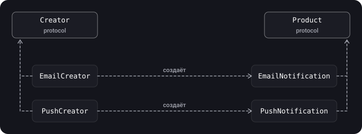
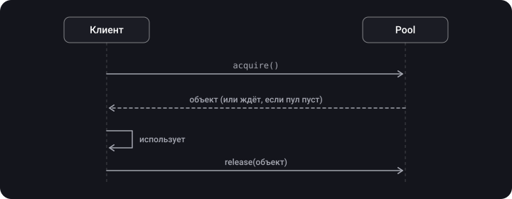

> **Что узнаешь**
>
> - что такое паттерны проектирования и на какие три группы они делятся;
> - как устроены шесть порождающих паттернов: Factory Method, Abstract Factory, Singleton, Builder, Prototype, Object Pool;
> - когда каждый нужен, а когда это перебор;
> - как безопасно делать Singleton и пул объектов в многопоточной среде.

> **Нужно знать заранее**
>
> Главы [01](../paradigms/)–[03](../kiss-dry-yagni/): протоколы, SOLID (особенно OCP и DIP). Для Object Pool — основы GCD (см. тему «Многопоточность»).

## Аналогия: как получить пиццу

Можно замесить тесто самому (создать объект `new`). Можно заказать «пиццу дня», а кухня решит, какую именно сделать (**Factory Method**). Можно заказать «комплект на вечеринку» — пицца, напиток и десерт из одной кухни (**Abstract Factory**). Можно собрать пиццу по шагам: тесто, соус, начинка (**Builder**). Можно попросить «такую же, как у соседа» (**Prototype**). Одна кухня на весь квартал — **Singleton**. А посуда, которую моют и используют заново, — **Object Pool**.

## Шаг 1. Что такое паттерны и как они делятся

**Паттерн проектирования** — описание взаимодействия объектов и классов, адаптированное для решения типичной задачи проектирования в определённом контексте. Это не готовый код, а «рецепт», который ты подстраиваешь под задачу.

| Группа | За что отвечает | Паттерны |
| --- | --- | --- |
| **Порождающие** | Создание объектов, скрытие того, *как* и *какой* объект создаётся | Factory Method, Abstract Factory, Singleton, Builder, Prototype, Object Pool |
| **Структурные** | Композиция объектов и классов в более крупные структуры | Adapter, Facade, Decorator, Flyweight, Proxy (глава [05](../structural-patterns/)) |
| **Поведенческие** | Взаимодействие объектов и распределение обязанностей | Delegate, Observer, Chain of Responsibility, Strategy, State, Reactor (глава [06](../behavioral-patterns/)) |

> **Полная классификация GoF** (дополнено, со скрина «Категории шаблонов»). В книге «банды четырёх» 23 паттерна. *Порождающие:* Singleton, Factory Method, Abstract Factory, Builder, Prototype. *Структурные:* Adapter, Bridge, Composite, Decorator, Facade, Flyweight, Proxy. *Поведенческие:* Visitor, Chain of Responsibility, Template Method, Command, Strategy, Iterator, State, Mediator, Observer, Memento. В этом туториале подробно разобраны те, что чаще всего встречаются в iOS; Object Pool и Reactor в список GoF не входят, это поздние дополнения.

> **Чем полезны паттерны** (дополнено, со скрина «Что такое и зачем нужны паттерны»). *Скорость:* берёшь готовое решение вместо изобретения велосипеда. *Проверенность:* код строится из стандартных блоков, чьи проблемы давно известны. *Общий словарь:* достаточно назвать паттерн, а не час объяснять устройство. Типичный пример из исходников («Кейс №1»): в разных местах приложения нужен доступ к ресурсам устройства (камера, галерея, геолокация); алгоритм запроса похож, а сам код отличается, и такую задачу решают через общий интерфейс с разными реализациями (например, Strategy или фабрика).

> Паттерн — не цель. Применять его нужно, когда возникла *проблема, которую он решает*; иначе получится усложнение (см. KISS из главы [03](../kiss-dry-yagni/)).

## Шаг 2. Factory Method (фабричный метод)

**Идея.** Общий интерфейс создания объекта объявляется в базовом типе, а *какой именно* объект создать, решают его наследники. Клиент работает с абстракцией и не знает конкретных классов.



```swift
protocol Notification {
    func send(_ text: String)
}

struct EmailNotification: Notification {
    func send(_ text: String) { print("Email: \(text)") }
}
struct PushNotification: Notification {
    func send(_ text: String) { print("Push: \(text)") }
}

protocol NotificationCreator {
    func makeNotification() -> Notification        // фабричный метод
}

extension NotificationCreator {
    func notify(_ text: String) {                  // общая логика использует продукт
        makeNotification().send(text)
    }
}

struct EmailCreator: NotificationCreator {
    func makeNotification() -> Notification { EmailNotification() }
}
struct PushCreator: NotificationCreator {
    func makeNotification() -> Notification { PushNotification() }
}

func alert(using creator: NotificationCreator) {
    creator.notify("Привет!")
}

alert(using: EmailCreator())
alert(using: PushCreator())
```

> В Foundation уже есть `Notification` (уведомление `NotificationCenter`). В своём проекте не называй тип так же — в примере это учебное имя; переименуй в `UserNotification` или `Message`.

**Алерты в UIKit — Factory и Builder рядом (дополнено, из исходников).** Фабрика выдаёт нужный алерт по типу, а строитель собирает конкретный алерт из параметров:

```swift
protocol DefaultsAlertsFactory: AnyObject {
    func getAlert(by type: DefaultsAlerts) -> UIViewController
}

protocol DefaultsAlertsBuilder: AnyObject {
    func buildOkAlert(with title: String, message: String) -> UIViewController
    func buildCancelAlert(with message: String, handler: (() -> Void)?) -> UIViewController
}
```

Разница в подходе: в фабрике клиент просит «дай алерт такого-то типа» (выбор варианта), в строителе — «собери алерт с вот такими данными» (сборка одного объекта). Протоколы с `AnyObject` удобны, если их потом хранят слабо (`weak`).

| Плюсы | Минусы |
| --- | --- |
| Клиент не привязан к конкретным продуктам. Код создания собран в одном месте. Новые продукты добавляются без правки клиента (OCP). | Растёт число типов: на каждый продукт — свой создатель. |

> В Swift часто обходятся проще: статическая функция или `enum` с методом `make()`, или замыкание `() -> Product`. Полная иерархия создателей нужна, когда логика создания должна *переопределяться* в подтипах.

**Вариант с параметром типа (дополнено, из исходников).** Фабрика машин: общий протокол, а каждая конкретная фабрика строит только часть моделей (например, для конкретной страны):

```swift
protocol Car { }
struct Tesla: Car { }
struct Mazda: Car { }

enum CarType { case tesla, ferrari, mazda }

protocol CarFactory {
    func makeCar(type: CarType) -> Car?
}

final class RegionalFactory: CarFactory {
    func makeCar(type: CarType) -> Car? {
        switch type {
        case .tesla: return Tesla()
        case .mazda: return Mazda()
        case .ferrari: return nil        // таких машин в этой стране не будет
        }
    }
}

let car = RegionalFactory().makeCar(type: .tesla)
```

В исходнике для неподдерживаемой марки стоит `fatalError(...)` — это уронит приложение в рантайме. Безопаснее вернуть `nil` или выбросить ошибку (`throws`), как выше.

## Шаг 3. Abstract Factory (абстрактная фабрика)

**Идея.** Создаёт **семейство** связанных объектов без привязки к конкретным классам. Отличие от Factory Method — как раз в семействе: одна фабрика выдаёт согласованный набор продуктов.

Пример — оформление интерфейса: у светлой и тёмной темы свои кнопки и переключатели, и их нельзя смешивать.

```swift
protocol Button { func render() -> String }
protocol Toggle { func render() -> String }

protocol ThemeFactory {
    func makeButton() -> Button
    func makeToggle() -> Toggle
}

struct LightButton: Button { func render() -> String { "Светлая кнопка" } }
struct LightToggle: Toggle { func render() -> String { "Светлый переключатель" } }
struct DarkButton: Button { func render() -> String { "Тёмная кнопка" } }
struct DarkToggle: Toggle { func render() -> String { "Тёмный переключатель" } }

struct LightThemeFactory: ThemeFactory {
    func makeButton() -> Button { LightButton() }
    func makeToggle() -> Toggle { LightToggle() }
}
struct DarkThemeFactory: ThemeFactory {
    func makeButton() -> Button { DarkButton() }
    func makeToggle() -> Toggle { DarkToggle() }
}

func buildScreen(with factory: ThemeFactory) {
    print(factory.makeButton().render())
    print(factory.makeToggle().render())
}

buildScreen(with: DarkThemeFactory())
```

> В исходной заметке та же идея показана на примере «набор техники от производителя» (телефон + ноутбук + планшет). Принцип тот же: фабрика = производитель, продукты = его комплект.

## Шаг 4. Singleton (одиночка)

**Идея.** Гарантирует один экземпляр класса на всё приложение и даёт глобальную точку доступа к нему. В iOS встречается постоянно: `URLSession.shared`, `UserDefaults.standard`, `FileManager.default`, `NotificationCenter.default`.

```swift
final class NetworkManager {
    static let shared = NetworkManager(baseURL: URL(string: "https://example.com")!)

    let baseURL: URL
    private init(baseURL: URL) { self.baseURL = baseURL }   // снаружи создать нельзя
}

print(NetworkManager.shared.baseURL)
```

Если при создании нужна настройка, её делают в замыкании-инициализаторе (так показано в исходниках): `static let shared: Singleton = { let instance = Singleton(); /* setup */ return instance }()` — замыкание тоже выполняется лениво и ровно один раз.

### Потокобезопасность (дополнено)

`static let` в Swift инициализируется **лениво и ровно один раз, даже при одновременном обращении из нескольких потоков** — это гарантия языка (Swift book, раздел Type Properties). Поэтому `static let shared` — безопасный способ создать одиночку.

> Гарантия относится **только к созданию** экземпляра. Изменяемое состояние внутри синглтона по-прежнему нужно защищать (очередь, `NSLock`, `actor`). А в Swift 6 со строгой проверкой конкурентности `static let` неконцурентного изменяемого типа вызовет ошибку — сделай тип `Sendable`, `actor` или `@MainActor`.

### Почему одиночку называют антипаттерном

| Проблема | Что происходит |
| --- | --- |
| Скрытые зависимости | Класс обращается к `NetworkManager.shared` изнутри, и по его `init` этого не видно |
| Тестирование | Подменить `shared` подделкой нельзя, состояние «протекает» между тестами |
| SRP | Тип отвечает и за свою работу, и за то, что он единственный |
| Глобальное изменяемое состояние | Любой код может его менять, порядок изменений непредсказуем |

### Как использовать безопаснее

- Делай `private init`, чтобы нельзя было создать второй экземпляр случайно.
- **Не хранить в синглтоне изменяемое состояние**, либо защищать его.
- **Внедряй его как зависимость** через протокол — тогда в тестах подставляется подделка:

```swift
protocol Networking { func load(_ url: URL) async throws -> Data }

final class NetworkService: Networking {
    static let shared = NetworkService()
    private init() {}
    func load(_ url: URL) async throws -> Data {
        try await URLSession.shared.data(from: url).0
    }
}

final class ProfileViewModel {
    private let network: Networking
    init(network: Networking = NetworkService.shared) { self.network = network }  // в тестах передаём Mock
}
```

## Шаг 5. Builder (строитель)

**Идея.** Собирает сложный объект **пошагово**; один и тот же процесс сборки может дать разные представления. Классически участвуют *Builder* (собирает) и *Director* (знает порядок шагов).

Пример — дом со стенами и крышей.

```swift
struct Walls { var width: Float; var height: Float }
struct Roof  { var width: Float; var height: Float }

struct House {
    var walls: Walls?
    var roof: Roof?
}

final class HouseBuilder {
    private var house = House()

    @discardableResult
    func setWalls(_ walls: Walls) -> Self { house.walls = walls; return self }

    @discardableResult
    func setRoof(_ roof: Roof) -> Self { house.roof = roof; return self }

    func build() -> House { house }
}

let house = HouseBuilder()
    .setWalls(Walls(width: 1.5, height: 2.3))
    .setRoof(Roof(width: 2.5, height: 3.3))
    .build()
```

> **В Swift Builder нужен реже, чем в Java.** Параметры по умолчанию и метки аргументов решают большую часть задач: `House(walls: w, roof: r)`. Строитель оправдан, когда сборка *многошаговая*, зависит от условий или должна валидироваться перед `build()`. В iOS ты постоянно видишь его в виде цепочек: `URLComponents`, `NSAttributedString`-сборщики, `UIAlertController` с добавлением действий.

**Пример с валидацией — `URLBuilder` (дополнено, из исходников).** Здесь строитель оправдан: шаги необязательны, а связность полей (логин без пароля) проверяется в `build()`:

```swift
import Foundation

final class URLBuilder {
    enum URLBuilderError: Error { case emptyHost, inconsistentCredentials, systemError }

    private var scheme = "https"
    private var user: String?
    private var password: String?
    private var host: String?
    private var port: Int?
    private var path = ""
    private var queryItems: [String: String]?

    func with(scheme: String) -> URLBuilder { self.scheme = scheme; return self }
    func with(user: String) -> URLBuilder { self.user = user; return self }
    func with(password: String) -> URLBuilder { self.password = password; return self }
    func with(host: String) -> URLBuilder { self.host = host; return self }
    func with(port: Int) -> URLBuilder { self.port = port; return self }
    func with(path: String) -> URLBuilder { self.path = path; return self }
    func with(queryItems: [String: String]) -> URLBuilder { self.queryItems = queryItems; return self }

    func build() throws -> URL {
        guard let host else { throw URLBuilderError.emptyHost }
        guard (user == nil) == (password == nil) else { throw URLBuilderError.inconsistentCredentials }

        var components = URLComponents()
        components.scheme = scheme
        components.user = user
        components.password = password
        components.host = host
        components.port = port
        components.path = path
        components.queryItems = queryItems?.map { URLQueryItem(name: $0.key, value: $0.value) }
        guard let url = components.url else { throw URLBuilderError.systemError }
        return url
    }
}

let url = try URLBuilder()
    .with(host: "example.com")
    .with(path: "/some/path")
    .with(queryItems: ["page": "0"])
    .build()
```

В исходнике проверка пары логин/пароль написана двумя зеркальными `if`; я свёл их в одно условие с тем же поведением. Ошибка `systemError` помечена в оригинале комментарием «Impossible?» — на практике `components.url` вернёт `nil` лишь при некорректных символах в компонентах.

| Плюсы | Минусы |
| --- | --- |
| Пошаговая сборка, один процесс — разные продукты, сложный код сборки отделён от бизнес-логики. | Дополнительные типы; клиент привязан к строителю, если у Director нет метода получения результата. |

## Шаг 6. Prototype (прототип)

**Идея.** Новый объект создаётся **клонированием** существующего. Это удобно, когда создание с нуля дорого или когда нужен «шаблон» с настройками.

В мире Objective-C/Foundation за это отвечает протокол `NSCopying`:

```swift
final class Contact: NSObject, NSCopying {
    var firstName: String
    var lastName: String

    init(firstName: String, lastName: String) {
        self.firstName = firstName
        self.lastName = lastName
    }

    func copy(with zone: NSZone? = nil) -> Any {
        Contact(firstName: firstName, lastName: lastName)
    }
}

let first = Contact(firstName: "Tom", lastName: "Leader")
let second = first.copy() as! Contact
second.lastName = "Paul"

print(first.lastName, second.lastName)   // Leader Paul
```

> **Value types — это встроенный Prototype.** В Swift структуры и enum *копируются при присваивании*, поэтому `var b = a` уже создаёт независимый клон. Реализовывать `NSCopying` нужно, только если тип — класс (особенно наследник `NSObject`, которого ожидают Cocoa API).

## Шаг 7. Object Pool (пул объектов)

**Идея.** Вместо того чтобы постоянно создавать и уничтожать «дорогие» объекты, ты создаёшь набор заранее и **берёшь / возвращаешь** их. Применяется для соединений с базой, потоков, буферов; в UIKit тот же принцип у `UITableView`/`UICollectionView` — ячейки переиспользуются через `dequeueReusableCell`.



Потокобезопасный пул на семафоре:

```swift
import Foundation

final class Pool<T> {
    private let lock = NSLock()
    private let semaphore: DispatchSemaphore
    private var items: [T]

    init(_ items: [T]) {
        self.items = items
        self.semaphore = DispatchSemaphore(value: items.count)   // столько «билетов», сколько объектов
    }

    /// Блокирует поток, пока в пуле нет свободного объекта.
    func acquire() -> T {
        semaphore.wait()
        lock.lock(); defer { lock.unlock() }
        return items.removeFirst()          // после wait() объект гарантированно есть
    }

    func release(_ item: T) {
        lock.lock()
        items.append(item)
        lock.unlock()
        semaphore.signal()                   // сообщаем: объект вернулся
    }
}
```

> `acquire()` блокирует вызывающий поток. **Не вызывай его на главном потоке** — интерфейс зависнет. В современном коде для ограничения числа одновременных задач чаще берут `TaskGroup` с лимитом или `actor`, а не семафоры.

## Шаг 8. Как выбрать

| Задача | Паттерн |
| --- | --- |
| Клиенту не нужно знать, какой именно объект создаётся | Factory Method |
| Нужно создать согласованный *набор* объектов (темы, платформы) | Abstract Factory |
| Нужен ровно один экземпляр (и это оправдано) | Singleton (лучше вместе с DI) |
| Сложный объект собирается по шагам | Builder |
| Проще склонировать готовый объект, чем создавать новый | Prototype |
| Создание дорогое, объекты можно переиспользовать | Object Pool |

## Типичные ошибки

- **Singleton для всего подряд** — «глобальные переменные в костюме».
- **Хранить изменяемое состояние в одиночке без синхронизации.**
- **Builder без нужды** там, где хватило бы `init` с параметрами по умолчанию.
- **Factory на единственный продукт** — лишний слой.
- **Блокировать главный поток в `acquire()`.**
- **Копирование класса «как значения»** — ссылки внутри копируются поверхностно.

## Шпаргалка

- Порождающие паттерны скрывают *как и какой* объект создаётся.
- Factory Method — один продукт; Abstract Factory — семейство.
- `static let shared` — лениво и потокобезопасно создаётся, но не делает потокобезопасным состояние.
- Builder = пошагово; Prototype = клонирование; Pool = переиспользование.

## Вопросы для самопроверки

<details>
<summary>1. Чем Abstract Factory отличается от Factory Method?</summary>

Factory Method создаёт один продукт, выбор которого оставлен подтипам. Abstract Factory выдаёт семейство согласованных продуктов.

</details>

<details>
<summary>2. Гарантирует ли static let shared потокобезопасность синглтона?</summary>

Только его создание: экземпляр инициализируется один раз даже при одновременном обращении. Изменяемое состояние внутри нужно защищать отдельно.

</details>

<details>
<summary>3. Почему Singleton мешает тестированию?</summary>

Зависимость скрыта внутри кода, подменить её нельзя, а состояние живёт между тестами. Решение — внедрять его через протокол.

</details>

<details>
<summary>4. Что не так с HouseBuilder из исходной заметки?</summary>

`house` — `nil`, поэтому все присваивания `house?.…` не выполнялись и результат всегда `nil`.

</details>

<details>
<summary>5. Где в UIKit встречается Object Pool?</summary>

В переиспользовании ячеек таблиц и коллекций (`dequeueReusableCell`).

</details>

## Источники

- [Properties — The Swift Programming Language (Type Properties)](https://docs.swift.org/swift-book/documentation/the-swift-programming-language/properties/)
- [NSCopying — Apple Developer Documentation](https://developer.apple.com/documentation/foundation/nscopying)
- [DispatchSemaphore — Apple Developer Documentation](https://developer.apple.com/documentation/dispatch/dispatchsemaphore)
- [Паттерны проектирования — Refactoring.Guru](https://refactoring.guru/ru/design-patterns)
