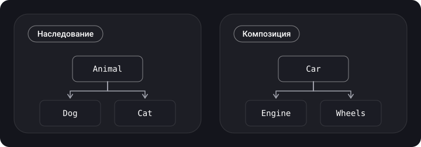

> **Что узнаешь**
>
> - что означают KISS, DRY и YAGNI и как они помогают (и мешают) друг другу;
> - чем композиция отличается от наследования и почему «предпочитай композицию» — не догма, а рабочее правило;
> - как заменить иерархию классов на набор протоколов и компонентов в Swift.

> **Нужно знать заранее**
>
> Главы [01](../paradigms/) и [02](../solid/): ООП, протоколы, SOLID.

## Аналогия: готовое блюдо против набора продуктов

**Наследование** — это купить полуфабрикат «борщ» и переделывать его в «солянку»: получишь всё лишнее, что уже в нём есть. **Композиция** — взять отдельные продукты и собрать блюдо из тех, что нужны. Первое быстрее в начале, второе гибче потом.

## Шаг 1. KISS — «делай проще»

**KISS** (*keep it simple, stupid* или, мягче, *keep it short and simple*) — простота как главная ценность. Простой код — понятный код; сложный код сложно менять и в нём чаще прячутся ошибки.

| Как проявляется | Пример из iOS |
| --- | --- |
| Не наращивать абстракции без нужды | Три слоя протоколов для экрана «О приложении» |
| Не тянуть огромную библиотеку ради пары функций | Подключить целый фреймворк ради форматирования даты, когда есть `Date.FormatStyle` |
| Разбивать сложное на простые части | Вынести сложный экран в несколько маленьких `View` |
| Использовать паттерн, только когда есть его проблема | Не делать Factory, если создаётся один тип одним способом |

> **Паттерны и KISS.** Паттерн проектирования — простое решение *конкретной проблемы*. Применить его там, где проблемы нет, — усложнение (нарушение KISS). Не применить там, где проблема есть, — тоже усложнение, потому что код получится запутаннее, чем мог бы быть.

```swift
// ❌ Переусложнено: фабрика, протокол и стратегия ради сложения двух чисел
protocol OperationStrategy { func run(_ a: Int, _ b: Int) -> Int }
struct AddStrategy: OperationStrategy { func run(_ a: Int, _ b: Int) -> Int { a + b } }
final class OperationFactory { func make() -> OperationStrategy { AddStrategy() } }

// ✅ Достаточно
func add(_ a: Int, _ b: Int) -> Int { a + b }
```

## Шаг 2. DRY — «не повторяйся»

> Каждая часть знания должна иметь единственное, непротиворечивое и авторитетное представление в рамках системы.

DRY (*don't repeat yourself*) — про повтор **знания**, а не про повтор строк. Если правило «максимальная длина имени — 30 символов» записано в трёх местах, при изменении его придётся исправлять везде, и одно место обязательно забудут.

```swift
// ❌ Знание про «30» размазано
func validateProfile(name: String) -> Bool { name.count <= 30 }
func validateCompany(name: String) -> Bool { name.count <= 30 }

// ✅ Одно место истины
enum Limits { static let nameLength = 30 }
func validate(name: String) -> Bool { name.count <= Limits.nameLength }
```

## Шаг 3. YAGNI — «тебе это не понадобится»

**YAGNI** (*you aren't gonna need it*): не реализуй то, чего нет в требованиях. Заказчик не должен платить за лишние функции, а ты — тратить время на код «про запас».

- Не добавляй параметры, протоколы и «расширяемость», которые никто не просил.
- При рефакторинге удаляй неиспользуемое. Понадобится снова — git всё помнит.

```swift
// ❌ «А вдруг пригодится»
struct User {
    let id: Int
    let name: String
    var legacyToken: String? = nil     // никто не использует
    var extraFlags: [String: Any] = [:] // «на будущее»
}

// ✅
struct User {
    let id: Int
    let name: String
}
```

### Как эти три принципа спорят друг с другом

| Ситуация | Что говорит принцип |
| --- | --- |
| Хочется сразу сделать универсальную абстракцию | YAGNI и KISS: рано, подожди второй-третий случай |
| Один и тот же код в пяти экранах | DRY: вынеси |
| Вынес, но пришлось добавить 4 флага | KISS: возможно, это было ложное дублирование — верни обратно |

## Шаг 4. Композиция и наследование

Одно из главных правил проектирования: **предпочитай композицию наследованию**. Оба приёма — способы переиспользовать функциональность.

- **Наследование** — «является» (*is-a*): `Dog` является `Animal`. Подкласс получает всё от родителя.
- **Композиция** — «имеет» (*has-a*): `Car` имеет `Engine`. Новый тип собирается из существующих частей.



### Чем плоха глубокая иерархия

Смоделируем героев игры. Вначале всё просто:

```swift
class Hero {
    func walk() { print("Иду") }
}
class Wizard: Hero {
    func castSpell() { print("Заклинание") }
}
class Archer: Hero {
    func shoot() { print("Выстрел") }
}
```

Потом появляется «маг-лучник» и «летающий маг». Наследовать от двух классов Swift не позволяет; выносить `shoot` в `Hero` — значит дать стрелять и пацифисту-крестьянину; копировать метод — нарушить DRY. Это и есть проблема: **подкласс жёстко привязан к родителю и получает всё, что тот умеет** (в том числе лишнее).

### То же на композиции и протоколах

```swift
protocol Walking   { func walk() }
protocol Shooting  { func shoot() }
protocol Casting   { func castSpell() }

struct Legs: Walking { func walk() { print("Иду") } }
struct Bow: Shooting { func shoot() { print("Выстрел") } }
struct Spellbook: Casting { func castSpell() { print("Заклинание") } }

struct Hero {
    let legs = Legs()
    var bow: (any Shooting)?           // умеет стрелять — если есть оружие
    var spellbook: (any Casting)?
}

var battleMage = Hero(bow: Bow(), spellbook: Spellbook())
battleMage.legs.walk()
battleMage.bow?.shoot()
battleMage.spellbook?.castSpell()
```

Каждая способность живёт отдельно, комбинации собираются без нового класса, а любую способность можно подменить в тестах.

> Компоненты можно подменять: `Hero` зависит от протокола `Shooting`, а не от `Bow`. Тогда в тесте ты передаёшь `MockShooter`, а в игре — `Bow` или `Crossbow`. Это уже принцип DIP из предыдущей главы.

### То же на экранах UIKit (дополнено, из исходников)

Классический случай: есть `BaseViewController` с набором методов `functionality1/2/3`, а экраны наследуются от него и переопределяют то, что им нужно:

```swift
class BaseViewController: UIViewController {
    func functionality1() { print("Base functionality 1") }
    func functionality2() { print("Base functionality 2"); functionality3() }
    func functionality3() { print("Base functionality 3") }
}

class ViewControllerB: BaseViewController {
    override func functionality3() { print("ViewControllerB functionality 3") }
    @IBAction func buttonTapped(_ sender: Any) { functionality2() }
}
```

Проблемы, которые перечислены в исходнике: нарушение SRP; в базовом классе множество методов, большинство из которых экрану не нужны, а всё сильно сцеплено; их нельзя переиспользовать в классах, которые не наследуют `UIViewController`-базу; трудно тестировать. Решение — композиция: каждую возможность выносят в протокол и компонент, а экран получает только нужные через `init`:

```swift
protocol Functionality1Protocol { func doSomething() }
struct Functionality1Component: Functionality1Protocol {
    func doSomething() { print("Something 1") }
}

protocol Functionality2Protocol { func doSomething() }
struct Functionality2Component: Functionality2Protocol {
    func doSomething() { print("Something 2") }
}

final class ViewControllerA: UIViewController {
    private let functionality1: Functionality1Protocol

    init(functionality1: Functionality1Protocol) {
        self.functionality1 = functionality1
        super.init(nibName: nil, bundle: nil)
    }
    required init?(coder: NSCoder) { fatalError("init(coder:) has not been implemented") }

    @IBAction func buttonTapped(_ sender: Any) { functionality1.doSomething() }
}

final class ViewControllerB: UIViewController {
    private let functionality1: Functionality1Protocol
    private let functionality2: Functionality2Protocol

    init(functionality1: Functionality1Protocol, functionality2: Functionality2Protocol) {
        self.functionality1 = functionality1
        self.functionality2 = functionality2
        super.init(nibName: nil, bundle: nil)
    }
    required init?(coder: NSCoder) { fatalError("init(coder:) has not been implemented") }

    @IBAction func buttonTapped(_ sender: Any) {
        functionality1.doSomething()
        functionality2.doSomething()
    }
}
```

Каждый экран берёт только нужное, а компоненты можно подменить в тестах. Код на скринах показан мелко, я восстановил его по смыслу, точные имена могут отличаться.

### Когда наследование всё же уместно

| Наследование | Композиция |
| --- | --- |
| Отношение «является» | Отношение «имеет / использует» |
| Только классы, один родитель | Любые типы, сколько угодно частей |
| Связь жёсткая, определяется на этапе объявления | Гибкая, можно подменить компонент |
| Подкласс видит внутренности родителя (сильное сцепление) | Части общаются через публичный интерфейс |
| Обязательно, когда фреймворк требует базового класса (`UIViewController`, `UIView`) | Обычный выбор для собственной логики |

На практике оба подхода сочетают: `final class ProfileViewController: UIViewController` наследует от UIKit (так надо), а вся её логика собрана из внедряемых сервисов.

## Типичные ошибки

- **«Универсальный» базовый класс** `BaseViewController` с логикой, которая нужна половине экранов. Экраны получают чужое поведение, а изменение базового класса ломает всех.
- **Объединять код только потому, что он похож** (ложное DRY).
- **Писать «расширяемость» заранее** (нарушение YAGNI): протокол на единственную реализацию, параметры «на будущее».
- **Считать KISS оправданием для лапши.** Простота — это не «в один метод на 300 строк», а понятная структура.
- **Бояться наследования как огня.** Если тип действительно «является» подтипом и ты контролируешь обе стороны, наследование — нормальный инструмент.

## Шпаргалка

- KISS — самое простое рабочее решение.
- DRY — одно знание — одно место.
- YAGNI — не пиши «про запас».
- Композиция = «имеет», наследование = «является»; по умолчанию собирай из частей.
- Протокол + компонент — способ получить нужную комбинацию поведений без иерархии.

## Вопросы для самопроверки

<details>
<summary>1. Чем DRY отличается от простого «не копируй код»?</summary>

DRY про дублирование *знания* (правила, константы, логики). Одинаковый по виду код, который меняется по разным причинам, объединять не нужно.

</details>

<details>
<summary>2. Как YAGNI помогает при рефакторинге?</summary>

Позволяет спокойно удалять неиспользуемые методы и поля: если что — их можно вернуть из git.

</details>

<details>
<summary>3. Почему «маг-лучник» плохо ложится на наследование?</summary>

У класса только один родитель, а вынесение способностей в общий базовый класс даёт их тем, кому они не нужны.

</details>

<details>
<summary>4. Когда наследование оправдано?</summary>

Когда это настоящее отношение «является» и когда этого требует фреймворк (например, `UIViewController`).

</details>

<details>
<summary>5. Как композиция связана с DIP?</summary>

Компоненты подключают через протоколы и передают снаружи, поэтому их легко подменять — это и есть зависимость от абстракций.

</details>

## Источники

- [Choosing Between Structures and Classes — Apple Developer Documentation](https://developer.apple.com/documentation/swift/choosing-between-structures-and-classes)
- [Inheritance — The Swift Programming Language](https://docs.swift.org/swift-book/documentation/the-swift-programming-language/inheritance/)
