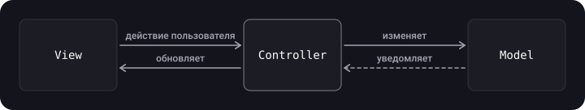
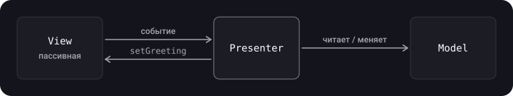
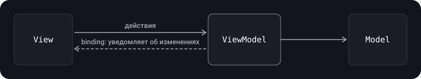

> **Что узнаешь**
>
> - зачем нужны архитектурные паттерны и по каким признакам отличить хорошую архитектуру;
> - как устроены MVC, MVP и MVVM, кто кого знает и кто за что отвечает;
> - почему «MVC от Apple» превращается в Massive View Controller;
> - как один и тот же экран выглядит во всех трёх вариантах, и что выбрать.

> **Нужно знать заранее**
>
> Главы [02](../solid/) (SOLID), [06](../behavioral-patterns/) (Delegate, Observer) и [07](../di-ioc/) (DI). UIKit на базовом уровне.

## Аналогия: ресторан

Есть **зал** (View) — то, что видит гость, **кухня и склад** (Model) — продукты и рецепты, и кто-то должен их связывать. В **MVC** это универсальный администратор (Controller), который и принимает заказ, и бегает на кухню, и накрывает на стол. В **MVP** — официант (Presenter): он не знает, как устроен зал, общается с ним по громкой связи (протокол) и легко тренируется на манекене. В **MVVM** — табло заказов (ViewModel), на которое зал сам подписан: официанта нет, зал просто отражает табло.

## Шаг 1. Зачем нужна архитектура

Архитектурный паттерн разделяет код на роли, чтобы каждая часть решала свою задачу и её можно было понимать, переиспользовать и тестировать отдельно.

**Признаки хорошей архитектуры:**

- **Распределение обязанностей** между сущностями (SRP из главы [02](../solid/));
- **Строгие роли:** понятно, что куда класть;
- **Тестируемость:** логику можно проверить без запуска интерфейса;
- **Простота, масштабируемость и низкая стоимость**: архитектура не должна стоить больше, чем экономит.
- **Лёгкость изменений:** хорошая архитектура легко откликается на новые требования, помогает точнее оценивать любые изменения системы и поддерживает быстрый постоянный темп разработки. (Дополнено, из слайда «Черты хорошей архитектуры».)
- **Независимость** от фреймворков, БД, UI, железа и внешнего мира — это идеал из главы [09](../viper-clean-mvi/) (Clean).

Проектирование архитектуры — скорее искусство, чем ремесло: компромиссы неизбежны.

### Три роли в MV(X)

| Роль | За что отвечает | Примеры |
| --- | --- | --- |
| **Model** | Данные домена и слой доступа к ним (сеть, база); *не знает* об интерфейсе | `Person`, `PersonDataProvider` |
| **View** | Отображение. В iOS это всё, что начинается с `UI`, а в SwiftUI — `View` | `UILabel`, `UIButton`, экран SwiftUI |
| **Controller / Presenter / ViewModel** | Посредник: реагирует на действия пользователя, меняет Model и обновляет View | `GreetingViewController`, `GreetingPresenter`, `GreetingViewModel` |

Практическая польза разделения: сущности проще понять, View и Model можно переиспользовать, каждую часть можно тестировать отдельно.

В примерах ниже везде одна и та же модель:

```swift
struct Person {
    let name: String
    let surname: String
}
```

И один и тот же экран: кнопка «Показать приветствие» и текстовая метка, в которой появляется «Hello Tom Leader».

## Шаг 2. MVC

MVC (Model–View–Controller) разделяет данные, интерфейс и управляющую логику на три компонента так, что каждый можно менять независимо.

### Классическая схема

- **Model** предоставляет данные и реагирует на команды контроллера.
- **View** отображает данные модели.
- **Controller** интерпретирует действия пользователя и сообщает модели, что нужно изменить.

Модель может быть **пассивной** (не умеет уведомлять; за перерисовку отвечает контроллер) или **активной** (оповещает подписанные представления об изменениях).

### MVC от Apple — как задумано



Controller — посредник: View и Model друг с другом не общаются.

### Как выглядит в UIKit на практике

```swift
import UIKit

final class GreetingViewController: UIViewController {
    var person: Person!                    // Model

    private let showGreetingButton = UIButton(type: .system)   // View
    private let greetingLabel = UILabel()                       // View

    override func viewDidLoad() {
        super.viewDidLoad()
        showGreetingButton.setTitle("Показать приветствие", for: .normal)
        showGreetingButton.addAction(UIAction { [weak self] _ in
            self?.didTapButton()
        }, for: .touchUpInside)
        // ... добавление subviews и констрейнты
    }

    private func didTapButton() {
        greetingLabel.text = "Hello \(person.name) \(person.surname)"   // логика отображения — тут же
    }
}
```

### Почему называют «Massive View Controller»

В iOS `UIViewController` **уже** связан с `View` (`view`, `viewDidLoad`, жизненный цикл, layout). Поэтому в реальном MVC View и Controller фактически слиплись, и в контроллер сваливается всё: форматирование данных, сеть, навигация, валидация. Итог — контроллеры на тысячи строк.

| Недостаток MVC в iOS | Последствие |
| --- | --- |
| View и Controller тесно связаны через `UIViewController` | Логика отображения неотделима от UIKit |
| Всё складывается в контроллер | Огромные, трудно читаемые классы |
| Логику нельзя проверить без создания UI | Тестируемость низкая (обычно тестируют только Model) |

**Плюс:** быстрее всего писать, знаком всем, подходит небольшим экранам и прототипам.

## Шаг 3. Идея «скромного объекта» (Humble Object)

Чтобы логику можно было тестировать, надо вынести её из того, что трудно тестировать (UI-классы). Шаблон **«Скромный объект»** делит поведение на две части:

- **скромная** часть — почти не содержит логики и трудно тестируется (`View`, `UIViewController`);
- **тестируемая** часть — вся логика, легко проверяется (`Presenter`, `ViewModel`).

В MVP и MVVM View — «скромный объект», а Presenter или ViewModel — тестируемая логика. ViewModel и Presenter работают с простыми базовыми типами (`String`, `Int`, `Bool`), а не с `UILabel`.

## Шаг 4. MVP

MVP (Model–View–Presenter) — производный от MVC шаблон, придуманный для упрощения модульного тестирования и лучшего разделения логики и отображения.



- **View** пассивна: показывает, что скажет Presenter, и передаёт ему события пользователя. Реализует **протокол**.
- **Presenter** ничего не знает о UIKit: работает с View через протокол, форматирует данные Model и командует View.
- **Presenter не связан с жизненным циклом** `UIViewController`.
- Связь View ↔ Presenter приходится **делать вручную** (обычно на этапе сборки экрана).

```swift
import UIKit

protocol GreetingView: AnyObject {
    func setGreeting(_ greeting: String)
}

protocol GreetingViewPresenter {
    func showGreeting()
}

final class GreetingPresenter: GreetingViewPresenter {
    private weak var view: GreetingView?
    private let person: Person

    init(view: GreetingView, person: Person) {
        self.view = view
        self.person = person
    }

    func showGreeting() {
        view?.setGreeting("Hello \(person.name) \(person.surname)")
    }
}

final class GreetingViewController: UIViewController, GreetingView {
    var presenter: GreetingViewPresenter!
    private let greetingLabel = UILabel()
    private let showGreetingButton = UIButton(type: .system)

    override func viewDidLoad() {
        super.viewDidLoad()
        showGreetingButton.addAction(UIAction { [weak self] _ in
            self?.presenter.showGreeting()
        }, for: .touchUpInside)
    }

    func setGreeting(_ greeting: String) {
        greetingLabel.text = greeting
    }
}

// Сборка (assembly) — связь делаем вручную
let viewController = GreetingViewController()
viewController.presenter = GreetingPresenter(view: viewController,
                                              person: Person(name: "Tom", surname: "Leader"))
```

> **`weak` у view в Presenter.** Контроллер владеет presenter'ом (`var presenter`), а presenter ссылается на контроллер — без `weak` получится retain cycle. В исходных материалах используется `unowned let view`; `weak` безопаснее: `unowned` упадёт, если view вдруг освободится раньше presenter'а. (Дополнено.)

Тест Presenter'а не требует UIKit:

```swift
import XCTest

final class GreetingViewSpy: GreetingView {
    private(set) var greeting: String?
    func setGreeting(_ greeting: String) { self.greeting = greeting }
}

final class GreetingPresenterTests: XCTestCase {
    func test_showGreeting_sendsFormattedGreetingToView() {
        let view = GreetingViewSpy()
        let sut = GreetingPresenter(view: view, person: Person(name: "Tom", surname: "Leader"))

        sut.showGreeting()

        XCTAssertEqual(view.greeting, "Hello Tom Leader")
    }
}
```

**Плюсы:** превосходная тестируемость, чёткое разделение. **Минусы:** значительно больше кода (примерно вдвое по сравнению с MVC), нужны протоколы и ручная сборка.

## Шаг 5. MVVM

MVVM (Model–View–ViewModel) удобен там, где платформа поддерживает **связывание данных (binding)**. В MVC/MVP любое изменение интерфейса идёт через контроллер или presenter; в MVVM View просто **подписывается** на ViewModel и обновляется само.



Отличия от MVP:

- **ViewModel не знает о View вообще** — у него нет ссылки на View, даже через протокол;
- обновление View идёт через **биндинги**, а не вызовом методов presenter'ом;
- ViewModel хранит состояние экрана в виде простых значений.

### Реализация с замыканием-биндингом (UIKit)

```swift
import UIKit

protocol GreetingViewModelProtocol: AnyObject {
    var greeting: String? { get }
    var greetingDidChange: ((GreetingViewModelProtocol) -> Void)? { get set }
    func showGreeting()
}

final class GreetingViewModel: GreetingViewModelProtocol {
    private let person: Person

    private(set) var greeting: String? {
        didSet { greetingDidChange?(self) }          // уведомляем подписчика
    }
    var greetingDidChange: ((GreetingViewModelProtocol) -> Void)?

    init(person: Person) { self.person = person }

    func showGreeting() {
        greeting = "Hello \(person.name) \(person.surname)"
    }
}

final class GreetingViewController: UIViewController {
    var viewModel: GreetingViewModelProtocol! {
        didSet {
            viewModel.greetingDidChange = { [weak self] viewModel in
                self?.greetingLabel.text = viewModel.greeting   // View обновляется сама
            }
        }
    }
    private let greetingLabel = UILabel()
    private let showGreetingButton = UIButton(type: .system)

    override func viewDidLoad() {
        super.viewDidLoad()
        showGreetingButton.addAction(UIAction { [weak self] _ in
            self?.viewModel.showGreeting()
        }, for: .touchUpInside)
    }
}

// Сборка
let viewController = GreetingViewController()
viewController.viewModel = GreetingViewModel(person: Person(name: "Tom", surname: "Leader"))
```

Вместо самодельного замыкания на практике используют Combine (`@Published`), а в SwiftUI биндинг встроен в платформу:

```swift
import SwiftUI
import Observation

@Observable final class GreetingViewModel {
    private let person: Person
    var greeting = ""

    init(person: Person) { self.person = person }
    func showGreeting() { greeting = "Hello \(person.name) \(person.surname)" }
}

struct GreetingView: View {
    @State private var viewModel = GreetingViewModel(person: Person(name: "Tom", surname: "Leader"))

    var body: some View {
        VStack {
            Button("Показать приветствие") { viewModel.showGreeting() }
            Text(viewModel.greeting)          // обновляется автоматически
        }
    }
}
```

> Общая схема слоёв iOS-приложения в MVVM: **Views** (UIKit/SwiftUI) → **View Controller** (только связывание) → **View Models** → **Business / Network / Persistence** (Foundation). ViewModel — граница между интерфейсом и остальной логикой.

**Плюсы:** сочетает достоинства подходов — хорошая тестируемость, меньше кода, чем в MVP; биндинги убирают ручное обновление View; логика вынесена из контроллера, а ViewModel можно переиспользовать. **Минусы:** нужен механизм биндинга (Combine, Observation, свои замыкания, раньше — RxSwift) и реактивное мышление; в больших приложениях ViewModel сам может раздуться; биндинги сложнее отлаживать; навигация остаётся нерешённой (см. главу [10](../router-coordinator/)). (Дополнено по слайдам.)

## Шаг 6. Сравнение

|  | MVC | MVP | MVVM |
| --- | --- | --- | --- |
| Посредник | Controller | Presenter | ViewModel |
| Знает ли посредник о View | Да, напрямую (`UIViewController` = View + Controller) | Да, через протокол | Нет |
| Как обновляется View | Контроллер сам меняет поля | Presenter вызывает методы View | Биндинг/подписка |
| Тестируемость логики | Низкая | Высокая | Высокая |
| Объём кода | Минимальный | Наибольший (протоколы, сборка) | Средний |
| Ручная связка View и посредника | Не нужна | Нужна | Нужна (плюс биндинг) |
| Когда брать | Простые экраны, прототип | UIKit, нужна максимальная проверяемость | SwiftUI и реактивный UIKit — выбор по умолчанию |

## Типичные ошибки

- **Складывать всё в `UIViewController`** «пока экран маленький» — и получить Massive View Controller.
- **Импортировать `UIKit` в Presenter/ViewModel** — тогда логика перестаёт быть «скромной» и тестируемой. Работай с `String`, `Bool`, `Int`.
- **Strong-ссылка на View в Presenter** — retain cycle.
- **Забыть `[weak self]` в биндинге** ViewModel → ViewController.
- **ViewModel-«мусорка»**: MVVM не отменяет SRP — сеть, форматирование и навигацию выноси отдельно.
- **Считать, что MVVM — «серебряная пуля»**: выбор паттерна зависит от размера экрана и команды.

## Шпаргалка

- MVC — быстро писать, слабо тестировать; в iOS склонен к Massive View Controller.
- MVP — пассивная View + Presenter по протоколу; лучшая тестируемость, много кода.
- MVVM — ViewModel не знает о View, обновление через биндинг; баланс кода и тестируемости.
- View / Model общие для всех, меняется только посредник.
- «Скромный объект»: вся логика — в лёгком для тестов типе.

## Вопросы для самопроверки

<details>
<summary>1. Почему в iOS MVC превращается в «Massive View Controller»?</summary>

`UIViewController` уже содержит View и жизненный цикл, поэтому логика отображения, сети, навигации и форматирования накапливается в контроллере.

</details>

<details>
<summary>2. Чем ViewModel отличается от Presenter?</summary>

Presenter держит ссылку на View (через протокол) и сам вызывает её методы, ViewModel не знает о View вообще — View подписывается на её изменения.

</details>

<details>
<summary>3. Что такое «скромный объект»?</summary>

Шаблон разделения на трудно тестируемую «скромную» часть (View) и легко тестируемую часть с логикой (Presenter/ViewModel).

</details>

<details>
<summary>4. Почему в MVP ссылку на View делают weak?</summary>

Контроллер владеет Presenter'ом, поэтому сильная обратная ссылка создаёт цикл.

</details>

<details>
<summary>5. Когда MVC всё-таки достаточно?</summary>

Когда экран простой и недолговечный (прототип, небольшой модуль), а стоимость лишнего кода выше выгоды.

</details>

## Источники

- [Model-View-Controller — Apple Developer Documentation (Archive)](https://developer.apple.com/library/archive/documentation/General/Conceptual/DevPedia-CocoaCore/MVC.html)
- [Managing the View Controller Lifecycle](https://developer.apple.com/documentation/uikit/uiviewcontroller)
- [Managing model data in your app — SwiftUI](https://developer.apple.com/documentation/swiftui/managing-model-data-in-your-app)
- [Архитектурные паттерны в iOS — Badoo, Habr](https://habr.com/ru/companies/badoo/articles/281162/)
