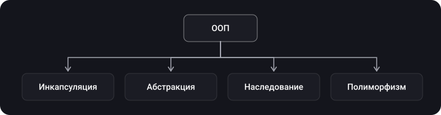

> **Что узнаешь**
>
> - чем ООП, протокольно-ориентированное и функциональное программирование отличаются друг от друга и как они уживаются в одном Swift-проекте;
> - как устроены четыре столпа ООП и как они выглядят в Swift;
> - когда протокол — это «тип», а когда — «ограничение на тип» (`any` против `some`/generic);
> - что такое функции высшего порядка: `map`, `flatMap`, `compactMap`, `filter`, `reduce`.

> **Нужно знать заранее**
>
> Базовый синтаксис Swift: `class`, `struct`, `enum`, `protocol`, замыкания. Больше ничего.

## Аналогия: три способа управлять кухней

Представь ресторан. **ООП** — это штат сотрудников: у каждого повара есть должность, обязанности и он умеет делиться навыками с учениками (наследование). **POP** — это набор «ролей» вроде «умеет жарить», «умеет резать»: любой человек, хоть повар, хоть официант, может получить такую роль, и иерархия должностей не нужна. **ФП** — это рецепты: на входе продукты, на выходе блюдо, и рецепт никогда не трогает то, что лежит на соседнем столе.

## Шаг 1. ООП: мыслим объектами

**Главная задача ООП** — сделать сложный код проще: программу разбивают на независимые блоки-объекты, у каждого свои данные и поведение. Изменения внутри одного объекта не должны ломать остальные.



| Принцип | Суть | Как выглядит в Swift |
| --- | --- | --- |
| Инкапсуляция | Данные и логика собраны в одном типе, лишнее спрятано | `private`, `fileprivate`, `internal`, `public`, `private(set)` |
| Абстракция | Снаружи виден только «пульт» — набор методов и свойств, а не устройство | Протоколы, публичный API типа |
| Наследование | Класс берёт свойства и методы родителя и добавляет своё | `class Dog: Animal`, `override`, `super`; только один родитель |
| Полиморфизм | Один интерфейс — много реализаций; код работает с разными типами одинаково | `override` в подклассах, протоколы, generics |

```swift
class Animal {
    private(set) var name: String          // инкапсуляция: менять имя снаружи нельзя
    init(name: String) { self.name = name }
    func makeSound() -> String { "..." }   // общий интерфейс
}

class Dog: Animal {                        // наследование
    override func makeSound() -> String { "Гав" }   // полиморфизм
}

class Cat: Animal {
    override func makeSound() -> String { "Мяу" }
}

let zoo: [Animal] = [Dog(name: "Рекс"), Cat(name: "Мурка")]
zoo.forEach { print($0.name, $0.makeSound()) }   // код не знает, кто конкретно перед ним
```

> **Абстракция и инкапсуляция — не одно и то же.** Инкапсуляция про *сокрытие данных* («как хранится»), абстракция про *сокрытие сложности* («как это делается»). Кнопка на блендере — абстракция, корпус, закрывающий мотор, — инкапсуляция. В источниках эти определения у разных авторов немного плавают — на собеседовании называй свой вариант и приводи пример.

**Плюсы ООП:** код делится между разработчиками (один пишет заказ, другой доставку — и второму достаточно знать, что есть `order.cancel()`), меньше дублирования, сложные программы пишутся проще.

**Минус ООП:** при наследовании ты забираешь *всё* — в том числе то, что подклассу не нужно, и жёстко привязываешься к иерархии. Эту проблему подробнее разбираем в главе про композицию и наследование.

> В Swift **структуры и перечисления не наследуются**, а наследование классов — одиночное. Поэтому в Swift «ООП» часто означает «протоколы + классы», а не глубокие деревья наследования.

## Шаг 2. POP: протоколы вместо иерархий

В **протокольно-ориентированном программировании** ты описываешь возможности типа протоколами, а не строишь жёсткую иерархию классов. Протокол могут принять и класс, и структура, и enum, а `extension` протокола даёт реализацию по умолчанию сразу всем типам.

```swift
protocol Flyable {
    var maxAltitude: Double { get }
    func fly()
}

extension Flyable {
    func fly() { print("Лечу, потолок \(maxAltitude) м") }   // реализация по умолчанию
}

struct Bird: Flyable { let maxAltitude = 500.0 }
struct Drone: Flyable { let maxAltitude = 120.0 }
enum Balloon: Flyable {
    case small
    var maxAltitude: Double { 3000 }
}

Bird().fly()
Drone().fly()
```

Обрати внимание: у `Bird`, `Drone` и `Balloon` нет общего предка. Это и есть выигрыш — модульность вместо иерархии, и один тип может принять сразу несколько протоколов.

### Протокол как тип и протокол как ограничение

Это главное, что нужно понять в POP. Есть два сценария:

|  | Протокол как **тип** (existential) | Протокол как **ограничение на тип** (generic / opaque) |
| --- | --- | --- |
| Запись | `let x: any Flyable` | `func f<T: Flyable>(_ x: T)` или `func f(_ x: some Flyable)` |
| Конкретный тип известен компилятору | Нет — значение «упаковано» в коробку | Да, один и тот же на каждый вызов |
| Можно хранить разные типы в одном массиве | Да: `[any Flyable]` | Нет: `[T]` — только один тип |
| Диспетчеризация | Динамическая | Часто статическая, компилятор может специализировать |
| Когда брать | Сервисы, репозитории и другие зависимости, которые ты передаёшь и регистрируешь в контейнере | Математика и сравнения, `Self`-требования, обобщённые алгоритмы |

```swift
let mixed: [any Flyable] = [Bird(), Drone()]      // разные типы в одной коллекции

func describe(_ x: some Flyable) { x.fly() }      // один конкретный тип на вызов
func describe2<T: Flyable>(_ x: T) { x.fly() }    // то же самое, длинная запись
```

### Протоколы с associated types

```swift
protocol Repository<Item> {                // primary associated type в угловых скобках
    associatedtype Item
    func all() -> [Item]
}

struct UsersRepo: Repository {
    func all() -> [String] { ["Аня", "Борис"] }
}

let repo: any Repository<String> = UsersRepo()   // Swift 5.7+
print(repo.all())
```

> **Практическое правило.** Зависимость, которую передают через `init` и подменяют в тестах, — `any Protocol`. Алгоритм, которому нужен один и тот же тип на входе и выходе, — `some`/generic. Если сомневаешься — начни с `any`, оптимизируй по профилировщику.

<details>
<summary>Что такое type erasure и нужно ли оно сейчас?</summary>

Type erasure — приём, когда ты оборачиваешь конкретный тип в универсальную «обёртку» (`AnyPublisher`, `AnyView`, `AnySequence`), скрывая детали. До Swift 5.7 это был основной способ хранить значения протоколов с associated types. Сегодня чаще хватает `any Protocol<…>`, но обёртки из стандартной библиотеки и SwiftUI/Combine по-прежнему в ходу.

</details>

## Шаг 3. ФП: функции как значения

**Функциональное программирование** — это не язык, а способ решать задачи: разбить сложный процесс на маленькие шаги и собрать их композицией. Единица композиции — *функция*, а её главная цель — **не менять состояние вне своей области видимости** (чистая функция: одинаковый вход → одинаковый выход, без побочных эффектов).

**Функции высшего порядка** принимают функцию как параметр или возвращают функцию. В стандартной библиотеке Swift они живут в протоколах `Sequence` и `Collection`.

| Функция | Что делает | Пример |
| --- | --- | --- |
| `map` | Применяет замыкание к каждому элементу, возвращает новую коллекцию той же длины | `[1,2,3].map { $0 * 2 }` → `[2,4,6]` |
| `filter` | Оставляет элементы, для которых замыкание вернуло `true` | `[1,2,3,4].filter { $0.isMultiple(of: 2) }` → `[2,4]` |
| `reduce` | Сворачивает коллекцию в одно значение | `[1,2,3].reduce(0, +)` → `6` |
| `flatMap` | Для последовательности последовательностей: применяет замыкание и «расплющивает» результат на один уровень | `[[1,2],[3]].flatMap { $0 }` → `[1,2,3]` |
| `compactMap` | Применяет замыкание и выбрасывает `nil` | `["1","a","3"].compactMap { Int($0) }` → `[1,3]` |

```swift
let raw = ["10", "x", "25", "7"]

let total = raw
    .compactMap { Int($0) }         // [10, 25, 7] — убрали нечисловое
    .filter { $0 > 8 }              // [10, 25]
    .map { $0 * 2 }                 // [20, 50]
    .reduce(0, +)                   // 70

print(total)
```

Функции можно передавать и возвращать, поэтому их можно *комбинировать*:

```swift
func adder(_ n: Int) -> (Int) -> Int { { $0 + n } }   // функция, возвращающая функцию

let plusTen = adder(10)
print([1, 2, 3].map(plusTen))   // [11, 12, 13]
```

> **Value type + иммутабельность = ФП в быту.** В Swift структуры копируются при передаче, поэтому функция, принявшая `struct`, не может незаметно изменить твою копию. Это и есть практическое воплощение «без побочных эффектов». Классы (reference types) такой гарантии не дают: две переменные ссылаются на один объект.

## Шаг 4. Как они уживаются вместе

В реальном iOS-проекте парадигмы не воюют:

| Слой | Что чаще всего используют |
| --- | --- |
| UIKit: `UIViewController`, `UIView` | ООП — наследование от классов фреймворка |
| Сервисы и зависимости | POP — протокол + реализация, подмена в тестах |
| Модели данных | `struct`, `enum` (value types) |
| Обработка коллекций, Combine, async-цепочки | ФП — `map`/`filter`/`reduce`, чистые функции |

## Типичные ошибки

- **Строить глубокие деревья наследования** там, где хватило бы протокола и `struct`.
- **`class` по умолчанию.** Начинай со `struct`, переходи на `class`, только если нужна ссылочная семантика или наследование от фреймворка.
- **Хранить `any Protocol` в горячем цикле** и удивляться нагрузке — динамическая диспетчеризация и упаковка не бесплатны.
- **Путать `flatMap` и `compactMap`** при работе с опционалами.
- **Функции с побочными эффектами внутри `map`.** `map` для преобразования; для действий используй `forEach`.

## Шпаргалка

- ООП: инкапсуляция, абстракция, наследование, полиморфизм.
- POP: протокол = возможность; `extension` даёт реализацию по умолчанию; работает для `struct`/`enum`/`class`.
- `any P` — «что-то, что умеет P»; `some P` / `<T: P>` — «один конкретный тип, который умеет P».
- Протоколы с associated types можно использовать как `any P` с Swift 5.7.
- ФП: чистые функции, `map`/`filter`/`reduce`/`flatMap`/`compactMap`.

## Вопросы для самопроверки

<details>
<summary>1. Чем инкапсуляция отличается от абстракции?</summary>

Инкапсуляция скрывает *данные и внутреннее состояние* (модификаторы доступа), абстракция скрывает *сложность реализации* за простым интерфейсом.

</details>

<details>
<summary>2. Почему в Swift POP часто удобнее наследования?</summary>

Протокол принимают и структуры, и enum, и классы; типу можно навесить несколько протоколов; наследование же одиночное и только для классов.

</details>

<details>
<summary>3. Что значит any Repository&lt;String&gt;?</summary>

«Любой тип, соответствующий `Repository`, у которого `Item == String`». Это existential-тип с primary associated type, доступен с Swift 5.7.

</details>

<details>
<summary>4. Что вернёт [[1,2],[3]].flatMap { $0 }, а ["1","a"].compactMap { Int($0) }?</summary>

`[1, 2, 3]` и `[1]`.

</details>

<details>
<summary>5. Почему чистая функция с struct безопаснее, чем метод объекта-класса?</summary>

Копия значения не может быть изменена «снаружи», у класса же несколько ссылок могут менять один и тот же объект.

</details>

## Источники

- [The Swift Programming Language: Opaque and Boxed Protocol Types](https://docs.swift.org/swift-book/documentation/the-swift-programming-language/opaquetypes/)
- [SE-0309: Unlock existential types for protocols with associated types](https://github.com/swiftlang/swift-evolution/blob/main/proposals/0309-unlock-existential-types-for-protocols-with-self-or-associated-type-requirements.md)
- [SE-0358: Primary associated types in the standard library](https://github.com/swiftlang/swift-evolution/blob/main/proposals/0358-primary-associated-types-in-stdlib.md)
