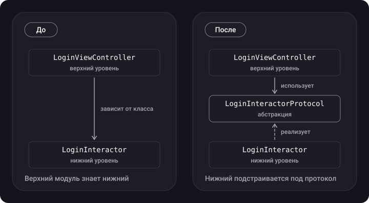

> **Что узнаешь**
>
> - что означает каждая буква SOLID и как узнать нарушение принципа в коде;
> - как исправлять нарушения на Swift — на «плохом» и «хорошем» примерах для каждого принципа;
> - почему DIP — это не то же самое, что DI и IoC, и что такое «модуль верхнего/нижнего уровня»;
> - как LSP связан с OCP и где его реально нарушают в iOS.

> **Нужно знать заранее**
>
> Глава [01](../paradigms/): классы, протоколы, полиморфизм.

## Аналогия: конструктор LEGO

Хороший код похож на конструктор: детали стандартные (протоколы), каждая делает одно дело (S), новую деталь можно добавить, не распиливая старые (O), любую подходящую деталь можно поставить на то же место (L), в детали нет лишних штырьков, которые не нужны (I), а соединяются детали через стандартный разъём, а не «намертво склеены» (D).

## Шаг 0. Общая картина

SOLID — пять принципов проектирования, цель которых — сделать код понятным, гибким и удобным для сопровождения.

| Буква | Принцип | В одну строку |
| --- | --- | --- |
| **S** | Single Responsibility | У типа одна причина для изменения |
| **O** | Open/Closed | Расширяем, не переписывая существующее |
| **L** | Liskov Substitution | Подтип можно подставить вместо базового типа, и программа продолжит работать правильно |
| **I** | Interface Segregation | Много узких протоколов лучше одного широкого |
| **D** | Dependency Inversion | Зависим от абстракций, а не от конкретики |

## Шаг 1. S — Single Responsibility (единственная ответственность)

У типа должна быть **одна причина для изменения**: он решает одну задачу. Несколько методов — нормально, если все они служат одной цели.

**Нарушение:** один класс и ходит в сеть, и разбирает ответ, и пишет в базу.

```swift
class NetworkManager {
    static let shared = NetworkManager()
    private init() {}

    func handleAllActions() {
        let data = getUsers()
        let users = parse(data)
        save(users)
    }
    func getUsers() -> Data { Data() }            // сеть
    func parse(_ data: Data) -> [String] { [] }   // парсинг
    func save(_ users: [String]) { }              // хранилище
}
```

Изменится формат ответа, схема базы или способ запроса — придётся править один и тот же класс.

**Исправление:** разделяем роли и собираем их вместе.

```swift
protocol UsersFetching { func fetchUsers() -> Data }
protocol UsersParsing  { func parse(_ data: Data) -> [String] }
protocol UsersStoring  { func save(_ users: [String]) }

struct UsersAPI: UsersFetching { func fetchUsers() -> Data { Data() } }
struct UsersParser: UsersParsing { func parse(_ data: Data) -> [String] { [] } }
struct UsersDatabase: UsersStoring { func save(_ users: [String]) { } }

final class SyncUsersUseCase {
    private let api: UsersFetching
    private let parser: UsersParsing
    private let storage: UsersStoring

    init(api: UsersFetching, parser: UsersParsing, storage: UsersStoring) {
        self.api = api; self.parser = parser; self.storage = storage
    }

    func run() {
        storage.save(parser.parse(api.fetchUsers()))
    }
}
```

> **Как проверить SRP.** Попробуй описать тип одним предложением без слов «и» / «а ещё». Не получается — скорее всего, ответственностей несколько. Ещё признак: тип трудно тестировать, потому что для проверки одной части приходится поднимать все остальные.

> **Не переусердствуй.** SRP не значит «один метод на класс». Если ради одной строки ты создаёшь пять типов, ты просто размазал логику. Разделяй по *причинам для изменения*, а не по числу методов.

## Шаг 2. O — Open/Closed (открытость/закрытость)

Тип **открыт для расширения** (можно добавить новое поведение) и **закрыт для изменения** (не нужно править проверенный код). В Swift это делают протоколами и `extension`.

**Нарушение:** чтобы добавить животное, приходится менять `makeSound`.

```swift
class Animal {
    let name: String
    init(name: String) { self.name = name }

    func makeSound() {
        if name == "Dog" { print("Woof") }
        else if name == "Cat" { print("Meow") }
        // добавили Cow — снова лезем сюда
    }
}
```

**Исправление:** поведение выносим в протокол.

```swift
protocol Animal { func makeSound() }

struct Dog: Animal { func makeSound() { print("Woof") } }
struct Cat: Animal { func makeSound() { print("Meow") } }
struct Cow: Animal { func makeSound() { print("Moo") } }   // новый тип, старый код не тронут

func chorus(_ animals: [any Animal]) { animals.forEach { $0.makeSound() } }
```

Так же устроен пример с источником данных: потребитель зависит от протокола, а не от конкретного класса.

```swift
protocol DataProtocol { func getData() -> Data? }

final class NetworkData: DataProtocol {
    func getData() -> Data? { nil }   // URLSession
}

final class SQLData: DataProtocol {
    func getData() -> Data? { nil }   // база данных
}
```

> **А как же `extension`?** `extension` позволяет добавить типу методы, не трогая его исходник (например, расширить `String` или `UIColor`), — это расширение в духе OCP. Но extension не может добавить хранимые свойства и не подменяет поведение существующих методов, так что это дополнение, а не полная замена полиморфизму.

## Шаг 3. L — Liskov Substitution (подстановка Барбары Лисков)

> Объекты базового типа должны заменяться объектами подтипа без ущерба для корректности программы.

Подтип обязан соблюдать **контракт** базового типа: не требовать от вызывающего большего, не обещать меньшего и не ломать то, чего от базового типа ожидают.

**Нарушение:** пингвин наследует от птицы, которая «умеет летать».

```swift
class Bird { func fly() { print("Лечу") } }

class Penguin: Bird {
    override func fly() { fatalError("Penguins can't fly!") }   // краш там, где ждали птицу
}

let bird: Bird = Penguin()
bird.fly()   // crash
```

**Исправление 1 (простое):** выделить общее поведение, которое действительно есть у всех.

```swift
class Bird { func move() { print("Птица движется") } }
class Penguin: Bird { override func move() { print("Пингвин скользит") } }
```

**Исправление 2 (лучше):** сделать «умение летать» отдельной способностью.

```swift
protocol Bird { func eat() }
protocol Flying { func fly() }

struct Sparrow: Bird, Flying { func eat() {}; func fly() { print("Лечу") } }
struct Penguin: Bird { func eat() {} }

func launch(_ f: some Flying) { f.fly() }   // пингвина сюда просто не передать
```

Ещё один классический сигнал нарушения — подкласс **меняет смысл** метода:

```swift
class Operators {
    func add(_ a: Int, _ b: Int) -> Int { a + b }
}
class Calculator: Operators {
    override func add(_ a: Int, _ b: Int) -> Int { a * b }   // сложение делает умножение
}

print(Calculator().add(5, 5))   // 25, а вызывающий ждал 10
```

И признак нарушения, который часто встречается на практике: **приведение типов в потребителе**.

```swift
func draw(shape: Shape) {
    if let s = shape as? Square { s.drawSquare() }
    else if let c = shape as? Circle { c.drawCircle() }   // а для Shape — ничего
}
```

Здесь функция ведёт себя по-разному для `Shape` и его подклассов, а при появлении `Triangle` придётся снова её править — значит, заодно нарушен и OCP. Лечится общим методом `draw()` в протоколе.

<details>
<summary>А что с «нарушением LSP в UIKit» — методы UIViewController без super?</summary>

Этот вопрос любят задавать на собеседованиях, и ответ тоньше, чем «нет super = нарушение LSP». У разных методов разный контракт: для `viewDidLoad()`, `viewWillAppear(_:)` документация требует вызвать `super` (иначе ломается внутренняя логика базового класса — подкласс перестаёт соблюдать контракт), а для `loadView()` наоборот — сказано *не* вызывать `super`, если ты создаёшь иерархию вью сам. Поэтому корректно сформулировать так: UIKit часто опирается на наследование с «шаблонными методами», где базовый класс полагается на то, что подкласс вызовет `super`, — это хрупкий контракт, близкий к нарушению LSP, и одна из причин, почему в современном коде выбирают композицию.

</details>

## Шаг 4. I — Interface Segregation (разделение интерфейса)

Клиент не должен зависеть от методов, которые он не использует. **Много узких протоколов лучше одного «универсального».**

**Нарушение:** роботу приходится «реализовывать» еду.

```swift
protocol Worker { func work(); func eat() }

class Robot: Worker {
    func work() { /* работает */ }
    func eat() { fatalError("Robots can't eat") }   // вынужденная заглушка
}
```

**Исправление:**

```swift
protocol Workable { func work() }
protocol Feedable { func eat() }

struct Robot: Workable { func work() { } }
struct Human: Workable, Feedable { func work() { }; func eat() { } }

typealias Employee = Workable & Feedable   // при необходимости — композиция протоколов
```

> В iOS ISP хорошо виден на делегатах: лучше несколько маленьких протоколов (`UITableViewDataSource`, `UITableViewDelegate`) с опциональными методами, чем одна «мегаспецификация» на 30 требований. Заглушка `fatalError` в методе, который ты «вынужден» реализовать, — почти всегда сигнал нарушения ISP (а нередко и LSP).

## Шаг 5. D — Dependency Inversion (инверсия зависимостей)

Формулировка из двух частей:

1. **Модули верхних уровней не должны зависеть от модулей нижних уровней. Оба должны зависеть от абстракций.**
2. **Абстракции не должны зависеть от деталей. Детали должны зависеть от абстракций.**

**Модуль** в iOS — это может быть класс, фреймворк или библиотека. **Нижний уровень** — конкретные исполнители (сеть, база, `LoginInteractor`), **верхний** — те, кто использует их результаты (`LoginViewController`).



В «после» стрелка от `LoginInteractor` **развернулась**: теперь не верхний модуль знает о нижнем, а нижний подстраивается под протокол, который нужен верхнему. Отсюда слово «инверсия».

**Нарушение (часть 1):**

```swift
class LoginInteractor {
    func login(userID: Int) { /* … */ }
}

final class LoginViewController: UIViewController {
    private let interactor: LoginInteractor   // конкретный класс

    init(interactor: LoginInteractor) {
        self.interactor = interactor
        super.init(nibName: nil, bundle: nil)
    }
    required init?(coder: NSCoder) { fatalError("init(coder:) has not been implemented") }

    override func viewDidLoad() {
        super.viewDidLoad()
        interactor.login(userID: 123)
    }
}
```

**Исправление:**

```swift
protocol LoginInteractorProtocol {
    func login(userID: Int)
}

final class LoginInteractor: LoginInteractorProtocol {
    func login(userID: Int) { /* реальный вход */ }
}

final class LoginViewController: UIViewController {
    private let interactor: LoginInteractorProtocol   // абстракция

    init(interactor: LoginInteractorProtocol) {
        self.interactor = interactor
        super.init(nibName: nil, bundle: nil)
    }
    required init?(coder: NSCoder) { fatalError("init(coder:) has not been implemented") }

    override func viewDidLoad() {
        super.viewDidLoad()
        interactor.login(userID: 123)
    }
}
```

Теперь в тестах можно подсунуть подделку:

```swift
final class LoginInteractorMock: LoginInteractorProtocol {
    private(set) var loggedInUserID: Int?
    func login(userID: Int) { loggedInUserID = userID }
}
```

### Часть 2: «детали» и абстракции

«Деталь» — это то, что просачивается из конкретной реализации в интерфейс: например, параметры `userID` и `phone`. Если у тебя два интерактора с разными методами (`login(userID:)` и `login(phone:)`), то каждый контроллер знает о своём и при смене сигнатуры придётся править всех потребителей. Правильнее сначала спроектировать *абстракцию под потребность верхнего уровня* («войти»), а уже потом подгонять под неё детали.

```swift
protocol AuthService {
    func login(with credentials: Credentials) async throws
}

enum Credentials {
    case userID(Int)
    case phone(String)     // ⚠️ телефон — строка, а не Int: ведущие нули, плюс, длина
}
```

> **DIP ≠ DI ≠ IoC.** DIP — *принцип*: «зависим от абстракций». DI (внедрение зависимостей) — *приём*, которым мы этот принцип реализуем: объект получает зависимости снаружи. IoC (инверсия управления) — более общая идея: не объект создаёт то, что ему нужно, а кто-то снаружи (контейнер, фреймворк). Подробно — в главе про DI.

## Типичные ошибки

- **Протокол «для галочки»** на каждый класс, даже когда реализация всегда одна и подмена не нужна.
- **`fatalError` в методе, который «не поддерживается»** — это почти всегда нарушение ISP/LSP.
- **`as?` внутри потребителя** для выбора поведения — признак нарушения LSP и OCP.
- **Понимать DIP только как «спрятать за протокол».** Важнее, *чей* это протокол: он должен отражать нужды верхнего уровня.
- **`static let shared` внутри класса, который что-то делает с интерфейсом** — конкретная зависимость, спрятанная от глаз (подробнее в главе про Singleton).

## Шпаргалка

- **S** — одна причина для изменения.
- **O** — новое поведение = новый тип, а не `if` в старом.
- **L** — подтип не ломает ожиданий от базового типа; расширять интерфейс можно, ломать контракт нельзя.
- **I** — узкие протоколы, никаких «заглушек» под чужие методы.
- **D** — верхний уровень зависит от протокола; нижний реализует протокол.

## Вопросы для самопроверки

<details>
<summary>1. Какой принцип нарушает класс, который ходит в сеть и обновляет UI?</summary>

SRP: у класса две причины для изменения — смена сетевого слоя и смена интерфейса.

</details>

<details>
<summary>2. Почему цепочка if name == "Dog" … else if … нарушает OCP?</summary>

Каждый новый вариант требует правки существующего метода. Вместо этого поведение выносят в протокол, и новый тип добавляется без изменения старого кода.

</details>

<details>
<summary>3. Нарушает ли LSP подкласс, добавивший новый метод?</summary>

Нет. LSP нарушается, когда подкласс меняет или ломает поведение, которое обещает базовый класс.

</details>

<details>
<summary>4. Как понять, что нарушен ISP?</summary>

Класс вынужден реализовать методы, которые ему не нужны (`fatalError`, пустые заглушки), либо клиент зависит от протокола, из которого использует лишь малую часть.

</details>

<details>
<summary>5. Что «инвертируется» в DIP?</summary>

Направление зависимости в исходном коде: вместо «верхний → нижний» получается «верхний → протокол ← нижний».

</details>

## Источники

- [UIViewController — Apple Developer Documentation](https://developer.apple.com/documentation/uikit/uiviewcontroller)
- [loadView() — Apple Developer Documentation](https://developer.apple.com/documentation/uikit/uiviewcontroller/1621454-loadview)
- [DI vs. DIP vs. IoC — Сергей Тепляков](https://sergeyteplyakov.blogspot.com/2014/11/di-vs-dip-vs-ioc.html)
- [SOLID в Swift. Простое объяснение с примерами](https://habr.com/ru/articles/746410/)
